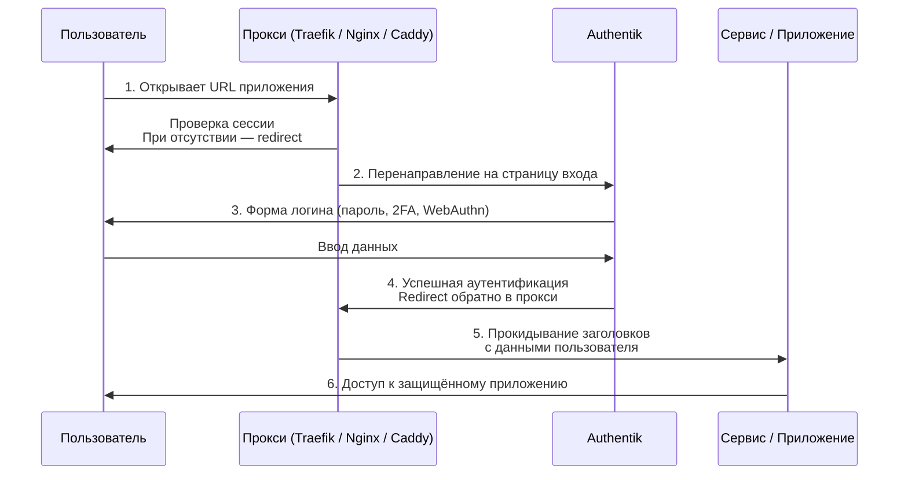

# OIDC and Proxy setup
## Настройка OIDC и proxy провайдера в Authentik в обратном прокси Traefik 

В данной статье я постараюсь описать каким образом можно настроить авторизацию в приложениях с помощью технологии OIDC или встроенного в Authentik proxy провайдера.

Немного теории.

### Что такое OIDC

**OIDC (OpenID Connect)** — это современный протокол авторизации и _аутентификации_, построенный поверх **OAuth 2.0**. Если OAuth2 сам по себе решает задачу выдачи прав доступа (авторизация), то **OIDC добавляет подтверждение личности пользователя** (аутентификацию).

Проще говоря:

> **OIDC = “кто пользователь” + “можно ли дать доступ”**, на базе OAuth2.

---

#### Как это работает

1.  **Пользователь** пытается войти в приложение.
2.  **Приложение** отправляет его на сервер авторизации (Identity Provider) с запросом типа _“хочу узнать, кто это”_.
3.  Пользователь логинится у провайдера.
4.  Провайдер возвращает:
    *   **ID Token** — JWT-токен с информацией о пользователе (имя, email, ID и т. д.).
    *   **Access Token** — токен доступа (как в OAuth2).
5.  Приложение получает подтверждённую информацию о пользователе и впускает его.

---

### Основные понятия

#### **ID Token**

Главная “фишка” OIDC — содержит данные о пользователе:

*   `sub` — уникальный идентификатор
*   `name`
*   `email`
*   время выдачи, истечения и т. д.

#### **OpenID Provider (OP)**

Сервер, который логинит пользователей и выдаёт токены:  
Keycloak, Authentik, Authelia, Zitadel, Google, GitHub и т. д.

#### **Relying Party (RP)**

Приложение, которое доверяет провайдеру и принимает токены.

---

#### Зачем нужен OIDC

*   Централизованная аутентификация (один логин для множества сервисов).
*   Лучшее взаимодействие между разными системами.
*   Возможность Single Sign-On (SSO).
*   Простая интеграция с приложениями (через стандартные библиотеки).

---

#### Где используется

Практически везде:

*   Keycloak
*   Authentik
*   Authelia
*   Zitadel
*   Google Sign-In
*   GitHub Login
*   Kubernetes (через Dex)
*   Traefik / Nginx / Envoy в качестве OIDC-proxy

### Что такое Oauth 2.0

**OAuth 2.0** — это **протокол авторизации**, который позволяет одному сервису получить ограничённый доступ к ресурсам пользователя на другом сервисе **без передачи пароля**.

Проще говоря:

> **OAuth 2.0 — это способ дать приложению доступ “от имени пользователя”, не раскрывая логин и пароль.**

---

#### Зачем нужен OAuth2

Частые сценарии:

*   Вы хотите залогиниться в сервис через **Google / GitHub / VK / Facebook**.
*   Приложение хочет доступ, например, только к вашим **фото**, но не к почте.
*   Микросервисы хотят безопасно “общаться” друг с другом.

---

#### Как это работает (очень простая схема)

1.  **Приложение** хочет что-то сделать от имени пользователя → отправляет запрос в **Authorization Server**.
2.  Пользователь логинится на этом сервере.
3.  Сервер возвращает **Authorization Code**.
4.  Приложение обменивает код на **Access Token**.
5.  Приложение использует Access Token для доступа к API.

Пользовательский пароль остаётся известен только авторизационному серверу.

---

### Основные сущности OAuth2

#### **Authorization Server**

Выдаёт токены (например: Authentik, Keycloak, Authelia, Google).

#### **Resource Server**

API или сервис, к которому нужно получить доступ (файлы, почта, профиль и т. д.).

#### **Client**

Приложение, которому нужен доступ.

#### **Access Token**

Токен, который клиент использует для доступа к ресурсам.

#### **Refresh Token**

Позволяет получить новый Access Token без повторного логина.

---

#### Гранты (типы авторизации)

Наиболее используемый — **Authorization Code Flow**, особенно с PKCE для безопасных SPA и мобильных приложений.

Другие:

*   Client Credentials — авторизация сервис ↔ сервис
*   Refresh Token — обновление токенов
*   Device Code Flow — устройства без клавиатуры (TV, приставки)
*   Password Grant — устарел, НЕ используется

---

### Ключевая идея

OAuth 2.0 **не подтверждает личность пользователя** (кто это).  
Он только выдаёт разрешения (что можно делать).

Для подтверждения личности используется **OIDC** — надстройка над OAuth2.

## В чем разница между OIDC и OAuth 2.0

### Если коротко

*   **OAuth2** — про _доступ_ («разрешить приложению сделать что-то от моего имени»).
*   **OIDC** — про _личность_ («кто этот пользователь?»), построено поверх OAuth2.

---

### Аналогия в жизни

#### **OAuth2 — доверенность**

Ты даёшь курьеру доверенность забрать твою посылку.  
Курьер не знает, кто ты. Он просто получил разрешение выполнить действие.

#### **OIDC — паспорт + доверенность**

Теперь ты ещё показал паспорт, и сервис точно знает, **кто** получил доступ.

---

#### Ключевая разница

| Что сравниваем | OAuth 2.0 | OIDC |
| --- | --- | --- |
| Что делает | Выдаёт **доступ** | Подтверждает **личность** |
| Тип протокола | Авторизация | Аутентификация + авторизация |
| Какие токены | Access Token | Access Token + **ID Token** |
| Что может клиент узнать | Может или не может выполнить действие | **Кто пользователь** (email, имя, ID) |
| Где используется | Доступ к API | Логин в приложения |

---

#### Почему появился OIDC

OAuth2 не говорит, **кто пользователь**.  
Приложение получает доступ, но не получает данные профиля и не понимает, кто залогинен.

Чтобы решить эту проблему, сделали:

**OIDC = OAuth2 + ID Token + UserInfo API + стандарты SSO.**

---

### Примеры использования

#### OAuth2

*   Выдать приложению доступ к YouTube API
*   Сценарий “доступ к файлам Google Drive”
*   Взаимодействие микросервисов

#### OIDC

*   Логин через Google / GitHub
*   SSO в компании
*   Авторизация в Keycloak/Authentik/Authelia/Zitadel

---

### Итог (кратко)

*   **OAuth2 говорит, что можно делать.**
*   **OIDC говорит, кто это делает.**

### **Proxy Provider в Authentik**

**Proxy Provider в Authentik** — это специальный тип провайдера, который позволяет Authentik работать как **прозрачный “прокси-слой” между пользователем и внешним сервисом**, добавляя аутентификацию и контроль доступа там, где сам сервис этого не умеет.

Говоря проще:

> **Proxy Provider — это способ защитить любой веб-сервис, даже если он совсем не поддерживает OAuth2 / OIDC / SAML.**

Authentik “встраивается” между пользователем и приложением как обратный прокси.

---

#### Как это работает

1.  Пользователь пытается открыть приложение.
2.  Запрос идёт не напрямую на приложение, а на **Authentik Proxy Provider**, который работает через nginx/traefik/caddy или врезается как sidecar.
3.  Authentik:
    *   проверяет, залогинен ли пользователь;
    *   если нет — отправляет его на страницу входа;
    *   после входа прокидывает запрос дальше к приложению.
4.  Приложение получает **заголовки с информацией о пользователе**, например:
    *   `X-authentik-username`
    *   `X-authentik-email`
    *   `X-authentik-groups`

Эти данные приложение принимает _как факт_ — оно не понимает OIDC, но оно умеет читать заголовки.

---

#### Когда Proxy Provider нужен

#### Когда у сервиса нет:

*   OIDC
*   OAuth2
*   SAML
*   LDAP

#### Когда надо защитить:

*   Legacy-веб-приложения
*   Панели управления (Grafana без SSO, Adminer, phpMyAdmin)
*   Веб-морды Docker-контейнеров
*   Домашние сервисы в локальной сети
*   API, которых нельзя модифицировать

---

#### Какие возможности даёт Proxy Provider

*   Авторизация через Authentik (пароль, 2FA, OTP, WebAuthn).
*   Ограничение доступа по группам / ролям.
*   Передача атрибутов пользователю через headers.
*   Единый SSO на старые приложения.
*   Возможность комбинировать с обратными прокси:
    *   Traefik
    *   Nginx
    *   Caddy

---

### Пример: как работает с Traefik

Traefik перенаправляет запросы на Authentik Proxy Provider → Authentik проверяет пользователя → возвращает назад в Traefik → тот прокидывает в приложение заголовки с информацией о пользователе.

#### **Схема потока (Proxy Provider → Authentik → приложение)**

---

#### **Пошаговое объяснение ещё короче**

1.  Пользователь → заходит на сервис
2.  Traefik/Nginx → перенаправляет на Authentik
3.  Authentik → спрашивает логин / 2FA
4.  Authentik → даёт прокси “метку”, что пользователь авторизован
5.  Прокси → добавляет заголовки с данными пользователя
6.  Приложение → принимает заголовки → пользователь внутри

---

### Итог

**Proxy Provider — это способ добавить SSO + защиту + контроль доступа к любому приложению, даже если оно само этого не поддерживает.**

В следующей статье перейдем от скучной теории к более интересной практике