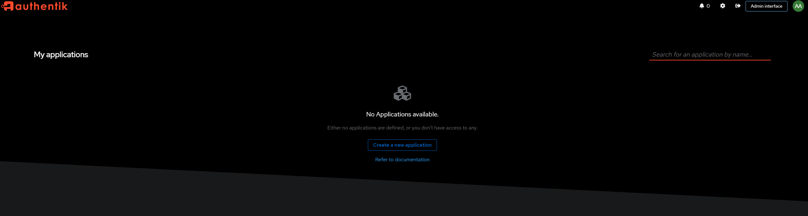
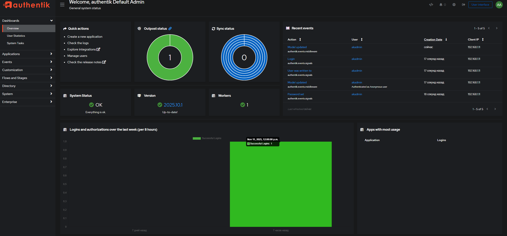
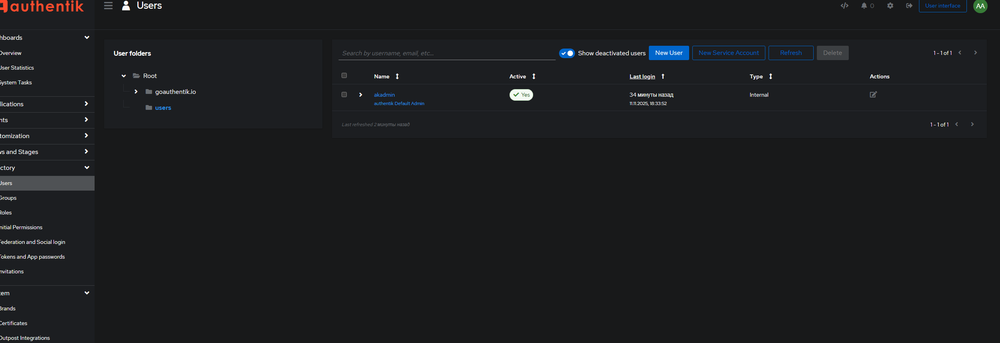
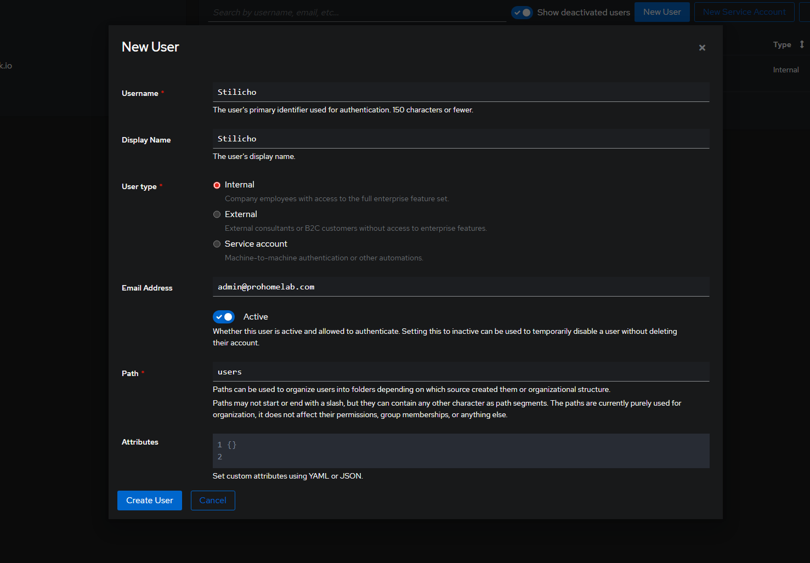
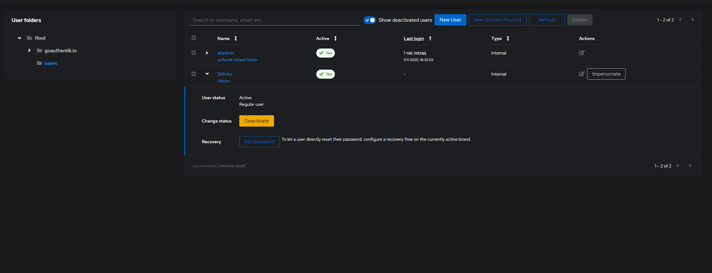
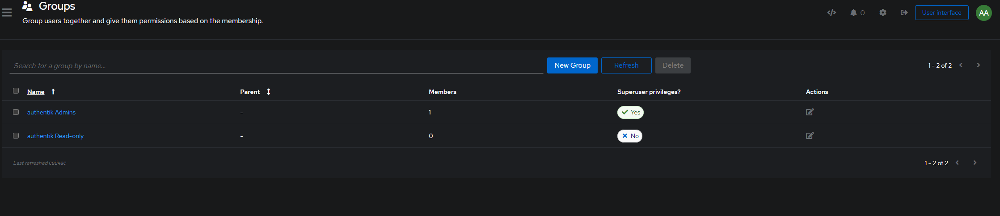
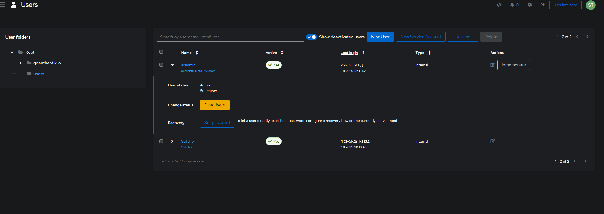
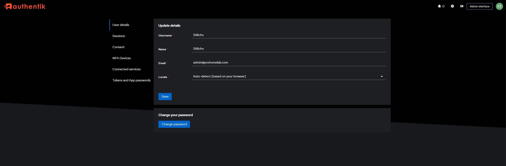

**Authentik** — это современная система управления идентификацией и доступом (IDP), с открытым исходным кодом. Она позволяет централизовать аутентификацию пользователей, подключать сторонние приложения через SSO, OIDC и SAML, а также управлять группами и политиками доступа.

В этом материале разберём, как выполнить **первоначальную настройку Authentik** после установки — чтобы быстро запустить свой собственный IDP.

## Первоначальная регистрация

Предполагаю, что для развертывания вы используете docker. Примерный вариант `docker compose` файла я привел в предыдущей статье. Обратите внимание, что начиная с версии `2025.10.0` разработчики исключили из уравнения контейнер `redis`. К сожалению в версии разработчики кое-что не учли и если посмотреть логи `postgres` , то там вы увидите, что контейнер `postgres` выдает нам что-то подобное

```
2025-11-11 14:14:03.578 UTC WARNING: you don't own a lock of type ExclusiveLock
```

В будущих версиях это должны исправить, но в любом случае, данный баг никак не влияет на работоспособность приложения.

Итак, мы с вами подготовили `docker-compose` файл и запустили его старой, доброй командой `docker compose up -d`

Проверьте, что все три контейнера запущены и работают. Так как приложение совсем не легковесное, то запуск займет какое-то время.

После того, как приложение запущено мы с вами можем перейти по поддоменному имени, который мы назначили приложению с помощью вашего обратного прокси, в моем случае это

```
authentik.stilicho.ru
```

Однако при переходе по указанному адресу приложение требует от нас ввести логин и пароль пользователя, которого у нас пока нет.


Все дело в том, что того чтобы создать перваначального администратора необходимо перейти по ссылке

```
https://authentik.ваше_доменное_имя.ru/if/flow/initial-setup/
```

Обратите внимание на закрывающую дробь в конце ссылки, это важный момент

Теперь вы уже перейдете в полноценное меню первоначальной регистрации


Укажите адрес электронной почты и пароль, при этом совершенно необязательно указывать реальную почту, чуть ниже расскажу почему.
После того, как вы указали все необходимые данные попадаем в основное меню.
Домашняя страница, где будут отображаться все приложения, доступ к которым мы настроим с помощью **Authentik**



и меню настроек самого **Authentik**



## Создание нового администратора

Теперь объясню почему я указал, что не стоит заморачиваться почтой для администратора.

Дело в том, что по умолчанию, первый администратор, которого мы создаем, имеет nickname `akadmin` и это постоянная величина. Поэтому намного безопасней будет создать нового пользователя, сделать его администратором, а первоначального администратора деактивировать.

Идем в **Directory > Users > New User**



Указываем все необходимые данные. Обязательно указываем электронную почту. Раздел атрибуты пока не трогаем. Нам это понадобится в будущем, когда мы будем настраивать приложения с помощью OIDC, где у нас автоматически будут создаваться пользователи, которые уже созданы в **Authentik** и нам надо будет задавать соответствующие права юзерам. Если более кратко, мы будем управлять правами пользователей в конкретных приложениях или сервисах на уровне **Authentik**.



Жмем **Create User**

Теперь нам надо задать пароль пароль. Безусловно пароль должен быть сложным. Я генерирую пароли с помощью **Vaultwarden** указывая длину в минимум 42 символов



Теперь присвоим нашему пользователю права суперпользователя.

Идем **Directory > Groups**, выбираем там группу суперадминов **authentik Admins**




Переходим в вкладку **Users**, выбираем **Add existing user**, жмем + и добавляем нашего нового юзера. У вас будет предупреждение, что **С большой силой приходит большая ответственность**, но мы ничего не боимся.

Теперь спокойно выходим из под учетки пользователя **akadmin** и заходим под новым пользователем.

## Отключение дефолтного администратора

Следующим шагом нам надо отключить учетную запись первоначального администратора Переходим по адресу **Directory > Users**, жмем стрелочку вниз напротив нашего `akadmin` и отключаем его кнопкой **deactivate**



## Обзор панели настроек администратора/пользователя



Нажав значок ⚙ вверху рядом именем нашего пользователя попадаем в меню настроек непосредственно пользователя

### 👤 Профиль пользователя

Раздел позволяет просмотреть и изменить основные данные учётной записи.

**Доступные поля:**

*   **Username** — уникальное имя пользователя (неизменяемое после создания).
*   **Display name** — отображаемое имя в интерфейсе и при входе в приложения.
*   **Email address** — используется для уведомлений, подтверждения и восстановления доступа.
*   **Locale** — язык интерфейса.

### 🔒 **Sessions**

Показывает все активные сессии, где пользователь авторизован через Authentik.

**Колонки:**

*   **Last IP** — IP-адрес, с которого был выполнен вход.
*   **Last used** — время последнего обращения к Authentik из этой сессии.
*   **Expires** — время истечения срока действия сессии.

**Доступные действия:**

*   Завершить отдельную сессию (например, если вы вышли из устройства).
*   Завершить все сессии, кроме текущей — для полного выхода со всех устройств.

🔐 _Полезно при утере устройства или смене пароля._

### 🪪 **Consent**

Раздел отображает список приложений, которым пользователь **разрешил доступ** к своим данным через OpenID Connect (OIDC).

**Информация по каждой записи:**

*   **Application name** — название приложения (например: Grafana, Vault, Gitea).
*   **Scopes** — какие данные разрешено использовать (`openid`, `email`, `profile` и т.д.).
*   **Date granted** — когда было выдано согласие.

**Действия:**

*   Отозвать согласие (Revoke) — после этого приложение потеряет доступ, и при следующем входе запросит разрешение заново.

Самый интересный раздел меню

### 🔐 **MFA Devices**

Управление подключёнными **устройствами двухфакторной аутентификации**.

**Поддерживаемые типы:**

*   **TOTP** — одноразовые коды (Google Authenticator, Authy, 1Password и т.п.).
*   **WebAuthn / FIDO2** — аппаратные ключи безопасности (YubiKey, Touch ID, Windows Hello).

**Колонки:**

*   **Device name** — название устройства.
*   **Last used** — когда последний раз использовалось.
*   **Added on** — дата подключения.

**Действия:**

*   Добавить новое устройство 2FA.
*   Удалить зарегистрированное устройство.

💡 _Рекомендуется иметь минимум одно резервное устройство (например, TOTP и WebAuthn)._

### 🔗 **Connected services**

Отображает внешние сервисы, с которыми связана учётная запись Authentik.

**Примеры подключений:**

*   GitHub
*   Google
*   Microsoft Entra ID (Azure AD)
*   LDAP

**Колонки:**

*   **Service** — имя внешнего провайдера.
*   **Last used** — время последнего входа через этот сервис.

**Действия:**

*   Отключить связь с внешним провайдером (Unlink).

🔗 _Позволяет входить через внешние учетные записи, не создавая новый пароль._

### 🧩 **Tokens and App passwords**

Раздел для управления **персональными токенами доступа** и **паролями для приложений**.

Используется для:

*   Доступа к API Authentik без интерактивного входа.
*   Подключения CLI-инструментов или интеграций.

**Колонки:**

*   **Name** — название токена или приложения.
*   **Last IP** — IP, с которого токен использовался.
*   **Last used** — последнее время использования.
*   **Expires** — дата истечения срока действия.

**Действия:**

*   Создать новый токен.
*   Задать срок действия и уровень доступа (scopes).
*   Удалить или отозвать существующий токен.

🔒 _Созданный токен отображается только один раз — сохраните его в надёжном месте._

### 🧭 Итог

Раздел **User Settings** в Authentik позволяет пользователю:

*   Просматривать и редактировать данные профиля,
*   Контролировать активные сессии,
*   Управлять выданными разрешениями (Consent),
*   Подключать или удалять 2FA-устройства,
*   Настраивать внешние сервисы входа,
*   Создавать и отзывать API-токены.

Это мощный инструмент самообслуживания, упрощающий безопасность и управление личными данными.