<iframe width="100%" height="468" src="https://www.youtube.com/embed/R8kFg4oSSNc?si=50HJ0UsB9QAlqgL-" title="YouTube video player" frameborder="0" allow="accelerometer; autoplay; clipboard-write; encrypted-media; gyroscope; picture-in-picture; web-share" allowfullscreen></iframe>

## Введение

Если вам понравилась настоящая статья, то можете поддержать автора став спонсором на бусти (ссылка в разделе контакты).

DNS является важным протоколом для интернет-коммуникаций. Однако безопасность этого важнейшего, а может быть и самого, важного протокола может быть значительно повышена. По умолчанию в DNS отсутствует шифрование, и, хотя существуют системы аутентификации для DNS, они сталкиваются с критикой и не получили значительного использования. Протокол DNSCrypt был разработан именно для повышения безопасности DNS. DNSCrypt - это протокол, который шифрует, аутентифицирует и может анонимизировать сообщения между DNS-клиентом и DNS-резолвером. Это открытый стандарт с бесплатными и опенсорсными референсными реализациями. Он не связан с какой-либо фирмой или организацией. DNSCrypt второй версии был разработан и представлен в 2013 году и, возможно, является наиболее широко используемым зашифрованным протоколом DNS на сегодняшний день.

DNSCrypt помогает в отражении DNS-spoofing атак. Он использует криптографические подписи для аутентификации того, что ответы получены от уполномоченного DNS-резолвера и остаются неизменными.

В этой статье рассмотрим установку и конфигурацию плагина DNSCrypt-прокси в брандмауэре OPNsense. Кроме того, я приведу список общедоступных DNScrypt серверов и объясню особенности сервиса DNScrypt.

Если вам понравилась настоящая статья, то можете поддержать автора став спонсором на бусти (ссылка в разделе контакты).

## Установка DNS-proxy плагина

Плагин DNSCrypt-proxy устанавливается очень легко.

Идем в System > Firmware > Plugins.
Вбиваем в строку поиска dnsсrypt.

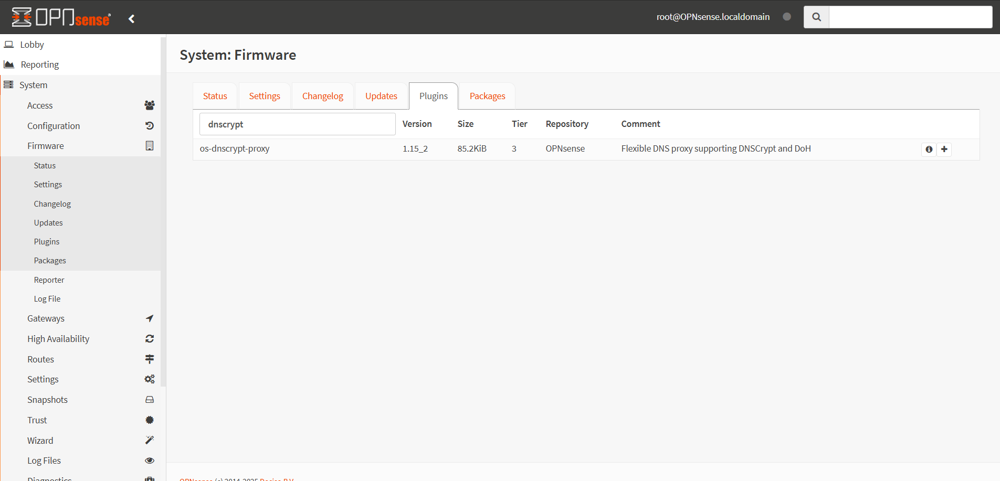

Жмем иконку + напротив с названием плагина os-dnscrypt-proxy для его установки. После этого вы будете переадресованы в меню установки.

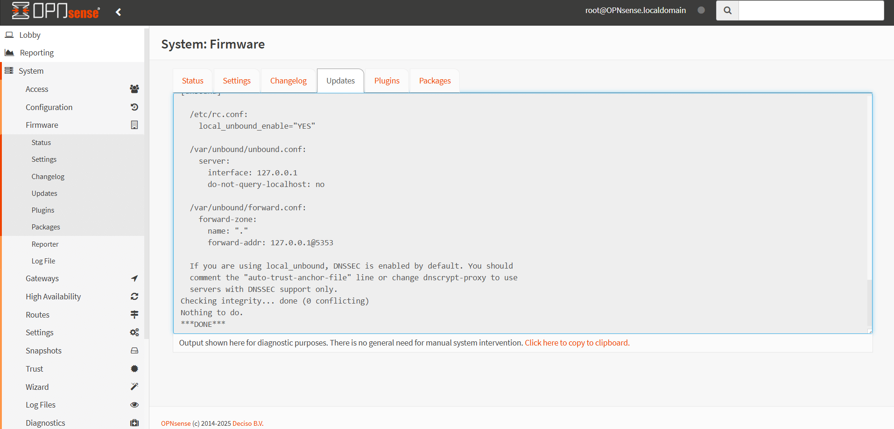

После перезагрузки меню Opnsense кнопкой F5 в меню Services у вас появится новое меню DNSCrypt-Proxy

## Настройка плагина DNSCrypt-proxy

Вы можете включить и настроить DNSCrypt-proxy в OPNsense по пути Services > DNSCrypt-proxy > Configuration. Демон, когда он будет инициализирован, будет искать список публичных DNS серверов по адресу https://dnscrypt.info/public-servers. Собственно по этой ссылке и вы можете посмотреть этот список.

В зависимости от приведенных ниже параметров, список может быть сокращен исходя из ваших предпочтений, например, можно отключить логирование или ограничить лог только IPv4 адресами. Запросы DNS будут выполняться двумя серверами, которые обрабатывают их наиболее быстро. На странице конфигурации DNSCrypt-proxy доступны следующие настройки.

**Enable DNSCrypt-Proxy**: Ставьте птицу, чтобы активировать сервис

**Listen Address**: Вы можете настроить адреса и порты для прослушивания. Настройки по умолчанию: локал-хост и порт 5353. Чтобы разрешить прослушивание по порту 53, вы должны включить **Allow Privileged Ports**, особенно когда система предназначена для работы в качестве резолвера.

**Allow Privileged Ports**: Эта опция позволяет сервису слушать на портах ниже 1024, например 53

**Max Client Connections**: Вы можете установить максимальное количество одновременных подключений клиентов, которые вы хотите принять.

**Use IPv4 Servers**: Вы можете позволить DNSCrypt-Proxy использовать серверы с поддержкой IPv4

**Use IPv6 Servers**: Вы можете позволить DNSCrypt-Proxy использовать серверы с поддержкой IPv6

**Use DNSCrypt Servers**: Вы можете разрешить DNSCrypt-Proxy использовать серверы с серверами с поддержкой протокола DNSCrypt.

**Use DNS-over-HTTPS Servers**: Вы можете разрешить DNSCrypt-Proxy использовать серверы с серверами которые поддерживают протокол DNSCrypt-over-HTTPS.

**Require DNSSEC**: Вы можете разрешить только DNS-резолверы с включенными DNSSEC.

**Require NoLog**: Вы можете разрешить только DNS-резолверы с отключенным логированием.

**Require NoFilter**: Вы можете разрешить только DNS-резолверы без фильтрации.

**Force TCP**: Вы можете последовательно использовать TCP для подключения к upstream серверам. Это удобно, если вам нужно маршрутизировать весь трафик через Tor; в противном случае не активируйте эту функцию

**Proxy**: Вы можете использовать эту опцию для маршрутизации всех TCP-соединений с помощью локального узла Tor. Формат должен быть в виде `127.0.0.1:9050`.

**Timeout**: Вы можете указать, как долго DNS-запрос будет ждать ответа в миллисекундах; по умолчанию 2500.

**Keepalive**: Думаю, что тут все понятно; по умолчанию значение установлено в 30 секунд.

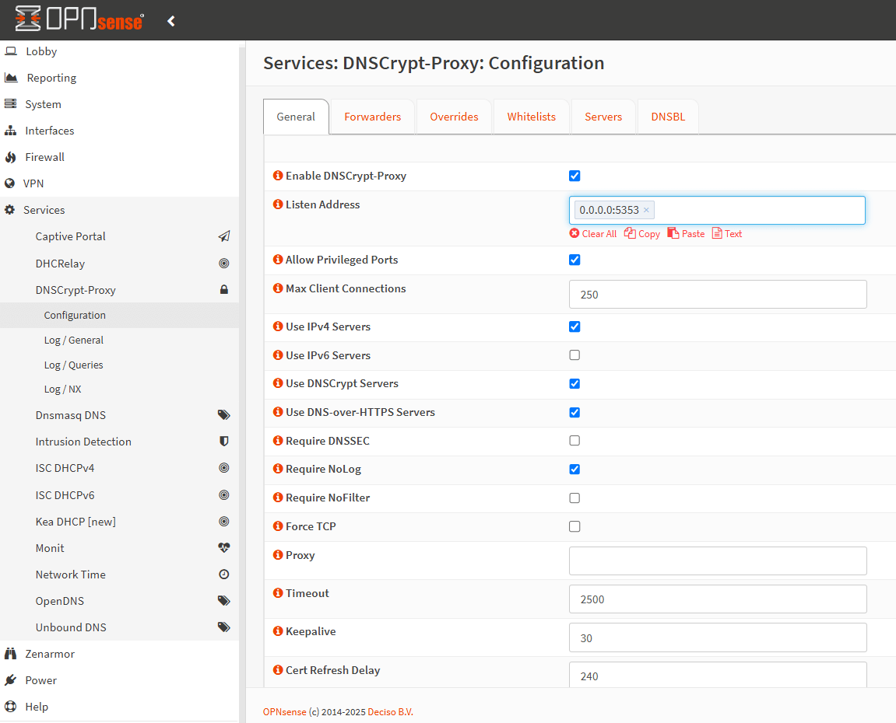

**Cert Refresh Delay**: Вы можете указать задержку в минутах, по истечении которой сертификаты будут перезагружены; значение по умолчанию — 240.

**Ephemeral Keys**: Вы можете создать отдельный ключ для каждого DNS-запроса. Это может повысить конфиденциальность, но может значительно повлиять на загрузку процессора.

**TLS Disable Session Tickets**: Вы можете отключить сессионые тикеты TLS. Это повышает конфиденциальность, но также увеличивает задержку.

**Fallback Resolver**: Это стандартный незашифрованный DNS-резолвер, предназначенный только для разовых запросов на получение начального списка резолверов и только в случае сбоя конфигурации DNS в системе. Значение по умолчанию — 9.9.9.9:53, что соответствует DNS-сервису Quad9. Вы можете изменить его на 1.1.1.1:53 для использования Cloudflare.

**Block IPv6**: Если не используете IPv6 можете отключить.

**Cache**: Можете включить кэш, если хотите снизить задержки.

**Cache Size**: Указываете желаемый размере кэша

**Cache Min TTL**: Минимальный TTL для кэшированных for cached записей.

**Cache Max TTL**: Максимальный TTL для кэшированных for cached записей.

**Cache Negative Min TTL**: Вы можете указать минимальный TTL для отрицательно кэшированных записей

**Cache Negative Max TTL**: Вы можете указать максимальный TTL для отрицательно кэшированных записей

**Server List**: Вы можете составить список известных серверов. Вы также можете разместить свои серверы с добавлением их вручную. Список доступных серверов вы можете найти в следующем разделе. Если эта строка остается пустой, DNS-серверы выбираются случайным образом.

**Enable query logs**: Эта опция активирует/деактивирует локальные логи.

**Disabled Servers List**: Вы можете исключить серверы из автоматического выбора, добавив здесь любые конкретные имена серверов, если вы не хотите использовать их по какой-либо причине.

**Relay List**: Вы можете установить список relay серверов, которые будут использоваться для ретрансляции на все сконфигурированные серверы.

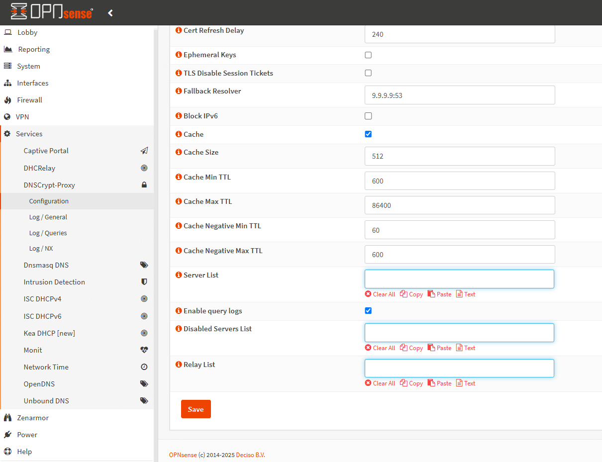

## Ручное добавление публичных DNSCrypt серверов

Плагин DNSCrypt-proxy позволяет добавлять специальные общедоступные серверы DNSCrypt по своему усмотрению. Чтобы определить общедоступные серверы DNSCrypt, которые вы хотите использовать в своем OPNSense, вы можете выполнить следующие шаги.

Во-первых, вам нужно найти информацию о SDSNS stamps для DNS-сервера. Для этого вы можете посетить https://dnscrypt.info/public-servers/.

Нажмите на DNS-сервер, например adguard-dns, который может использоваться для удаления рекламы и защиты вашего компьютера от вредоносных программ.
Скопируйте значение в поле SDNS stamp.

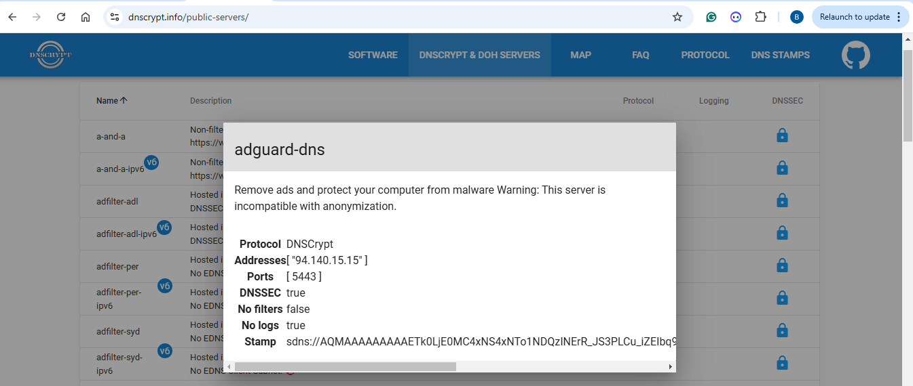

Переходим к Services > DNSCrypt-proxy > Configuration в веб-интерфейсе Opnsense
Кликаем на меню Servers

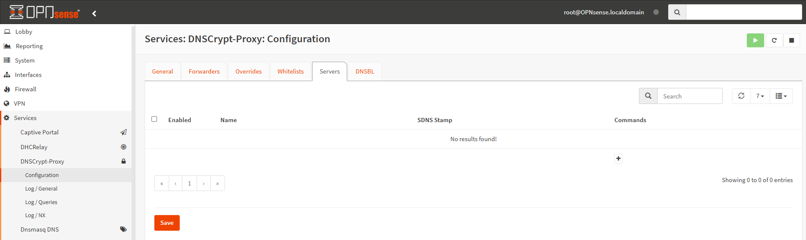

Нажмите кнопку Add с иконкой + в правом нижнем углу страницы.

Убедитесь, что сервис активирован.

Введите имя для DNS-резолвера, в нашем случае adguard-dns.

Вставьте штамп SDNS, который вы скопировали на шаге 3, но без префикса sdns://.

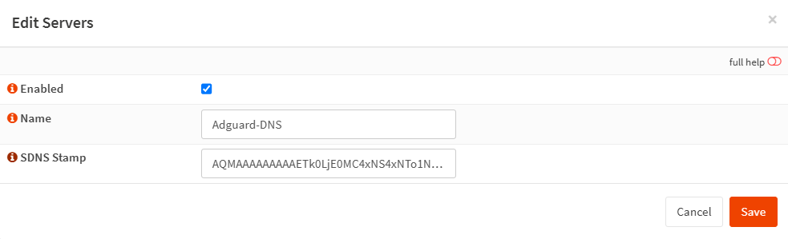

Вы можете добавить столько DNS-серверов, сколько хотите.
Нажмите Save. 
Это автоматически добавит новые настройки сервера, и он будет указан на странице Servers.

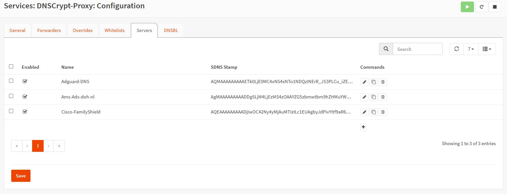

Вы можете легко редактировать настройки DNS-серверов, нажав на кнопку «Edit» со значком ручки в конце строки.

Вы можете удалить настройку DNS-сервера, нажав на кнопку Delete с помощью значка мусора в конце строки.

Сам плагин обладает всеми необходимыми возможностями для блокировки рекламы, составления whitelists и в принципе замены Unbound DNS, но лично мне такой вариант не очень нравится. И я использую Unbound DNS по полной в этой части.

Поэтому я перенаправляю все dns запросы на встроенный в Opnsense Unbound DNS

## Перенаправление DNS-запросов в Unbound DNS на DNSCrypt-proxy

Вы можете легко интегрировать сервер Unbound DNS с DNSCrypt-прокси на брандмауэре OPNSense. В старых версиях это было не так просто. Чтобы позволить Unbound DNS отправлять все DNS-запросы на DNSCrypt-proxy, вы должны выполнить следующие шаги.

Идем в **Services** > **Unbound DNS** > **Query Forwarding**
Нажмите на кнопку **Add** с значком + в правом нижнем углу панели **Custom Forwarding**
Убедитесь, что опция **Enabled** включена
Оставьте поле **Domain** пустым, чтобы перенаправить все запросы на службу DNScrypt-proxy.
Введите 127.0.0.1 в поле **Server IP**.
Укажите порт на котором будет прослушиваться сервис DNSCrypt-прокси в разделе **Server Port**, например `5353`

Вы можете ввести описание для вашей ссылки, например `DNSCrypt-proxy`

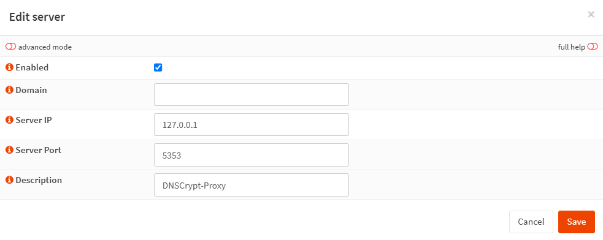

Нажмите кнопку **Save**.

Нажмите кнопку **Apply** для активации переадресации запросов.

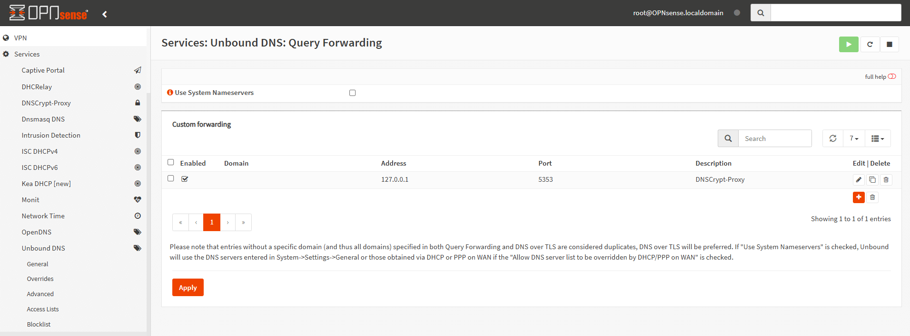

## Запуск DNSCrypt-proxy как самостоятельного DNS-сервера

Скажу честно, лично я так не делал, потому что функционала у Unbound DNS намного больше, но есть люди которые не хотят городить много сервисов и хотят все сделать минималистичным.
Сейчас расскажу как это сделать.

DNSCrypt-Proxy может функционировать как комплексная и независимая DNS-альтернатива для Unbound или Dnsmasq. Эта конфигурация устраняет необходимость в переадресации запросов для шифрования DNS-запросов или использования DNSBL. Чтобы запустить DNSCrypt-Proxy в качестве автономного DNS-сервера, вам может потребоваться выполнить следующие шаги.

Отключите **Unbound DNS**, перейдя в **Services** > **Unbound DNS** > **General**, а затем снимите галку напротив `Enable Unbound`.

Отключите Dnsmasq по аналогии с Unbound DNS, если вы используете Dnsmasq.

Теперь вы можете приступить к настройке опций, таких как выбор серверов, создание политики конфиденциальности или настройки кэширования. `Cloaking` или `DNSBL` могут использоваться без каких-либо дополнительных настроек.

## Проверка конфигурации DNSCrypt-прокси

После установки плагина DNScrypt-proxy в брандмауэре OPNsense вы можете проверить конфигурацию несколькими способами.

### Просмотр журналов DNSCrypt-прокси

После включения сервера DNSCrypt-прокси и включения параметра регистрации запросов на вашем OPNsense вы должны увидеть как отклоненные, так и переданные DNS-запросы в своей сети на странице `Log/Queries`, перейдя в `Services > DNSCrypt-proxy` > `Log/Queries`. Ниже приведен файл журнала образца.

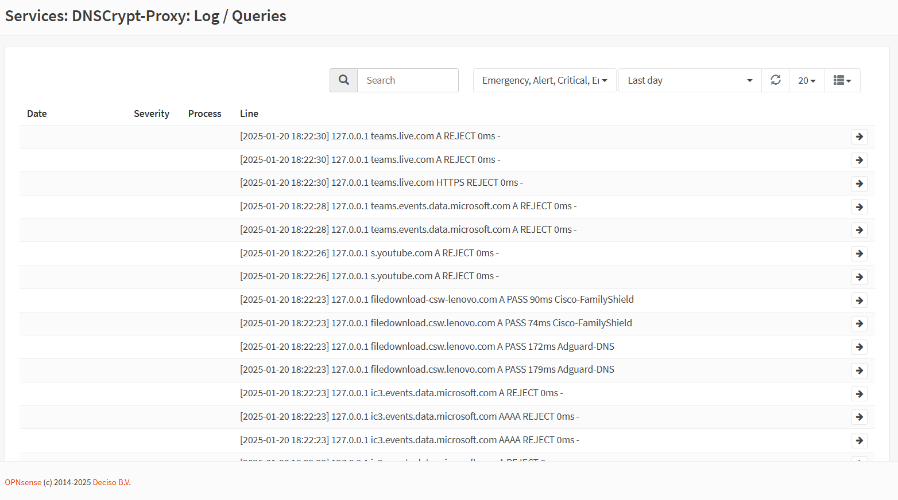

Вы можете просматривать доступные DNS-серверы, к которым уже получил доступ ваш OPNsense, и время их отклика на странице `Log/General`, перейдя в `Services` > `DNSCrypt-proxy` > `Log/General`.

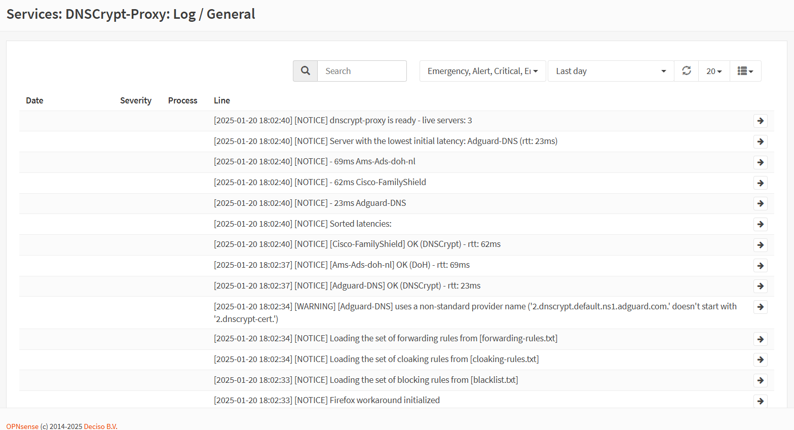

### Использование сайта DNS Leak Test

Для проверки работоспособности сервиса можно использовать сайт `DNS Leak Test`

DNSleaktest.com - это широко используемый веб-сайт, который можно использовать для определения используемых DNS-резолвер.

Вы можете проверить свои настройки DNSCrypt-proxy, выполнив следующие шаги.

Зайдите на сайт `dnsleaktest.com`.

Кликните на кнопку `Extended test` и подождите пока тест не будет пройден до конца.
Вы должны увидеть список ваших DNSCrypt серверов, похожий на тот, что на картинке ниже.

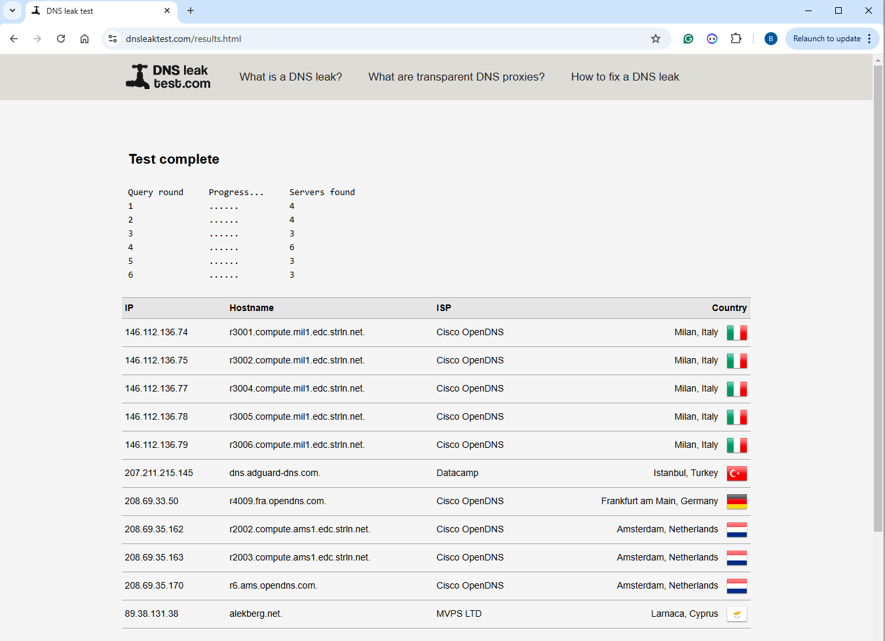

> [!NOTE]
>Пожалуйста, имейте в виду, что тест проверяет только конфигурацию вашего веб-браузера. Возможно, что в другом программном обеспечении используется отдельная конфигурация DNS. Неправильные результаты также могут быть получены с помощью HTTP-прокси.

### Блокировка рекламы

Вы можете добавить разные DNSBL (днс блоклисты), такие как `AdAway List`, `AdGuard List` и `Simple Adlist`, чтобы заблокировать рекламу, а затем посетить сайт `https://canyoublockit.com/testing/`. Вы должны увидеть страницу `Adblocker Test`, которая похожа на ту, что приведена ниже.

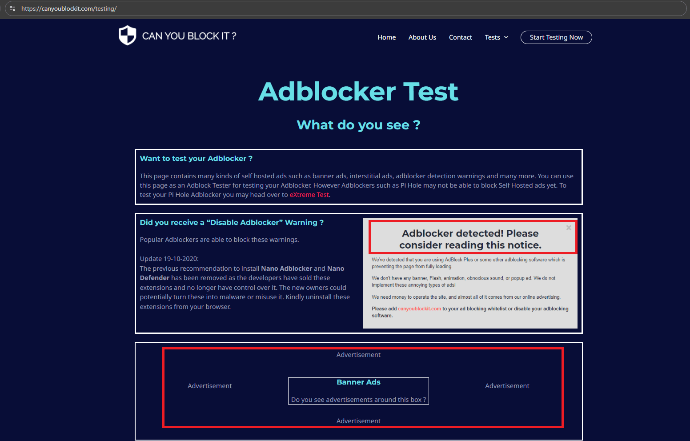

## Что такое общедоступные серверы DNSCrypt?

Бесплатные резолверы с поддержкой DNSCrypt доступны по всему миру. Вы можете найти интерактивный список общедоступных DNS-серверов на сайте `https://dnscrypt.info/public-servers`

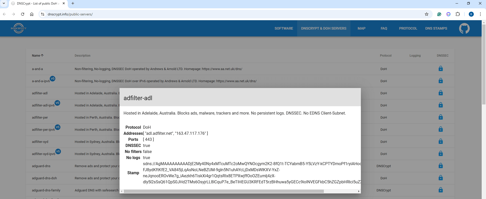

Интерактивная карта общедоступных DNS-серверов доступна по адресу `https://dnscrypt.info/map`

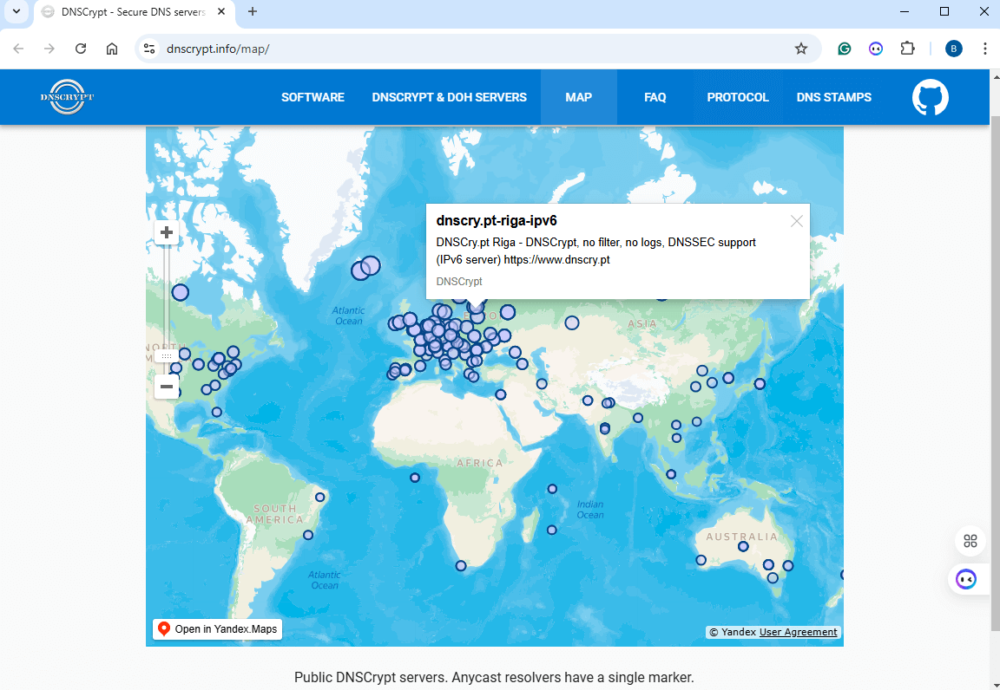

Серверы с поддержкой DNSCrypt OpenNIC указаны по адресу https://download.dnscrypt.info/dnscrypt-resolvers/v3/opennic.md.

Серверы DNSCrypt, используемые для родительского контроля, доступны по адресу: https://download.dnscrypt.info/dnscrypt-resolvers/v3/parental-control.md.

Обширный список публичных DNS-резолверов, поддерживающих протоколы DNSCrypt и DNS-over-HTTP2 доступны по адресу: https://download.dnscrypt.info/dnscrypt-resolvers/v3/public-resolvers.md

## Особенности DNSCrypt-proxy

DNSCrypt-proxy - это мощный DNS-прокси. Он работает на вашем компьютере или маршрутизаторе, обеспечивая локальную блокировку нежелательной информации, раскрывая адресата передачи данных с ваших устройств, повышая производительность приложений с помощью кэширования ответов DNS и усиливая безопасность и приватность, используя безопасные маршруты для связи с upstream DNS-серверами. DNSCrypt-proxy обладает следующими возможностями.

**Фильтрация**: блокирует рекламу, вирусы и дополнительный нежелательный контент. Совместимость со всеми DNS-провайдерами.

**Шифрование и аутентификация DNS-связи**. Облегчает работу DNS-over-HTTPS (DoH) с использованием TLS 1.3 и QUIC, DNSCrypt, Anonymized DNS и ODoH. IP-адреса клиентов могут быть скрыты через Tor, SOCKS или анонимные DNS-ретрансляторы.

**Маскировка**, которая может быть использована для обеспечения безопасных результатов поиска в Google, Yahoo, DuckDuckGo и Bing.

**Фильтрация** с универсальным еженедельным расписанием.

**Балансировка нагрузки**, которая позволяет администраторам выбирать группу резолверов. В таких случаях DNScrypt-proxy будет автоматически оценивать и контролировать их производительность, распределяя трафик среди самых быстрых доступных опций.

**Мониторинг запросов DNS**, используя различные файлы журналов для стандартных и не очень запросов

**DNS-кэширование** для уменьшения задержки и улучшения конфиденциальности.

**Четкая маршрутизация** конкретных доменов для определенных резолверов

**Локальное** понижение очередности запросов IPv6 для уменьшения задержки в эксклюзивных сетях IPv4

**Автоматическое** обновление списков резолверов

**Совместимость** с DNS Security Extensions

Включает в себя локальный сервер DoH для облегчения **ECH** (ESNI).
