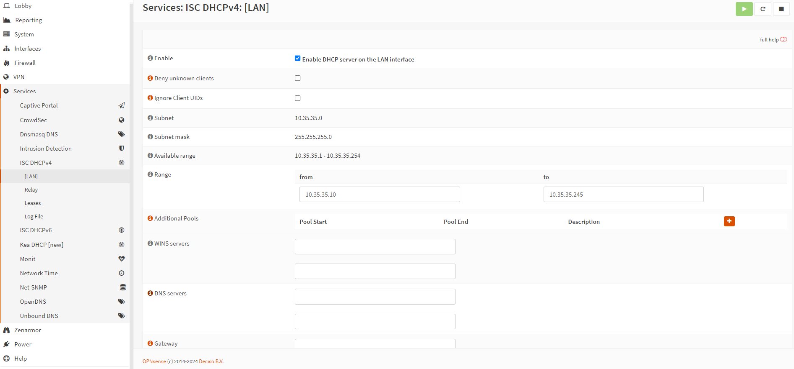

<iframe width="100%" height="468" src="https://www.youtube.com/embed/RSrT7VfC5As?si=5Wd9d3T6WFZTRnbf" title="YouTube video player" frameborder="0" allow="accelerometer; autoplay; clipboard-write; encrypted-media; gyroscope; picture-in-picture; web-share" allowfullscreen></iframe>

> **DNS over TLS (DoT)** — это способ шифрования DNS-запросов, повышающий конфиденциальность и защищённость от их перехвата злоумышленниками. В OPNsense вы можете включить DoT с помощью встроенного DNS-сервера **Unbound**.

## Настройка Unbound DNS, split dns, борьба с рекламой или как я перестал пользоваться Pi-Hole часть 1

Если вам понравилась настоящая статья, то можете поддержать автора став спонсором на бусти (ссылка в разделе контакты).

Те, кто смотрели мои ролики на ютубе знают, что дома я давно пользуюсь Opnsense в качестве роутера и firewall.
По умолчанию Opnsense использует Unbound DNS в качестве DNS резолвера. Это на самом деле очень крутое решение, которое в итоге заменило мне очень много разных сервисов и соответственно теперь у меня всего одна точка отказа. С одной стороны, это может звучать как минус, но конкретно в данном случае - это плюс. Почему? Потому что в случае возникновения проблем с DNS, а проблемы всегда в DNS, искать проблему теперь надо только в одном месте, а не как раньше, то ли в opnsense, то ли в Pi-Hole и т.д.
Но давайте обо всем по порядку.

**Unbound DNS** — это рекурсивный DNS-сервер с открытым исходным кодом, разработанный NLnet Labs. Он ориентирован на безопасность, производительность и соответствие современным стандартам DNS. В OPNsense он является DNS-сервером по умолчанию. Unbound работает как рекурсивный резолвер, то есть он сам запрашивает DNS-записи, начиная с корневых серверов, без обращения к сторонним публичным резолверам (например, 8.8.8.8).

## Перечень функций Unbound DNS

- DNSSEC для проверки подлинности ответов DNS.
- Local DNS overrides — локальные записи DNS.
- DNS over TLS (DoT) и DNS over HTTPS (DoH).
- Access control — настройку прав доступа к DNS.
- Caching — кэширование запросов.

## Плюсы использования Unbound DNS в OPNsense

1. Безопасность

· Поддержка DNSSEC.
· Возможность включения DNS over TLS, шифрующий трафик DNS.
· Минимальное количество внешних доверенных точек — резолвинг напрямую с корневых серверов.

1. Производительность

· Очень быстрый и лёгкий.
· Эффективное кэширование: частые запросы обрабатываются моментально.
· Хорошо работает даже на слабом «железе» (домашние маршрутизаторы, мини-ПК).

1. Гибкость

· Можно задать собственные зоны, редиректы, блокировку рекламы.
· Поддерживает настройку доступа по IP, интерфейсам и портам.

1. Приватность

· Нет зависимости от внешних публичных DNS-провайдеров (в отличие от Google, Cloudflare и т. д.).
· Нет логирования DNS-запросов, если вы не настроите его вручную.

1. Глубокая интеграция с OPNsense

· Управляется через веб-интерфейс.
· Поддерживает DHCP Static Mappings в связке с DNS.
· Совместим с настройками firewall, VLAN, aliases.

## Минусы и ограничения Unbound DNS

1. Медленное разрешение первых запросов

- При включенном полном рекурсивном режиме первый DNS-запрос может быть немного медленнее, чем у публичных резолверов с предзагруженным кэшем.
- Это особенно заметно после перезагрузки или очистки кэша.

1. Сложность настройки

- Некоторые функции (например, DNS over TLS, блокировка рекламы) требуют ручной настройки в конфигурационных файлах или через расширенные настройки.
- Не для новичков, если нужны сложные правила фильтрации или нестандартная маршрутизация.

1. Отсутствие встроенной фильтрации рекламы

- В отличие от Pi-hole или AdGuard Home, Unbound не фильтрует рекламу «из коробки» необходимо ручное активирование соответствующего функционала (по факту пару кликов мышкой, поэтому это минус очень условный).
- Требуется вручную выбирать блоклисты, чье название не всегда интуитивно понятно.

1. Отсутствие красивого графического логирования запросов

- Нет красивой статистики и интерфейса, как у того же AdGuard Home или Pi hole (есть некрасивая. На самом деле все хорошо там с графикой).

## Порядок настройки

Все DNS-запросы маршрутизируются в открытом виде. Ваш интернет-провайдер или хакер может перехватывать передачи запросов по протоколам UDP и TCP на порту 53 в открытом виде, чтобы скомпрометировать DNS-запросы и ответы сайта. По этой причине мы должны шифровать наши DNS-запросы в целях безопасности. DNS через TLS (DoT) — это протокол безопасности, который использует Transport Layer Security (TLS) для шифрования DNS-трафика и является одним из наиболее распространенных решений безопасности DNS. Основная задача — повысить вашу безопасность и конфиденциальность. Вот несколько преимуществ DNS over TLS:

- Предотвращение манипуляций с DNS со стороны злоумышленника.
- Исключение атаки типа «человек посередине». Это когда ваш запрос перехватывается и перенаправляется на какой-нибудь фишинговый сайт.
- Предотвратить шпионаж. Ну для дома это конечно фантасмагория.

## Включение DoT в Opnsense

Чтобы настроить и включить DoT на брандмауэре OPNsense, выполните следующие действия:

1. Перейдите в раздел «Services» → «Unbound DNS» → «DNS over TLS» в веб-интерфейсе OPNsense.

1. Нажмите кнопку «Добавить» со значком + в правом нижнем углу панели.
2. Убедитесь, что отмечен параметр «Включено».
3. Вы можете оставить поле Домен пустым. По умолчанию, если оставить это поле пустым, все запросы будут направляться на указанный сервер. Ввод доменного имени в этом поле приведет к направлению запросов для этого конкретного домена на выбранный сервер.
4. Введите IP-адрес DNS-сервера для пересылки всех запросов, например 8.8.8.8.
5. Установите порт сервера для DoT 853.
6. Введите общее имя DNS-сервера (например, dns.google.com) в поле Verify CN, чтобы проверить его сертификат TLS. DNS-over-TLS уязвим для атак типа «человек посередине», если подлинность сертификатов не может быть подтверждена. Вы можете оставить поле пустым, чтобы принять самоподписанные сертификаты, но это полностью нивелирует смысл того, что мы с вами делаем в этой статье.

1. Нажмите «Сохранить» .
2. Вы можете добавить DNS-сервер IPv6 в качестве вторичного DNS-резолвера.
3. Нажмите «Применить», чтобы активировать настройки.

В итоге вы получите что-то вроде такого

## Настройка DNS и DHCP серверов

Чтобы заставить всех клиентов в вашей сети использовать серверы DoT, которые вы определили выше, вы должны правильно настроить свои серверы DNS и DHCP. Вы можете настроить службы DNS и DHCP в OPNsense, выполнив следующие шаги:

1. Перейдите в раздел System → Settings → General в меню слева.
2. Убедитесь, что все поля для DNS-серверов пустые. Это делается для того, чтобы гарантировать, что DNS-трафик будет перенаправлен обратно на маршрутизатор.
3. Снимите флажок Allow DNS server list to be overridden by DHCP/PPP on WAN для параметров DNS-сервера. Если этот параметр включен, DNS-серверы, предоставляемые DHCP/PPP-сервером в глобальной сети (WAN) (перевожу на русский, это днс сервера вашего провайдера), будут использоваться для своих предполагаемых функций, таких как предоставление DNS-сервисов. И соответственно они будут иметь приоритет.

1. Нажмите «Сохранить» .
2. Перейдите в раздел Services → ISC DHCPv4 → LAN в веб-интерфейсе OPNsense.
3. Убедитесь, что поля DNS Servers пусты. Мы должны использовать системные DNS-серверы по умолчанию.
4. Нажмите «Save» , а затем нажмите кнопку «Обновить» в правом верхнем углу, если настройка была изменена.

Чтобы обеспечить безопасную и доверенную среду, рекомендуется использовать правило брандмауэра, которое запрещает любой исходящий трафик DNS на порту 53 при использовании DNS over TLS, который у нас использует порт 53. Если клиенты решат напрямую запрашивать другие серверы имен самостоятельно, можно использовать правило перенаправления NAT для отправки этих запросов на 127.0.0.1:53, который является локальной службой Unbound. Это гарантирует, что эти запросы точно будут отправлены через TLS.

Список  СN доменов, которые используются для DoT надо смотреть для соответствующего провайдера.
Для quad 9 это  - dns.quad9.net.
