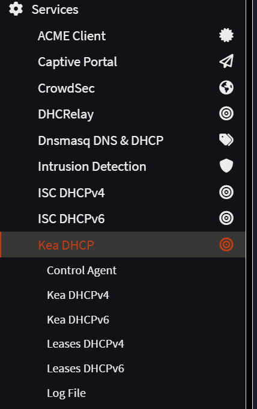
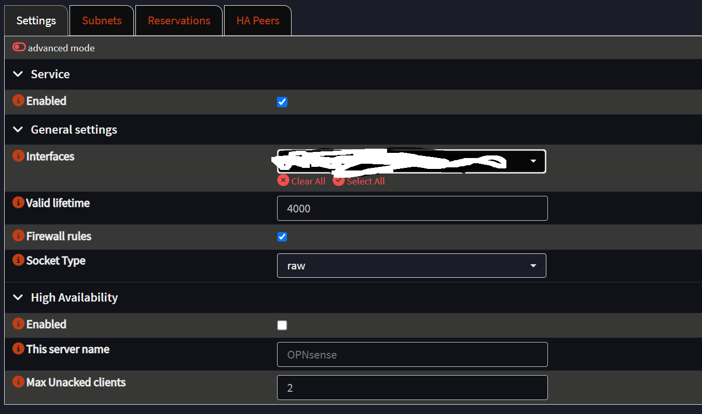
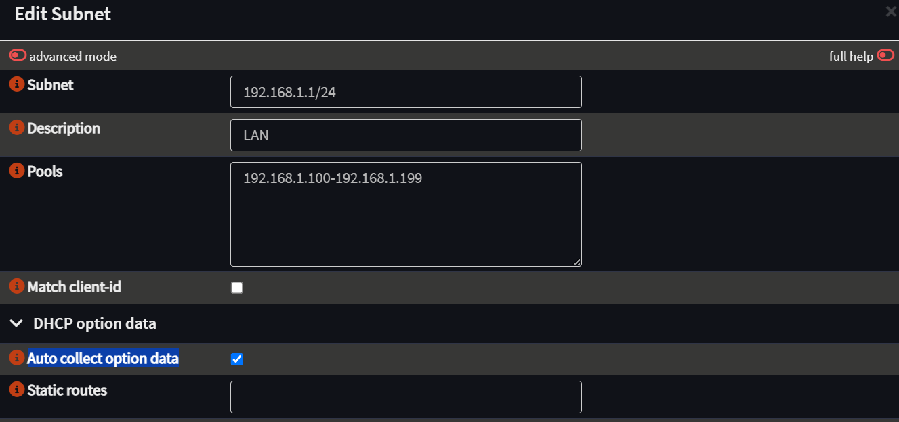

<iframe width="100%" height="468" src="https://www.youtube.com/embed/R5LZuPm_eoY?si=EddqTaoqKpHGpolH" title="YouTube video player" frameborder="0" allow="accelerometer; autoplay; clipboard-write; encrypted-media; gyroscope; picture-in-picture; web-share" allowfullscreen></iframe>

# Зачем переходить на Kea DHCP в OPNsense?

По умолчанию OPNsense использует ISC DHCP-сервер, который надёжен, но не просто морально устарел, но и как проект [ISC DHCP](https://www.isc.org/dhcp/) достиг своего конца жизни (EOL) и более не развивается. На смену ему пришёл **Kea DHCP** — модульное, высокопроизводительное и гибкое решение от тех же разработчиков.

Если вам понравилась настоящая статья, то можете поддержать автора став спонсором на бусти (ссылка в разделе контакты).

Kea DHCP — мощная альтернатива устаревшему ISC DHCP, предлагающая современный подход к распределению IP-адресов и возможность централизованного управления. Если вы используете OPNsense в продакшене или домашней лаборатории — самое время перейти на более гибкое и активно развивающееся решение.

### Преимущества Kea DHCP

- **Горячее обновление списка аренд адресов** — можно менять конфигурацию без перезапуска.
- **Модульная архитектура** — только нужные компоненты.
- **Поддержка хранения списка аренд ip в базе данных (MySQL/PostgreSQL)**.
- **REST API** — автоматизация и внешнее управление.
- **Поддержка расширенной логики через hooks и scripts**.
- **Активное развитие и поддержка** сообществом и ISC.

### Недостатки Kea DHCP

- **Более высокая нагрузка при использовании в контейнерах на слабом железе** Kea — современное и модульное ПО, но при использовании с REST API или БД может потреблять больше ресурсов. На маломощных одноплатниках (типа Raspberry Pi) или LXC-контейнерах производительность может быть ниже, чем у легковесного ISC DHCP.

- **Ограниченная поддержка failover (по сравнению с ISC)** В ISC DHCP реализован классический failover peer protocol. В Kea пока что нет полноценного HA-механизма "из коробки", вернее есть определенные нюансы при настройке.

### Ссылки

- [Официальная документация Kea DHCP](https://Kea.readthedocs.io/)
- [Проект OPNsense](https://opnsense.org/)
- [GitHub Kea DHCP](https://github.com/ISC-projects/Kea) 

В Opnsense достаточно давно Kea DHCP идет из коробки. Вариант который я опишу в этой статье подходит как для настройки с нуля, так и если у вас уже есть работающий Opnsense c ISC DHCP сервером.

Я долго подходил или, будет более точно сказать, не хотел начинать переезд с ISC DHCP на Kea DHCP, так как боялся, что при переезде что-то да поломается. Более того Kea по меркам скоростей с которой развиваются (внедряются) сетевые технологии, проект молодой. На Kea DHCP у пользователей Opnsense бывают нарекания, он еще пока не такой стабильный как хотелось бы, и кому-то функционала может не хватать. Учитывая все перечисленное, разработчики OPNsense начали внедрять Dnsmasq DHCP & DNS, как легковесную альтернативу Kea DHCP. В итоге у пользователей Opnsense теперь есть вариант для выбора dhcp сервера. Сами разработчики на своем сайте предлагают следующее разделение: Dnsmasq для дома и маленького офиса, а Kea DCHP только для бизнес задач. Но к сожалению и Dnsmasq DHCP пока продукт для Opnsense слишком свежий. Постоянно что-то приходится исправлять. Правда это ожидаемо для нового решения. 
Итог следующий. В январе 2026 в версии 26.1 ISC DHCP будет удален из предустановленных пакетов и будет доступен **только** как плагин для любителей преданий старины глубокой. А пользователи будут вправе самостоятельно решать какой вариант DHCP сервера выбрать. НО при этом по умолчанию будет использоваться DNSMasq. При этом переезд с Kea DHCP на Dnsmasq DHCP и наоборот может быть очень быстрым, потому что оба варианта сервиса поддерживают формат .csv. То есть вам достаточно будет активировать сервер, сделать минимальные начальные настройки и скормить csv файл с данными статических аренд.
К сожалению ISC сервер, как старая технология, такой формат не поддерживает, поэтому переезд с ISC сервера в системах где большое количество статических аренд может занять много времени. Но, если исходить из принципа наполовину полного стакана, то это надо сделать всего лишь раз.

### Настройка KEA DHCP сервера

Итак. Представим что у вас существующий сетап с ISC. Когда у вас свежая установка, то по большому счету делать вы будете тоже самое, разве что вам не надо будет переносить существующие аренды.
Порядок моих действий был следующий. Сначала на неработающем Kea DHCP (и соответственно работающем ISC) я делал все необходимые настройки, вносил данные об интерфейсах, статических адресах, потом включал Kea DHCP и тут же выключал ISC DHCP. Соответственно статические аренды подхватывались сразу, а динамические появлялись в списках аренд Kea DHCP после того как истекал срок аренды, учитываемый ISC сервером, хотя он уже и был выключен. Все прошло без сучка и задоринки. Я даже удивился, что все прошло так просто.

Идем в Services, выбираем Kea DHCP

Control Agent нас не интересует, так как он нужен для использования в enterprise. В домашних условиях вряд ли вы устраиваете HA для роутеров?! Ведь не устраиваете же?
Я предполагаю, что у вас обычный Ipv4, поэтому показываю все на примере для обычных людей. Переходим в Kea DHCPv4. Пока мы, повторюсь, не активируем сервис, но в разделе интерфейсы в ниспадающем меню должны выбрать все интерфейсы на которых мы хотим, чтобы работал наш новый DHCP сервер. Если у вас их всего два: WAN и LAN, то выбираем только LAN. Если вы такой же ненормальный как и я, то у вас интерфейсов больше трех, как минимум: WAN, LAN и какой-нибудь VLAN. Выбираете все что угодно, кроме WAN.
После выбора всех нужных вам интерфейсов обязательно ставим галку напротив firewall rules. В строке valid lifetime можете указать нужное вам время аренды dhcp, но стандартные значения должны подойти для большинства сценариев использования. HA режим конечно не трогаем.
У меня получилось все вот так/

Теперь переходим в раздел subnets, жмем на значок красного плюсика и руками вбиваем данные наших подсетей.
В разделе subnet введем данные нашей подсети. Например для дефолтной сети LAN это выглядит как 192.168.1.1/24. Задаем описание в разделе description, но это уже по желанию. Если подсетей у вас мало или память хорошая, то в этом нет необходимости. В разделе pool вам необходимо руками вбить пул айпи адресов, которые будет автоматом раздавать dhcp сервер. Давайте зададим пул адресов как это было с ISC в формате 192.168.1.100 - 192.168.1.199. Снимаем галку напротив match client-id. Я воздержусь от слов, что сделать это надо обязательно, но если вы хотите чтобы в будущем вы могли регистрировать аренду ip по mac адресам, а вы именно этого на самом деле хотите, то галку надо снять. В разделе DHCP option data ставим галку напротив Auto collect option data. Больше ничего не трогаем.

В итоге у нас следующая ситуация. Нам нужно перенести существующие статические аренды из ISC DHCPv4 в Kea DHCPv4. И тут придется все делать руками. Если бы мы все настраивали с нуля, то тут вроде как и выбора нет, но когда ты это делаешь на рабочем сетапе, а аренд много - это муторно, так как никакой автоматики. 
Идем в раздел reservation, жмем плюс. В ниспадающем меню выбираем нужную нам подсеть (subnet) где мы хотим, чтобы был зарегистрирован наш девайс. Дальше все уже логично и интуитивно понятно. В разделе ip задаем желаемый ip. В поле mac адрес вносим mac адрес нашего устройства, задаем имя хоста и описание. Последнее по желанию. Ну вот и все. Я дольше писал, чем вы это будете делать.
Теперь возвращаемся в раздел settings, ставим галку для активации Kea DHCP сервера, идем в ISC и деактивируем уже его.
Все. Работа сделана. Дальше вы уже можете смотреть в логах как заканчивается время аренды устройств в ISC DHCPv4 и они появляются в Kea DHCPv4. 
