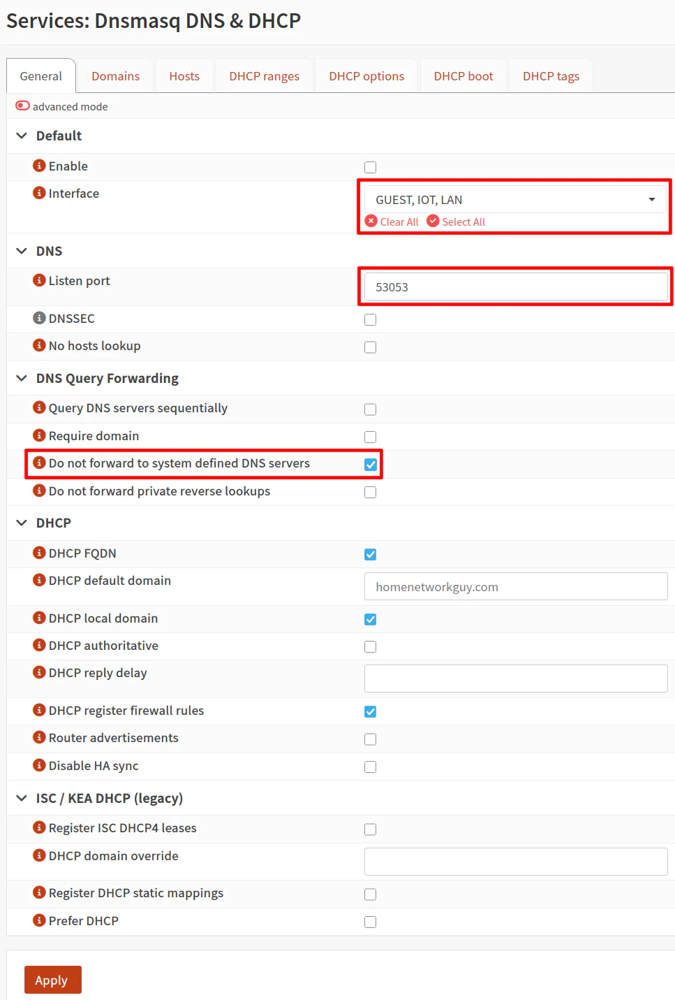

## Вступление

В этой статье разберем с вами настройку широко известного шлюза Opnsense 26.1

> [!NOTE]
> Настоящая статья, посвященная настройке Opnsense, является уникальной для русскоязычной части сети. Ее написание отняло у автора много времени и сил, поэтому, в случае, если вы нашли данную статью полезной и считаете возможным отблагодарить автора, то это можно сделать по соответствующей ссылке на [**boosty**](https://boosty.to/stilicho2011)
>

<iframe width="560" height="315" src="https://www.youtube.com/embed/zuip_xItuT4?si=s8arFkRTOjOGC0Kz" title="YouTube video player" frameborder="0" allow="accelerometer; autoplay; clipboard-write; encrypted-media; gyroscope; picture-in-picture; web-share" referrerpolicy="strict-origin-when-cross-origin" allowfullscreen></iframe>

У меня на сайте достаточно много материалов посвященных настройке разных функций Opnsense, но для новичка они носят разрозненный характер и могут быть сложны для усвоения. В связи с этим, собравшись духом и из последних сил, я решился на этот сизифов труд.

## Что такое OPNsense

**OPNsense** — это свободно распространяемый дистрибутив межсетевого экрана и маршрутизатора с открытым исходным кодом, построенный на базе FreeBSD. Он позволяет превратить обычный компьютер, мини-ПК или виртуальную машину в полноценное сетевое устройство корпоративного уровня.

Несмотря на то что OPNsense часто называют просто «фаерволом», его возможности значительно шире. Помимо фильтрации сетевого трафика, система может выполнять функции маршрутизатора, VPN-шлюза, DHCP- и DNS-сервера, балансировщика нагрузки, обратного прокси, IDS/IPS, а также централизованной платформы для управления безопасностью сети.

> [!NOTE]
> Часть функций, такие как - обратный прокси, настраиваются с помощью плагинов

Одним из главных преимуществ OPNsense является сочетание широких возможностей, удобного веб-интерфейса и регулярных обновлений. Большинство задач выполняется через графический интерфейс, поэтому для настройки системы не требуется знание командной строки.

### Чем OPNsense отличается от других решений

Наиболее известными альтернативами OPNsense являются pfSense, MikroTik RouterOS, OpenWrt и различные Linux-дистрибутивы, настроенные вручную в качестве маршрутизатора.

Главное отличие OPNsense заключается в том, что система ориентирована на удобство администрирования, прозрачность разработки и регулярное развитие. Проект появился как форк pfSense (который сам по себе форк) и с самого начала сделал акцент на открытой модели разработки, современном интерфейсе управления и предсказуемом цикле обновлений.

По сравнению с MikroTik RouterOS OPNsense предоставляет более широкие возможности в области безопасности и интеграции дополнительных сервисов, которые, любители Mikrotik не обижайтесь, легче настраиваются. В отличие от OpenWrt, который в первую очередь предназначен для домашних маршрутизаторов и по факту является просто операционной системой для старых роутеров, OPNsense рассчитана на использование как на специализированном сетевом оборудовании, так и на обычных x86-компьютерах и виртуальных машинах.

Если сравнивать OPNsense с самостоятельно настроенным маршрутизатором на базе Linux, то она избавляет администратора от необходимости вручную собирать отдельные компоненты — такие как firewall, DHCP, DNS, VPN и систему мониторинга. Все основные функции уже интегрированы в единую платформу и доступны через веб-интерфейс.

### Какие задачи решает OPNsense

OPNsense может использоваться как в домашних сетях, так и в инфраструктуре малого и среднего бизнеса. Наиболее распространенные сценарии применения включают:

- организацию доступа в Интернет для нескольких сетей и VLAN;

- создание правил межсетевого экрана и сегментацию сети;

- развертывание VPN-серверов и VPN-клиентов (WireGuard, OpenVPN, IPsec);

- настройку DHCP- и DNS-сервисов;

- публикацию внутренних сервисов через обратный прокси;

- защиту сети с помощью IDS/IPS, GeoIP-фильтрации и других механизмов безопасности;

- мониторинг сетевой активности и анализ журналов событий;

- обеспечение высокой доступности (HA) и резервирования сетевой инфраструктуры.

### OPNsense в домашней лаборатории

Для владельцев домашней лаборатории OPNsense может стать одинм из центральных элементов сети, так как позволяет построить и настроить сеть, максимально приближенную к корпоративной, не требуя дорогостоящего оборудования и специальных познаний.

В домашней лаборатории OPNsense обычно используют для создания отдельных VLAN для серверов, рабочих устройств, IoT и гостевой сети, организации защищенного удаленного доступа через VPN, публикации сервисов в Интернет (есть плагин обратного прокси Caddy), настройки межсетевого экрана между сегментами сети и централизованного управления сетевой безопасностью.

Благодаря поддержке виртуализации OPNsense отлично работает в Proxmox VE и других гипервизорах. Поэтому OPNsense можно использовать как виртуальный маршрутизатор, не выделяя отдельное физическое устройство, хотя для максимальной производительности и надежности многие предпочитают устанавливать систему на компактный мини-ПК с несколькими сетевыми интерфейсами.

## Системные требования

OPNsense нельзя назвать требовательной операционной системой. Она без проблем работает как на компактных мини-ПК, так и в виртуальной машине. Однако требования к оборудованию напрямую зависят от того, какие функции вы планируете использовать.

Для знакомства с системой или домашней лаборатории достаточно [выделить]():

- двухъядерный процессор с архитектурой x86-64;

- 4 ГБ оперативной памяти;

- SSD объемом от 16 ГБ;

- не менее двух сетевых интерфейсов — один для подключения к провайдеру (WAN), второй для локальной сети (LAN).

Если же планируется использовать дополнительные возможности, например IDS/IPS, VPN для нескольких пользователей, Zenarmor или большое количество правил фильтрации, объем оперативной памяти лучше увеличить до 8–16 ГБ, а процессор выбрать с запасом производительности.

Отдельного внимания заслуживают сетевые адаптеры. Так как Opnsense основана на Freebsd, то это возможно один из самых важных вопросов. Для домашней лаборатории лучше использовать устройства на базе контроллеров Intel. Они отличаются стабильной работой, высокой производительностью и полностью поддерживаются FreeBSD, на которой основана OPNsense. С адаптерами Realtek система также работает, но с Realtek есть историчаская проблема с драйверами под сетевые устройства, поэтому я бы старался избегать их использование.

> [!warning]
> Следует учитывать одну особенность FreeBSD при работе в виртуализированной среде. Если сетевой адаптер не передается в виртуальную машину с OPNsense целиком с помощью PCI Passthrough, а используется виртуальный сетевой интерфейс, то на высокоскоростных каналах (10 Гбит/с и выше) производительность может значительно снижаться. В некоторых сценариях потери пропускной способности достигают 80 %.

По этой причине, если вы планируете использовать OPNsense на скоростях 10 Гбит/с и выше, рекомендуется по возможности использовать PCI Passthrough для сетевого адаптера или устанавливать систему непосредственно на физическое оборудование.

В качестве платформы можно использовать практически любое современное оборудование: мини-ПК, тонкий клиент, небольшой сервер или виртуальную машину. Многие пользователи запускают OPNsense в Proxmox VE, выделяя ей два или более виртуальных сетевых интерфейса. Такой вариант отлично подходит для домашней лаборатории, поскольку позволяет быстро создавать резервные копии, переносить систему между узлами и экспериментировать с настройками без использования отдельного оборудования.

> [!NOTE]
> В видео, ссылка на которое есть в начале настоящей статьи, я все устанавливал на минипк с двумя физическими сетевыми интерфейсами, поэтому в статье я буду придерживаться описания установки и первоначальной настройки именно такой конфигурации. Остальные настройки системы не зависят от способа установки - виртуализация или установка непосредственно на пк.

## Установка Opnsense

### Выбор установочного образа

Первым делом необходимо скачать установочный образ OPNsense с официального сайта проекта. Несмотря на большое количество вариантов, определиться с выбором достаточно просто — все зависит от того, где будет устанавливаться система.

Если OPNsense будет работать на физическом компьютере или мини-ПК с подключенными монитором и клавиатурой, выбирайте образ **VGA**. Именно он используется в этой статье.

Образ **DVD** предназначен в первую очередь для виртуальных машин и подходит для установки в Proxmox VE, VMware, Hyper-V и другие гипервизоры.

Если устройство оснащено последовательной консолью и управление осуществляется через COM-порт, следует использовать образ **Serial**. Такой вариант чаще встречается на промышленном оборудовании и некоторых сетевых устройствах.

Также на странице загрузки доступен образ **Nano**, однако в большинстве случаев он не потребуется. Разработчики рекомендуют использовать обычную установку с помощью VGA, DVD или Serial-образов.

### Создание загрузочной флешки

После загрузки образ необходимо записать на USB-накопитель. Для этого можно воспользоваться Rufus, balenaEtcher или любой другой программой, поддерживающей запись загрузочных образов.

После завершения записи подключите флешку к компьютеру, на который будет устанавливаться OPNsense, и выберите ее в качестве загрузочного устройства в BIOS или UEFI.

### Запуск установщика

Чтобы сделать настоящую статью  чуть более компактной, я не буду включать в данный раздел снимки экрана.

- Не нажимайте никаких клавиш, когда появится запрос **Configuration Importer**.
- Когда появится запрос на ручное назначение интерфейсов (**Manual Interface Assignment**), нажмите любую клавишу. Я предпочитаю настраивать интерфейсы вручную, а не использовать автоматическую настройку.
- Нажмите **Enter**, чтобы пропустить настройку **LAGG**.
- Нажмите **Enter**, чтобы пропустить создание **VLAN** (мы настроим их позже через веб-интерфейс).
- Введите **igc0** в качестве имени интерфейса **WAN**.
- Введите **igc1** в качестве имени интерфейса **LAN** .
- Когда появится запрос на указание дополнительного интерфейса (**Optional Interface Name**), нажмите **Enter**, чтобы пропустить этот шаг (мы настроим дополнительные интерфейсы позже).
- Нажмите **Y**, затем **Enter**, чтобы продолжить.
- В приглашении для входа в систему введите имя пользователя **installer** и пароль **opnsense**, чтобы начать установку.
- Нажмите **Enter**, чтобы использовать раскладку клавиатуры по умолчанию (если вы используете клавиатуру с американской раскладкой; в противном случае выберите подходящий вариант).

Следующим шагом установщик предложит выбрать файловую систему — **ZFS** или **UFS**.

**UFS** — классическая файловая система FreeBSD. Она потребляет меньше ресурсов и подходит для большинства домашних маршрутизаторов, но она является более "хрупкой" по сравнению с ZFS.

**ZFS** предоставляет дополнительные возможности, такие как контроль целостности данных, моментальные снимки (Snapshots) и более гибкое управление хранилищем. Однако она предъявляет более высокие требования к объему оперативной памяти и вычислительным ресурсам.

Для домашней лаборатории и большинства современных мини-ПК я рекомендую выбрать **ZFS**, особенно если система будет установлена на SSD и объем оперативной памяти составляет не менее 8 ГБ.
Если же вы устанавливаете Opnsense в качестве виртуального роутера, то надо учитывать, что установка ZFS на ZFS не самая лучшая идея, но, в любом случае, выбор файловой системы зависит от вашего конкретного способа установки

> [!warning]
> Дешевые китайские ssd или nvme накопители не подходят под использование Opnsense, в особенности в связке с ZFS. Opnsense, как firewall, пишет много логов, zfs тоже. Дешевые диски под такой постоянной нагрузкой будут выходит из строя довольно часто.

После выбора файловой системы останется указать накопитель, на который будет установлена OPNsense. Перед подтверждением внимательно проверьте выбранный диск, так как в процессе установки все данные на нем будут удалены.

Когда копирование файлов завершится, установщик предложит задать пароль пользователя **root**. Рекомендую сделать это сразу, чтобы после первого запуска не использовать пароль по умолчанию.

## Первоначальная настройка

Друзья, первоначальная настройка достаточна проста и логична, поэтому я предлагаю вам посмотреть видео, ссылка на которое в начале данной статьи.
Но по мере сил, я заполню эту главу. Пока же предлагаю сосредоточиться на более важных и сложных вещах.

## Настройка Unbound DNS

Unbound DNS — это проверяющий (validating), рекурсивный и кэширующий DNS-резолвер, разработанный для высокой производительности и безопасности. Unbound DNS — это программное обеспечение с открытым исходным кодом под лицензией BSD, созданное NLnet Labs, и широко используемое на различных платформах для преобразования доменных имён в IP-адреса. Системные администраторы, интернет-провайдеры и пользователи, заботящиеся о конфиденциальности, часто используют Unbound. Он совместим с OPNsense, pfSense, FreeBSD, Linux, macOS и другими Unix-подобными операционными системами.

В этой статье я опишу только основные функции Unbound DNS в Opnsense.

### Особенности Unbound DNS

Unbound поддерживает **DNSSEC (Domain Name System Security Extensions)**, что гарантирует подлинность и целостность DNS-данных, защищая пользователей от таких угроз, как подмена DNS (DNS spoofing) или отравление кэша (cache poisoning). Он может быть настроен на выполнение рекурсивных запросов и кэширование DNS-результатов для повышения производительности и снижения задержек при последующих обращениях.

Unbound DNS обладает следующими особенностями:

- **Эффективность и легковесность**: разработан для минимального использования ресурсов.
- **Гибкость настройки**: поддерживает широкий набор параметров конфигурации для сложных и продвинутых установок.
- **DNS-over-TLS/HTTPS**: обеспечивает шифрование DNS-запросов для повышения приватности.
- **Поддержка IPv6**: полностью совместим с современными интернет-протоколами.
- **Контроль доступа**: позволяет настраивать права клиентов на выполнение DNS-запросов к серверу.

К сожалению, список настроек Unbound DNS настолько обширен, что описание каждой из них, требует нескольких статей, поэтому в данном случае я обойдусь скриншотами, как я это настраивал на видео

Ниже на скриншоте настройки раздела **General**


Далее настройки в разделе **Advanced**


### Настройка DNS over TLS

> **DNS over TLS (DoT)** — это способ шифрования DNS-запросов, повышающий конфиденциальность и защищённость от их перехвата злоумышленниками. В OPNsense вы можете включить DoT с помощью встроенного DNS-сервера **Unbound**.

#### Порядок настройки

Все DNS-запросы маршрутизируются в открытом виде. Ваш интернет-провайдер или хакер может перехватывать передачи запросов по протоколам UDP и TCP на порту 53 в открытом виде, чтобы скомпрометировать DNS-запросы и ответы сайта. По этой причине мы должны шифровать наши DNS-запросы в целях безопасности. DNS через TLS (DoT) — это протокол безопасности, который использует Transport Layer Security (TLS) для шифрования DNS-трафика и является одним из наиболее распространенных решений безопасности DNS. Основная задача — повысить вашу безопасность и конфиденциальность. Вот несколько преимуществ DNS over TLS:

- Предотвращение манипуляций с DNS со стороны злоумышленника.
- Исключение атаки типа «человек посередине». Это когда ваш запрос перехватывается и перенаправляется на какой-нибудь фишинговый сайт.
- Предотвратить шпионаж. Ну для дома это конечно фантасмагория.

#### Включение DoT в Opnsense

Чтобы настроить и включить DoT на брандмауэре OPNsense, выполните следующие действия:

1. Перейдите в раздел «Services» → «Unbound DNS» → «DNS over TLS» в веб-интерфейсе OPNsense.


1. Нажмите кнопку «Добавить» со значком + в правом нижнем углу панели.
2. Убедитесь, что отмечен параметр «Включено».
3. Вы можете оставить поле Домен пустым. По умолчанию, если оставить это поле пустым, все запросы будут направляться на указанный сервер. Ввод доменного имени в этом поле приведет к направлению запросов для этого конкретного домена на выбранный сервер.
4. Введите IP-адрес DNS-сервера для пересылки всех запросов, например 8.8.8.8.
5. Установите порт сервера для DoT 853.
6. Введите общее имя DNS-сервера (например, dns.google.com) в поле Verify CN, чтобы проверить его сертификат TLS. DNS-over-TLS уязвим для атак типа «человек посередине», если подлинность сертификатов не может быть подтверждена. Вы можете оставить поле пустым, чтобы принять самоподписанные сертификаты, но это полностью нивелирует смысл того, что мы с вами делаем в этой статье.


1. Нажмите «Сохранить» .
2. Вы можете добавить DNS-сервер IPv6 в качестве вторичного DNS-резолвера.
3. Нажмите «Применить», чтобы активировать настройки.

В итоге вы получите что-то вроде такого


#### Настройка DNS и DHCP серверов

Чтобы заставить всех клиентов в вашей сети использовать серверы DoT, которые вы определили выше, вы должны правильно настроить свои серверы DNS и DHCP. Вы можете настроить службы DNS и DHCP в OPNsense, выполнив следующие шаги:

1. Перейдите в раздел System → Settings → General в меню слева.
2. Убедитесь, что все поля для DNS-серверов пустые. Это делается для того, чтобы гарантировать, что DNS-трафик будет перенаправлен обратно на маршрутизатор.
3. Снимите флажок Allow DNS server list to be overridden by DHCP/PPP on WAN для параметров DNS-сервера. Если этот параметр включен, DNS-серверы, предоставляемые DHCP/PPP-сервером в глобальной сети (WAN) (перевожу на русский, это днс сервера вашего провайдера), будут использоваться для своих предполагаемых функций, таких как предоставление DNS-сервисов. И соответственно они будут иметь приоритет.


Чтобы обеспечить безопасную и доверенную среду, рекомендуется использовать правило брандмауэра, которое запрещает любой исходящий трафик DNS на порту 53 при использовании DNS over TLS, который у нас использует порт 53. Если клиенты решат напрямую запрашивать другие серверы имен самостоятельно, можно использовать правило перенаправления NAT для отправки этих запросов на 127.0.0.1:53, который является локальной службой Unbound. Это гарантирует, что эти запросы точно будут отправлены через TLS.

Список  СN доменов, которые используются для DoT надо смотреть для соответствующего провайдера.

Для quad 9 это  - dns.quad9.net.

#### Просмотр журналов Unbound DNS

Дополнительно можно проверить журналы **Unbound DNS**, чтобы убедиться, что DNS-запросы действительно передаются по протоколу **DNS over TLS (DoT)** через порт **853**.

Для этого выполните следующие действия:

1. Перейдите в **Services → Unbound DNS → Advanced**.
2. Прокрутите страницу до раздела **Logging Settings**.
3. Включите параметр **Log Queries**.

    После этого Unbound будет записывать в журнал каждую обработанную DNS-запрос. Для каждой записи будут указаны время, IP-адрес клиента, запрашиваемое доменное имя, тип и класс запроса.

    > **Примечание.** Включение журналирования всех DNS-запросов может заметно снизить производительность DNS-сервера, поэтому рекомендуется использовать эту опцию только для диагностики и отключить ее после завершения проверки.

4. Для параметра **Log Level Verbosity** выберите значение **Level 2**. Этот уровень обеспечивает достаточно подробную информацию для диагностики работы DNS over TLS.
5. Нажмите **Apply**, чтобы сохранить изменения.
6. Затем откройте раздел **Services → Unbound DNS → Log File**.
7. В поле поиска введите **853**.

Если DNS over TLS настроен корректно, в журнале появятся записи, подтверждающие, что Unbound обменивается данными с настроенным DNS-резолвером через **порт 853**. Это означает, что DNS-запросы передаются в зашифрованном виде, а не по обычному протоколу DNS через порт **53**.

---

## Создание VLAN-интерфейса и настройка DHCP в OPNsense

Ниже приведён пример настройки VLAN WIFI с созданием интерфейса, назначением IP-адреса и включением DHCP-сервера.

---

### 1. Создание VLAN

Перейдите в:

**Interfaces → Devices → VLAN**

Нажмите **Add** и укажите:

| Параметр             | Значение |     |
| -------------------- | -------- | --- |
| **Name**             | пропуск  |     |
| **Parent Interface** | LAN      |     |
| **Tag**              | 10       |     |
| **Description**      | WIFI     |     |

После этого сохраните настройки.

---

### 2. Назначение интерфейса

Перейдите в:

**Interfaces → Assignments**

1. В списке доступных интерфейсов выберите ваш созданный vlan(virtual device)**
2. Нажмите **Add**

После добавления:

- откройте созданный интерфейс (например, **OPT1**)
- переименуйте его в **WIFI**

### 3. Настройка интерфейса

|                             |                 |
| --------------------------- | --------------- |
| Параметр                    | Значение        |
| **Enable Interface**        | включить        |
| **IPv4 Configuration Type** | Static IPv4     |
| **IPv4 Address**            | 192.168.10.1/24 |

Этот адрес будет шлюзом (gateway) для устройств в WIFI.

Сохраните изменения.

---

### 4. Повтор для других VLAN

Аналогично можно создать дополнительные VLAN-сети.

Для каждой сети необходимо:

- выбрать уникальный **VLAN Tag**
- назначить отдельную подсеть (например, `10.0.X.1/24`)
- создать отдельный DHCP-сервер
- настроить соответствующие правила firewall

---

Такой подход позволяет легко сегментировать сеть и управлять доступом между устройствами в разных VLAN.

---

## Настройка DHCP сервера

**ISC (Internet Systems Consortium)** — организация, разработавшая и на протяжении многих лет поддерживавшая открытый DHCP-сервер **ISC DHCP**. Начиная с октября 2022 года его активная разработка была прекращена.

Официальным преемником ISC DHCP стал **Kea DHCP**, который также разрабатывается и поддерживается организацией ISC.

До версии **OPNsense 25.7** сервер **ISC DHCP** использовался в качестве DHCP-сервера по умолчанию. Но начиная с версии **25.7**, эту роль по умолчанию стал выполнять **Dnsmasq DNS и DHCP**, поскольку он представляет собой легковесное решение, хорошо подходящее для небольших сетей. При этом в состав OPNsense также входит **Kea DHCP**, поэтому пользователь может самостоятельно выбрать DHCP-сервер, наиболее подходящий для своей инфраструктуры.

У меня на сайте есть статья, посвященная [переходу](https://prohomelab.com/posts/KEA-DHCP-setup-in-Opnsense/) с ISC на KEA, но в этой статье я буду показывать настройку только **Dnsmasq**

> [!NOTE]
> Некоторые моменты в видео и соответственно в настоящей статье являются необязательными. Не всем пользователям требуется использовать такие возможности, как статические DHCP-резервирования или переопределения доменов и хостов (Domain/Host Overrides).

### Какой DHCP-сервер выбрать?

Выбор между ними зависит не столько от производительности, сколько от задач, которые вы решаете.

#### Dnsmasq DHCP

Для большинства домашних пользователей и небольших homelab я рекомендую использовать **Dnsmasq**. Именно поэтому он стал DHCP-сервером по умолчанию.

Dnsmasq подойдет вам, если:

- домашняя сеть или Homelab состоит из нескольких VLAN и не требует сложной DHCP-инфраструктуры;

- вы хотите использовать Dnsmasq не только как DHCP-сервер, но и как DNS Forwarder вместо Unbound DNS;

- необходимо, чтобы имена устройств, получивших адрес по DHCP, автоматически регистрировались в локальном DNS-сервере;

- вы планируете использовать специальные DNS-алиасы OPNsense для блокировки доступа к определенным доменам.

#### Kea DHCP

**Kea DHCP** — это современный преемник ISC DHCP, ориентированный на более сложные сценарии использования.

Его стоит выбрать, если:

- требуется обеспечить отказоустойчивость DHCP-сервера (High Availability);

- в сети используются сложные маршрутизаторы, которым необходимо делегировать IPv6-префиксы (Prefix Delegation).

#### Какой DNS-сервер выбрать?

Помимо выбора DHCP-сервера, необходимо определиться и с DNS-службой. В OPNsense доступны два варианта: **Dnsmasq DNS** и **Unbound DNS**.

Несмотря на появление Dnsmasq в качестве DHCP-сервера по умолчанию, основным DNS-сервером по-прежнему остается **Unbound DNS**. Каждый из вариантов имеет свои преимущества.

### Dnsmasq DNS

Dnsmasq стоит выбрать в следующих случаях:

- вы хотите использовать DHCP и DNS в рамках одного сервиса;

- вам необходима поддержка DNS-алиасов OPNsense, которые автоматически преобразуют доменные имена в IP-адреса для использования в правилах межсетевого экрана;

- требуется максимально простая конфигурация DNS без большого количества дополнительных настроек.

При этом стоит учитывать, что возможности Dnsmasq заметно скромнее, чем у Unbound. Он предоставляет меньше параметров конфигурации, а также обладает более ограниченными средствами журналирования и диагностики DNS-запросов.

#### Unbound DNS

**Unbound DNS** — это DNS-сервер, который используется в OPNsense по умолчанию, и именно его я рекомендую большинству пользователей.

Его основные преимущества:

- является полноценным рекурсивным DNS-резолвером, который может выполнять запросы непосредственно к корневым DNS-серверам, не полагаясь на публичные DNS-провайдеры;

- поддерживает DNS Block Lists (DNSBL), позволяя блокировать рекламу, трекеры и вредоносные домены по аналогии с Pi-hole;

- поддерживает DNS over TLS (DoT), благодаря чему DNS-запросы могут передаваться в зашифрованном виде через доверенные DNS-серверы, например Cloudflare или Quad9;

- предоставляет подробную статистику и отчеты о работе DNS в разделе **Reporting**, что значительно упрощает диагностику и анализ запросов.

Следует помнить, что при использовании **DNS over TLS** Unbound перестает работать как рекурсивный резолвер. В этом режиме он пересылает запросы выбранному внешнему DNS-серверу по защищенному TLS-соединению.

#### Использование Dnsmasq и Unbound одновременно

В некоторых случаях имеет смысл использовать оба DNS-сервиса одновременно.

Например, если в качестве DHCP-сервера используется **Dnsmasq**, а основным DNS-сервером остается **Unbound**, клиенты сети продолжают отправлять DNS-запросы в Unbound. При этом запросы к локальным именам хостов автоматически перенаправляются в Dnsmasq, который знает обо всех устройствах, получивших адрес по DHCP.

Такая схема позволяет объединить преимущества обоих решений: использовать расширенные возможности Unbound и одновременно сохранить автоматическое разрешение имен устройств внутри локальной сети.

---

### Общие настройки

Перейдите в раздел:

**Services → Dnsmasq DNS & DHCP → General**

Здесь находятся основные параметры службы Dnsmasq.

#### Включение службы

Первый параметр — **Enable**.

#### Выбор интерфейсов

В поле **Interface** выберите все интерфейсы, на которых Dnsmasq будет обслуживать DHCP-клиентов.

Одним из преимуществ Dnsmasq является возможность выбрать сразу несколько интерфейсов в одном месте. .

#### Использование Dnsmasq в качестве DNS

Если вы планируете использовать Dnsmasq не только как DHCP-сервер, но и для разрешения имен устройств в локальной сети, необходимо включить его DNS-функциональность.

Для этого в разделе **DNS** измените значение параметра **Listen port**.

|Параметр|Значение|
|---|---|
|Listen port|53053|

#### Настройка переадресации DNS-запросов

В разделе **DNS Query Forwarding** рекомендуется включить следующий параметр:

|   |   |
|---|---|
|Параметр|Значение|
|Do not forward to system defined DNS servers|Enabled|

В этом случае Dnsmasq не будет использовать DNS-серверы, указанные в **System → General**, а будет отвечать только за разрешение локальных имен хостов. Это предотвращает отправку запросов к неизвестным локальным именам на внешние DNS-серверы.

#### Параметры DHCP

В разделе **DHCP** по умолчанию уже включены три рекомендуемые опции. Их можно оставить без изменений.

|                              |          |
| ---------------------------- | -------- |
| Параметр                     | Значение |
| DHCP FQDN                    | Enabled  |
| DHCP local domain            | Enabled  |
| DHCP register firewall rules | Enabled  |

#### Локальный домен

Если поле **DHCP default domain** оставить пустым, Dnsmasq автоматически будет использовать доменное имя, указанное в разделе **System → General**. Такое поведение аналогично поведению ISC DHCP.

При необходимости здесь можно задать другой домен по умолчанию или указать отдельный домен для каждого DHCP-пула.

> [!NOTE]
> Для локальной сети лучше использовать специальный внутренний домен, например **.internal**. Он официально зарезервирован ICANN для использования в частных сетях. Альтернативой является домен **.home.arpa**, однако **.internal** обычно проще воспринимается и запоминается.

#### Раздел ISC/KEA DHCP (Legacy)

В нижней части страницы находится раздел **ISC/KEA DHCP (Legacy)**.

Если вы настраиваете Dnsmasq по схеме, описанной в этой статье, включать какие-либо параметры в этом разделе **не требуется**. Локальное разрешение имен будет работать без использования механизмов совместимости с ISC DHCP и Kea DHCP.



---

### Настройка диапазонов DHCP

После настройки основных параметров Dnsmasq необходимо создать DHCP-пулы для каждого интерфейса, на котором сервер будет выдавать IP-адреса.

Перейдите в раздел:

**Services → Dnsmasq DNS & DHCP → DHCP Ranges**

Для каждого интерфейса LAN или VLAN потребуется создать отдельный диапазон адресов.

> [!NOTE]
> В отличие от ISC DHCP и Kea DHCP, для Dnsmasq разработчики OPNsense рекомендуют размещать **статические DHCP-резервирования внутри DHCP-пула**, а не за его пределами.

##### Создание нового DHCP-пула

Нажмите кнопку **+** в правом нижнем углу страницы и заполните параметры.

| Параметр      | Значение                                   |
| ------------- | ------------------------------------------ |
| Interface     | Интерфейс, для которого создается DHCP-пул |
| Start address | Начальный IP-адрес диапазона               |
| End address   | Конечный IP-адрес диапазона                |
| Description   | Необязательно.                             |

Например, для сети `192.168.1.0/24` диапазон может выглядеть следующим образом:

|               |               |
| ------------- | ------------- |
| Параметр      | Значение      |
| Start address | 192.168.1.2   |
| End address   | 192.168.1.254 |

Параметр **Subnet mask** заполнять не требуется. Поскольку диапазон создается для существующего интерфейса OPNsense, система автоматически определит маску подсети на основании его конфигурации.

После заполнения параметров нажмите **Save**.

Если в вашей инфраструктуре используется несколько сетей (например, LAN, WIFI, Guest или Management), аналогичным образом создайте DHCP-пулы для каждого соответствующего интерфейса.

---

### Перенаправление локальных доменов из Unbound DNS в Dnsmasq

Если вы, как и большинство пользователей OPNsense, используете **Unbound DNS** в качестве основного DNS-сервера, а **Dnsmasq** только для DHCP и разрешения локальных имен устройств, необходимо настроить перенаправление локальных DNS-запросов.

Такая схема практически полностью повторяет поведение связки **ISC DHCP + Unbound DNS**.

Предполагается, что **Unbound DNS уже настроен и используется** в качестве основного DNS-сервера. Рассмотрим только параметры, необходимые для интеграции с Dnsmasq.

---

#### Настройка Query Forwarding

Перейдите в раздел:

**Services → Unbound DNS → Query Forwarding**

В таблице **Custom forwarding** нажмите кнопку **+** и создайте новое правило.

|Параметр|Значение|
|---|---|
|Domain|`.internal` (или ваш локальный домен)|
|Server IP|`127.0.0.1`|
|Server Port|`53053`|
|Description|Необязательно|

Здесь используется адрес **127.0.0.1**, поскольку Dnsmasq работает на том же устройстве, что и Unbound, а порт **53053** был указан при включении DNS-службы Dnsmasq.

Если для разных сегментов сети используются разные домены (например, `.lan`, `.iot`, `.guest`), аналогичное правило необходимо создать для каждого домена.

---

#### Настройка Reverse DNS

Кроме обычного разрешения имен рекомендуется настроить **Reverse DNS** (обратное разрешение имен).

Reverse DNS позволяет определить имя устройства по его IP-адресу. Это особенно удобно при анализе журналов OPNsense, когда известно только IP-адрес клиента.

Настройка выполняется аналогично предыдущему пункту.

Нажмите **+** и создайте еще одно правило.

Для параметра **Domain** используется специальная зона **in-addr.arpa**.

Например, если необходимо обслуживать всю адресацию диапазона **192.168.0.0/16**, параметры будут следующими:

|   |   |
|---|---|
|Параметр|Значение|
|Domain|`168.192.in-addr.arpa`|
|Server IP|`127.0.0.1`|
|Server Port|`53053`|
|Description|Необязательно|

Такое правило позволит выполнять обратное разрешение имен для всех подсетей вида **192.168.x.x**.

Если ваша инфраструктура использует другие диапазоны адресов или требуется более точная настройка, можно создать отдельные записи Reverse DNS для каждой локальной сети.

После сохранения изменений Unbound будет автоматически перенаправлять запросы к локальным доменам в Dnsmasq, сохраняя при этом все преимущества Unbound как основного DNS-резолвера.

---

### Настройка Domain Overrides (необязательно)

Если вы используете **Dnsmasq DNS**, при необходимости можно настроить **Domain Overrides** — правила, позволяющие направлять запросы к определенным доменам на другой DNS-сервер.

Такая возможность полезна, например, если отдельные домены должны обходить DNS-фильтрацию или использовать другой DNS-резолвер.

---

#### Domain Override и Firewall Alias

Одной из интересных особенностей Dnsmasq в OPNsense является возможность связать **Domain Override** со специальным алиасом межсетевого экрана.

В отличие от обычного алиаса, созданного по доменному имени, такой алиас автоматически добавляет не только IP-адреса самого домена, но и всех успешно разрешенных поддоменов.

Это значительно упрощает создание правил Firewall, если необходимо разрешить или запретить доступ сразу ко всему домену.

---

#### Создание Firewall Alias

Перед созданием Domain Override необходимо создать специальный алиас.

Перейдите в:

**Firewall → Aliases**

Создайте новый алиас со следующими параметрами:

|Параметр|Значение|
|---|---|
|Type|External (advanced)|

После сохранения нажмите **Apply**.

Теперь этот алиас можно будет выбрать при создании Domain Override.

---

#### Создание Domain Override

Перейдите в раздел:

**Services → Dnsmasq DNS & DHCP → Domains**

Создайте новое правило и в качестве DNS-сервера укажите локальный адрес Dnsmasq.

| Параметр       | Значение              |
| -------------- | --------------------- |
| Server IP      | `127.0.0.1`           |
| Server Port    | `53053`               |
| Firewall Alias | ранее созданный алиас |

После этого OPNsense будет автоматически наполнять выбранный алиас IP-адресами домена и его поддоменов.

---

> **Важно**
> > Эта функция очень удобна, но использовать ее следует с осторожностью.
> > Если домен обслуживается большим количеством серверов или использует CDN, алиас может содержать сотни IP-адресов. Применение такого алиаса в правилах Firewall способно привести к неожиданным результатам — например, разрешить или заблокировать доступ к сторонним сервисам, которые используют те же IP-адреса.
> > По этой причине разработчики OPNsense рекомендуют использовать подобные алиасы **прежде всего для разрешаюших списков разрешения (Allow List)**, а не для блокировки.

Следует также учитывать, что OPNsense не отслеживает значение **TTL** DNS-записей для такого алиаса. Если IP-адреса домена изменятся, они не будут обновлены автоматически до очистки и повторного заполнения алиаса. В результате правила межсетевого экрана могут некоторое время использовать устаревшие адреса.

---

### Настройка Hosts (необязательно)

Вкладка **Hosts** предназначена не только для хранения статических DHCP-резервирований, но и для создания переопределений DNS-имен (Host Overrides), если в Dnsmasq включена DNS-служба.

При открытии окна **Edit Host Override** можно заметить, что оно объединяет параметры как DHCP, так и DNS.

---

#### Создание нового статического резервирования

Чтобы добавить новое устройство, нажмите кнопку **+** и заполните необходимые поля.

| Параметр         | Значение             |
| ---------------- | -------------------- |
| Host             | Имя устройства       |
| IP address       | Статический IP-адрес |
| Hardware address | MAC-адрес устройства |
| Domain           | Необязательно        |

Если поле **Domain** оставить пустым, будет использован домен, указанный в общих настройках системы (**System → General**).

---

#### Использование Alias Record

Помимо статических DHCP-записей, Dnsmasq позволяет создавать дополнительные DNS-псевдонимы (**Alias Record**).

Это может быть полезно, например, при использовании обратного прокси (Reverse Proxy), когда несколько доменных имен должны указывать на одно устройство.

Кроме того, можно создавать записи **CNAME**, что особенно удобно для устройств с динамическими IPv4-адресами.

---

### Dnsmasq или Unbound для Host Overrides?

Если Unbound DNS настроен на перенаправление локальных запросов в Dnsmasq, переопределения имен можно создавать двумя способами:

- в разделе **Hosts** Dnsmasq;

- с помощью **Host Overrides** в Unbound DNS.

Оба варианта будут работать корректно.

Если вы уже использовали **Host Overrides** в Unbound DNS, переносить их в Dnsmasq не обязательно. Можно оставить существующую конфигурацию без изменений — Unbound продолжит использовать ее, а локальные имена устройств, зарегистрированных в Dnsmasq, также будут успешно резолвиться.

---

## Настройка Firewall

В этой части статьи я кратко рассмотрю основы настройки фильтрации пакетов в OPNsense и покажу, как создаются и применяются правила межсетевого экранирования на простых примерах.

### Как работает межсетевой экран OPNsense?

Ниже кратко рассмотрены основные принципы работы межсетевого экрана OPNsense и базовые понятия, необходимые для понимания механизма фильтрации пакетов.

#### Правила (Rules)

OPNsense использует **межсетевой экран с отслеживанием состояния соединений (Stateful Packet Filter)**. Он позволяет разрешать или запрещать прохождение сетевых пакетов между определенными сетями, а также управлять тем, каким образом пакеты пересылаются через устройство.

Правила межсетевого экранирования в OPNsense представляют собой политики безопасности, которые применяются к сетевому трафику и организованы по интерфейсам.

Ниже рассмотрены основные элементы правила.

#### Действия (Actions)

Каждому правилу можно назначить одно из трех действий.

##### Pass (Разрешить)

Разрешает прохождение сетевого трафика.

##### Block (Блокировать)

Запрещает прохождение трафика без уведомления клиента о том, что пакет был отброшен.

Это рекомендуемый вариант для недоверенных сетей, например Интернета.

##### Reject (Отклонить)

Запрещает прохождение трафика и отправляет клиенту уведомление об отказе.

Данный режим поддерживается только протоколами **TCP** и **UDP**:

- для TCP отправляется пакет **RST (Reset)**;
- для UDP возвращается сообщение **ICMP Destination Unreachable**.

> [!NOTE]
> **Примечание**
> При блокировке доступа во внутренних сетях зачастую удобнее использовать **Reject**, поскольку клиент сразу получает уведомление об отказе и не ожидает завершения тайм-аута.
> Для недоверенных сетей (например, Интернета) рекомендуется использовать **Block**, чтобы не предоставлять потенциальному злоумышленнику никакой дополнительной информации о работе межсетевого экрана.

---

#### Правило «Разрешить всё» (Allow All Rule)

После установки OPNsense и первоначальной настройки интерфейсов **LAN** и **WAN** система автоматически создает несколько правил:

- правило защиты от блокировки доступа (**Web Administration Anti-Lockout Rule**);
- правило **Allow All** для IPv4;
- правило **Allow All** для IPv6.

Эти правила выполняют две важные функции:

- предотвращают потерю доступа к веб-интерфейсу управления OPNsense;
- предоставляют устройствам локальной сети (LAN) полный доступ в Интернет и к другим сетям, расположенным за межсетевым экраном.

Поэтому любое устройство, подключенное непосредственно к маршрутизатору (или к коммутатору, подключенному к нему), сразу получает возможность работать в сети без дополнительной настройки правил.

Если правило **Allow All** удалить или отключить, весь исходящий трафик из локальной сети будет заблокирован. Исключением останется только доступ к веб-интерфейсу управления OPNsense.

#### Почему правило Anti-Lockout не рекомендуется использовать в корпоративной сети

Хотя правило **Anti-Lockout** очень удобно для домашнего использования, в корпоративной среде его применение считается небезопасным.

Причина заключается в том, что оно позволяет **любому устройству локальной сети** получить доступ к интерфейсам управления межсетевым экраном, включая:

- Web GUI;
- SSH-консоль.

Это создает серьезную угрозу информационной безопасности и может привести к компрометации системы или утечке данных.

Поэтому в корпоративных сетях рекомендуется:

1. отключить правило **Anti-Lockout**;
2. создать собственное правило, разрешающее доступ к управлению только администраторам или доверенным устройствам.

#### Как посмотреть правила по умолчанию

Чтобы просмотреть автоматически созданные правила:

1. Перейдите в **Firewall → Rules → LAN**.
2. В верхней части списка правил нажмите значок раскрывающегося списка рядом с пунктом **Automatically generated rules**.

После этого будут отображены автоматически созданные правила, включая:

- **Default Anti-Lockout Rule**;
- **Allow LAN to Any**.

---

#### Порядок обработки правил в OPNsense

При поступлении сетевого пакета OPNsense проверяет правила в следующем порядке:

1. **Floating Rules** (плавающие правила);
2. **Interface Groups** (правила групп интерфейсов);
3. **Interface Rules** (правила отдельных интерфейсов).

Автоматически создаваемые внутренние правила системы обычно регистрируются первыми.

---

#### Параметр Quick и порядок срабатывания правил

По умолчанию большинство правил создаются с включенным параметром **Quick**.

Если **Quick** включен, используется принцип:

> [!NOTE]
> > **Первое совпавшее правило побеждает (First Match Wins).**
>

Как только пакет соответствует какому-либо правилу:

- дальнейшая проверка прекращается;
- последующие правила игнорируются.

Если параметр **Quick** отключен, применяется другой алгоритм:

> [!NOTE]
> > **Побеждает последнее совпавшее правило (Last Match Wins).**

Такой режим используется значительно реже и подходит для реализации специальных политик фильтрации.

Например, именно этот механизм применяется в стандартном правиле **Default Deny**: если пакет не подошел ни под одно правило, он будет отброшен.

---

#### Почему порядок правил имеет значение

Правила OPNsense проверяются **сверху вниз**.

Поэтому их расположение напрямую влияет на результат обработки трафика.

Как только пакет соответствует правилу:

- **Pass**;
- **Block**;
- **Reject**,

дальнейшая обработка прекращается.

Именно поэтому рекомендуется соблюдать следующий принцип:

- наиболее специфичные правила размещать в начале списка;
- более общие — ближе к концу.

Например:

1. разрешить пользователям LAN доступ только к HTTP и HTTPS;
2. затем разрешить DNS;
3. после этого добавить другие необходимые правила;
4. в самом конце оставить правило **Deny All** или **Allow All**, которое будет обрабатывать весь трафик, не попавший под предыдущие правила.

Такой подход делает конфигурацию более понятной и значительно повышает безопасность сети.

---

### Направление проверки трафика (Direction)

Правила могут применяться к трафику в двух направлениях:

- **Incoming (In)** — входящий трафик;
- **Outgoing (Out)** — исходящий трафик.

По умолчанию OPNsense фильтрует **входящий** трафик (**In**).

Это означает, что правило необходимо создавать **на том интерфейсе, через который пакет поступает в межсетевой экран**.

#### Пример

Предположим, необходимо разрешить подключения по **HTTPS (порт 443)** из Интернета к внутреннему веб-серверу.
В этом случае правило следует создавать **на интерфейсе WAN**, поскольку именно через него пакеты поступают в OPNsense из внешней сети.
После этого правило разрешит входящие подключения на TCP-порт **443** к указанному серверу.

---

### Настройки правил межсетевого экрана

Некоторые параметры правил используются исключительно для удобства администрирования и никак не влияют на обработку сетевого трафика. Использование понятных названий и описаний значительно облегчает поиск правил и анализ событий в журнале межсетевого экрана.

#### Описание параметров

|Параметр|Описание|
|---|---|
|**Category**|Категория, к которой относится правило. Может использоваться для фильтрации правил в списке.|
|**Description**|Произвольное текстовое описание правила. Рекомендуется использовать информативные комментарии.|

---

#### Основные параметры

Ниже приведены параметры, которые используются чаще всего.

|Параметр|Описание|
|---|---|
|**Action**|Действие правила: **Pass**, **Block** или **Reject**.|
|**Disabled**|Позволяет временно отключить правило без его удаления. Полезно при тестировании или для редко используемых политик.|
|**Interface**|Интерфейс, к которому применяется правило. Правила можно копировать между интерфейсами, изменяя только целевой интерфейс.|
|**TCP/IP Version**|Определяет, применяется ли правило к IPv4, IPv6 или сразу к обеим версиям протокола.|
|**Protocol**|Сетевой протокол. Наиболее часто используются TCP и UDP.|
|**Source**|Исходный IP-адрес или сеть. При использовании алиасов можно объединять IPv4- и IPv6-адреса в одном правиле.|
|**Source / Invert**|Инвертирует условие источника. Например, «не 172.16.0.0/24».|
|**Destination**|Адрес или сеть назначения. Поддерживается использование алиасов.|
|**Destination / Invert**|Инвертирует условие назначения.|
|**Destination Port Range**|Позволяет указать сервис по имени (HTTP, HTTPS и т.д.) или номеру порта (включая диапазоны). Также можно использовать алиасы.|
|**Log**|При срабатывании правила создается запись в журнале. Проверить ее можно в **Firewall → Log Files → Live View**.|

---

#### Алиасы (Aliases)

Алиасы — один из самых полезных инструментов OPNsense. Они позволяют существенно сократить количество правил и сделать конфигурацию более понятной.

Алиас представляет собой именованный список:

- узлов;

- сетей;

- портов;

- MAC-адресов;

- стран;

- других объектов.

Вместо того чтобы перечислять множество IP-адресов или портов в каждом правиле, достаточно указать имя соответствующего алиаса.

В OPNsense уже имеются встроенные алиасы, например:

- **SSH**

- **HTTP**

- **HTTPS**

- **LAN net**

- **LAN address**

- **LAN interface**

- DNS

Использование встроенных алиасов делает правила значительно более читаемыми.

##### Преимущества использования алиасов

Использование алиасов позволяет:

- писать более понятные правила;

- облегчить сопровождение конфигурации;

- уменьшить количество правил;

- объединять множество объектов в одно правило;

- повысить производительность межсетевого экрана за счет уменьшения числа проверяемых правил.

Иными словами, правильно организованные алиасы позволяют существенно снизить сложность конфигурации.

---

##### Управление алиасами

Создание, изменение и удаление алиасов выполняется через:

**Firewall → Aliases**

При просмотре правил переходить в раздел **Aliases** необязательно.

Если навести курсор мыши на имя алиаса в правиле, OPNsense покажет всплывающую подсказку, содержащую:

- содержимое алиаса;

- его описание.

Это значительно упрощает анализ существующих правил.

---

##### Типы алиасов

OPNsense поддерживает несколько видов алиасов.

|Тип|Описание|
|---|---|
|**Hosts**|Отдельные IP-адреса, диапазоны адресов или доменные имена (FQDN).|
|**Networks**|Подсети в формате CIDR либо сети-исключения.|
|**Ports**|Один порт или диапазон портов.|
|**MAC addresses**|Полные или частичные MAC-адреса.|
|**URL (IPs)**|Список IP-адресов, который загружается один раз.|
|**URL Tables (IPs)**|Список IP-адресов, автоматически обновляемый через заданные интервалы времени.|
|**GeoIP**|Страны или целые регионы мира.|
|**Network Group**|Объединяет несколько сетевых алиасов в один.|
|**External**|Внешний алиас, содержимое которого управляется сторонними программами или API.|

---

##### Hosts

Алиасы типа **Hosts** могут содержать:

- отдельные IP-адреса;

- диапазоны IP-адресов;

- локальные имена узлов;

- полные доменные имена (FQDN).

Для исключения адресов используется символ **!**.

Например:

```
!172.16.0.10
```

означает исключение данного адреса.

В одном алиасе допускается объединение различных типов записей:

```text
youtube.com,
172.16.1.1,
192.168.10.1,
web_server
```

##### Допустимые примеры

IPv4-адрес:

```text
172.16.1.10
```

или

```text
!172.16.1.10
```

Диапазон адресов:

```text
172.16.1.10-172.16.1.15
```

Локальное имя:

```text
dbserver
```

или

```text
!dbserver
```

Полное доменное имя:

```text
youtube.com
```

или

```text
!youtube.com
```

Также поддерживаются IPv6-адреса.

---

##### Networks

Для сетевых алиасов используется запись **CIDR (Classless Inter-Domain Routing)**.

Например:

- **/32** — один IPv4-адрес;

- **/128** — один IPv6-адрес;

- **/24** — сеть с маской **255.255.255.0**;

- **/64** — стандартная подсеть IPv6.

Как и в алиасах Hosts, здесь допускается использование исключений:

```text
!172.16.0.0/24
```

Кроме CIDR можно применять **Wildcard Mask**, позволяющую описывать диапазоны адресов.

> [!tip]
> Чтобы выбрать все маршруты, заканчивающиеся на .1 в сети 172.16.х.1 можно использовать запись вида 172.16.0.1/0.0.255.0
>

---

##### Ports

Порты могут задаваться:

- одним номером;

- диапазоном через двоеточие.

Например:

```text
20:25
```

означает диапазон портов от **20** до **25**.

Допускаются значения от **0** до **65535**.

Можно перечислять сразу несколько портов и диапазонов:

```text
21,8000:8080
```

---

##### MAC Addresses

Алиасы данного типа содержат MAC-адреса.

Допускается использование как полного, так и частичного адреса.

Например:

```text
F4:90:EA
```

позволит выбрать все устройства данного производителя.

---

##### URL Tables

URL Table позволяет автоматически получать список IP-адресов с удаленного сервера.

Наиболее известный пример — списки **Spamhaus Don't Route Or Peer (DROP)** или **FireHole**.

Подобные списки часто используются для автоматической блокировки вредоносных адресов.

---

##### GeoIP

Алиасы типа **GeoIP** позволяют разрешать или запрещать доступ:

- отдельным странам;

- целым регионам или континентам.

Для использования GeoIP необходимо:

1. открыть **Firewall → Aliases → GeoIP**;

2. настроить источник данных;

3. получить базу GeoIP.

Наиболее распространенным поставщиком является **MaxMind**.

Для работы потребуется зарегистрироваться в сервисе MaxMind и получить базу географических диапазонов IP-адресов.

---

##### Network Group

**Network Group** объединяет несколько сетевых алиасов в один.

Такой алиас может содержать:

- сети;

- отдельные хосты;

- другие совместимые алиасы.

Главное преимущество данного типа заключается в том, что OPNsense не позволит случайно объединить несовместимые типы алиасов.

---

##### External

Алиасы типа **External** не управляются штатным механизмом OPNsense.

Их содержимое формируется внешними приложениями, API или скриптами.

Такие алиасы удобно использовать, например:

- для интеграции с системами защиты;

- динамической блокировки адресов;

- автоматического управления списками доступа.

Текущее содержимое можно посмотреть в разделе:

**Firewall → Diagnostics → pfTables**

---

##### Вложенные алиасы (Nesting Aliases)

Все типы алиасов поддерживают вложенность.

Это позволяет объединять несколько существующих алиасов в один более общий.

Например, если имеются два алиаса:

- **webserver**

- **emailserver**

можно создать третий алиас:

```text
dmzservers
```

в который будут входить оба предыдущих.

После этого:

- отдельные правила можно применять только к **webserver**;

- только к **emailserver**;

- либо сразу ко всей группе **dmzservers**.

Такой подход значительно упрощает сопровождение крупных конфигураций межсетевого экрана и позволяет избежать дублирования правил.

---

### Примеры правил межсетевого экрана OPNsense

Ниже приведены наиболее распространенные примеры правил OPNsense, которые могут оказаться полезными как домашним пользователям, так и владельцам небольших компаний при первоначальной настройке межсетевого экрана.

---

#### 1. Разрешение использования только определённых DNS-серверов

Одной из первых мер по повышению безопасности сети является запрет использования сторонних DNS-серверов. Это предотвращает попытки пользователей или вредоносного ПО обойти политики фильтрации, родительского контроля или DNS-блокировки.

Рекомендуется разрешить клиентам использовать только:

- встроенный DNS-сервер OPNsense;

- собственный локальный DNS-сервер;

- либо доверенный внешний DNS-сервис с функциями фильтрации.

Для этого необходимо создать два правила.

##### Шаг 1. Разрешить доступ к внутреннему DNS-серверу

| Параметр             | Значение           |
| -------------------- | ------------------ |
| **Action**           | Pass               |
| **Protocol**         | TCP/UDP            |
| **Source**           | any                |
| **Source Port**      | any                |
| **Destination**      | LAN address        |
| **Destination Port** | DNS (53)           |
| **Description**      | Allow internal DNS |
Если используется DNS Resolver или DNS Forwarder OPNsense, DNS-служба автоматически работает на IP-адресе интерфейса LAN.

Именно поэтому:

- IP-адрес шлюза;

- IP-адрес DNS-сервера

во многих домашних сетях совпадают.

Если используется отдельный DNS-сервер, вместо **LAN address** необходимо указать его IP-адрес.

---

#### Шаг 2. Заблокировать все остальные DNS-серверы

После разрешения собственного DNS необходимо создать правило блокировки.

| Параметр             | Значение           |
| -------------------- | ------------------ |
| **Action**           | Block              |
| **Protocol**         | TCP/UDP            |
| **Source**           | any                |
| **Source Port**      | any                |
| **Destination**      | any                |
| **Destination Port** | DNS (53)           |
| **Description**      | Block external DNS |

OPNsense проверяет правила сверху вниз.

Поэтому:

1. сначала пакет попадает под правило **Allow Internal DNS**;

2. если DNS-сервер не совпадает с разрешенным, пакет доходит до правила **Block External DNS** и блокируется.

Таким образом:

- внутренний DNS продолжает работать;

- обращения ко всем остальным DNS-серверам блокируются.

После создания правил рекомендуется переместить их в начало списка правил и нажать **Apply Changes**.

---

#### 2. Разрешение доступа к локальным сервисам между VLAN

Одним из основных принципов информационной безопасности является **сегментация сети**.

Критически важные серверы рекомендуется размещать в отдельных VLAN и разрешать к ним доступ только тем пользователям, которым это действительно необходимо.

Например, сервер базы данных отдела кадров должен быть доступен исключительно компьютерам сотрудников HR.

#### Пример: доступ к серверу базы данных Postgres

Создадим следующие алиасы.

Алиас типа **Hosts**, содержащий список айпи адресов с которых можно получить доступ до базы данных

Например:

```text
10.10.10.11-10.10.10.20
```

---

**Postgres**

Алиас типа **Hosts**, содержащий IP-адрес сервера базы данных.

Например:

```text
192.168.1.157
```

---

**SQL**

Алиас типа **Ports**, содержащий стандартный порт Postgres.

```text
5432/TCP
```

---

##### Создание правила

| Параметр             | Значение                                 |
| -------------------- | ---------------------------------------- |
| **Action**           | Pass                                     |
| **Protocol**         | TCP                                      |
| **Source**           | название алиаса                          |
| **Destination**      | Postgres                                 |
| **Destination Port** | SQL                                      |
| **Description**      | Allow access to Postgres Database Server |

Такое правило разрешит только конкретным устройствам подключаться к серверу с базой данных Postgres

Для остальных устройств рекомендуется использовать правило **Deny All** либо отдельное правило блокировки.

После создания правила жмем **Apply Changes**.

---

#### Пример: доступ из LAN к веб-серверу в DMZ

Рекомендуется размещать публичные веб-серверы в отдельной сети **DMZ (Demilitarized Zone)**.

Предположим, веб-сервер имеет адрес:

```text
192.168.10.20
```

Создаем алиас:

```text
Web_server
```

После этого создаем правило.

| Параметр             | Значение                   |
| -------------------- | -------------------------- |
| **Action**           | Pass                       |
| **Protocol**         | TCP                        |
| **Source**           | LAN net                    |
| **Destination**      | Web_server                 |
| **Destination Port** | HTTPS                      |
| **Description**      | Allow access to Web Server |

После применения изменений пользователи локальной сети смогут подключаться к веб-серверу по HTTPS.

---

#### 3. Блокировка доступа между VLAN

По возможности следует запрещать любое ненужное взаимодействие между внутренними сегментами сети.

По умолчанию OPNsense не разрешает обмен трафиком между VLAN, если только внизу списка правил не находится правило **Allow All**.

Однако многие домашние пользователи предпочитают использовать правило **Allow All**, разрешающее весь трафик, кроме явно запрещенного.

В этом случае необходимо вручную запретить доступ к другим VLAN.

Иначе устройства различных сегментов смогут свободно взаимодействовать друг с другом, что полностью нивелирует преимущества сетевой сегментации.

##### 3.1 Создание алиаса

Создайте алиас **Private_IP_Ranges** в разделе:

**Firewall → Aliases**

Он должен содержать все диапазоны частных сетей:

- 10.0.0.0/8

- 172.16.0.0/12

- 192.168.0.0/16

---

##### 3.2 Создание правила

| Параметр             | Значение                                   |
| -------------------- | ------------------------------------------ |
| **Action**           | Block                                      |
| **Protocol**         | any                                        |
| **Source**           | LAN net                                    |
| **Destination**      | Private_IP_Ranges                          |
| **Destination Port** | any                                        |
| **Description**      | Block access to all other private networks |

---

#### 4. Разрешение всего остального трафика

В конце списка правил OPNsense всегда существует неявное правило **Deny All**.

Поэтому администратор обычно явно разрешает только необходимые службы.

Однако домашним пользователям бывает сложно определить все необходимые порты для современных устройств:

- телевизоров;

- игровых приставок;

- смартфонов;

- ноутбуков;

- IoT-устройств.

Поэтому для домашних сетей нередко применяется следующая схема:

1. в начале списка размещаются правила блокировки;

2. после них — необходимые разрешающие правила;

3. в конце добавляется правило **Allow All**.

Такой подход значительно упрощает эксплуатацию домашней сети, хотя для корпоративной инфраструктуры он не рекомендуется.

---

#### 5. Полный доступ для администратора

Во время устранения неисправностей системному администратору часто требуется быстро получить доступ к любому устройству сети.

Поэтому рекомендуется создать отдельное правило, которое будет располагаться **выше всех правил блокировки**.

##### 5.1 Создание алиаса

Создайте алиас:

```text
admins
```

в который добавьте:

- рабочий компьютер администратора;

- ноутбук;

- сервер администрирования;

- другие доверенные устройства.

##### 5.2 Создание правила

| Параметр             | Значение                                                       |
| -------------------- | -------------------------------------------------------------- |
| **Action**           | Pass                                                           |
| **Interface**        | LAN                                                            |
| **Protocol**         | any                                                            |
| **Source**           | admins                                                         |
| **Destination**      | any                                                            |
| **Destination Port** | any                                                            |
| **Description**      | Allow admin devices access to anywhere without any restriction |

На интерфейсе, где находятся устройства администратора (например **LAN**):

1. создайте правило **Pass**;

2. источником выберите алиас **admins**;

3. остальные поля оставьте **Any**.

Такое правило позволит администраторам получать доступ к любым устройствам сети независимо от других ограничений.

Поскольку правила OPNsense обрабатываются сверху вниз, данное правило рекомендуется разместить в самом начале списка.

---

### Destination NAT (Port Forward)

#### Перенаправление портов (Destination NAT)

Когда несколько устройств локальной сети используют один внешний IP-адрес, все входящие подключения из Интернета поступают на этот единственный адрес.

Без дополнительных настроек OPNsense не может определить, какому внутреннему устройству следует передать входящий трафик. В результате такие подключения будут отклоняться.

Эта проблема решается с помощью **Destination NAT (DNAT)**, также известного как **Port Forward** (перенаправление портов).

Типичный пример использования — публикация веб-сервера, расположенного во внутренней сети. Чтобы сервер стал доступен из Интернета, необходимо перенаправить на него входящие подключения к портам:

- **80/TCP** (HTTP);
- **443/TCP** (HTTPS).

---

#### Где настраивается Destination NAT

Для создания правил перенаправления портов перейдите в веб-интерфейсе OPNsense:

**Firewall → NAT → Destination NAT (Port Forward)**

В данном разделе отображается список всех существующих правил Destination NAT, а также доступны функции их создания, редактирования и удаления.

---

#### Параметры правила Destination NAT

При создании нового правила доступны следующие основные параметры.

| Параметр        | Описание                                                                                                                           |
| --------------- | ---------------------------------------------------------------------------------------------------------------------------------- |
| **Disabled**    | Отключает правило без его удаления. Пока параметр включен, правило не применяется.                                                 |
| **Sequence**    | Определяет порядок обработки правил. OPNsense проверяет правила последовательно сверху вниз в соответствии с их порядком.          |
| **Categories**  | Позволяет присвоить правилу одну или несколько категорий для удобной организации и фильтрации.                                     |
| **Description** | Произвольное описание правила. Рекомендуется указывать понятное название, чтобы в дальнейшем было проще определить его назначение. |

---

#### Параметры интерфейса (Interface)

При создании правила **Destination NAT (Port Forward)** необходимо указать, на каком интерфейсе и для какого типа трафика оно будет применяться.

| Параметр      | Описание                                                                                                                                                                          |
| ------------- | --------------------------------------------------------------------------------------------------------------------------------------------------------------------------------- |
| **Interface** | Интерфейс (или несколько интерфейсов), на котором будет приниматься входящий трафик. Обычно для публикации сервисов используется интерфейс **WAN**.                               |
| **Version**   | Версия IP-протокола, к которой применяется правило: **IPv4**, **IPv6** или **обе версии одновременно**.                                                                           |
| **Protocol**  | Сетевой протокол, который должен соответствовать правилу. Чаще всего используются **TCP**, **UDP** или комбинация **TCP/UDP**, однако доступны и другие поддерживаемые протоколы. |

---

#### Параметры источника (Source) в правилах OPNsense

При создании правил фильтрации и NAT в OPNsense важно правильно определить параметры, связанные с источником трафика.

| Параметр           | Описание                                                                                                                                                                                         |
| ------------------ | ------------------------------------------------------------------------------------------------------------------------------------------------------------------------------------------------ |
| **Invert Source**  | Инвертирует условие источника. Вместо указанного диапазона будет соответствовать _весь трафик, кроме него_. Например, «все, кроме 192.168.1.0/24».                                               |
| **Source Address** | Указывает исходную сеть, IP-адрес или алиас, с которого должен приходить трафик. Можно использовать как отдельные хосты, так и целые сети или группы.                                            |
| **Source Port**    | Определяет исходный порт или диапазон портов. Обычно используется реже, так как клиентские порты назначаются динамически. Однако может быть полезен для специализированных сценариев фильтрации. |

---

#### Параметры назначения (Destination) в правилах OPNsense

При настройке правил фильтрации и NAT важно точно определить, куда направляется трафик. Для этого используются параметры назначения (Destination).

| Параметр                | Описание                                                                                                                        |
| ----------------------- | ------------------------------------------------------------------------------------------------------------------------------- |
| **Invert Destination**  | Инвертирует условие назначения. Вместо указанного адреса или сети правило будет применяться ко _всем адресам, кроме указанных_. |
| **Destination Address** | IP-адрес, сеть или алиас, на который должен быть направлен трафик. Может включать как отдельные хосты, так и группы адресов.    |
| **Destination Port**    | Порт или диапазон портов назначения. Используется для фильтрации конкретных сервисов (например, HTTP, HTTPS, DNS и т.д.).       |

---

#### Параметры перенаправления (Redirect / Translation)

В правилах **Destination NAT (Port Forward)** параметры перенаправления определяют, куда именно будет отправлен входящий трафик после обработки.

##### 💡 Принцип работы

Перенаправление (NAT) преобразует **исходный внешний адрес назначения** (например, публичный IP-адрес firewall) в **внутренний адрес сервера**.

Например:

- внешний IP: 203.0.113.10:443

- внутренний сервер: 192.168.1.50:443

После применения правила соединение автоматически перенаправляется на внутренний хост.

#### Параметры перенаправления

| Параметр                 | Описание                                                                                                                                                                  |
| ------------------------ | ------------------------------------------------------------------------------------------------------------------------------------------------------------------------- |
| **Redirect Target IP**   | Внутренний IP-адрес, на который будет перенаправлен входящий трафик. Обычно это сервер в локальной сети (LAN или DMZ).                                                    |
| **Redirect Target Port** | Порт на внутреннем хосте, на который будет перенаправлено соединение. Он может совпадать с внешним портом или отличаться (например, 80 → 8080).                           |
| **Pool Options**         | Определяет способ распределения трафика при использовании нескольких внутренних IP-адресов (балансировка нагрузки или выбор целевого сервера по определённому алгоритму). |

---

#### Дополнительные параметры (Options) в Destination NAT

При настройке правил **Destination NAT (Port Forward)** в OPNsense доступны дополнительные опции, которые управляют поведением правила, синхронизацией и взаимодействием с firewall rules.

##### Параметры Options

|Параметр|Описание|
|---|---|
|**No XMLRPC Sync**|Исключает данное правило из синхронизации с HA-партнёрами (High Availability). Используется в кластерах, где не все NAT-правила должны копироваться на второй узел.|
|**NAT Reflection**|Управляет режимом NAT reflection (hairpin NAT). Позволяет внутренним клиентам обращаться к сервисам через внешний IP-адрес. Может быть включён, отключён или наследовать глобальные настройки.|
|**Set Tag**|Присваивает тег пакетам, которые соответствуют этому NAT-правилу. Используется для последующей обработки другими правилами firewall.|
|**Match Tag**|Позволяет применять правило только к пакетам, уже имеющим определённый тег. Используется для сложных сценариев маршрутизации и фильтрации.|

---

## Firewall rule (генерация правил firewall)

OPNsense может автоматически создавать соответствующие правила межсетевого экрана на основе NAT-конфигурации.

Доступны следующие варианты:

|Опция|Описание|
|---|---|
|**Manual (рекомендуется)**|Администратор вручную создаёт firewall rules. Это наиболее гибкий и рекомендуемый вариант.|
|**Pass (auto rule)**|Автоматически разрешает трафик через NAT-правило. Такие правила не отображаются во вкладке Firewall Rules.|
|**Generate Interface Rules**|Создаёт правила на интерфейсе автоматически, которые затем могут быть переопределены более приоритетными правилами.|

---

## Важное замечание

При использовании автоматической генерации правил необходимо учитывать:

- правило NAT и firewall rule должны соответствовать одному и тому же целевому адресу;

- автоматические правила могут быть перекрыты более приоритетными правилами интерфейса;

- для сложных конфигураций рекомендуется использовать **ручное управление правилами**, чтобы избежать конфликтов и неожиданных блокировок.

---

### CrowdSec (OPNsense plugin)

CrowdSec — это система поведенческой защиты, которая анализирует логи и автоматически блокирует подозрительную активность. В отличие от классического firewall, он работает не по IP-спискам, а по сценариям поведения (bruteforce, сканирование, аномальные запросы и т.д.).

В OPNsense плагин [CrowdSec](https://doc.crowdsec.net/docs/next/getting_started/install_crowdsec_opnsense/) устанавливается из официальных репозиториев и включает сразу три компонента:

- Log Processor (анализ логов, ранее IDS)
- LAPI (локальный API для принятия решений)
- Remediation Component (блокировка трафика, ранее IPS)

---

#### Установка плагина

Перейдите в:

**System → Firmware → Plugins**

Найдите и установите:

`os-crowdsec`

После установки автоматически будут развернуты следующие пакеты:

- crowdsec
- crowdsec-firewall-bouncer
- os-crowdsec

⚠️ Важно: не запускайте и не настраивайте сервисы вручную через shell. В OPNsense управление CrowdSec полностью выполняется через интерфейс плагина.

---

#### Проверка установки

После установки обновите страницу и перейдите в:

**Services → CrowdSec → Overview**

Здесь можно проверить:

- запущен ли Log Processor
- активен ли LAPI
- работает ли Remediation Component
- загружены ли collections и сценарии

Если все отображается корректно — базовая установка завершена.

---

#### Настройки CrowdSec

Далее перейдите в:

**Services → CrowdSec → Settings**

По умолчанию включены три основных компонента:

- Log Processor
- LAPI
- Remediation Component

Их можно отключить только для тестирования или при нестандартной архитектуре (например, если LAPI вынесен на отдельный сервер).

---

#### Поведение по умолчанию

Начиная с CrowdSec 1.6.3, частные IP-адреса (LAN диапазоны) автоматически исключаются из блокировок.

Это означает, что адреса вида:

- 192.168.x.x
- 10.x.x.x
- 172.16.x.x

не будут блокироваться даже при совпадении со сценариями атак.

Если необходимо изменить это поведение и разрешить блокировку внутренних адресов, можно удалить соответствующий whitelist-парсер:

```bash
cscli parsers remove crowdsecurity/whitelists
```

---

#### Тестирование работы Remediation (IPS)

Для проверки работы блокировки можно вручную добавить тестовое правило.

⚠️ Важно: при выполнении команды ваш SSH-сеанс может быть разорван.

```text
cscli decisions add -t ban -d 2m -i <your_ip_address>
```

После выполнения:

- ваш текущий IP будет заблокирован на 2 минуты
- повторное подключение с этого IP будет невозможно

---

#### Как узнать свой внешний IP

Если вы подключены по SSH, IP можно получить так:

```text
echo $SSH_CLIENT | awk '{print $1}'
```

или:

```text
w -h | awk '{print $3}' | sort -u
```

---

#### Remote LAPI (опционально)

По умолчанию LAPI (локальный API CrowdSec) работает прямо на OPNsense. Однако в более сложных схемах его можно вынести на отдельный сервер.

Это имеет смысл, если:

- OPNsense работает на слабом железе
- уже есть центральный CrowdSec сервер
- требуется единая точка управления

⚠️ Важно: при использовании удаленного LAPI часть информации в интерфейсе OPNsense может отображаться некорректно (например, список машин и bouncers).

---

#### Настройка удаленного LAPI

Предположим, что у вас уже есть отдельный LAPI сервер, доступный по сети.

##### 1. Настройка LAPI сервера

На сервере CrowdSec откройте конфигурацию:

```text
/usr/local/etc/crowdsec/config.yaml (FreeBSD)/etc/crowdsec/config.yaml (Linux)
```

Измените параметр:

```text
api.server.listen_uri
```

например:

```text
192.168.122.214:8080
```

Также обновите:

```text
local_api_credentials.yaml
```

в формате:

```text
http://192.168.122.214:8080
```

После этого перезапустите CrowdSec.

---

##### 2. Настройка OPNsense

В OPNsense:

- отключите Enable LAPI
- включите Manual LAPI configuration
- примените настройки

---

##### 3. Регистрация OPNsense в LAPI

На OPNsense выполните:

```text
cscli lapi register -u http://192.168.122.214:8080
```

---

##### 4. Проверка на LAPI сервере

```text
cscli machines list
```

При необходимости:

```text
cscli machines validate <machine_id>
```

---

##### 5. Добавление bouncer’а

```text
cscli bouncers add opnsense
```

В ответ вы получите API key, например:

```text
a8605055a065fd06b86ecac84e9e9ae4
```

---

##### 6. Настройка bouncer на OPNsense

Откройте файл:

```text
/usr/local/etc/crowdsec/bouncers/crowdsec-firewall-bouncer.yaml
```

Укажите:

- api_key
- api_url

После этого перезапустите сервис CrowdSec:

```
service oscrowdsec restart
```

или через GUI:

**Services → CrowdSec → Settings → Apply**

---

#### Firewall rules для блокировки исходящих подключений  
  
По умолчанию CrowdSec в OPNsense блокирует входящие соединения от известных вредоносных IP-адресов. Однако это не защищает ситуацию, когда устройство внутри вашей сети само пытается обратиться к такому адресу.  
  
Например, это может быть:  
  
- заражённый хост в локальной сети;  
- вредоносный скрипт или контейнер;  
- случайно запущенное подозрительное ПО.  
  
В таких случаях соединение будет разрешено, если отдельно не запретить исходящий трафик к известным плохим IP.  
  
Для этого в OPNsense рекомендуется использовать **Floating Rules**, которые позволяют применять правила сразу к нескольким интерфейсам (LAN/VLAN).  
  
---  
  
##### Создание Floating Rule  
  
Перейдите в:  
  
**Firewall → Rules → Floating**  
  
Нажмите **Add (+)** в правом верхнем углу.  
  
Настройте правило следующим образом:  
  
| Параметр    | Значение                           |
| ----------- | ---------------------------------- |
| Action      | Block                              |
| Interface   | LAN (или нужные VLAN/интерфейсы)   |
| Direction   | In                                 |
| Protocol    | Any                                |
| Destination | crowdsec_blacklists                |
| Log         | Enabled                            |
| Description | Block access to CrowdSec blacklist |
  
---  
  
##### IPv4 и IPv6  
  
Если в сети используется IPv6, необходимо создать отдельное правило для IPv6-трафика.  
  
OPNsense не всегда автоматически применяет одинаковые правила ко всем стеклам, поэтому лучше разделить их явно:  
  
- одно правило для IPv4  
- второе правило для IPv6  
  
---  
  
##### Применение правил  
  
После создания правил нажмите:  
  
**Apply Changes**  
  
С этого момента любые попытки изнутри сети обратиться к IP-адресам из CrowdSec blacklist будут блокироваться на уровне firewall.  
  
---  
  
##### Практический смысл  
  
Эта настройка закрывает важный пробел:  
  
- CrowdSec защищает входящий трафик (internet → LAN)  
- Floating rules защищают исходящий трафик (LAN → internet)  
  
Вместе они позволяют не только ограничивать внешние атаки, но и снижать риск компрометации устройств внутри вашей сети.

---

### Блокировка известных вредоносных IP-адресов с помощью FireHOL

Даже при правильно настроенном межсетевом экране в журнале OPNsense можно заметить постоянные попытки подключения со стороны ботов, сканеров и других потенциально нежелательных узлов. Полностью исключить такой трафик невозможно, однако его можно значительно сократить, используя публичные списки IP-адресов, замеченных в различной вредоносной активности.

Одним из наиболее популярных источников таких списков является **FireHOL**. Проект регулярно объединяет данные из различных Threat Intelligence-источников и публикует готовые списки IP-адресов, связанных с ботнетами, вредоносным программным обеспечением, серверами управления (C&C), сетевыми сканерами и другими угрозами.

В OPNsense такие списки можно подключить в виде URL-алиасов, после чего система будет автоматически загружать их и использовать при фильтрации трафика.

#### Создание алиаса FireHOL

Перейдите в **Firewall → Aliases** и нажмите **Add**.

Заполните поля следующим образом:

| Поле     | Значение    |
| -------- | ----------- |
| **Name** | `Firehol`   |
| **Type** | `URL (IPs)` |

В поле **Content** добавьте ссылки на используемые блок-листы:

```text
https://raw.githubusercontent.com/firehol/blocklist-ipsets/master/firehol_level1.netset
https://raw.githubusercontent.com/firehol/blocklist-ipsets/master/firehol_level2.netset
https://raw.githubusercontent.com/firehol/blocklist-ipsets/master/firehol_level3.netset
https://raw.githubusercontent.com/firehol/blocklist-ipsets/master/firehol_abusers_1d.netset
```

После сохранения нажмите **Apply**, чтобы OPNsense загрузила содержимое списков.

#### Исключение локальных сетей

Несмотря на то что списки FireHOL содержат только публичные IP-адреса, хорошей практикой считается исключение внутренних диапазонов сети из проверки.

> [!warning]
> **Какой уровень FireHOL выбрать?**
> FireHOL объединяет десятки различных источников информации об угрозах и предоставляет несколько уровней блокировки.
>
> - **firehol_level1** — наиболее консервативный список. В него попадают IP-адреса с высокой репутацией угроз, поэтому риск ложных срабатываний минимален. Именно этот уровень можно рекомендовать большинству пользователей.
> - **firehol_level2** — содержит больше адресов и обеспечивает более агрессивную фильтрацию, однако вероятность блокировки легитимных ресурсов становится выше.
> - **firehol_level3** — максимально строгий уровень. Он объединяет большое количество источников и может вызывать ложные срабатывания, поэтому использовать его стоит только в том случае, если вы понимаете возможные последствия.
> - **firehol_abusers_1d** — список IP-адресов, замеченных в подозрительной активности за последние сутки. Он постоянно обновляется и помогает оперативно блокировать новые источники атак.
> - Для домашней сети или небольшой инфраструктуры чаще всего достаточно использовать **firehol_level1**. Если вы регулярно наблюдаете большое количество сканирований или попыток подбора паролей, можно дополнительно подключить **firehol_abusers_1d**.
> - Уровни **level2** и **level3** лучше включать только после оценки возможных последствий и контроля журналов межсетевого экрана.

Для этого создайте алиас со следующими параметрами:

| Поле     | Значение   |
| -------- | ---------- |
| **Name** | `External` |
| **Type** | `Networks` |

В качестве содержимого укажите:

```text
!10.0.0.0/8
!172.16.0.0/12
!192.168.0.0/16
!127.0.0.0/8
```

Затем создайте еще один алиас:

| Поле     | Значение                   |
| -------- | -------------------------- |
| **Name** | `Firehol_without_internal` |
| **Type** | `Network Group`            |

В него необходимо добавить алиасы **External** и **Firehol**.

#### Создание правила блокировки

Теперь остается создать правило межсетевого экрана.

Перейдите в **Firewall → Rules → WAN** и добавьте новое правило со следующими параметрами:

|Поле|Значение|
|---|---|
|**Action**|Block|
|**Interface**|WAN|
|**Direction**|In|
|**Protocol**|Any|
|**Source**|Firehol_without_internal|
|**Destination**|Any|

После сохранения нажмите **Apply changes**.

Теперь все входящие соединения с IP-адресов, присутствующих в списках FireHOL, будут автоматически блокироваться еще до обработки другими правилами межсетевого экрана.

#### Автоматическое обновление списков

IP-адреса, используемые злоумышленниками, постоянно меняются, поэтому блок-листы необходимо регулярно обновлять.

Перейдите в **System → Settings → Cron** и создайте новое задание со следующими параметрами:

| Поле                                                            | Значение                 |
| --------------------------------------------------------------- | ------------------------ |
| **Enabled**                                                     | checked                  |
| **Minutes**                                                     | WAN                      |
| **Hours**                                                       | In                       |
| **Day of the month**                                            | Any                      |
| **Months**                                                      | Firehol_without_internal |
| **Days of the week**                                            | Any                      |
| **Command**                  |                          Update and reload firewall aliases

После этого OPNsense будет ежедневно загружать актуальные версии списков FireHOL и автоматически применять изменения без вашего участия.

### Geoblock

#### Географическая блокировка (GeoIP)

Если ваши сервисы предназначены только для пользователей из определенных стран, имеет смысл ограничить доступ по географическому признаку. В OPNsense это реализуется с помощью GeoIP-алиасов, которые позволяют создавать правила межсетевого экрана на основе страны, к которой относится IP-адрес.

#### Настройка базы GeoIP

Для работы GeoIP необходимо подключить базу данных **MaxMind GeoLite2**.

Сначала зарегистрируйтесь на сайте MaxMind и получите персональный лицензионный ключ. Для пользователей из России это может быть проблема, так как MaxMind удалила возможность регистрации для пользователей из России, но я думаю, что эту проблему вы решите.

После этого перейдите в **Firewall → Aliases → GeoIP settings** и в поле **URL** укажите ссылку следующего вида, заменив `your-license-key` на полученный лицензионный ключ:

```text
https://download.maxmind.com/app/geoip_download?edition_id=GeoLite2-Country-CSV&license_key=your-license-key&suffix=zip
```

Сохраните изменения.

Более подробно можно почитать [тут](https://docs.opnsense.org/manual/how-tos/maxmind_geo_ip.html).

#### Создание GeoIP-алиасов

После подключения базы данных перейдите в **Firewall → Aliases** и создайте алиас со следующими параметрами:

| Поле    | Значение                                               |
| ------- | ------------------------------------------------------ |
| Name    | Geoblock                                               |
| Type    | GeoIP (IPv4, IPv6)                                     |
| Content | Выберите страны, доступ из которых нужно заблокировать |

Если необходимо разрешить доступ из определенной страны, создайте еще один GeoIP-алиас. Например, для России:

| Поле    | Значение           |
| ------- | ------------------ |
| Name    | UK                 |
| Type    | GeoIP (IPv4, IPv6) |
| Content | Russia             |

#### Создание правил межсетевого экрана

Теперь необходимо создать соответствующие правила межсетевого экрана.

Перейдите в **Firewall → Rules → WAN** и создайте правило блокировки:

| Поле           | Значение                  |
| -------------- | ------------------------- |
| Action         | Block                     |
| Interface      | WAN                       |
| Direction      | In                        |
| TCP/IP Version | IPv4 + IPv6               |
| Protocol       | Any                       |
| Source         | Geoblock                  |
| Destination    | Any                       |
| Description    | Blocks specific countries |

Если требуется предоставить доступ к определенному сервису только из выбранной страны, создайте правило разрешения:

| Поле             | Значение                 |
| ---------------- | ------------------------ |
| Action           | Pass                     |
| Interface        | WAN                      |
| Direction        | In                       |
| TCP/IP Version   | IPv4 + IPv6              |
| Protocol         | TCP                      |
| Source           | RU                       |
| Destination      | WAN address              |
| Destination port | 443                      |
| Description      | Whitelist RU on port 443 |

> **Важно.** Правила межсетевого экрана в OPNsense обрабатываются сверху вниз. Поэтому правило **Pass** должно располагаться **выше** правила **Block**, иначе соединение будет заблокировано раньше, чем система дойдет до разрешающего правила.

#### Автоматическое обновление базы GeoIP

База MaxMind регулярно обновляется, поэтому рекомендуется настроить ее автоматическое обновление.

Перейдите в **System → Settings → Cron** и создайте новое задание:

| Поле         | Значение                           |
| ------------ | ---------------------------------- |
| Enabled      | ✓                                  |
| Minutes      | 0                                  |
| Hours        | 0                                  |
| Day of month | *                                  |
| Months       | *                                  |
| Day of week  | *                                  |
| Command      | Update and reload firewall aliases |

После этого OPNsense будет ежедневно загружать актуальную базу GeoIP и автоматически обновлять все алиасы, использующие географическую фильтрацию.

---

## Блокировка рекламы

### Блокировка рекламы и вредоносных доменов

Одним из преимуществ **Unbound DNS** является встроенная поддержка **DNS Block Lists (DNSBL)**. Эта технология позволяет блокировать рекламу, трекеры, вредоносные домены и фишинговые сайты еще на этапе DNS-разрешения, не позволяя клиентам сети установить соединение.

Перед началом убедитесь, что служба **Unbound DNS** включена.

Перейдите в:

**Services → Unbound DNS → General**

и активируйте параметр **Enable Unbound**.

Перейдите в:

**Services → Unbound DNS → Blocklist**

Включите DNSBL и выберите списки блокировки.

|               |                        |
| ------------- | ---------------------- |
| Параметр      | Значение               |
| Enable        | ✓                      |
| Type of DNSBL | Toggle preferred lists |

Для начала рекомендуется использовать следующие списки:

- Abuse.ch
- OISD
- AdAway
- AdGuard
- Blocklist.site

Если после включения блокировок некоторые сайты или сервисы перестанут работать, необходимые домены можно добавить в поле **Whitelist Domains**.

По мере необходимости можно подключать дополнительные списки, однако не стоит включать сразу все доступные источники. Это усложнит поиск причины возможных ложных срабатываний.

---

### Автоматическое обновление DNS Block Lists

Чтобы списки блокировки всегда оставались актуальными, рекомендуется настроить их ежедневное обновление.

Перейдите в:

**System → Settings → Cron**

Создайте новое задание со следующими параметрами:

|   |   |
|---|---|
|Параметр|Значение|
|Minutes|`0`|
|Hours|`0`|
|Day of Month|`*`|
|Months|`*`|
|Day of Week|`*`|
|Command|`Update Unbound DNSBLs`|
|Description|`Update Unbound BLs`|

После этого OPNsense будет автоматически обновлять DNS Block Lists каждый день в **00:00**.

---

## NetFlow и Insight

NetFlow в OPNsense используется для сбора информации о сетевом трафике. Он позволяет понять, какие устройства и сервисы создают нагрузку, в какое время достигаются пики использования сети и как именно маршрутизируется трафик.

Модуль **Insight** дополняет NetFlow визуальной аналитикой и отчетами. В нем доступны графики, статистика по интерфейсам, а также экспорт данных в CSV для дальнейшего анализа в таблицах или внешних инструментах.

---

### Настройка NetFlow

Перейдите в **Reporting → NetFlow** и настройте параметры следующим образом:

#### Основные параметры

| Параметр             | Значение                      |
| -------------------- | ----------------------------- |
| Listening interfaces | LAN, WAN, все_другие_интерфесы_которые_хотите |
| WAN interfaces       | WAN                           |
| Capture local        | Enabled                       |
| Version              | v9                            |
| Destinations         | 127.0.0.1:2056                |

После применения настроек OPNsense начнет собирать статистику по всем указанным интерфейсам и отправлять данные в локальный collector.

---

### Просмотр статистики в Insight

После активации NetFlow данные становятся доступны в модуле анализа.

Перейдите в:

**Reporting → Insight**

Здесь можно:

- просматривать графики загрузки сети;

- анализировать распределение трафика по интерфейсам;

- отслеживать пики нагрузки;

- выгружать данные в CSV для дальнейшего анализа.

Insight фактически превращает OPNsense в инструмент базовой сетевой аналитики, позволяя видеть не только “что не работает”, но и “что и как именно используется в сети”.

## Настройки отчетности (Reporting Settings)

OPNsense собирает статистику по системе и сетевым интерфейсам с помощью встроенного механизма графиков (RRD — Round-Robin Database). Это позволяет хранить исторические данные о нагрузке и просматривать их в виде графиков прямо в веб-интерфейсе.

---

### Unbound DNS reporting

Если в системе используется DNS-резолвер **Unbound**, можно включить сбор статистики по DNS-запросам.

| Параметр | Значение |
| -------- | -------- |
|Statistics|Enabled|

После включения OPNsense начнет собирать данные о DNS-запросах локальной сети. Это позволяет анализировать, какие домены запрашиваются чаще всего и как ведут себя клиенты в сети.

---

### Reporting Database (RRD)

Следующий блок отвечает за хранение и отображение графиков производительности системы.

| Параметр             | Значение |
| -------------------- | -------- |
| Round-Robin-Database | Enabled  |

RRD используется для построения графиков загрузки CPU, памяти, сетевых интерфейсов и других системных метрик. Данные хранятся в сжатом виде и автоматически перезаписываются по мере заполнения базы.

> После изменения настроек графиков может потребоваться до 1 минуты, прежде чем новые данные начнут отображаться корректно.

---

## Split DNS

### Что такое **Split DNS** кратко

Термин **Split DNS** обычно переводят на русский как **«разделённый DNS»** или **«разделённая система доменных имён»**.

Смысл концепции такой: один и тот же домен (например, `stilicho.ru`) разрешается по-разному в зависимости от того, с какой сети обращается клиент: внутренней (LAN) или внешней (Интернет).

Примеры перевода и использования:

- **Split DNS** → **Разделённый DNS**
- **Split-horizon DNS** → иногда тоже **Разделённый DNS** или **DNS с разделённым горизонтом**

Раздельный DNS позволяет давать разные ответы на DNS-запросы для внутренних и внешних пользователей, поэтому локальным запросам к вашему серверу не придется проходить через маршрутизатор. Это имеет несколько преимуществ:

- Быстрее, так как не нужно проходить через маршрутизатор.
- Обратный прокси-сервер может легко различать внутренние и внешние запросы, разрешая/запрещая их, поскольку NAT отсутствует.
- При отсутствии интернета все продолжает работать.
- Система продолжает работать, даже если DNS-сервер верхнего уровня (ваш интернет-провайдер/Google/OpenDNS и т. д.) недоступен.

### Требования[¶](https://docs.linuxserver.io/general/split-dns/#requirements)

- Внутренний обратный прокси-сервер, **прослушивающий порт 80/443** .
- Внутренний DNS-резолвер, поддерживающий перезапись или размещение полных DNS-зон.

### Популярные конфигурации DNS[¶](https://docs.linuxserver.io/general/split-dns/#popular-dns-configurations)

В этом примере предполагается, что `domain.com` — ваш домен и `10.10.10.10`— ваш обратный прокси-сервер.

Перейдите в раздел Services > Unbound DNS > Overrides > Host Overrides > Добавить:

- Host: `*`
- Domain: `stilicho.ru`
- Type: `A or AAAA`
- IP: `10.10.10.10`

## Заключение

На этом базовая настройка OPNsense завершена (хотя какая она базовая, правда?) и у нас есть рабочий firewall с сегментацией сети и настройками безопасностью выше среднего.

Дальше всё зависит от твоей инфраструктуры и желания продолжить настройку дальше, например, можно и нужно добавить IDS/IPS.

Важно понимать, что OPNsense — это не бытовой роутер, который “plug and play”, а инструмент, который раскрывается постепенно. Чем глубже ты его интегрируешь в свою сеть, тем больше контроля получаешь над трафиком и безопасностью.
