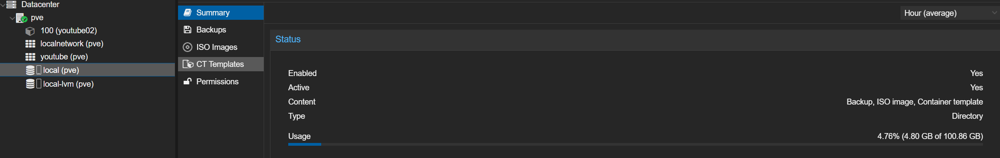
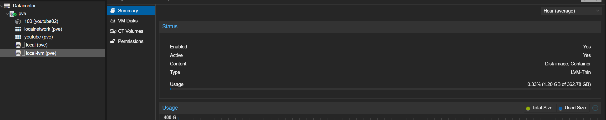
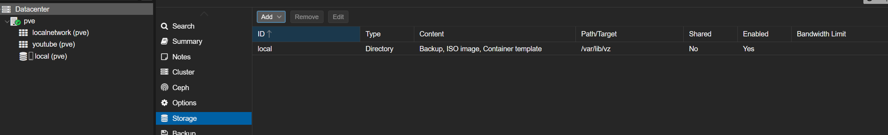
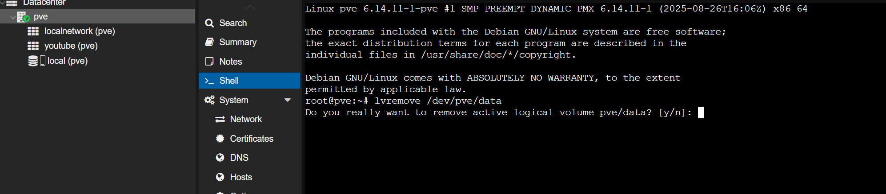
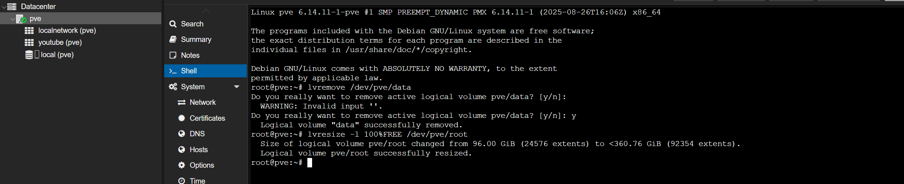
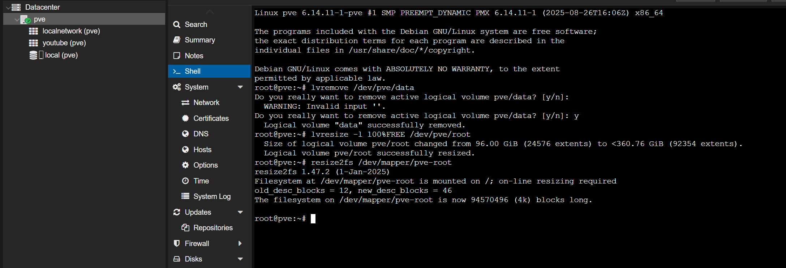
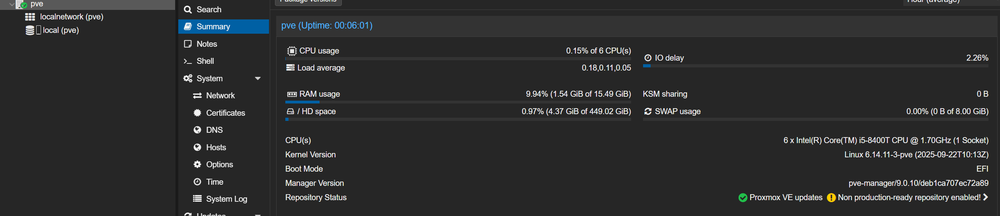
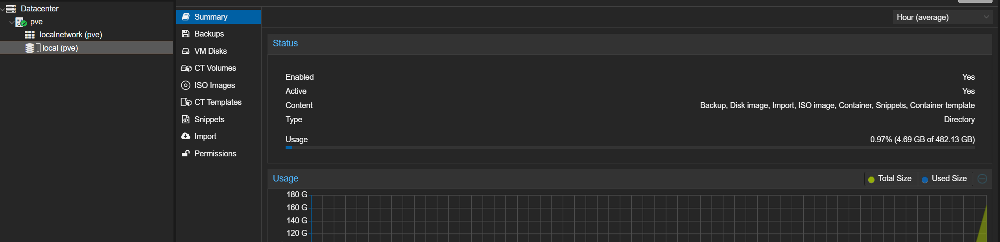
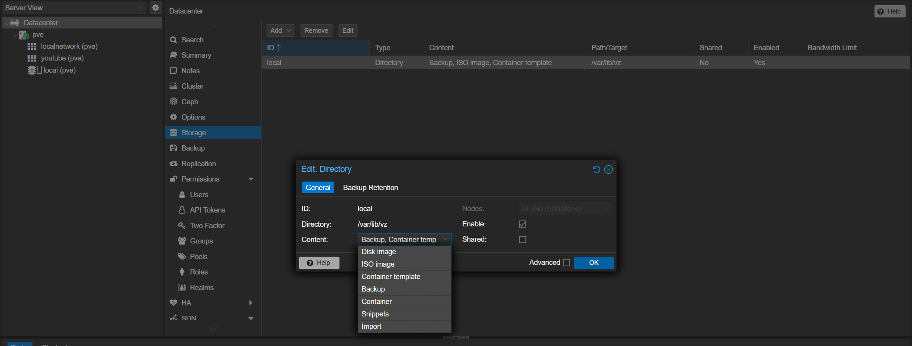

## Зачем объединять local-lvm и local?

После установки **Proxmox VE** по умолчанию создаются два локальных хранилища:

- `local` — папка `/var/lib/vz`, предназначенная для ISO-образов, шаблонов и бэкапов.



- `local-lvm` — LVM-пул, где хранятся диски виртуальных машин и контейнеров.



На первый взгляд это удобно, но у такого разделения есть минусы:

- Размер `local-lvm` фиксирован, и освободить место под ISO или бэкапы сложно.
- Файлы в `local-lvm` не видны напрямую в файловой системе.
- Расширить пул или перенести его проблематично.

Поэтому многие администраторы предпочитают **объединить local-lvm и local в единое файловое хранилище**, где всё будет храниться в виде обычных файлов.

---

## Варианты решения

Есть два подхода:

1. **Удалить LVM-пул и использовать всё пространство под ext4 (или ZFS)**.
2. **Перенести диски с local-lvm на local, а затем удалить LVM-пул.**

Рассмотрим первый вариант, так как он проще, если у вас установка Proxmox c нуля, так безопаснее — вы не потеряете данные.

---

## Шаг 1. Удаляем lvm хранилище из списка Storage в разделе Datacenter нашего Proxmox

Идем в меню **Datacenter**, выбираем **Storage**, выбираем ненужный нам *local-lvm storage* и жмем кнопку remove



Как итог, у нас остается только хранилище `local`.
Однако проблема заключается в том, что "вроде бы" освобожденное дисковое простанства еще не освобождено.

## Шаг 2. Освобождаем место

Идем в shell нашей ноды и начинаем сеанс магии.

Сначала реально удалим логический том командой

```yaml
lvremove /dev/pve/data
```



и подтверждаем действие.

## Шаг 3. Увеличиваем размер логического тома

Теперь следующей командой увеличим размер логического тома (LVM), чтобы он занял всё доступное нераспределённое пространство на физическом томе (PV).

```yaml
lvresize -l +100%FREE /dev/pve/root
```



Что значат вышеприведенная команда, спросишь ты меня, мой маленький пытливый друг. Хороший вопрос.

Что происходит по шагам

- `lvresize` — это утилита для изменения размера логического тома (Logical Volume) в LVM.
- `-l +100%FREE` — ключ, который говорит:
"Добавь к этому логическому тому всё оставшееся свободное место из группы томов (VG)."

То есть, если в нашей группе pve осталось, например, 50 ГБ неиспользованного пространства, эта команда добавит их все в /dev/pve/root.

/dev/pve/root — путь к логическому тому, где установлена основная файловая система (обычно /).

И, наконец, последняя на сегодня команда

## Шаг 4. Расширяем нашу файловую систему

```yaml
resize2fs /dev/mapper/pve-root
```

расширяет нашу файловую систему ext4 внутри указанного раздела.



Давай теперь проверим что же мы все натворили




Как вы можете видеть - теперь у нас используется все дисковое простанство в одном `local storage`.

Но нужен еще один, финальный и обязательный, штрих

## Шаг 5. Финальный штрих

Мы должны сказать системе, что хранилище `local` теперь надо использовать подо все типы данных, в том числе и под тот тип, который раньше использовал только `local-lvm`



## Post scriptum

Если тебе понравилась это статья или эти знания оказались полезными для тебя, то рассмотри вопрос поддержки канала на boosty по ссылке в контактах.
