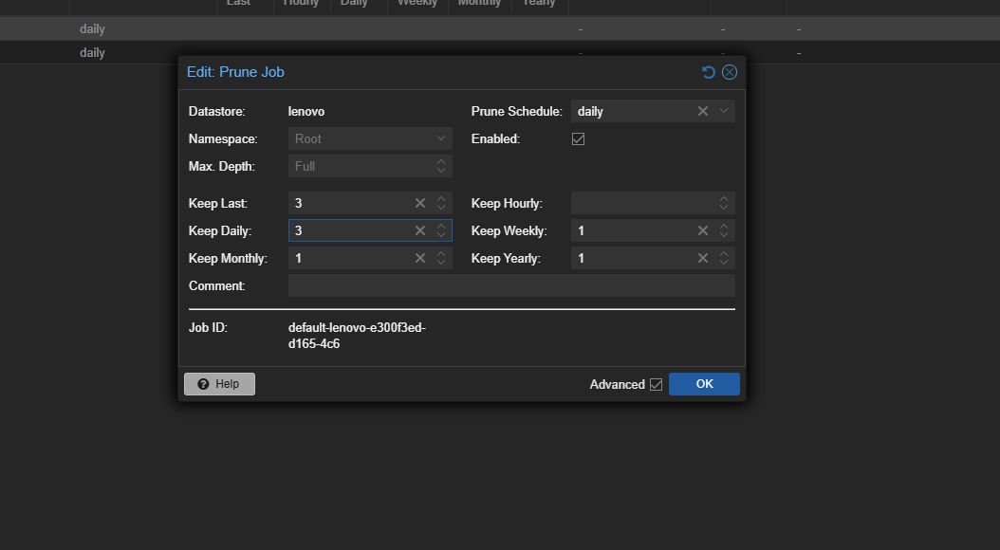
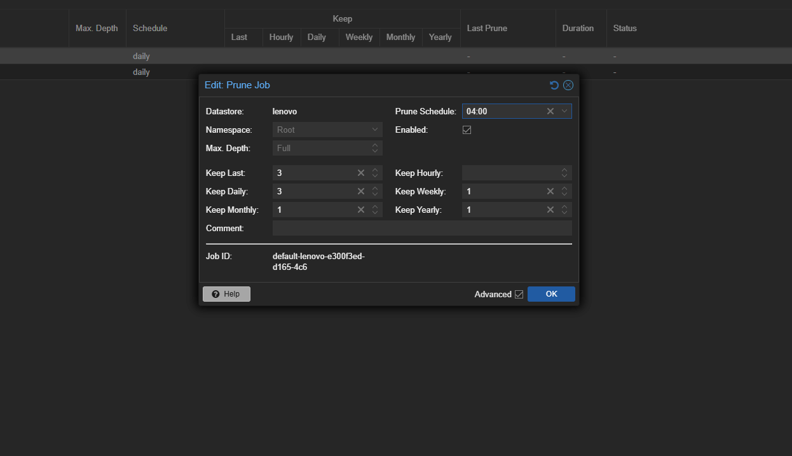
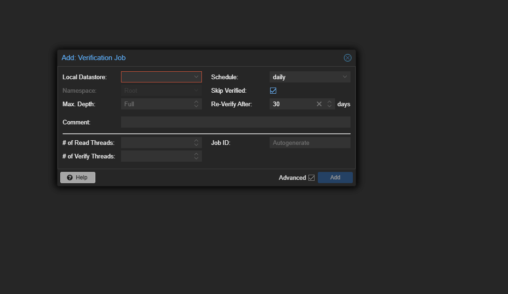
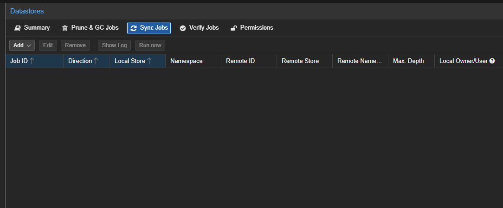
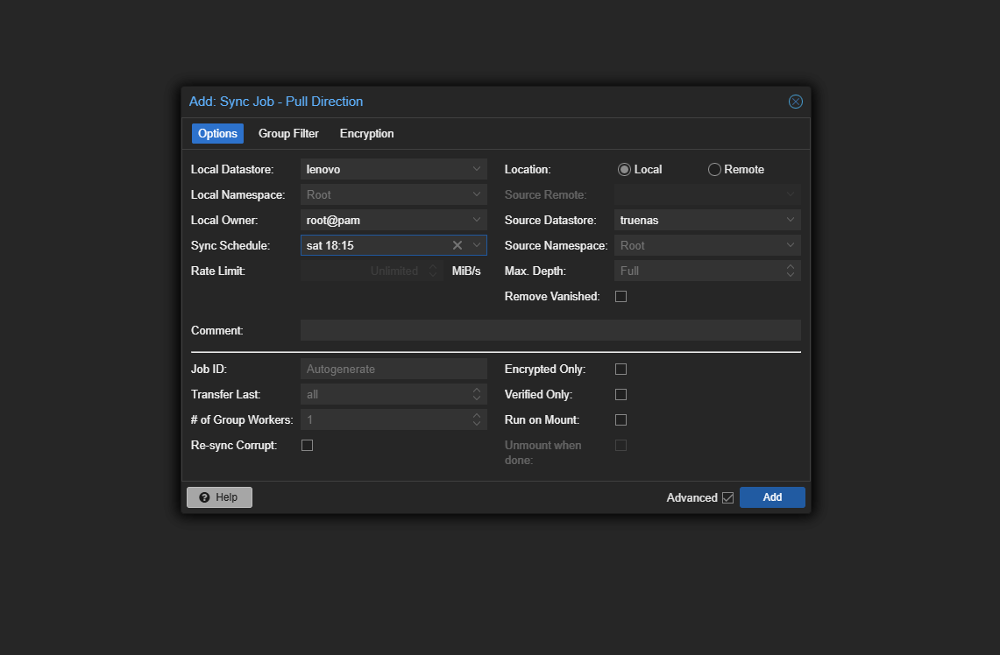

## Предисловие

Откровенно говоря, я не планировал ни снимать новое видео про Proxmox Backup Server, ни писать полноценную статью. Но меня угораздило быстро обновить Proxmox VE до новой версии ядра 7.0.0.3.

В результате система перестала загружаться и стабильно уходила в kernel panic с неприятным розовым экраном. Откат на предыдущую версию ядра в моем случае не сработал.

<iframe width="560" height="315" src="https://www.youtube.com/embed/BR04yEGZrlo?si=llajKJJf-fv_jiUj" title="YouTube video player" frameborder="0" allow="accelerometer; autoplay; clipboard-write; encrypted-media; gyroscope; picture-in-picture; web-share" referrerpolicy="strict-origin-when-cross-origin" allowfullscreen></iframe>

Поиск на официальном форуме Proxmox показал, что проблема не единичная, а носит массовый характер. В итоге мне пришлось переустановить ноду с нуля.

Для обычного пользователя это могло бы означать потерю всей информации, хранящейся в виртуальных машинах или LXC-контейнерах. Однако я использую Proxmox Backup Server, а бэкапы хранятся на NAS, поэтому отделался, можно сказать, легким испугом.

Мне пришлось заново развернуть ноду, установить PBS, подключить старый datastore и восстановить всё из бэкапов.

После этого я поделился ситуацией в Telegram-канале, предупредил о проблемах свежей сборки ядра Proxmox VE и напомнил о важности резервного копирования. В ответ мне предложили ~~пойти кое-куда~~ записать свежий обзорный ролик о восстановлении ноды.

Хотя у меня на канале уже есть видео про PBS, оно по меркам индустрии уже заметно устарело. Поэтому я решил обновить материал.

В этой статье я не просто разберу настройку Proxmox Backup Server, но и покажу свой реальный сценарий: создание двух datastore — для «горячих» и «холодных» бэкапов.

---

## Введение

Резервное копирование — одна из ключевых задач как в домашней лаборатории (homelab), так и в корпоративной инфраструктуре. Потеря виртуальной машины, повреждение диска или неудачное обновление могут привести к серьёзным последствиям, если заранее не настроена система бэкапов.

Для решения этой задачи команда Proxmox разработала Proxmox Backup Server (PBS) — специализированную систему для хранения резервных копий виртуальных машин, контейнеров и физических серверов.

PBS поддерживает:

- дедупликацию данных
- инкрементальные бэкапы
- эффективное сжатие
- удобную интеграцию с Proxmox VE

Это позволяет существенно экономить дисковое пространство и ускорять процессы резервного копирования и восстановления.

В версии Proxmox Backup Server 4.x добавлены:

- поддержка S3-совместимых хранилищ
- улучшенные sync-задачи
- расширенные возможности работы с namespace и datastore
- обновление базовой системы до Debian 13

В этой статье мы установим Proxmox Backup Server 4.2, настроим хранилище, подключим его к Proxmox VE и выполним первое резервное копирование виртуальной машины.

---

## Что такое Datastore в Proxmox Backup Server

### Общее описание

Datastore в Proxmox Backup Server (PBS) — это основное хранилище резервных копий. Его можно представить как папку или логический контейнер, в котором PBS хранит все данные бэкапов, индексы, метаданные и информацию о дедупликации.

### Что находится внутри Datastore

При создании Datastore PBS использует указанную директорию, например:

```bash
/mnt/backup/pbs-datastore
```

Внутри создается структура каталогов:

```text
pbs-datastore/
├── .chunks/
├── vm/
├── ct/
├── host/
└── .lock
```

Datastore хранит:

- Резервные копии виртуальных машин
- Резервные копии LXC-контейнеров
- Резервные копии физических серверов через PBS Client
- Дедуплицированные чанки данных
- Индексы и метаданные

### Как работает дедупликация

PBS разбивает данные на небольшие блоки (чанки) и сохраняет только новые или измененные данные.

Пример:

1. Первый бэкап виртуальной машины занимает 100 ГБ.
2. На следующий день изменилось только 2 ГБ данных.
3. PBS сохранит только новые чанки объемом 2 ГБ.

В результате Datastore может содержать множество резервных копий, занимая значительно меньше места благодаря дедупликации.

### Несколько Datastore на одном PBS

На одном сервере PBS можно создать несколько Datastore для разных задач.

Примеры:

| Datastore  | Назначение                         |
| ---------- | ---------------------------------- |
| local-ssd  | Быстрые ежедневные резервные копии |
| hdd-backup | Долгосрочное хранение              |
| offsite    | Репликация на удаленную площадку   |

Пример конфигурации:

```yaml
Datastore: fast-backup
Path: /mnt/ssd/pbs
```

```yaml
Datastore: archive
Path: /mnt/hdd/pbs
```

Каждый Datastore имеет собственные настройки:

- Политики хранения (Prune)
- Проверка резервных копий (Verify)
- Синхронизация (Sync)
- Права доступа
- Ограничения скорости чтения и записи

#### Рекомендации

- Используйте надежную файловую систему Linux (например zfs)
- Не изменяйте содержимое Datastore вручную
- Удаляйте старые резервные копии через задачи Prune
- Регулярно запускайте Verify для проверки целостности данных
- Следите за состоянием дисков и объемом свободного пространства

#### Важно

- Удаление файлов Datastore вручную может привести к повреждению резервных копий и потере данных.
- Потеря или повреждение Datastore делает недоступными все резервные копии, находящиеся в нем.

#### Аналогия

Если представить PBS как библиотеку:

| Компонент     | Аналогия                                    |
| ------------- | ------------------------------------------- |
| PBS Server    | Библиотека                                  |
| Datastore     | Книжный склад                               |
| Backup        | Книга                                       |
| Chunk         | Страница книги                              |
| Deduplication | Хранение одинаковых страниц только один раз |

В видео я создам только два датастора:

- быстрые, ежедневные копии
- долгосрочные данные, которые у меня будут храниться на моем Truenas

## Системные требования

Перед началом установки Proxmox Backup Server 4.2 необходимо подготовить отдельный сервер или виртуальную машину. Хотя PBS может работать даже на достаточно скромном оборудовании, рекомендуется заранее оценить объём резервных копий и количество защищаемых систем. Для домашнего окружения конечно важно первое.

Сейчас в зарубежном сегменте ютуба почему-то популярно устанавливать PBS в LXC контейнер. Мне это решение не нравится, потому что такая установка требует установки в привилегированный контейнер или определенные сложности с монтированием дисков. В тоже время установка в виртуальную машину (в случае невозможности выделить отдельный сервер/минипк) в случае homelab не добавляет каких-то заметных накладных расходов. PBS достаточно нетребовательное решение.

Для выполнения установки потребуется:

### Минимальные требования

- 64-битный процессор с поддержкой виртуализации

- 2 ядра CPU

- 2 ГБ оперативной памяти

- 8 ГБ дискового пространства для системы

- Отдельный диск или раздел для хранения резервных копий

- Сетевое подключение со скоростью не менее 1 Гбит/с

### Рекомендуемые требования

- 4 и более ядер CPU

- 8–16 ГБ оперативной памяти

- SSD для системного раздела

- Отдельный SSD или HDD-массив для хранения резервных копий

- Файловая система ZFS для datastore

- Сетевое подключение 2.5 Гбит/с или выше при работе с большим количеством виртуальных машин

Иронично, что найти сервер с минимальными требованиями в 2026 году практически невозможно. В тоже время, если мы говорим о домашнем окружении, минимальные требования будут для постоянной работы достаточны. Все дело в том, что нагрузка на систему будет только в те короткие промежутки времени, когда система будет проводить бэкапы и сверять чанки. Как вы понимаете, в домашнем окружении это в лучшем случае раз в сутки и весь процесс будет укладываться в часовой промежуток.

### Тестовый стенд

В рамках данной статьи и видео Proxmox Backup Server 4.2 установлен на Lenovo Thinkcenter m720q со следующими параметрами:

| Параметр         | Значение            |
| ---------------- | ------------------- |
| CPU              | Intel iCore - 8400T |
| RAM              | 16 ГБ               |
| Системный диск   | 256 ГБ nvme         |
| Диск для бэкапов | 500 ГБ SSD          |
| Сеть             | 1 Гбит/с            |

Такой конфигурации не просто более чем достаточно для домашней лаборатории и резервного копирования нескольких виртуальных машин и LXC-контейнеров, а даже избыточно.

> Рекомендуется использовать отдельный диск или пул ZFS для хранения резервных копий. Это позволит максимально эффективно использовать встроенную дедупликацию данных и защитить систему от потери резервных копий при сбое системного диска.

## Установка Proxmox Backup Server

Установка PBS каких-то затруднений вызвать не должна, установочный интерфейс идентичен PVE.


Вы соглашаетесь с лицензионным соглашением,


Выбираете диск или массив куда будет установлена операционная система, а также файловую систему


Задам пароль пользователя root, а также указываем адрес почты, куда система будет нам присылать уведомления. Обратите внимание, что просто указание адреса почты недостаточно, в последующем нужно будет обязательно значения, полученная от своего почтового провайдера.


Далее выбираете основной сетевой интерфейс (в случае, если у вас их больше одного), имя хоста (я в последующем всегда загружаю нормальный ssl сертификат от let's encrypt), а также сетевые значения для хоста и шлюза


## Первоначальная настройка

Нас встречает достаточно похожий на PVE интерфейс, что логично. Унификация в данном случае важный момент.
Первым делом мы с вами идем в раздел Administration > Repositories


и подключаем бесплатные репозитории, попутно деактивируя платные репозитории


после это переходим в соседнее меню **Updates** и обновляем пакетную базу. В случае необходимости перезагружаем инстанцию **PBS**

## Подготовка дискового пространства и настройка Datastore

В нашем случае у нас уже есть шара (датасет в Truenas), которая уже когда-то служила в качестве datastore. Также у нас есть отдельный ssd диск объемом 512 гб под ежедневные бэкапы.
Давайте начнем с подготовки данного диска. В разделе Storage > Disks мы видим список подключенных дисков. В моем случае система установлена на nvme диск. Ssd диск в системе у нас учитывается как /dev/sda


Прежде всего надо его разметить. В разделе диски, выбираем нужный нам диск и выбираем **Initialized Disk with GPT**

После этого переходим в меню командной строки (Shell)
Установим утилиту *parted* командой

```yaml
apt install parted
```

создаем раздел

```yaml
parted /dev/sda -- mkpart primary ext4 0% 100%
```

получится:

```yaml
/dev/sda1
```

Форматируем раздел

Для PBS обычно используют:

- `ext4` — просто и надежно
- `xfs` — хорошо для больших backup-хранилищ
- `zfs` — если нужен RAID/сжатие/снапшоты

Самый простой вариант:

```yaml
mkfs.ext4 /dev/sda1
```


Записываем получившийся UUID в блокнот, он нам в последующем понадобится при монтировании нового датастора для ежедневных бэкапов. Однако если по каким-то причинам uuid потерялся, то его всегда можно узнать командой

```yaml
blkid /dev/sda1
```

Сначала создаем две папки, которые будут у нас выступать в качестве директорий для хранения данных:

- lenovo - ежедневные бэкапы
- truenas - длинные бэкапы


Теперь отредактируем файл fstab

```yaml
nano /etc/fstab
```


таким образом с вами примонтировали соответствующий раздел и удаленную шару к конкретным директориям. Сохраняем изменения Ctrl+S, выходим Ctrl+X.

Вводим команду

```yaml
mount -a
```

Если все в порядке и мы ничего с вами не ошиблись, что система предложит нам перезагрузить демон командой

```yaml
systemctl daemon-reload
```


## Создание datasore

После того, как мы с вами примонтировали нужные нам шары и разделы в соответствующие директории, приступаем к созданию datastore. У нас их будет два, как я уже упоминал выше:

- локальный для ежедневных бэкапов. Назовем его lenovo
- удаленный для долгосрочного хранения, который размещен на nfs шаре в моем Truenas

Переходим в раздел Datastore > Add Datastore

Задаем название datastore, выбираем его тип. В качестве пути мы с вами должны прописать абсолютный путь. Меню GC Schedule и Prune Schedule пока не трогаем. Эту часть мы с вами настроим позже

Так как мне нужно подкkючить в том числе и уже существующий datastore, я выбираю меню advanced и ставлю галку в меню `reuse existing datastore` .
В Proxmox Backup Server 4.2 опция **“Reuse existing datastore”** означает:

> использовать уже существующую папку с бэкапами как datastore, не создавая его заново.


Повторяем те же действия, но уже в отношении нового datasore


Так как это новый datastore, нам достаточно задать ему название и прописать путь до места хранения.

В итоге в панели управления мы увидим созданные datastore, данные о занятом объеме хранилищ, перечень работ и итог.


## Подключение созданных datastore к Proxmox Virtual Enviroment

В Proxmox VE нельзя подключить datastore напрямую как диск.  
  
Ты подключаешь **PBS-сервер**, а datastore выбирается внутри него.  
  
### Убедись, что datastore создан в PBS  
  
На стороне PBS у нас уже созданы необходимые нам datastore

### Добавление PBS в Proxmox VE

В веб-интерфейсе PVE:

Datastore > Storage > Add > Proxmox Backups Server


### Заполнение параметров

#### Server

IP или DNS-имя PBS:

```yaml
192.168.1.10
```

---

#### Datastore

Это НЕ путь в файловой системе.

Указывается имя datastore из PBS:

```yaml
truenas
```

---

### Username

Рекомендуется использовать отдельного пользователя, но можно:

```yaml
root@pam
```

или:

```yaml
backup@pbs
```

backup - это имя юзера, созданного в PBS

---

#### Password

Пароль пользователя PBS.

---

#### Fingerprint

Его мы с вами получаем в PBS:

Dashboard > Show Fingerprint

---


### Результат подключения

После добавления в PVE появится storage:


Теперь можно использовать его для backup VM и CT.

---

## Принцип работы PVE в связке с PBS

- PBS хранит данные и дедуплицирует их
- PVE отправляет backup через сеть
- Datastore внутри PBS управляет данными

Для этого нам прежде всего надо настроить расписание по созданию бэкапов и место их хранения (по умолчанию PVE хранит бэкапы у себя на lvm разделе)

В PVE переходим в раздел Datacenter

Datacenter > Backup

и настраиваемо расписание бэкапов, список бэкапов и место куда мы будем сохранять бэкапы


Теперь каждые 24 часа PVE будет создавать копии выбранных ресурсов и сохранять их на наше хранилище `lenovo`, который является datastore для ежедневных бэкапов в PBS

## Настройка работы с бэкапами в PBS

Переходим в соответствующий раздел в меню datastore в PBS


### Настройка Prune Job, Garbage Collection и Verification Job в Proxmox Backup Server

#### Prune Job (политика хранения)

Prune Job отвечает за удаление старых snapshot-ов согласно заданной политике хранения. Важно понимать, что prune удаляет только ссылки на backup-снимки, но не физические данные сразу.

##### Настройка Prune Job

Расписание

Можно использовать простое расписание или cron:

daily  
0 2 ** *

##### Политика хранения (keep options)

Как пример в меру сбалансированной политики:

keep-daily: 7  
keep-weekly: 4  
keep-monthly: 6  

Это означает:

- хранить 7 последних дней
- 4 последние недели
- 6 последних месяцев

>[!WARNING]
>Prune не освобождает место на диске сразу, так как данные могут оставаться в chunks до запуска Garbage Collection.



---

#### Garbage Collection (очистка данных)

Garbage Collection удаляет физически неиспользуемые chunks, которые остались после prune.

Как работает

PBS использует дедупликацию, поэтому один chunk может использоваться в нескольких backup-ах. После prune ссылки удаляются, но сами данные остаются до GC.

GC проходит и удаляет:

- неиспользуемые chunks
- устаревшие данные без ссылок

##### Настройка Garbage Collection

Datastore → Garbage Collection → Add

Пример рекомендуемого расписания

weekly  
0 3 ** 0 (каждое воскресенье ночью)

>[!WARNING]
>
> - требует высокой дисковой нагрузки
> - лучше запускать ночью
> - может выполняться долго на больших datastore



---

#### Verification Job (проверка целостности)

Verification Job проверяет целостность данных и обнаруживает поврежденные chunks.

Что проверяет:

- поврежденные блоки
- silent corruption
- корректность chunk-структуры

Почему это важно:

Даже SSD и HDD могут:

- повреждать данные без ошибок ОС
- иметь скрытую деградацию

Verification позволяет обнаружить это заранее.

##### Настройка Verification Job

Datastore → Verification Jobs → Add

Вариант расписания

Home lab: monthly  
Production: weekly или bi-weekly  



---

### Правильный порядок выполнения задач

Очень важно соблюдать порядок задач:

1. Prune Job  
2. Garbage Collection  
3. Verification Job  

---

### Типичные ошибки

- Только Prune без GC → место не освобождается  
- Слишком частый GC → лишняя нагрузка на SSD  
- Отсутствие Verification → риск silent data corruption  

---

### Итог

В итоге три задачи работают вместе:

Prune управляет сроком хранения  
GC освобождает дисковое пространство  
Verification защищает от повреждений данных  

Правильная настройка этих процессов обеспечивает стабильность, экономию места и надежность системы резервного копирования.

## Настройка синхронизации между datastore

Синхронизационные задания (Sync jobs) настраиваются для того, чтобы получать содержимое datastore с удалённого сервера (Remote) и копировать его в локальный datastore.

Управлять sync jobs можно через веб-интерфейс — во вкладке **Sync Jobs** в панели Datastore или внутри самого Datastore. Также ими можно управлять через команду `proxmox-backup-manager sync-job`.

Конфигурация sync jobs хранится в файле:

```text
/etc/proxmox-backup/sync.cfg
```

Чтобы создать новое sync-задание, нажмите кнопку **Add** в GUI или используйте команду `create` в CLI.

После создания sync job его можно:

- запустить вручную через GUI
- запустить через CLI командой `run`
- либо задать расписание (см. Calendar Events), чтобы оно выполнялось регулярно

В моем случае я хочу, чтобы копии с датастор lenovo, где мы храним ежедневные копии синхронизировались с датастор truenas, где у нас будут храниться копии для долгосрочного хранения.

>[!NOTE]
>как вы понимаете расписание работы с бэкапами на разных datastore будут отличаться





---

## Выводы

Настройка Proxmox Backup Server — это не просто подключение диска и создание хранилища, а полноценная система управления жизненным циклом резервных копий.

Правильно настроенная связка из **datastore + prune + garbage collection + verification + sync job** даёт полный набор механизмов для надёжного и масштабируемого бэкапа.

---

### Основные преимущества системы

- **Контролируемое хранение данных (Prune Jobs)**  
    Позволяют задавать политику retention и предотвращают переполнение диска.
- **Освобождение дискового пространства (Garbage Collection)**  
    Удаляет неиспользуемые chunk-данные, оставшиеся после удаления snapshot-ов.
- **Проверка целостности (Verification Jobs)**  
    Обнаруживает повреждения данных и silent corruption до того, как они станут проблемой.
- **Синхронизация между серверами (Sync Jobs)**  
    Позволяет копировать datastore с удалённого PBS на локальный или резервный сервер.  
    Это используется для:
  - репликации бэкапов
  - оффсайт-хранения
  - защиты от потери основного сервера
- **Автоматизация процессов**  
    Все задачи могут выполняться по расписанию без ручного вмешательства.

При корректной настройке Proxmox Backup Server превращается в полноценную систему резервного копирования уровня production, которая:

- эффективно использует дисковое пространство
- обеспечивает высокую надёжность хранения
- позволяет строить распределённые и отказоустойчивые схемы
- минимизирует ручное обслуживание

Именно сочетание prune, GC, verification и sync делает PBS не просто хранилищем, а полноценной системой управления жизненным циклом данных.
