<iframe width="100%" height="468" src="https://www.youtube.com/embed/SmpZz1Y4fTY?si=NJFXeGnpsFly2MvJ" title="YouTube video player" frameborder="0" allow="accelerometer; autoplay; clipboard-write; encrypted-media; gyroscope; picture-in-picture; web-share" allowfullscreen></iframe>

# Настройка Firewall в Proxmox

Proxmox VE — это мощная платформа виртуализации, которая объединяет в себе возможности KVM и LXC, а также средства для кластеризации и управления хранилищами. Одним из ключевых инструментов обеспечения безопасности в Proxmox является **встроенный firewall**.

В этой статье мы разберём:

- что такое firewall и зачем он нужен в Proxmox,  
- его плюсы и минусы,  
- как настроить базовые правила для защиты узла и виртуальных машин.  

---

## Что такое Firewall в Proxmox

Firewall (межсетевой экран) — это система фильтрации сетевого трафика, которая позволяет управлять входящими и исходящими соединениями. В Proxmox используется **iptables/nftables** как backend, а управление правилами осуществляется через веб-интерфейс или CLI.  

Firewall в Proxmox может работать на трёх уровнях:

1. **Datacenter** — глобальные правила для всего кластера.  
2. **Node (узел)** — правила, которые применяются к конкретному серверу.  
3. **VM/CT (виртуальная машина или контейнер)** — отдельные правила для каждой виртуальной машины.  

---

Если у вас не включен firewall на уровне **Datacenter**, то и на других уровнях (ноды или вм/lxc) он тоже не работает. Поэтому необязательно снимать соответствующую галку в настройках вновь создаваемых виртуальных машинах.

## Зачем нужен Firewall в Proxmox

В принципе в домашних условиях я не вижу смысла в использовании встроенного firewall в Proxmox, потому что дома вы скорее всего настраиваете правила на глобальном уровне (на уровне маршрутизатора). В домашних условиях, если конечно вы не живете в датацентре, нет необходимости настраивать firewall на уровне Proxmox. Но раз уж мы с вами полезли в кроличью нору **SDN** в **Proxmox**, то давайте разберем, что может firewall в Proxmox.

Использование встроенного firewall позволяет:

- ограничить доступ к управляющему интерфейсу Proxmox,  
- защитить виртуальные машины и контейнеры от нежелательного трафика,  
- сегментировать сеть и контролировать взаимодействие сервисов,  
- снизить риск атак (DDoS, brute-force, сканирование портов и т. д.).  

---

## Плюсы и минусы использования Firewall в Proxmox

### Плюсы

- Централизованное управление правилами через веб-интерфейс.  
- Возможность задавать правила на уровне кластера, ноды (узла) и VM.  
- Поддержка групп правил (Firewall Groups), что упрощает масштабирование.  
- Интеграция с Proxmox — не нужно настраивать отдельные правила firewall внутри каждой VM.  

### Минусы

- Требует понимания логики iptables/nftables.  
- Ограниченные возможности мониторинга в сравнении с внешними системами.  
- Ошибочные правила могут заблокировать доступ к самому Proxmox.  
- Не заменяет полноценные решения вроде pfSense или OPNsense (но хорошо дополняет их в случае необходимости).  

---

## Настройка Firewall в Proxmox

Как указано выше, по умолчанию firewall в **Datacenter** отключен.

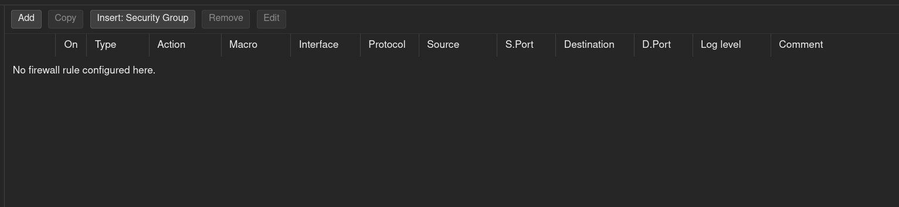

>[!WARNING]
>Ни в коем случае не активируйте firewall в Datacenter, пока не настроите первые **три** правила о которых ниже. По умолчанию в firewall отсутствуют сконфигурированные правила. Это означает, что все запрещено. Включение firewall без предварительно сконфигурированных правил лишит вас доступа к web интерфейсу Proxmox. А значит выпадет тебе, милАй, дорога дальная с клавиатурой и монитором к физическому устройству.

### Включение Firewall в Datacenter и настройка трех основных правил

1. Перейдите в **Datacenter → Firewall → Options** и нажмите **Add**.  
  
#### Правило 1: Разрешить доступ к веб-интерфейсу Proxmox

1. В разделе **Rules** добавьте правило:  
   - Action: `ACCEPT`  
   - Direction: `IN`
   - Interface: `vmbr0`
   - Protocol: `tcp`  
   - Destination Port: `8006`  
   - Comment: `Allow WebGUI from home`  

Жмем **add**

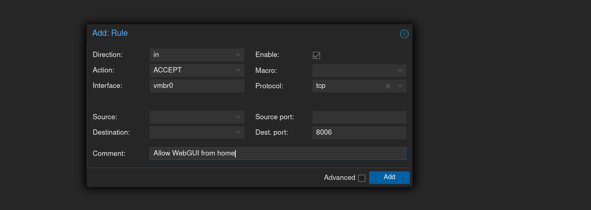

В разделе **Firewall** идем подменю **Options** и включаем `firewall`

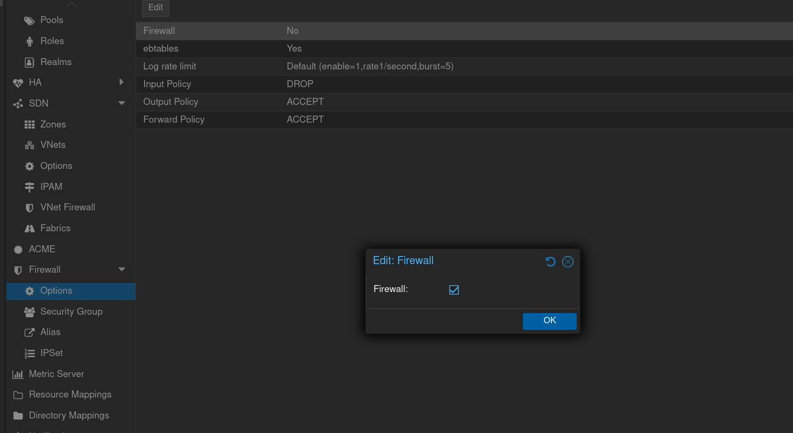

Сейчас нам надо проверить, что мы не потеряли доступ к веб-интерфейсу нашего Proxmox. Просто обновим страницу, и если доступ на месте, то мы в игре. Ура!

---

Теперь надо добавить еще два правила: нужно разрешить запросы от **DHCP** и запросы по протоколу **http** или **dns**, так как сейчас единственное что разрешено, это доступ к веб-интерфейсу.

#### Правило 2: Разрешить запросы по DHCP

1. В разделе **Rules** добавьте правило:  
   - Action: `ACCEPT`  
   - Direction: `IN`
   - Macro: `DHCPfwd`  
   - Comment: `Allow DHCP requests`  

Жмем **add**

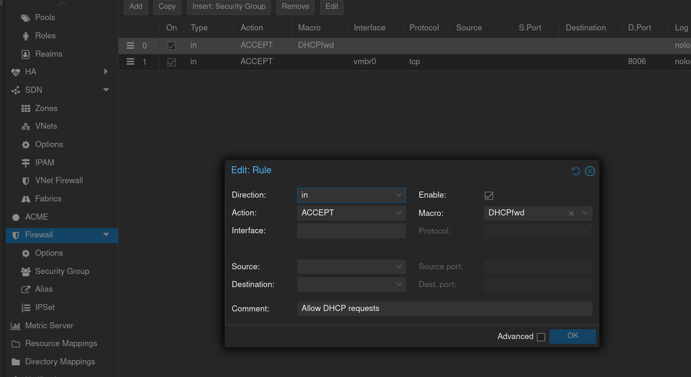

#### Правило 3: Разрешить запросы по DNS

1. В разделе **Rules** добавьте правило:  
   - Action: `ACCEPT`  
   - Direction: `IN`
   - Macro: `DNS`  
   - Comment: `Allow DNS requests`  

Жмем **add**

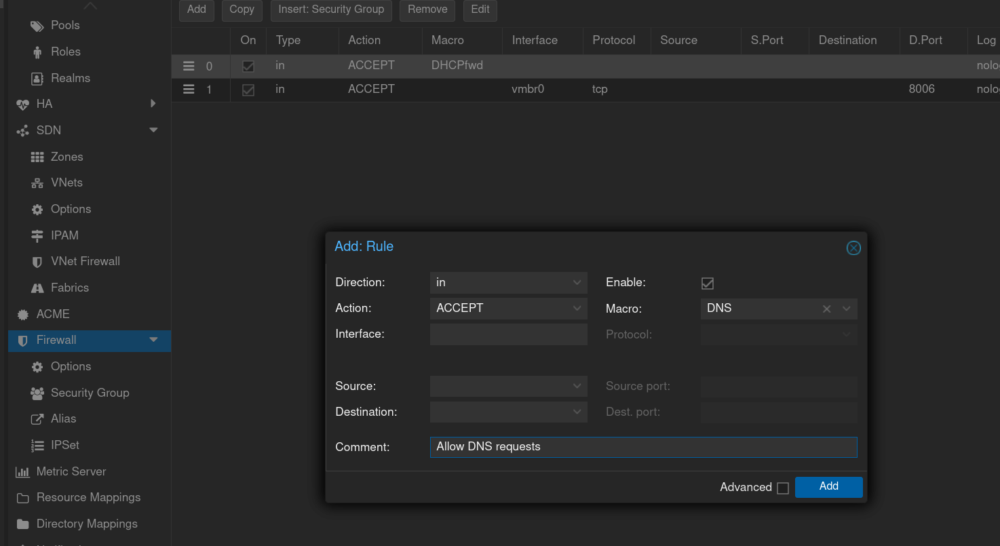

---

Сейчас мы с вами сконфигурировали три базовых правила для **firewall** на уровне **Datacenter**. Если вы хотите использовать firewall в Proxmox по полной, то это базовые и обязательные правила. Обсуждению этот момент не подлежит.

Так как firewall обрабатывает правила в порядке очередности сверху вниз, то правило для веб-интерфейса у нас должно идти первым, потом правило с DHCP, а потом правило про DNS. Я так думаю(с) Мимино

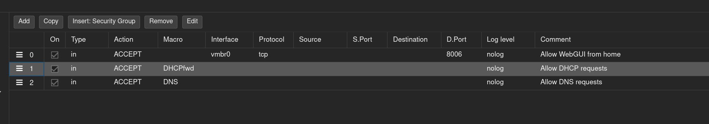

В тоже время, так как эти правила сформированы на уровне Datacenter, то они применяются даже в случае, если у вас есть кластер из двух или трех нод **Proxmox**

---

### Создание alias и security groups в Proxmox

Мы с вами настроили правила на уровне Datacenter и там же активировали firewall.

Однако, если мы с вами спустимся на уровень ноды и зайдем в раздел firewall, то увидим, что несмотря на то, что мы еще не настраивали правила на уровне ноды, firewall там уже активирован.

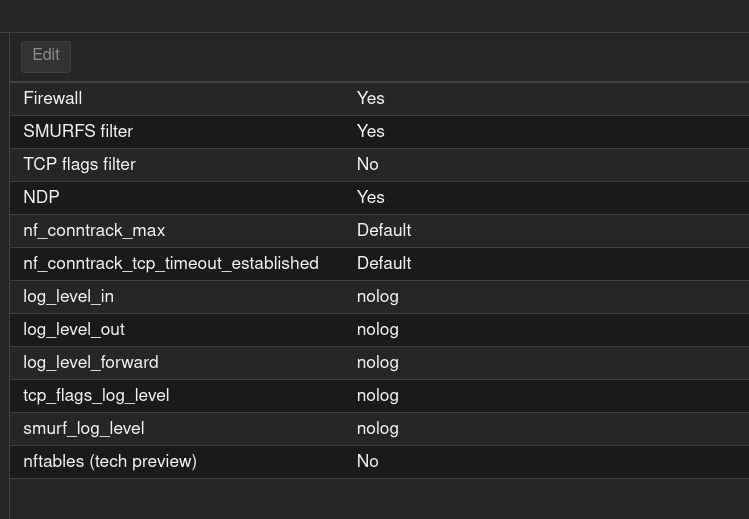

Тут есть один очень важный момент. Если у вас кластер, то firewall, как вы понимаете, включается автоматом на всех нодах кластера. А так как у нас, в настоящий момент, никаких правил еще не настроено, то трафик между нодами по умолчанию запрещен. Может конечно оно вам так и надо, но предположим, что у вас есть ceph хранилище, оно у вас тут же отвалится без правильной настройки правил firewall.
Давайте это поправим. Сначала создадим пару, тройку **alias**, чтобы нам было проще работать с правилами.

1. Перейдите в **Datacenter → Firewall → Alias** и нажмите **Add**.

#### Создаем `alias для локальной сети`

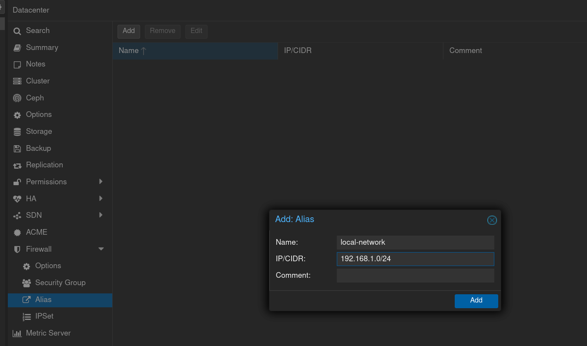

1. В разделе **alias** пишем следующее:  
   - Name: `local-network`  
   - IP/CIDR: `192.168.1.0/24`
   - Comment: `по желанию`

Если с именем все понятно, то что касается сети, - я указал всю свою локальную сеть. У вас и диапазон может быть другим, так и требования могут соответствующие. Меняйте их исходя из ваших потребностей. Например, вы хотите разрешить трафик только между нодами и все. Но так как я показываю простые и базовые вещи, то и действую соответственно.

Создаем `Alias для виртуальной сети`

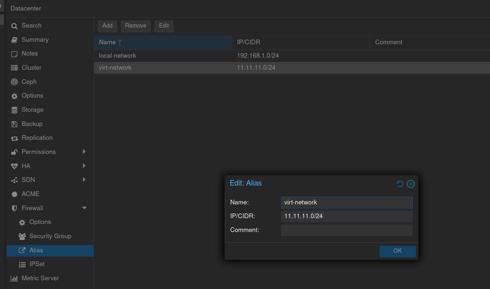

1. В разделе **alias** пишем следующее:  
   - Name: `virt-network`  
   - IP/CIDR: `11.11.11.0/24`
   - Comment: `по желанию`

Но в данном случае я указываю диапазон VNET сети. В предыдущей статье мы с вами задали ей адрес в диапазон 11.11.11.0/24

Создаем `alias для шлюза` нашей физической локальной сети

1. В разделе **alias** пишем следующее:  
   - Name: `gateway`  
   - IP/CIDR: `192.168.1.1`
   - Comment: `по желанию`

---

После того, как мы с вами для облегчения дальнейшей работы создали три `alias`, тперь создадим **Security Groups**

1. Перейдите в **Datacenter → Firewall → Security Groups** и нажмите **Create**.

#### Создаем `Security Groups`

Создаем группу для локальной сети

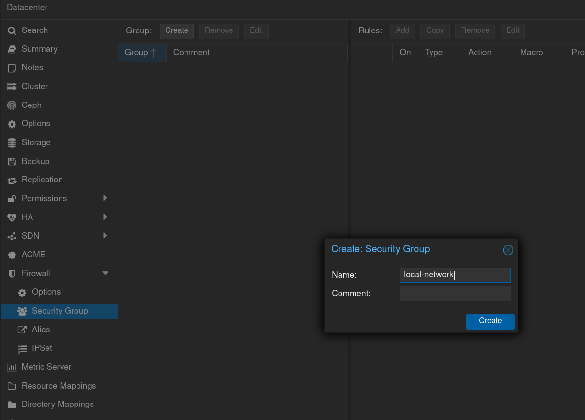

Теперь переходим в окошко нашей группы и создаем правило

1. Перейдите в **Datacenter → Firewall → Security Groups - Rules** и нажмите **Add**.

Создадим правило для нашей Security Group, куда входит наша локальная сеть.

#### Правило 1: Разрешить входящий трафик из нашей локальной сети

1. В разделе **Rules** добавьте правило:  
   - Action: `ACCEPT`  
   - Direction: `IN`
   - Source: `local-network`  
   - Comment: `по желанию`  

Жмем **Enable**, а затем **Add**

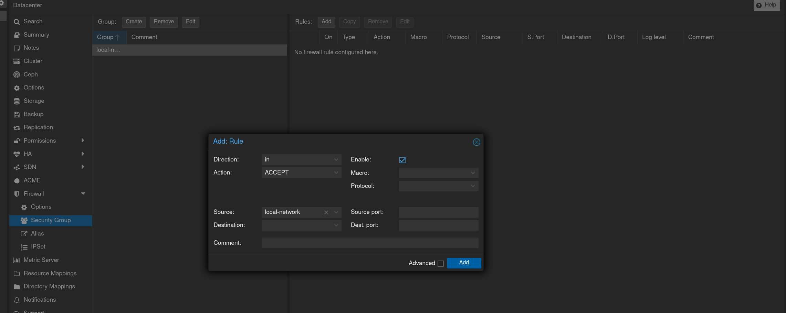

#### Правило 2: Разрешить исходящий трафик в нашу локальную сеть

1. В разделе **Rules** добавьте правило:  
   - Action: `ACCEPT`  
   - Direction: `OUT`
   - Destination: `local-network`  
   - Comment: `по желанию`  

Жмем **Enable**, а затем **Add**

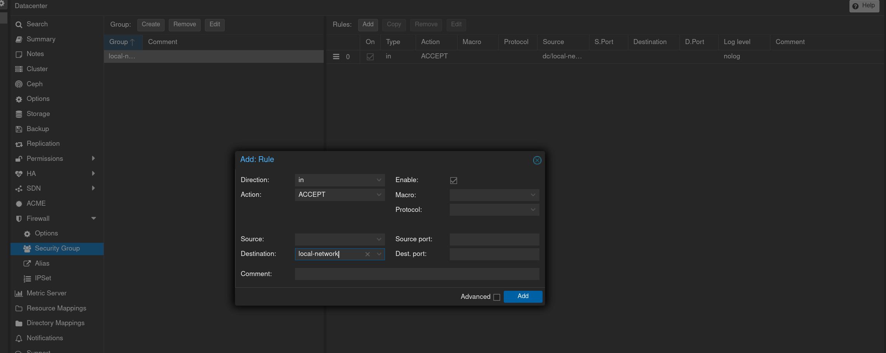

То есть, мы с вами разрешили любой трафик от наших устройств из локальной сети к ноде и обратно.

### Настройка основных правил на уровне ноды Proxmox

1. Перейдите в **Datacenter → Название вашей ноды → Firewall → Insert Security Groups** и нажмите **Add**.

В ниспадающем окошке выбираете нашу группу, ставим галку напротив **Enable** и жмем **Add**

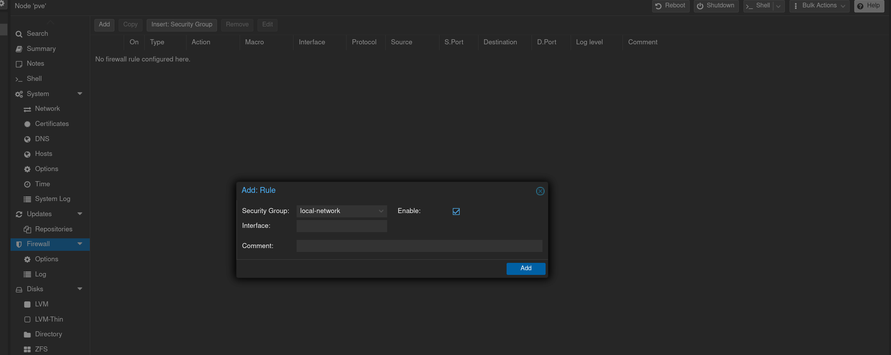

Соответственно, если у вас несколько нод, то на каждой ноде повторите соответствующее действие.

Теперь у нас в меру открытый `firewall`.

Если же вам нужны более тонкие настройки, то руки у вас развязаны, дерзайте.

### Настройка основных правил на уровне VM или LXC в Proxmox

Давайте перейдем к настройками firewall на уровне создаваемых машин или контейнеров в Proxmox

1. Переходим в **Datacenter → Название вашей ноды → Firewall → Insert Security Groups** и нажмите **Add**.

Создаем **Security Group**, как в предыдущем пункте, но в отношении виртуальной сети. Я ее назвал **virt-network**

Выбираем вновь созданную группу, переходим в раздел **Rules** и создаем первое правило.

Например мы хотим запретить доступ от наших виртуальных машин или контейнеров в нашу локальную сеть

1. В разделе **Rules** добавьте правило:  
   - Action: `DROP`  
   - Direction: `OUT`
   - Destination: `local-network`  
   - Comment: `по желанию`

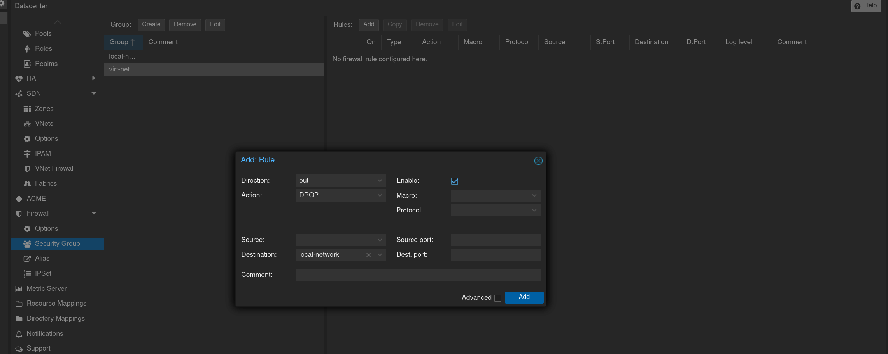

Но, но, запретив доступ нашим ВМ или контейнерам к локальной сети, мы одновременно запретили доступ им и во внешний мир, так как наш шлюз находится в том же диапазоне адресов, что и диапазон к которому мы запретили доступ.
Поэтому мы с Вами создаем еще одно правило.

1. В разделе **Rules** добавьте правило:  
   - Action: `ACCEPT`  
   - Direction: `OUT`
   - Destination: `gateway`  
   - Comment: `по желанию`

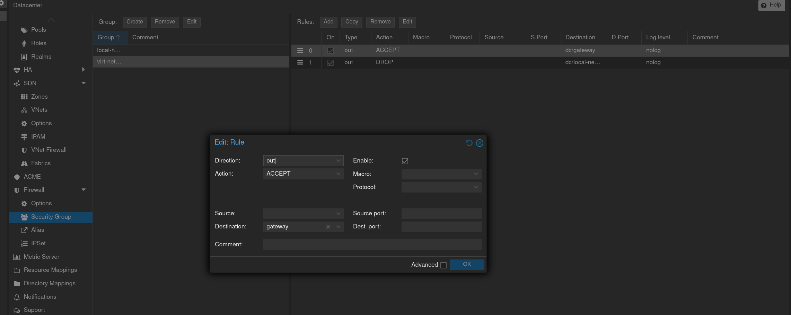

Обратите внимание на порядок правил. Разрешающее правило должно быть выше запрещающего

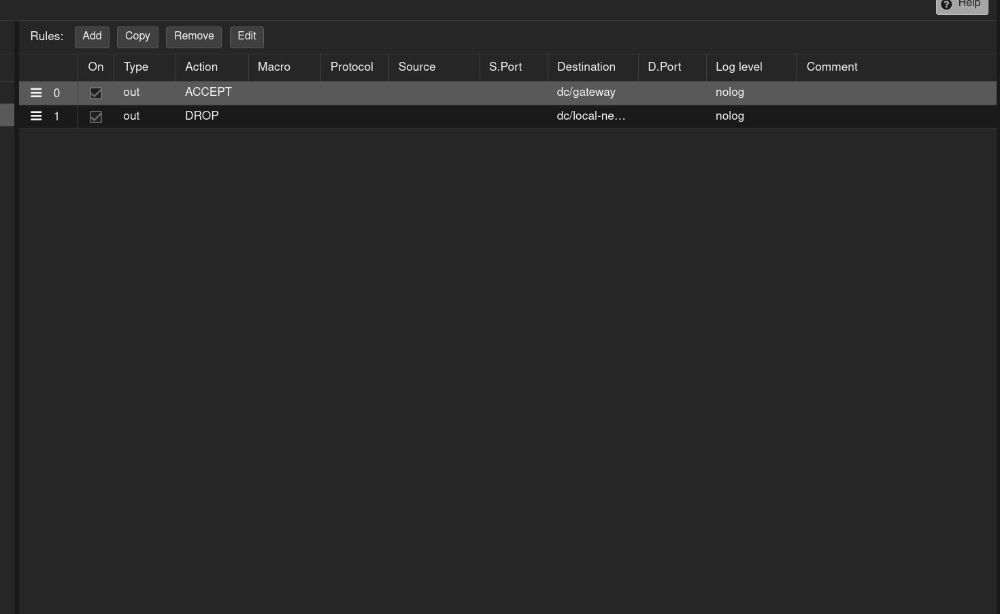

Ну и опционально, просто для наглядности, давайте добавим еще одно, дополнительное правило. Что называется для закрепления материала.

1. В разделе **Rules** добавьте правило:  
   - Action: `ACCEPT`  
   - Direction: `in`
   - Source: `local-network`  
   - Comment: `по желанию`

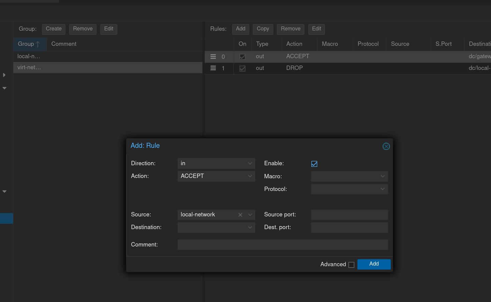

То есть мы разрешили входящий трафик из локальной сети в нашу виртуальную сеть.
Да, какого-то смысла все запретить и тут же все разрешить нет. Но, как я и сказал выше, - это просто для наглядности и понимания принципов работы firewall

В итоге у нас сейчас три правила

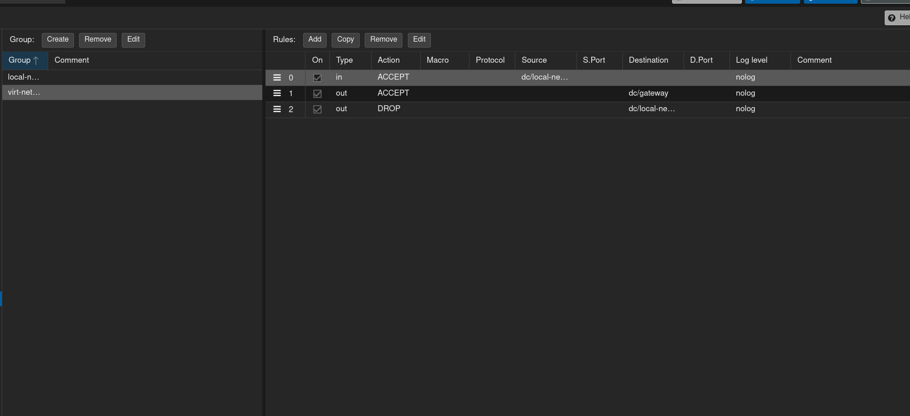

Мы разрешаем входящий трафик из локальной сети.
Мы разрешаем трафик во внешний мир, потому что мы разрешили исходящий трафик на адрес нашего шлюза.
Мы запретили исходящий трафик из нашей виртуальной сети в нашу локальную сеть. Так что никакие виртуальные машины или контейнеры не имеют доступа к нашим устройствам в нашей физической локальной сети.

Но пока эти правила не работают.

Что я имею ввиду.

Идем с вами в командную строку, в моем случае, контейнера на базе Ubuntu и пропингуем машину, с которой я сейчас пишу настоящую статью

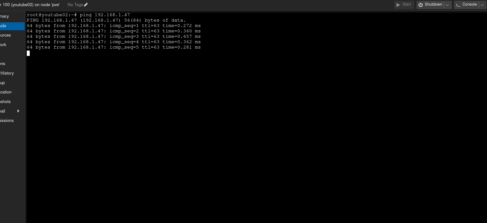

Как вы видите пинг проходит. Это из-за того, что мы не включили firewall на уровне контейнера.
Поэтому в меню нашего контейнера идем в **Firewall → Options** и включаем firewall

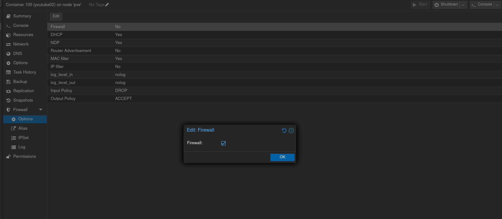

Поднимаемся в меню **firewall** нашего контейнера и активируем нашу security group для виртуальной сети.

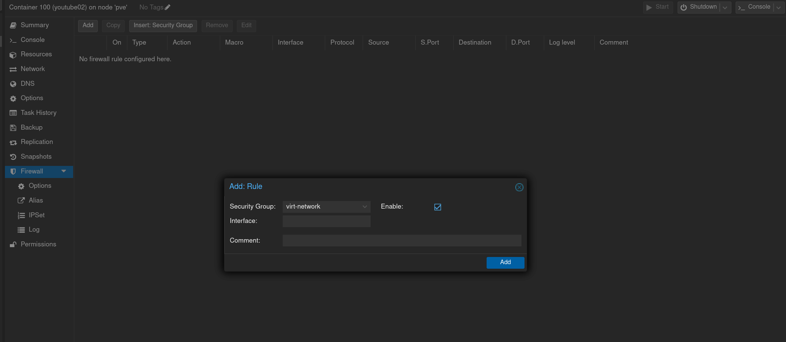

И теперь когда мы с вами опять попробуем пропинговать нашу машину, то ответом нам будет тишина, так как машина в локальной сети не входит в группу для виртуальной сети

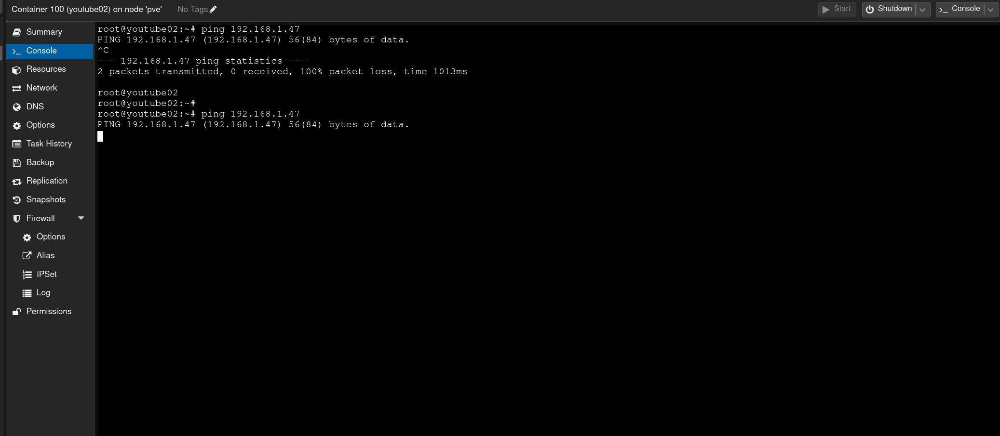

Но если мы например решим выйти во внешний мир и пропингуем что-то типа ya.ru, то сигнал пройдет

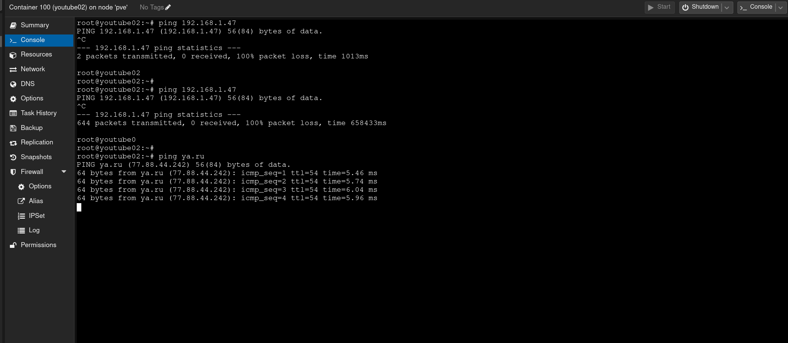

Но как известно во всем всегда виновато dns и чтобы избежать каки-то проблем, что мы можем пропинговать какой-то айпи во внешний мир, но не можем пропинговать доменное имя создадим еще одно правило для **Security Group** на уровне **Datacenter**, которым мы разрешим доступ к DNS

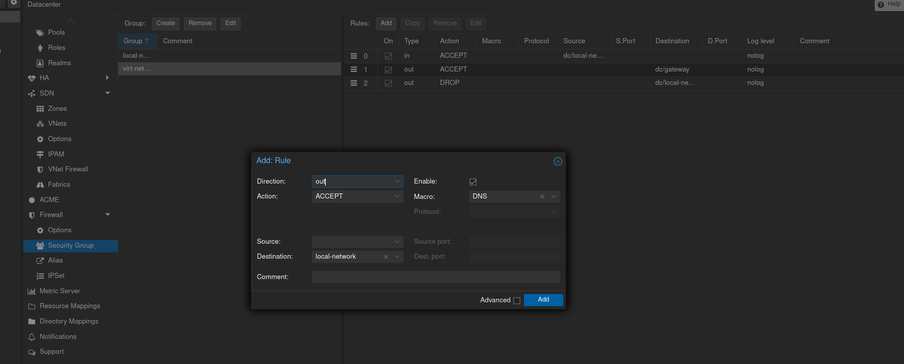

На этом я хотел бы закончить первоначальную настройку firewall в Proxmox.
Но напоследок хотел бы повторить про лучшие практики настройки правил в **firewall**

## Лучшие практики настройки правил firewall для начинающих

- Всегда начинайте с **ALLOW правил**, затем переходите к блокировке (`DROP`).  
- Используйте **Firewall Groups** для удобства управления (например, `ssh-access`, `web-access`).  
- Тестируйте правила пошагово, чтобы случайно не заблокировать доступ.  
- Для продакшн-окружения используйте firewall Proxmox **вместе с внешним firewall (pfSense, OPNsense, iptables на роутере)**.  

---

## Выводы

Firewall в Proxmox — это мощный инструмент для повышения безопасности вашего кластера и виртуальных машин. Он позволяет централизованно управлять доступом, фильтровать трафик и минимизировать риски атак. Несмотря на некоторые ограничения, встроенный firewall отлично подходит для большинства сценариев в homelab и малых продакшн-системах.  
