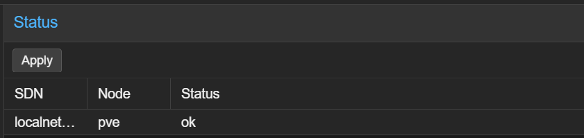
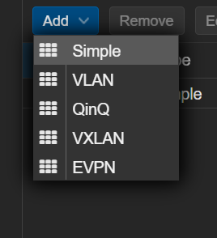
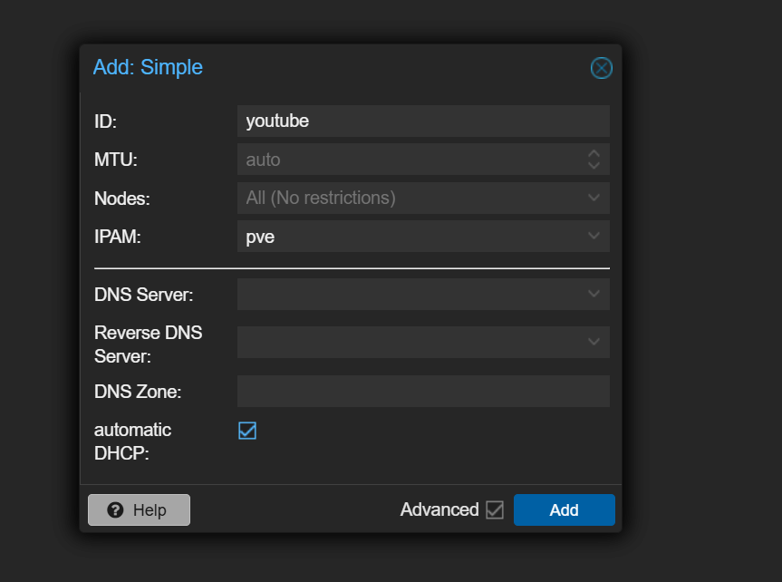
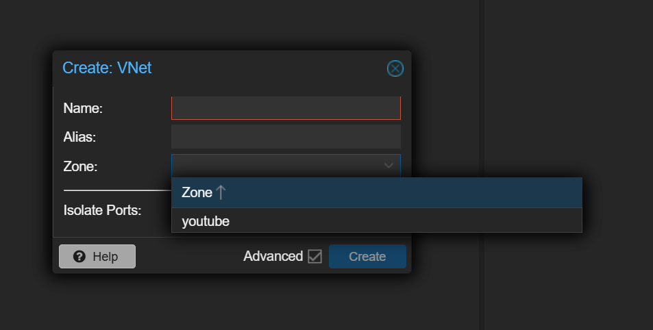
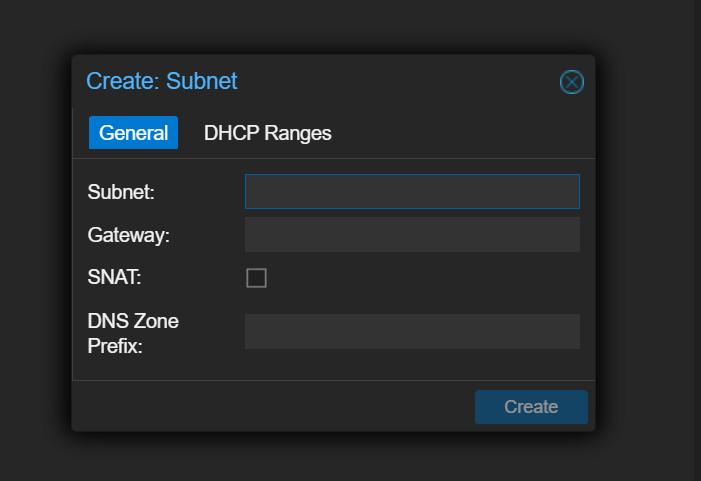
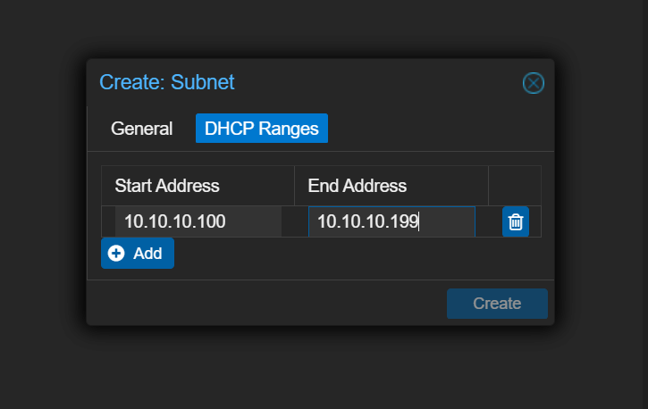
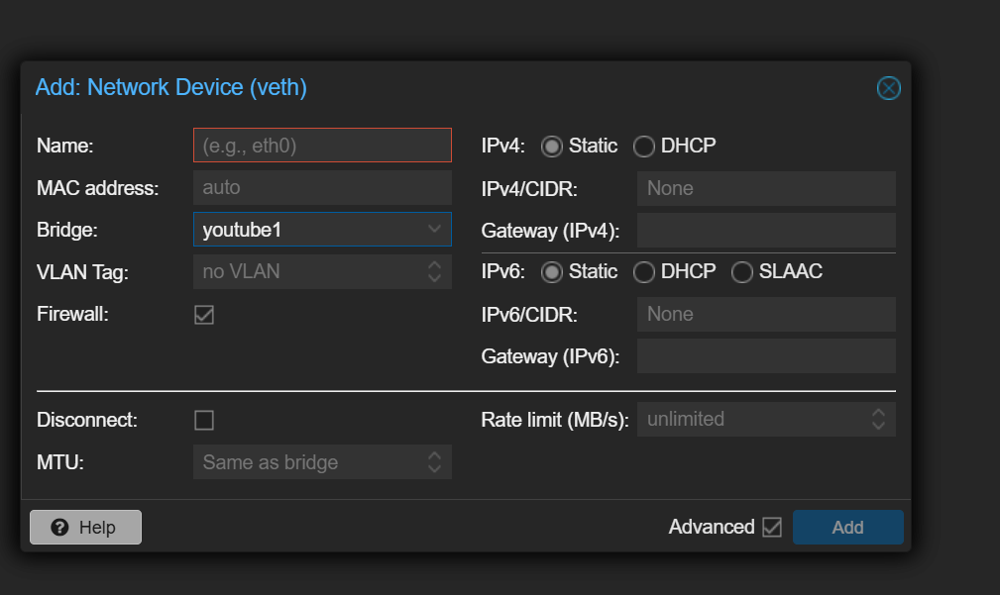
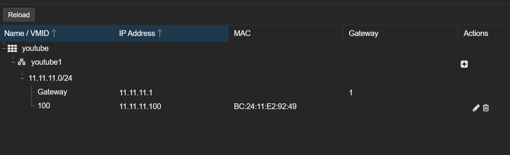

<iframe width="100%" height="468" src="https://www.youtube.com/embed/bKO9lyKR-ms?si=YRsDNa439W0jo9uY" title="YouTube video player" frameborder="0" allow="accelerometer; autoplay; clipboard-write; encrypted-media; gyroscope; picture-in-picture; web-share" allowfullscreen></iframe>

В **Proxmox VE** **SDN (Software Defined Networking)** — это подсистема для управления виртуальными сетями, добавленная начиная с версии **7**. Она упрощает работу с сетевой инфраструктурой внутри кластера и позволяет организовывать гибкие, изолированные и масштабируемые сети для виртуальных машин и контейнеров.  

---

## Основные моменты про SDN в Proxmox

### 1. Зачем нужно SDN

- Упрощает создание частных сетей внутри кластера Proxmox.  
- Позволяет изолировать трафик разных пользователей или проектов.  
- Дает возможность масштабировать сеть на несколько узлов кластера.  
- Автоматизирует настройку маршрутизации, NAT, DHCP и DNS.  

### 2. Компоненты SDN в Proxmox

- **Zones (зоны)** — логические сегменты сети (например, для разных проектов или клиентов).  
- **VNet (виртуальные сети)** — создаются внутри зон и определяют топологию L2/L3.  
- **Controllers (контроллеры)** — управляют сетевыми настройками (например, через EVPN, VXLAN, BGP).  
- **IPAM/DNS** — встроенная система для управления IP-адресами и именами.  

### 3. Поддерживаемые типы зон

- **Simple (VLAN-aware bridge)** — обычная сеть на базе bridge + VLAN.  
- **VXLAN** — оверлейная сеть с туннелированием поверх IP.  
- **EVPN** — продвинутый вариант для интеграции с "датацентровой" сетью через BGP.  
- **QoS zones** — поддержка ограничений пропускной способности.  

### 4. Пример использования

1. У вас есть кластер Proxmox на 3 узла.  
2. Вы создаете SDN-зону типа **VXLAN**, чтобы виртуалки на разных хостах оказались в одной L2-сети.  
3. Proxmox сам поднимает туннели между узлами, и ВМ/контейнеры видят друг друга, как будто они в одной локальной сети.  

---

## Конкуренты

SDN в Proxmox позволяет строить облачные сценарии наподобие **OpenStack/VMware NSX**, но в более простом виде.  

## Особенности статьи

В данной статье, которая идет как дополнение к видео в начале текста, я постараюсь рассмотреть базовую конфигурацию SDN, которая даст нам понимание как работает SDN в Proxmox

### Вводные

SDN в Proxmox по умолчанию появилась начиная с версии `Proxmox` 8.1. В случае если у вас система более старая, то сначала вам надо будет ввести в шелле вашей ноды следующую команду, чтобы установить необходимые пакеты:

```yaml
apt update
apt install libpve-network-perl
```

После установки необходимо убедиться, что следующая строка присутствует в конце файла конфигурации `/etc/network/interfaces` на всех нодах (в случае если у вас кластер), чтобы конфигурация SDN была включена и активирована

```text
source /etc/network/interfaces.d/*
```

Интеграция DHCP во встроенный стек управления IP-адресами PVE в настоящее время использует dnsmasq для выдачи DHCP-аренды.
Чтобы использовать эту функцию, вам необходимо установить пакет dnsmasq на каждой ноде.

```yaml
apt update
apt install dnsmasq
# disable default instance
systemctl disable --now dnsmasq #отключаем dhcp сервер, чтобы он не конфликтовал с вашим роутером
```

## Первоначальная настройка SDN

В меню **Datacenter** кликаете на вкладку **SDN**. Там вы видите список сетей, которые существуют на данный момент. Количество сетей будет зависеть от количество нод. В моем случае будет только одна локальная сеть.



Теперь давайте создадим свою первую (так-то она конечно вторая по счету) локальную есть. Идем в раздел **Zones** жмем копку **add** и видим, что можем выбрать разные типы зон.



Так как у нас с вами будет базовая/простая конфигурация, - то выбираем **simple**.

В качестве ID я указываю название `youtube`. Значения MTU я оставлю по умолчанию. Обратите внимание, иногда регионы рапортуют, что с дефолтным значение MTU которое равняется 1500 могут быть проблемы. Можете попробовать значение 1460 как вариант. В этом же меню в качестве DHCP я выбираю автонастройку. Жмем **add**.


В итоговом окошке видим настройки нашей зоны.
Теперь идем в раздел VNET, жмем кнопку create.



Выбираем имя и alias который вы хотите. Теперь выбираете вновь созданную зону. Все остальное оставляем по умолчанию, потому что в этой статье, как сказано выше, мы делаем только базовую настройку, никаких vlan и прочего.
Мы с вами создали нашу первую виртуальную сеть. После того как мы с вами ее создали, у нас появилось новое меню подсеть. В меню vnet выбираем нашу вновь созданную сеть, переходим в меню подсеть `subnet`.
Жмем создать. Сейчас мы с вами создадим нашу подсеть, которая будет изолирована от нашей домашней сети.



Задаем адрес нашей подсети. Я люблю нечетные числа, поэтому задам адрес 11.11.11.0/24 (но это неправильно с точки зрения использования в production среде). Адрес шлюза 11.11.11.1 нам нужно поставить галку в разделе snat. Это позволит всем устройствам подсети иметь единый внешний айпи адрес, чтобы они имели выход во внешний мир. Днс не трогаем.

>[!WARNING]
>Правильно создавать сети в пределах диапазона частных сетей для избежания разных неприятных сюрпризов! Поэтому лучше создавать все в пределах 10.10.10.0/24. Но так как наша вновь созданная подсеть должна быть изолирована от доступа из внешнего мира без отдельного на то разрешения, то и так сойдет.

Теперь нам надо задать диапазон адресов в меню DHCP. Не будем изобретать велосипед, зададим диапазон от 100 до 199. Жмем create.



Мы с вами создали зону, vnet, subnet. Теперь чтобы изменения были применены идем в меню **SDN** и жмем **apply**. Теперь когда вы перейдете в список сетей вашей ноды, вы увидите что рядом с **localnetwork** появилась вновь созданная сеть.
Все, мы с вами сделали первые шаги, чтобы создать основу для нашей маленькой SDN.

Чтобы проверить как все оно работает в реальности - создадим для тестовых задач простой и пустой LXC контейнер на базе `Ubuntu`. Все делаем как обычно, кроме одного маленького, но очень важного, момента.
Когда мы с вами выбираем мост (bridge) который будет использовать наш контейнер в разделе `bridge`



выбираем не vmbr0, к которому мы с вами привыкли, а вновь созданную сеть. Все остальное оставляем как обычно.
Уже сейчас вы можете вернуться в **Datacenter**, и в подменю **IPAM** увидеть сетевые данные вновь созданного контейнера.



В нашем случае у него теперь ip адрес 11.11.11.100
После создания и запуска контейнера мы должны проверить - имеет ли наш контейнер выход во внешний мир. Вы конечно можете это сделать простой командой ping `нужный ресурс`, но достаточно будет просто запустить apt update, и в случае если все в порядке, то контейнер проверит наличие обновлений и выдаст вам результат. Уже это подтверждает, что у вас полностью рабочий контейнер, который имеет доступ во внешний мир.
Теперь удостоверимся, что наш контейнер не доступен из внешнего мира.
С любой машины внутри вашей локальной сети, но не из шелла Proxmox пропингуем наш контейнер `ping 11.11.11.100` и ответом нам будет тишина. Все потому, что, как я и указывал в начале статьи, наш с вами контейнер находится в изолированной от внешнего мира сети (SDN). Необходимо отметить, что если вы будете пинговать контейнер из шелла вашей ноды, то в данном случае контейнер будет доступен. Это связано с тем, что сеть создана внутри нашей ноды, каких-либо правил firewall мы еще не настраивали, поэтому с ноды наш контейнер замечательно пингуется.
Однако настройка firewall внутри Proxmox - это тема уже другой статьи.
