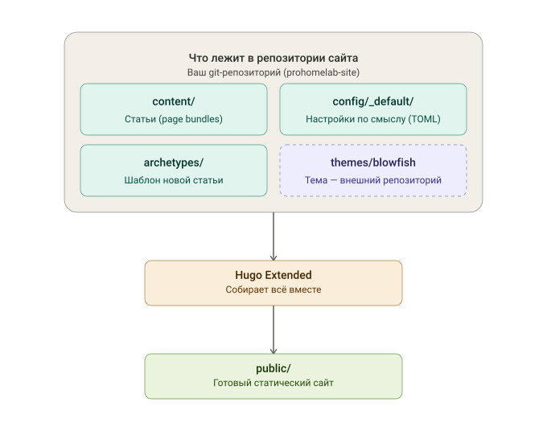

## Установка Hugo + тема Blowfish с нуля - подробная инструкция

Эта заметка - отдельный, самостоятельный гайд: как развернуть сайт на Hugo с темой Blowfish с чистого листа. Она не зависит от инструкции по автоматизации публикации (Obsidian → Forgejo → CI/CD[^1]) - если сайт уже работает, эта заметка не нужна. Пригодится, если разворачиваете новый сайт, тестовый стенд, или хотите понимать, что вообще происходит внутри той LXC-машины, где уже стоит ваш сайт. 

Инструкция рассчитана на новичка - каждая команда с объяснением. 

> [!attention] 
> У меня сайт со всеми файлами крутится в LXC контейнере внутри Proxmox, поэтому в настоящей статье я буду исходит из этой предпосылки. Но Hugo можно установить в любую систему, которая поддерживает git, даже WIndows. Я выбрал LXC для того, чтобы я мог писать статьи из любой точки мира,  удаленно подключившись к своему серверу. 

---

## Как всё это связано между собой

Прежде чем идти по шагам, стоит увидеть общую картину - иначе не очень понятно, зачем такая, на первый взгляд, сложная структура: отдельная папка для темы, отдельная для настроек, разбитых на несколько файлов, и всё это через git и submodule, а не просто "закинуть всё в одну папку".

Логика простая: каждая часть отвечает за своё, и это не усложнение ради усложнения, а разделение ответственности.



- **`content/`** - это то, что пишете вы: сами статьи. Меняется чаще всего.
- **`config/_default/`** - это настройки: как выглядит сайт, какое меню, какие параметры темы. Меняется редко, но когда меняется - удобно, что каждый аспект в своём файле, а не в одной простыне на тысячу строк.
- **`archetypes/`** - шаблон, по которому создаётся новая статья, чтобы не копипастить фронтматтер каждый раз руками.
- **`themes/blowfish`** - а вот это принципиально другое: это **не ваш код**, это отдельный чужой репозиторий (тема Blowfish), подключённый через git submodule. Он специально не смешан с вашими файлами - так вы можете обновлять тему до новой версии одной командой, не боясь, что где-то в её файлах случайно затерялась ваша правка, и наоборот - ваши статьи и настройки никак не зависят от внутренней структуры темы.

Дальше Hugo Extended берёт всё это вместе - ваш контент, ваши настройки и внешнюю тему - и на выходе даёт готовый статический сайт в папке `public/`. Именно эту связку мы дальше и будем собирать по шагам.


> [!tip] 
> В других готовых темах для Hugo логика построения проекта отличается

---

## Терминология статьи

- **Hugo** - генератор статичных сайтов: берёт markdown-файлы с контентом и шаблоны оформления, на выходе даёт готовый HTML-сайт (без базы данных, без PHP - просто файлы).
- **тема (theme)** - набор шаблонов оформления и стилей. Blowfish - одна из популярных тем для Hugo, заточенная под блоги/документацию, ио точно одна из самых кастомизируемых.
- **Hugo Extended** - расширенная сборка Hugo с поддержкой SCSS/SASS (компиляция стилей). Большинству современных тем, включая Blowfish, нужна именно она - обычная (не Extended) сборка не подойдёт.
- **submodule** - репозиторий внутри репозитория. Тема обычно подключается как submodule: ваш сайт ссылается на конкретную версию репозитория темы, не копируя её файлы напрямую.
- **frontmatter (фронтматтер)** - блок метаданных в начале markdown-файла статьи, обычно между `---`, где указываются заголовок, дата, теги и т.д.
- **page bundle** - способ оформления статьи в Hugo, при котором у статьи есть своя папка (а не просто один `.md`-файл), и рядом с текстом лежат её изображения (например `featured.png`).
- **config/_default/** - папка с настройками сайта, разбитая на несколько файлов по смыслу (`hugo.toml`, `params.toml`, `menus.toml` и т.д.) - так организована конфигурация в Blowfish.
- **TOML** - формат файлов конфигурации (похож на INI, но со своими особенностями синтаксиса).

---

## Этап 1. Подготовка сервера

Если разворачиваете на новой машине (например, ещё один LXC-контейнер в Proxmox) - сначала базовая подготовка.

### Шаг 1.1. Создайте/подключитесь к серверу

Если это новый LXC-контейнер в Proxmox - создайте его с шаблоном Debian или Ubuntu, выделите хотя бы 1 vCPU / 1 ГБ RAM / 8 ГБ диска - для статического сайта этого с запасом хватит.

Подключитесь по SSH:
```bash
ssh root@IP_КОНТЕЙНЕРА
```

### Шаг 1.2. Обновите систему

```bash
apt update && apt upgrade -y
```

### Шаг 1.3. Установите git

```bash
apt install -y git
git --version
```

---

## Этап 2. Установка Hugo Extended

### Шаг 2.1. Почему не с помощью `apt install hugo`

В стандартных репозиториях Debian/Ubuntu версия Hugo обычно слишком старая и **не Extended** - темы вроде Blowfish, и не только, просто откажутся собираться (ошибки про отсутствующий SCSS-транспайлер). Ставим актуальный релиз вручную, с GitHub.

### Шаг 2.2. Скачайте актуальный релиз Hugo Extended

Откройте в браузере страницу релизов:

```text
https://github.com/gohugoio/hugo/releases
```

Найдите самый верхний релиз без пометки Pre-release. В списке файлов внизу страницы найдите архив для Linux с словом **extended** в названии (например `hugo_extended_0.XXX.X_linux-amd64.tar.gz`) - обычная сборка без этого слова не подойдёт.

**Не набирайте ссылку руками** - кликните правой кнопкой по названию файла и выберите "Копировать адрес ссылки" (Copy link address). Так исключается риск опечататься в номере версии и скачать несуществующий файл.

На сервере, вставив скопированную ссылку вместо `ССЫЛКА`:

```bash
cd /opt
curl -L -o hugo.tar.gz "ССЫЛКА"
```

Прежде чем распаковывать, проверьте, что скачался архив, а не страница с ошибкой:

```bash
file hugo.tar.gz
```

Должно быть что-то вроде `gzip compressed data` - если вместо этого `ASCII text` или `HTML document`, значит ссылка оказалась нерабочей, вернитесь на страницу релизов и скопируйте ссылку заново.

```bash
tar -xzf hugo.tar.gz hugo
mv hugo /usr/local/bin/
rm hugo.tar.gz
```

### Шаг 2.3. Проверьте установку

```bash
hugo version
```

В выводе обязательно должно быть слово **extended** - например:

```
hugo v0.163.3-...+extended linux/amd64 ...
```

Если слова `extended` нет - скачали не тот архив, повторите Шаг 2.2.

---

## Этап 3. Создание нового сайта

### Шаг 3.1. Создайте структуру проекта

```bash
mkdir -p /home/prohomelab
cd /home/prohomelab
hugo new site . --force
```

Разбор: `hugo new site . --force` создаёт стандартную структуру Hugo-сайта прямо в текущей папке (`.`), `--force` разрешает сделать это в уже существующей (но пустой) папке.

Появятся папки: `archetypes/`, `assets/`, `content/`, `data/`, `i18n/`, `layouts/`, `static/`, и файл `hugo.toml`. Этот `hugo.toml` мы дальше не трогаем напрямую - в Фазе 4 он будет заменён на структуру из нескольких файлов.

### Шаг 3.2. Инициализируйте git

```bash
git init
git config user.name "Ваше имя"
git config user.email "you@example.com"
```

---

## Этап 4. Подключение темы Blowfish

### Шаг 4.1. Добавьте тему как submodule

```bash
git submodule add -b main https://github.com/nunocoracao/blowfish.git themes/blowfish
```

> [!NOTE]
> На сайте разработчика есть инструкция, как подключить тему с помощью встроенных инструментов. В ходе такой установки вам будет задано огромное количество вопросов, ответив на которые вы получите готовую к использованию тему, но мы пойдем по старинке.

Разбор значений: `-b main` - отслеживать ветку `main` репозитория темы. Команда создаст файл `.gitmodules` (в нём будет записано, откуда брать тему) и скачает саму тему в `themes/blowfish`.

### Шаг 4.2. Скопируйте образец конфигурации Blowfish

У темы Blowfish есть готовый пример конфигурации (папка `exampleSite`), с которого удобно начать вместо конфигурации с нуля:

```bash
cp -r themes/blowfish/config/_default config/
```

Это создаст папку `config/_default/` с несколькими файлами вместо одного `hugo.toml` - так рекомендует сама тема Blowfish, конфигурация разложена по смыслу:

- `hugo.toml` - базовые настройки сайта (заголовок, baseURL, языки по умолчанию)
- `params.toml` - параметры темы (цветовая схема, футер, соцсети и т.д.)
- `menus.<язык>.toml` - пункты меню (например `menus.ru.toml`)
- `languages.<язык>.toml` - настройки конкретного языка (например `languages.ru.toml`)
- `markup.toml` - настройки обработки markdown
- `module.toml` - настройки Hugo Modules (если используете модули вместо submodule - в нашем случае не нужен, можно удалить или оставить пустым)

> [!attention]
> Важно: как только появляется папка `config/_default/`, Hugo полностью переключается на неё и перестаёт читать корневой `hugo.toml` из Шага 3.1. Дальше редактируем только файлы внутри `config/_default/`.

### Шаг 4.3. Настройте базовые параметры сайта

```bash
nano config/_default/hugo.toml
```

Проверьте/поправьте:

```toml
theme = "blowfish"
baseURL = "https://ваш-домен.com/"
title = "Название вашего сайта"
locale = "ru-RU"
```

Поле `locale` - это актуальное на сегодня имя параметра, который задаёт язык и регион сайта (используется, например, в метатегах для соцсетей). В старых примерах в интернете вместо него можно встретить `languageCode` - это устаревшее имя, при сборке на нём Hugo выдаст предупреждение, поэтому сразу используем `locale`.

### Шаг 4.4. Настройте язык

Откройте `config/_default/languages.ru.toml`:

```bash
nano config/_default/languages.ru.toml
```

В самом верху файла (не внутри `[params]`) проверьте/поправьте:

```toml
locale = "ru-RU"
label = "Russian"
weight = 1
```

(Если вместо `locale`/`label` видите `languageCode`/`languageName` - замените, это те же устаревшие имена, что и в Шаге 4.3.)

### Шаг 4.5. Первый локальный запуск (превью)

```bash
hugo server -D --bind 0.0.0.0 --baseURL "http://IP_ВАШЕГО_СЕРВЕРА"
```

Разбор: `-D` - показывать черновики тоже, `--bind 0.0.0.0` (можно указать конкретный IP вашего контейнера) - слушать на всех сетевых интерфейсах (по умолчанию Hugo слушает только `127.0.0.1`, и с другого компьютера в сети не достучаться), `--baseURL` - на какой адрес ссылаться внутри сгенерированных страниц.

Откройте в браузере `http://IP_ВАШЕГО_СЕРВЕРА:1313` (Hugo dev-сервер по умолчанию слушает порт 1313).

> [!attention]
> Если страница не открывается, а команда в терминале отработала без ошибок - скорее всего, порт 1313 закрыт файрволом (на самом LXC-контейнере, на хосте Proxmox, или на пограничном роутере/файрволе вашей сети). Временно откройте порт 1313 для тестового доступа, либо подключайтесь к превью только с той же машины через SSH-туннель (`ssh -L 1313:localhost:1313 root@IP_КОНТЕЙНЕРА`, дальше `http://localhost:1313` у себя в браузере).

Должна открыться стартовая страница темы Blowfish (пока пустая, без статей). Остановить сервер - `Ctrl+C` в терминале.

---

##Этап 5. Структура контента (под ваш формат статей)

Я все буду рассказывать на примере своего сайта, но у вас, конечно, может быть своя структура. У меня уже устоявшийся формат - статьи оформлены как **page bundle** (папка на статью со слагом внутри, плюс `featured.png` рядом), а фронтматтер включает конкретный набор полей. Задокументируем это здесь, чтобы формат был предсказуем при создании новых статей вручную (без Obsidian) или при разворачивании копии сайта.

### Шаг 5.1. Создайте архетип (шаблон новой статьи)

Архетип - это заготовка, которую Hugo подставляет при создании новой статьи командой `hugo new`. Отредактируйте `archetypes/default.md`:

```bash
nano archetypes/default.md
```

Впишите шаблон фронтматтера под ваш формат, у меня например такой:

```markdown
---
title: "{{ replace .File.ContentBaseName "-" " " | title }}"
published: {{ .Date }}
pinned: false
description: ""
tags: []
slug: "{{ .File.ContentBaseName }}"
category: ""
licenseName: "CC BY 4.0"
author: "ваше имя"
draft: true
series: ""
toc: true
showDate: true
showDateUpdated: true
showReadingTime: true
showAuthor: true
cover: ./featured.png
summary: ""
---
```

Данный шаблон повторяет структуру фронтматтера, которую я использую (без отдельных полей `date`/`pubDate` - публикационная дата берётся из `published`).

### Шаг 5.2. Создайте новую статью как page bundle

```bash
hugo new content/posts/Selfhosting/Моя-новая-статья/index.md
```

Это создаст папку `content/posts/Selfhosting/Моя-новая-статья/` с файлом `index.md` внутри, оформленным по архетипу из Шага 5.1. Картинку обложки положите туда же, под именем `featured.png` (или поправьте `cover:` в фронтматтере на другое имя файла).

### Шаг 5.3. Категории и теги

В моей текущей структуре у каждой крупной категории (`content/posts/Traefik/`, `content/posts/Proxmox/` и т.д.) есть файл `_index.md` - он описывает саму категорию/раздел (не отдельную статью), например задаёт заголовок раздела и обложку `featured.png`/`featured.webp` для страницы-листинга этой категории. Создаётся так же, вручную:

```bash
mkdir -p content/posts/НоваяКатегория
cat > content/posts/НоваяКатегория/_index.md <<'EOF'
---
title: "Название категории"
---
EOF
```

---

## Этап 6. Сборка для продакшена

### Шаг 6.1. Соберите сайт

```bash
cd /home/prohomelab
hugo -D --minify
```

Разбор: `-D` - включить черновики в сборку (уберите этот флаг, когда захотите публиковать только полностью готовые статьи), `--minify` - сжать итоговые HTML/CSS/JS.

Результат появится в папке `public/` - это и есть готовый статичный сайт, который можно заливать на любой хостинг.

### Шаг 6.2. Локальная проверка собранного сайта

Если хотите посмотреть именно собранную (production) версию, а не через dev-сервер:

```bash
cd public
python3 -m http.server 8080
```

Откройте `http://IP_СЕРВЕРА:8080` в браузере (тот же нюанс с файрволом, что и в Шаге 4.5, актуален и здесь). Остановить - `Ctrl+C`.

---

## Что дальше

На этом сайт развёрнут и умеет собираться. Дальше вы должны решить, как вы хотите публиковать свой сайт.
Я раньше заливал папку `public/` на хостинг вручную (через FileZilla). Но вариантов намного больше - тут вам предстоит принять решение самостоятельно и свериться с официальной документацией темы и движка.

## P.S. Пара вещей, о которых стоит подумать отдельно, не описанных в этом гайде:

- **Резервное копирование**: сам Hugo-репозиторий версионируется в git, но сгенерированный `public/` - нет (мы его исключаем через `.gitignore`), это нормально, он пересоздаётся из исходников в любой момент.
- **HTTPS/TLS для локального дев-сервера** - не нужен, `hugo server` предназначен только для локального превью, не для публичного доступа.
- **Обновление темы**: раз в какое-то время стоит обновлять submodule темы до новой версии:

  ```bash
  cd themes/blowfish
  git pull origin main
  cd ../..
  git add themes/blowfish
  git commit -m "Update Blowfish theme"
  ```

- Перед обновлением стоит свериться с changelog темы на GitHub - иногда меняются названия полей конфигурации (как в примере с `languageCode`/`locale` выше), и после обновления может понадобиться поправить `config/_default/*.toml`.

[^1]: на момент публикации настоящей статьи инструкция с Obsidian еще не опубликована
