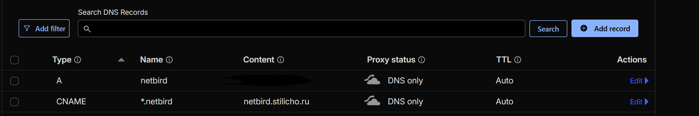
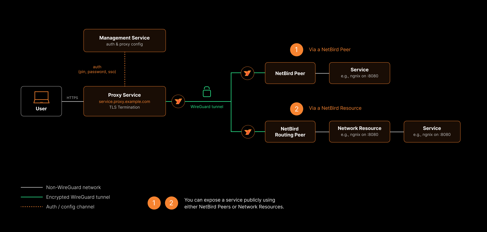

*В случае если вам понравилась эта статья, то можете поддержать автора, став спонсором на [Boosty](https://boosty.to/stilicho2011).*

Если вы думаете, что NetBird — это просто ещё одно VPN приложение, которое может объединять ваши устройства в mesh-сеть, то … частично, да, вы правы.  
Но на практике — это гораздо более гибкий инструмент, который закрывает сразу несколько задач: приватная сеть, доступ к ресурсам и теперь ещё и публикация сервисов наружу.

<iframe width="560" height="315" src="https://www.youtube.com/embed/SsKlv967sv0?si=yprUo4aSfIUyJjsE" title="YouTube video player" frameborder="0" allow="accelerometer; autoplay; clipboard-write; encrypted-media; gyroscope; picture-in-picture; web-share" referrerpolicy="strict-origin-when-cross-origin" allowfullscreen></iframe>

----

## Предисловие

В homelab всё обычно начинается одинаково:

Сначала ты поднимаешь сервисы локально — всё работает идеально.  
Потом появляется желание зайти к ним извне.
И тут начинается: проброс портов, NAT, firewall, динамический DNS, домены, HTTPS и постоянная паранойя «а всё ли я закрыл»?  
Дальше — больше: появляется VPN (речь не про обход блокировок, товарищ майор, а про безопасность).  Но VPN тоже не всегда идеален: нужно поднимать сервер, настраивать клиентов, разбираться с маршрутизацией, чинить доступ с мобильных сетей. 
И в какой-то момент ты понимаешь, что занимаешься не сервисами, а сетью.
Вот здесь и выходит на сцену **Netbird**.

----

## Что такое NetBird

NetBird — это система, которая создаёт **приватную mesh-сеть между всеми твоими устройствами**.
Проще говоря:

> Все твои серверы, ноутбуки, телефоны и контейнеры становятся частью одной виртуальной сети.

И всё это:

- без проброса портов  
- без ручной настройки WireGuard  
- без сложной сетевой логики  

----

## Чем он отличается от Pangolin

Если коротко:

- **Pangolin** — публикует сервисы наружу (разной степени доступа конечно)  
- **NetBird** — соединяет устройства между собой  

Но сейчас граница размылась.
NetBird теперь умеет: делать приватную сеть (его основная функция); давать доступ к ресурсам; публиковать сервисы наружу через встроенный прокси. Последнее уже  новая функция, которая полностью меняет восприятие этого приложения.  
То есть он превращается в **универсальный инструмент доступа**.

----

## Основная идея: mesh-сеть

Вместо классического VPN (клиент → сервер), NetBird использует mesh сеть:

- устройства соединяются напрямую  
- если не получается — используется relay  
- маршруты строятся автоматически  

Под капотом используется *wireguard*, но ты с ним почти не взаимодействуешь.

----

## Почему это удобно

### 1. Никаких открытых портов

Твой сервер **сам инициирует соединение наружу**.  
Это значит, что: не нужно трогать роутер; не нужно открывать порты; меньше рисков, связанных с возможной компрометацией сервисов. 

### 2. Всё шифруется

Трафик идёт через WireGuard. На практике - это значит современная криптография, высокая производительность, минимальные пинги  

### 3. Zero Trust подход

NetBird не доверяет сети — только пользователю и устройству.
Ты контролируешь: кто именно подключается; к каким ресурсам подключается пользователь и по каким правилам (вернее ролям, так как там внедрен [RBAC](https://ru.wikipedia.org/wiki/%D0%A3%D0%BF%D1%80%D0%B0%D0%B2%D0%BB%D0%B5%D0%BD%D0%B8%D0%B5_%D0%B4%D0%BE%D1%81%D1%82%D1%83%D0%BF%D0%BE%D0%BC_%D0%BD%D0%B0_%D0%BE%D1%81%D0%BD%D0%BE%D0%B2%D0%B5_%D1%80%D0%BE%D0%BB%D0%B5%D0%B9), хотя и на начальной стадии )  

### 4. Простота

Тебе не надо писать конфиги вручную, генерировать ключи и дебажишь iptables  
Ты просто устанавливаешь агента, логинишься и получаешь сеть.


Безусловно это не все возможности приложения, но я надеюсь, что читатели меня простят, если я не буду просто переводить сайт с документацией NetBird 

----

## Новая фишка Netbird: публикация сервисов

Раньше NetBird был чисто про организацию приватной сети и получения к ней доступа. Теперь он умеет работать как **обратный прокси**.
Это означает:

-  ты можешь публиковать сервисы наружу;  
- без прямого открытия портов на домашнем сервере;  
- с контролем доступа.  

Фактически, внутренний сервис → доступен по домену; трафик проходит через NetBird; доступ тонко регулируется политиками.
Это делает его похожим на:

- Pangolin  
- Cloudflare Tunnel  

Но с важным отличием от Cloudflare Tunnel:
> всё остаётся под твоим контролем

----

## Как это работает

### Общая схема

1. У тебя есть **management server** (в нашем случае это self-hosted сервер на VPS)
2. Устройства подключаются к нему
3. Между ними строится mesh-сеть
4. При необходимости поднимается relay или используется direct connection


### Компоненты

#### Management Server
Центральная точка управления:

- пользователи  
- устройства  
- политики доступа  


#### Agents

Клиенты, которые ставятся на:

- серверы  
- ПК  
- ноутбуки  
- контейнеры  


#### Relay (если нужен)

Используется, если прямое соединение невозможно (NAT, CGNAT и т.д.)

#### Встроенный прокси

Отвечает за:

- публикацию сервисов  
- маршрутизацию трафика  
- доступ извне  

----

## Ключевые сценарии использования

### 1. Доступ к homelab из любой точки

Ты просто подключаешься — и:

- открываешь Proxmox  
- подключаешься к NAS  
- подключаешься по SSH  

Как будто ты дома.

### 2. Объединение нескольких организаций

Например дом, VPS, офис  
Все они становятся одной сетью.


### 3. Публикация сервисов

Теперь можно открыть доступ к веб-приложению по доменному имени, выдать доступ конкретным пользователям, не светить IP  

### 4. Безопасный доступ для команды

Можно дать доступ разработчикам, друзьям и коллегам. Но это если они у тебя конечно есть.  
Можно все сделать и в обратную сторону и ограничить все только нужными сервисами и только нужными портами  

----

## Требования к развертыванию

### Минимальный набор

1. Сервер (VPS или локальный)
2. Домен 
3. Интернет-доступ у клиентов

В этом требования у Pangolin и NetBird похожи


### Варианты развертывания

#### Облачный (самый простой)

Использовать hosted-версию NetBird.

Плюсы:

- быстро  
- не нужна предварительная настройка.   

Минусы:

- меньше контроля
- доступ из России на дату публикации статьи затруднен  


#### Self-hosted (рекомендуется для homelab) в 2026 году

Ты поднимаешь:

- management server  с помощью установочного скрипта, который ты берешь на сайте разработчика, отвечаешь на пару вопросов, установка проходит в автоматическом режиме.

И полностью контролируешь инфраструктуру.

----

## Подготовка сервера

Базовые шаги:

- создать пользователя (не root)  
- настроить SSH  
- включить firewall  
- открыть нужные порты  

(всё как обычно для любого VPS)

Ниже примерный перечень действий, которые можно будет реализовать на VPS до развертывания NetBird

----

## Процесс подготовки VPS

### Базовая настройка безопасности VPS

После получения VPS первым шагом необходимо выполнить базовую настройку безопасности, чтобы минимизировать риски несанкционированного доступа. 
В первую очередь следует отказаться от работы под пользователем root и создать отдельного пользователя с правами sudo. 

Работать под пользователем root небезопасно, поэтому сначала создадим нового пользователя и добавим его в группу sudo:  

```bash
adduser youruser  
usermod -aG sudo youruser
```

Проверим, что всё работает:

```bash
su - youruser  
sudo whoami
```

####  Настройка SSH (смена порта и отключение root)

Открываем конфигурационный файл SSH:

```yaml
sudo nano /etc/ssh/sshd_config
```

Находим и изменяем следующие параметры:

```
Port 2222  (ставить такой порт это большая ошибка)
PermitRootLogin no
```

Это:

- изменит стандартный порт SSH (22 → любой свободный нестандартный порт )
- полностью запретит вход под root

#### Отключение входа по паролю (крайне рекомендуется)

Для дополнительной защиты рекомендуется разрешить только вход по SSH-ключам:

> [!WARNING]
>Включайте этот параметр **только если у вас уже настроены SSH-ключи**, иначе можно потерять доступ к серверу.


```shell
PasswordAuthentication no
```

####  Настройка firewall (UFW)

Установим и включим UFW:

```yaml
sudo apt update  
sudo apt install -y ufw
```

Разрешим только необходимые порты для работы Pangolin:

```yaml
sudo ufw allow номерпортадляssh,еслитыневключилдоступтолькопоключам/tcp  
sudo ufw allow 80/tcp  
sudo ufw allow 443/tcp  
sudo ufw allow 51820/udp
```

Активируем firewall:

```yaml
sudo ufw enable  
sudo ufw status
```

#### Применение изменений SSH

После внесения изменений перезапускаем SSH-сервис:

```yaml
sudo systemctl restart ssh
```


####  Обязательная проверка подключения

Перед тем как завершить текущую SSH-сессию, откройте новое подключение и убедитесь, что всё работает:

```yaml
ssh youruser@your_ip -p номерпортадляssh,еслитыневключилдоступтолькопоключам
```

Только после успешного подключения можно закрывать старую сессию.

### Настройка DNS  
  
Базовые DNS-записи  
  
Вам потребуется создать записи типа **A** (или **AAAA для IPv6**), указывающие на IP-адрес вашего VPS.  
  
  
#### 1. Создание wildcard-записи  
  



 
  
#### 2. Ожидание распространения DNS  
  
Изменения DNS могут распространяться от **5 минут до 48 часов** по всему миру.

## Reverse Proxy

Reverse Proxy в NetBird позволяет публиковать внутренние сервисы, запущенные на пирах (peers) или за сетевыми ресурсами, в публичный интернет. NetBird выполняет завершение TLS (TLS termination), при необходимости применяет аутентификацию и ограничения доступа, а также проксирует входящий трафик через mesh-сеть NetBird к целевому сервису — без необходимости открывать порты или настраивать firewall на внутренних машинах.

**Доступность:** функция Reverse Proxy в настоящее время находится в стадии **beta**.

**Требование для self-hosted:** в self-hosted развертываниях необходимо использовать Traefik в качестве внешнего reverse proxy. Это единственный поддерживаемый прокси, обеспечивающий TLS passthrough, необходимый для корректной работы функции Reverse Proxy.

## Как это работает

При создании сервиса reverse proxy NetBird автоматически выделяет публичный домен с TLS-сертификатом. Входящий трафик к этому домену поступает в кластер прокси NetBird, затем пересылается через зашифрованный туннель NetBird к целевому пиру или сетевому ресурсу, где запущено ваше приложение.

Целевой сервис должен быть доступен только внутри сети NetBird — ему не требуется публичный IP-адрес или открытые порты.



NetBird поддерживает два типа сервисов:

- **HTTP-сервисы** (Layer 7)  
    TLS завершается на прокси, далее HTTP-запросы проксируются на backend.  
    Поддерживаются:
    - маршрутизация по пути (path-based routing)
    - проброс заголовка Host
    - переписывание редиректов
    - браузерная аутентификация (SSO, пароль, PIN)
- **L4-сервисы** (TCP, UDP, TLS)  
    Работают на уровне транспорта (Layer 4).  
    Прокси пересылает соединения или датаграммы без анализа содержимого.  
    В режиме TLS используется SNI-маршрутизация без завершения TLS.

Можно включить аутентификацию и ограничить доступ по IP или стране.

----

## Концепция

### Services (Сервисы)

Сервис — это основная единица конфигурации reverse proxy.

Сервис включает:

- **Режим сервиса** — HTTP (L7) или TCP/UDP/TLS (L4)
- **Домен** — публичный URL
- **Targets** — backend-цели
- **Аутентификация** — SSO / пароль / PIN / заголовки
- **Ограничения доступа** — IP, страна, CrowdSec
- **Настройки**
- **Включение/выключение**


### Service modes (Режимы)

| Режим | Уровень | Описание                         |
| ----- | ------- | -------------------------------- |
| HTTP  | L7      | Завершение TLS + HTTP-прокси     |
| TCP   | L4      | Прямой TCP relay                 |
| UDP   | L4      | UDP relay с отслеживанием сессий |
| TLS   | L4      | TLS passthrough с SNI            |

Особенности L4:

- используют отдельный порт
- нет HTTP-аутентификации
- можно использовать только ограничения доступа

### Targets (Цели)

Target определяет, куда отправляется трафик внутри сети NetBird.

Типы:

- Peer — узел с агентом NetBird
- Host — IP-адрес
- Domain — доменное имя
- Subnet — подсеть (CIDR)

#### Для HTTP:

- Path (опционально)
- Protocol: HTTP / HTTPS
- Port (по умолчанию 80/443)

#### Для L4:

- только тип + порт
---
### Domains (Домены)

#### Cloud

Формат:

{subdomain}.{nonce}.{cluster}.proxy.netbird.io

Пример:

myapp.abc123.eu.proxy.netbird.io

#### Self-hosted

{subdomain}.{proxy-domain}

Пример:

myapp.proxy.mycompany.com

#### DNS (self-hosted)

Необходимо:

- A-запись → сервер NetBird
- CNAME:
    - `proxy`
    - `*.proxy`

#### Custom domains

Можно использовать собственные домены через CNAME.

Все домены получают автоматические TLS-сертификаты.


### Authentication (Аутентификация)

|Метод|HTTP|L4|
|---|---|---|
|SSO|Да|Нет|
|Password|Да|Нет|
|PIN|Да|Нет|
|Header|Да|Нет|
|Access restrictions|Да|Да|

Если нет защиты — сервис публичный.

### Service statuses

|Статус|Значение|
|---|---|
|pending|создаётся|
|certificate_pending|выпускается TLS|
|active|активен|
|tunnel_not_created|туннель не создан|
|certificate_failed|ошибка TLS|
|error|общая ошибка|

----

## Prerequisites

Перед созданием:

- есть peer или network
- есть домен
- (self-hosted) есть proxy-инстанс
- есть права доступа

----

## Быстрый старт

### Шаг 1

Dashboard → Reverse Proxy → Services → Add Service

### Шаг 2

Настройки:

- режим (HTTP / L4)
- subdomain
- base domain
- порт (для L4)
- target

### Шаг 3 (HTTP)

Аутентификация:

- SSO
- пароль
- PIN
- header

### Шаг 3b

Access control:

- IP
- страна
- CrowdSec

### Шаг 4

Доп. настройки:

#### HTTP:

- Pass Host Header
- Rewrite Redirects

#### L4:

- PROXY Protocol
- Session timeout (UDP)

⚠️ Backend должен доверять proxy (trusted proxies)

### Шаг 5

Создание сервиса → ожидание `active`

## Управление сервисами

- редактирование
- включение/выключение
- удаление
- управление targets

## Порты L4

- один сервис = один порт
- возможен auto или manual выбор
- нельзя пересекаться

Особенности:

- HTTP и TLS могут делить порт через SNI
- TCP fallback при отсутствии SNI

⚠️ Нельзя использовать один hostname для HTTP и TLS

## Path-based routing

Пример:

|Path|Target|
|---|---|
|/|app|
|/api|API|
|/docs|docs|

----

Более подробно как устанавливается это приложение у меня в видео ролике, и это тот случай, когда лучше один раз увидеть, чем сто раз прочитать.