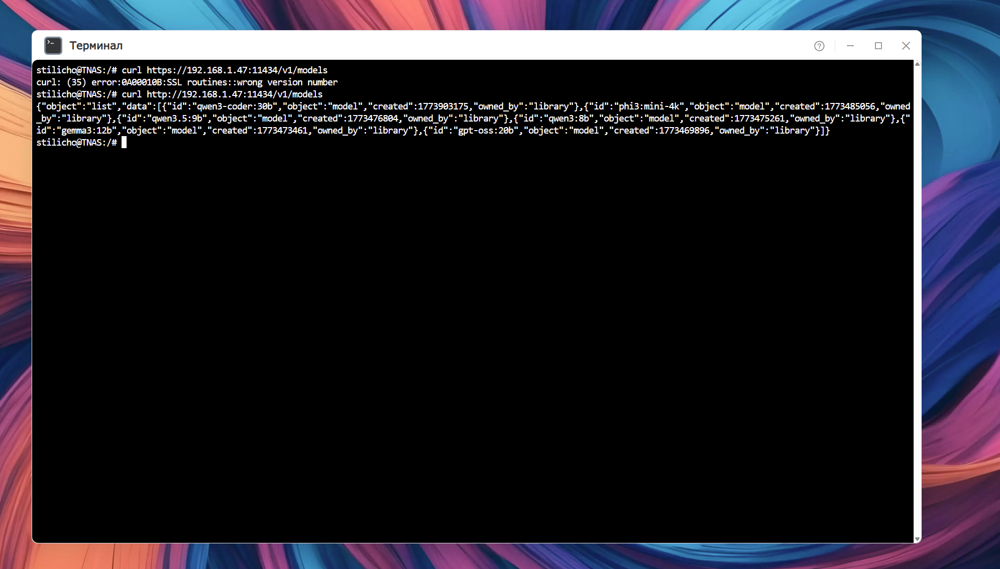

<iframe width="560" height="315" src="https://www.youtube.com/embed/CC-UBgaETj0?si=EqF9tPaS0uMl2its" title="YouTube video player" frameborder="0" allow="accelerometer; autoplay; clipboard-write; encrypted-media; gyroscope; picture-in-picture; web-share" referrerpolicy="strict-origin-when-cross-origin" allowfullscreen></iframe>

## Вступление

Тем, кто смотрел мои старые ролики, могло показаться, что они слышат в моем голосе сарказм и иронию, когда я упоминаю ИИ.

На самом деле вам не показалось. Но моя ирония связана только с тем сумасшествием, которое сопровождает бум ИИ. Полгода назад все сходили с ума по ChatGPT и кричали, что вот оно — будущее.

Прошло полгода. Теперь все кричат, что будущее — это ИИ-агенты, что всех заменят ИИ-агенты, а сотрудники какой-нибудь NVIDIA должны работать сразу с 50 такими агентами. Что делать с предыдущим будущим — непонятно. Но тут главное, чтобы народ был вечно в изумлении, а то люди начнут задавать вопросы, и самопровозглашенным трендсеттерам они точно не понравятся.

Короче, сегодня поговорим о такой хайповой теме, как ИИ-агент OpenClaw. Хотя вру. Не прошло и пару месяцев, как теперь все эякулируют на Hermes, но давайте всё-таки поговорим об OpenClaw.

Щупать этого агента за вымя, вернее, за клешни будем на примере работы в TerraMaster F4-425 Pro, так как, по заявлениям производителя, их новейшая ОС под названием TOS 7 заточена именно под работу с OpenClaw и вообще вся такая передовая и нарядная.

TerraMaster утверждает, что это первый AI Native NAS.
Предполагается следующая схема работы

```text
Пользователь
↓
OpenClaw
↓
LLM
↓
Инструменты NAS
↓
TOS
```

Производитель обещает:

- управление NAS голосом
- автоматизация
- Docker
- виртуальные машины
- Jenkins
- GitLab
- REST API
- более 500 встроенных API
- создание workflow по текстовому описанию

Более подробно можно почитать на официальном сайте - https://www.terra-master.com/pages/tos7

> [!NOTE]
> Обзор на TerraMaster F4-425 Pro я делал в прошлом ролике. Это NAS, и он делает нам всем .... NAS. А главное, что, несмотря на тот факт, что там уже была установлена новая и свежая версия TOS 7, официально вышедшая 23 июня 2026 года, последнее минорное обновление принесло новый дизайн иконок.  UI очень заметно преобразился, но я, правда, не понял такого шага от разработчика. А что мешало сразу так сделать? И это, как я уже сказал, маленькое минорное обновление. Странно, но ок.


## Что такое ИИ-агент OpenClaw

Теперь разберемся, что такое ИИ-агент на примере OpenClaw. Если простыми словами, то именно так, наверное, человек и должен взаимодействовать с ИИ, а не по модели «вопрос — ответ».

OpenClaw — это открытый AI-агент, который работает локально на вашем компьютере и способен не просто отвечать на вопросы, а выполнять реальные действия: управлять файлами, отправлять сообщения и письма, работать с календарем, запускать программы, искать информацию в интернете и взаимодействовать с десятками сервисов через привычные мессенджеры, такие как Telegram, WhatsApp, Discord и Slack (что характерно, ни один из них не работает в России).

В отличие от обычных чат-ботов, OpenClaw получает доступ к инструментам операционной системы и может автоматизировать сложные многошаговые задачи.

Главная особенность OpenClaw — полная открытость и возможность запускать его на собственной инфраструктуре. Пользователь сам выбирает модель искусственного интеллекта, настраивает навыки (Skills), подключает внешние сервисы и контролирует, какие действия агенту разрешено выполнять.

Благодаря этому OpenClaw подходит как для автоматизации повседневных задач, так и для построения персонального AI-ассистента, не зависящего от облачных сервисов и закрытых экосистем.

Но вы должны понимать, что по факту, это как тело без мозгов. То есть ИИ-агент - это тело, поэтому обязательно необходимо подключить к LLM, которая будет выступать в качестве мозга

## Вопросы безопасности работы с OpenClaw

Несмотря на широкие возможности, OpenClaw имеет и серьезный недостаток — для полноценной работы агенту часто требуются расширенные права доступа к системе и подключаемым сервисам. Он может, а в идеале и должен, получать доступ к файлам, выполнять команды, управлять приложениями и взаимодействовать с различными API, поэтому компрометация агента или его неправильная настройка потенциально способны привести к утечке данных или выполнению нежелательных действий.

Именно поэтому при использовании OpenClaw рекомендуется придерживаться принципа минимально необходимых привилегий: запускать его в изолированной среде (докер), как минимум запускать в соответствующем VLAN, выдавать доступ только к тем ресурсам, которые действительно нужны, и внимательно контролировать подключаемые инструменты и разрешения. Такой подход позволяет значительно снизить риски без существенной потери функциональности. 

Ну и нельзя забывать, что в идеальном сценарии он сам думает за вас: что вам надо, что вам не надо, чего вы хотите. И не исключено, что рано или поздно он поймет, что самое слабое звено — это вы.

### Моя конфигурация

Для работы OpenClaw я использую **Ollama**, установленную на **Windows 11 Pro**. Все модели хранятся на отдельном несистемном SSD.

**Конфигурация компьютера:**

- **Операционная система:** Windows 11 Pro
- **Процессор:** AMD Ryzen 5 5600X
- **Оперативная память:** 64 ГБ DDR4 UDIMM ECC Kingston
- **Видеоускоритель:** Intel Arc B580 с 12 ГБ видеопамяти
- **LLM-модель:** Qwen3.5:9B

При использовании данной конфигурации модель показывает следующую производительность:

```
PS C:\WINDOWS\system32> ollama run qwen3.5:9b --verbose
>>> gfhgfghfghghf

---
total duration: 17.4145857s
load duration: 251.4912ms
prompt eval count: 18 token(s)
prompt eval duration: 214.962ms
prompt eval rate: 83.74 tokens/s
eval count: 955 token(s)
eval duration: 16.90268s
eval rate: 56.50 tokens/s
---
```

В моем случае скорость генерации составляет **56,5 токена/с**, чего более чем достаточно для комфортной работы OpenClaw в режиме интерактивного общения.

## Установка OpenClaw в TerraMaster

На самом деле установка агента очень простая, но в моем случае не обошлось без приключений. На этапе установки, когда прогресс доходил до 99%, она сбрасывалась в ноль. Я долго не мог понять, в чем дело, пока мне в голову не пришла шальная мысль пропинговать серверы TerraMaster.

В итоге в соответствующий address list того, чье имя нельзя называть, были внесены четыре адреса:

```yaml
apt.terramaster.net
104.26.2.214
104.26.3.214
172.67.71.137
```

И в следующий раз установка прошла как по маслу.

После того как вы развернули само приложение, я пропинговал свою инстанцию Ollama, потому что именно ее я буду использовать для примеров в этой статье.

```yaml
curl http://айпи_машины_с_развернутой_ollama:11434/v1/models
```

Это нужно для того, чтобы проверить возможность OpenClaw достучаться до Ollama. Если правила firewall у вас настроены правильно, то в результате вы получите список локальных ИИ-моделей, которые уже скачаны.



Теперь, когда мы установили OpenClaw и проверили доступ к локальным ИИ-моделям, переходим к настройке агента.

В дальнейшем, как показала практика, мое железо, а может быть конкретная LLM не очень хорошо взаимодействовала с Opneclaw, но более подробно об этом можно посмотреть в видео по ссылке в начале статьи.
