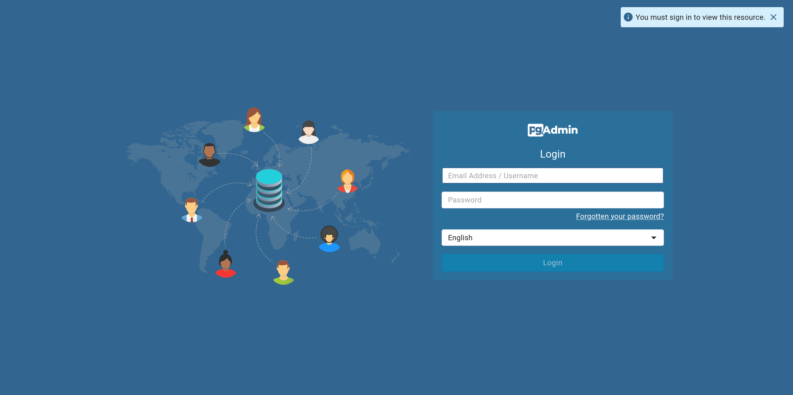
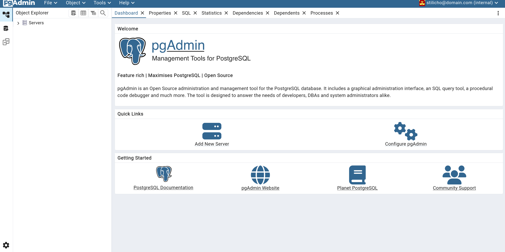
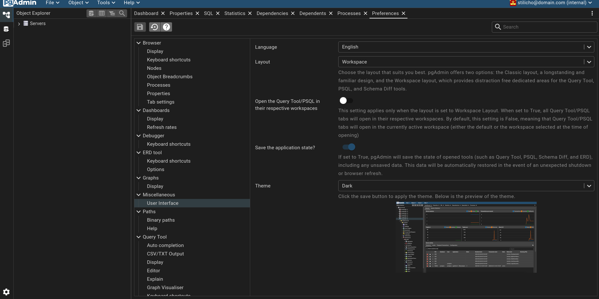
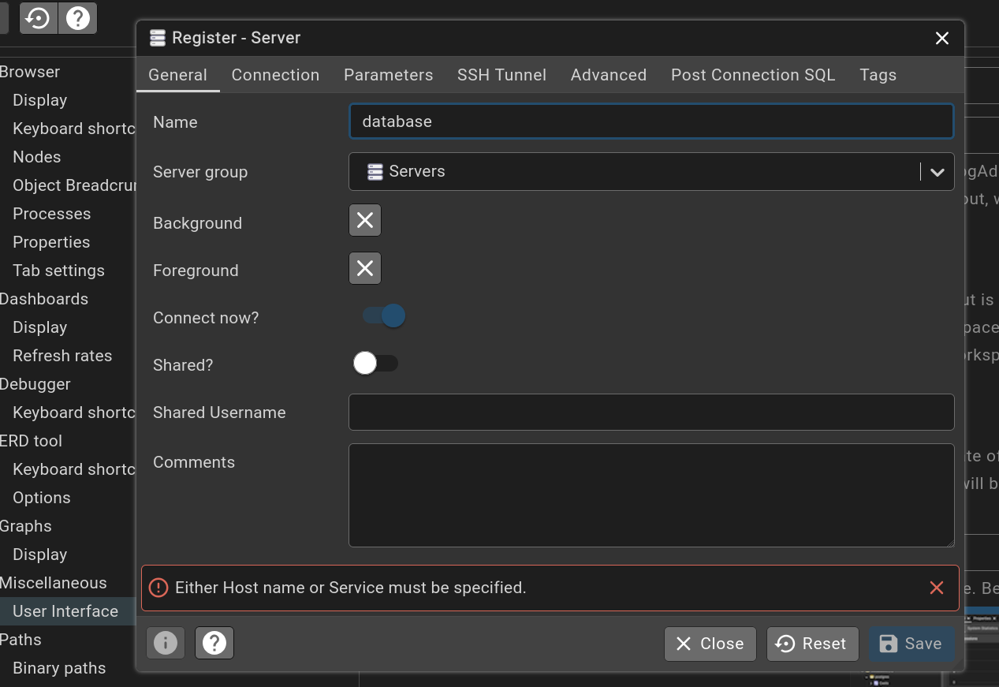
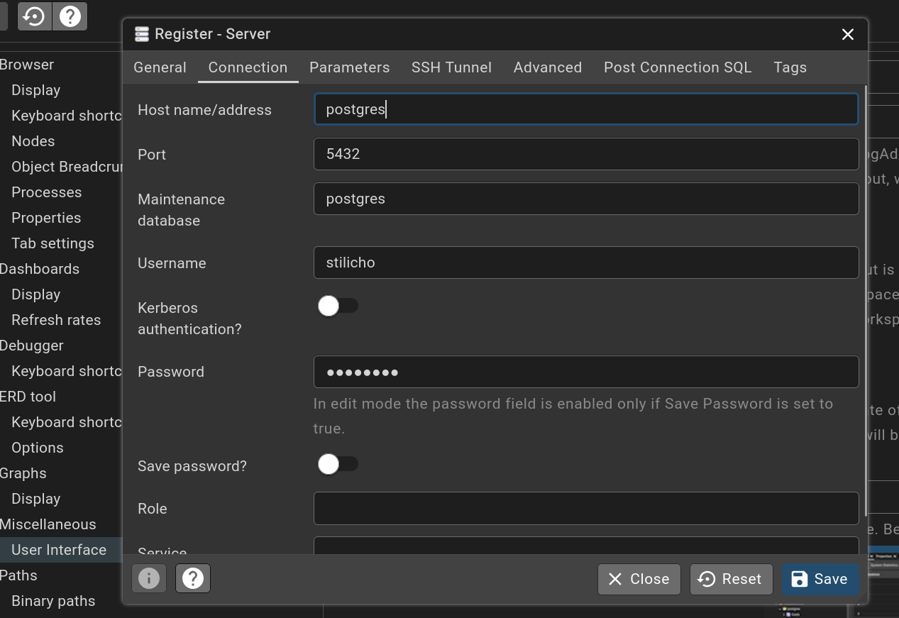
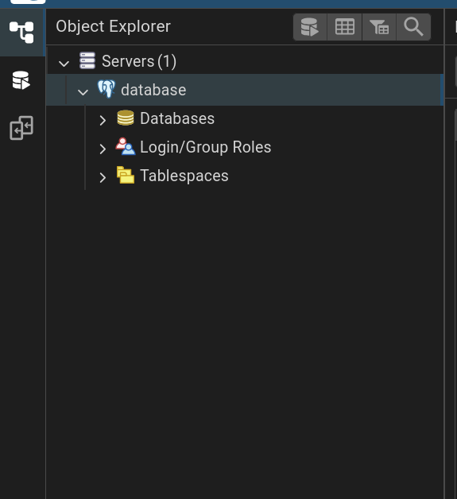

## Введение

<iframe width="100%" height="468" src="https://www.youtube.com/embed/PHCPcWqNztg?si=irsxkO0ico3-PJzS" title="YouTube video player" frameborder="0" allow="accelerometer; autoplay; clipboard-write; encrypted-media; gyroscope; picture-in-picture; web-share" allowfullscreen></iframe>

В своих видео роликах про установку разных сервисов и приложений в домашнем сервере, я часто использую внешние базы данных, в основном базу данных Postgres. В телеграм канале меня как-то спрашивали, почему я не использую одну, единую базу данных для всех сервисов которые ее используют, так как это более логично с точки зрения экономии ресурсов, легче в управлении, а также намного проще бекапить единую базу данных в одном контейнере. Это действительно так. Но в моем случае все достаточно прозаично. Меня смотрят люди с разной степенью подготовки и разным уровнем знаний. Поэтому я обязан упрощать подачу материала, и как вы понимаете, в каждом ролике рассказывать новичкам, что "вот тут у меня есть внешняя база данных, тут мы к ней подключаем контейнер, смотрите другие ролики про работу с внешними базами данных" будет ими справедливо воспринято как издевательство. Но давайте все-таки попробуем **начать** использовать наши ресурсы более правильно и переводить все наши сервисы на единую базу данных **PostgreSQL**, а также установим **pgAdmin** - веб-интерфейс для управления БД. 

> [!WARNING]
>**NB!!!** Я понимаю, что использование БД PostgreSQL для дома это излишне и даже чересчур, но очень многие серьезные приложения ее используют как рекомендованную БД (Nextcloud, Authentik, Linkwarden и т.д.). Поэтому почему бы и нет?


---

> [!NOTE]
>**Disclaimer** В целях упрощения восприятия информации, в данной статье мы только установим БД PostgreSQL, pgAdmin и соединим их. Настройку сторонних контейнеров и их связывание с единой БД **PostgreSQL** рассмотрим в отдельной статье."


## Что такое PostgreSQL

**PostgreSQL** — это мощная объектно-реляционная система управления базами данных (СУБД) с открытым исходным кодом.  
Она отличается высокой надёжностью, гибкостью и расширяемостью, что делает её одной из самых популярных СУБД в мире.

---

###  История

- Проект начался в 1986 году в Калифорнийском университете в Беркли под названием **POSTGRES**.
- В 1996 году к системе добавили поддержку SQL и она получила современное название **PostgreSQL**.
- Сегодня развивается глобальным сообществом разработчиков и активно используется как в стартапах, так и в крупных корпорациях.

---

### Основные особенности PostgreSQL

1. **Полная совместимость с SQL**
   - Поддержка стандартов SQL:2011 и многих расширений.
   - Богатый синтаксис для сложных запросов.

2. **Расширяемость**
   - Возможность добавлять свои типы данных, функции, операторы.
   - Поддержка пользовательских расширений, например PostGIS для работы с геоданными.

3. **Надёжность и отказоустойчивость**
   - Журнал предзаписи (WAL) для защиты от потери данных.
   - Поддержка репликации и кластеризации.

4. **Производительность**
   - Оптимизация запросов с помощью индексов (B-tree, GiST, GIN и др.).
   - Поддержка параллельного выполнения запросов.

5. **Безопасность**
   - Сильная система контроля доступа.
   - Шифрование соединений (SSL/TLS).

6. **Поддержка JSON**
   - Возможность работы как с реляционными, так и с документно-ориентированными данными.

---

### Где используется PostgreSQL

- **Веб-приложения** — бэкенды на Django, Ruby on Rails, Laravel, Spring Boot.
- **Аналитические системы** — BI-платформы, отчётность.
- **Геоинформационные системы** — через расширение PostGIS.
- **Финансовые и банковские системы** — благодаря надёжности и транзакционности.

---

### PostgreSQL в экосистеме разработки

PostgreSQL поддерживает работу:
- На Windows, Linux, macOS и BSD.
- В облачных сервисах (AWS RDS, Google Cloud SQL, Azure Database for PostgreSQL).
- В контейнерах Docker.

---

### Преимущества PostgreSQL

- Бесплатная и с открытым исходным кодом.
- Сообщество активно выпускает обновления и исправления.
- Подходит как для небольших проектов, так и для систем с высокой нагрузкой.

---

### Когда стоит выбрать PostgreSQL

- Если нужна **надёжная и масштабируемая СУБД**.
- Когда важна **совместимость с SQL и расширяемость**.
- Если проект требует **работы с большими объёмами данных** и сложными аналитическими запросами.
- При необходимости **гибридного хранения** — реляционные и JSON-данные в одной базе.

## Что такое pgAdmin

**pgAdmin** — это официальный и наиболее популярный инструмент администрирования базы данных PostgreSQL с графическим веб-интерфейсом.  
Он позволяет работать с PostgreSQL без необходимости постоянно использовать командную строку, что особенно удобно для администраторов, разработчиков и аналитиков данных.

---

### История и назначение

pgAdmin был создан как проект с открытым исходным кодом для упрощения управления PostgreSQL.  
С годами он развился в мощный многофункциональный инструмент, который поддерживает как локальное, так и удалённое администрирование баз данных.

Его основная цель — предоставить удобный способ:
- Создания, редактирования и удаления баз данных, таблиц, функций.
- Выполнения SQL-запросов.
- Мониторинга состояния и производительности PostgreSQL.
- Настройки пользователей, прав доступа и ролей.

---

### Основные возможности pgAdmin

1. **Визуальный интерфейс для администрирования**
   - Создание и управление схемами, таблицами, индексами, представлениями.
   - Лёгкая настройка связей между таблицами.

2. **SQL-редактор**
   - Подсветка синтаксиса.
   - Автодополнение SQL-команд.
   - История выполненных запросов.

3. **Мониторинг и диагностика**
   - Просмотр активных соединений.
   - Анализ выполнения запросов (`EXPLAIN`, `EXPLAIN ANALYZE`).
   - Графики загрузки и использования ресурсов.

4. **Управление пользователями и безопасностью**
   - Создание и настройка ролей.
   - Разграничение прав доступа.
   - Управление политиками безопасности.

5. **Поддержка подключения к удалённым серверам**
   - Можно управлять несколькими PostgreSQL-серверами из одного интерфейса.
   - Работает как с локальной, так и с облачной инфраструктурой.

---

### Архитектура pgAdmin

pgAdmin — это веб-приложение, которое можно запускать:

- **Локально** — на своём компьютере.

- **В серверном режиме** — доступ через браузер из любой точки.

- **В контейнере Docker** — для быстрого развёртывания без установки зависимостей.

**Основные компоненты:**

- **Backend** — на Python (Flask), отвечает за обработку запросов и взаимодействие с PostgreSQL.

- **Frontend** — на JavaScript (React), обеспечивает работу веб-интерфейса.

- **Database Storage** — хранит настройки pgAdmin, список серверов, сессии пользователей.

---

### Почему удобно использовать pgAdmin в Docker

- Быстрый запуск без сложной установки.

- Лёгкое обновление версии (смена тега образа).

- Изоляция окружения — не засоряет основную систему.

- Возможность интеграции с **PostgreSQL** в одном `docker-compose.yml`.

---

### Когда стоит использовать pgAdmin

- Если нужно **администрировать PostgreSQL через удобный веб-интерфейс**.

- Для **визуализации структуры БД** и упрощения навигации.

- При **мониторинге производительности** и анализе запросов.

- Если у вас **несколько PostgreSQL-серверов** и нужно централизованное управление.


## Почему будем устанавливать в Docker

Использование **Docker Compose** позволяет быстро и удобно развернуть эти сервисы, не устанавливая их напрямую на хостовую систему.

В этом руководстве мы создадим `docker-compose.yml` для запуска **PostgreSQL** и **pgAdmin** в отдельных контейнерах. Да, можно установить с помощью единого `docker-compose` файла, но так как мы хотим отделить контейнер с БД от всех остальных контейнеров, то разделим БД и приложение для администрирования.

---

## Требования

Перед началом убедитесь, что у вас установлены:

- [Docker](https://docs.docker.com/get-docker/)

- Идеологически правильно разместить БД не просто в отдельном контейнере, но и вынести ее за пределы рабочей машины. Например разместить ее на NASе. Это не только обезопасит нас от проблем хоста, но и позволит подключать приложения и серверы, которые находятся в локальной сети, но на других машинах. Ко всему прочему, мы без страха можем сносить рабочие машины, потом создавать их с нуля, прописывать путь до нашей БД и все будет работать как ни в чем не бывало.


**NB!!!** Необходимо отметить, что размещение БД на SMB или NFS шарах небезопасно с точки зрения рисков повреждения БД. Идеологически правильно размещать БД на iSCSI-томе. Но в видео в целях упрощения я все делаю в пределах одной и той же виртуальной машины. 


## Создание проекта PostgreSQL


Создаем директорию, где мы разместим нашу БД

```yaml
mkdir postgres
cd postgres
sudo touch docker-compose.yml
```

Теперь давайте создадим простой docker-compose файл для БД

Все переменные я взял с docker hub


```yaml
services:
  postgres:
    image: postgres:16 # выбирайте любую версию, которую считаете нужной, но серьезные приложения пока, по состоянию на август 2025, до сих пор используют 16 версию
    container_name: postgres
    restart: always
    # set shared memory limit when using docker compose
    #shm_size: 128mb
    # or set shared memory limit when deploy via swarm stack
    #volumes:
    #  - type: tmpfs
    #    target: /dev/shm
    #    tmpfs:
    #      size: 134217728 # 128*2^20 bytes = 128Mb
    environment: # задаем минимально необходимые переменные
      - POSTGRES_PASSWORD=password
      - POSTGRES_USER=stilicho
      - POSTGRES_DB=postgres
    ports: # если у вас все контейнеры, которые используют БД, будут находиться в одной докер сети, то порты можно закомментировать. Контейнеры будут общаться по названию контейнеров внутри докера
      - 5432:5432
    volumes:
      - /home/stilicho/docker/postgres/pgdata:/var/lib/postgresql/data # прописываем путь на хосте, где у нас будет храниться БД. 
    networks: # указываем докер сеть, где у нас будет крутиться наша БД. Все контейнеры внутри одной докер сети могут общаться по имени контейнера. 
      database:
    
networks:
    database:
        external: true

```

Создаем новую docker сеть командой

```yaml
docker network create database
```

Теперь запускам наш проект командой `docker compose up -d`.

После того как контейнер будет скачен и запущен мы увидим, что у нас появилась новая папка `pgdata` по пути, который мы прописали в `docker compose` файле. 

Если вы попробуете ее открыть, то никакой информации вы не увидите. Все нормально, это связано с тем, что у пользователя postgres свои права, которые отсутствуют у пользователя из под которого мы работаем в данный момент. Поэтому если вы хотите просто посмотреть, что все в порядке, и внутри папки `pgdata` что-то есть, то используйте команду `sudo cd pgdata && sudo ls`. Когда увидите, что в папке `pgdata` появились какие-то файлы и директории, то там ничего трогать не надо, мы просто проверили, что все хорошо.

## Создание проекта pgAdmin

Создаем директорию, где мы разместим нашу БД

```yaml
mkdir pgadmin
cd pgadmin
sudo touch docker-compose.yml
```

Теперь давайте создадим простой docker-compose файл для pgAdmin

Все переменные я взял с docker hub и с родного сайта разработчика к конкретной версии приложения

```yaml
services:
  pgadmin: 
    image: dpage/pgadmin4:9.6.0 # свежая версия приложения на дату написания статьи
    container_name: pgadmin
    restart: always
    environment: # минимально необходимые переменные для запуска контейнера     
      - PGADMIN_DEFAULT_EMAIL=user@domain.com
      - PGADMIN_DEFAULT_PASSWORD=SuperSecret
    volumes:
      - /home/stilicho/docker/pgadmin/data:/var/lib/pgadmin # путь до папки, где у нас будут храниться все данные приложения
    ports: # порты контейнера. Подумайте о необходимости закрытия портов если будут использовать обратный прокси. Для целей этой статьи я порты не закрываю.
      - 8080:80
    networks: # определяем сети в которых у нас будет работать pgAdmin.
      - proxy # сеть, где у меня работает обратный прокси Traefik
      - database # сеть, где у нас работает наша БД
    labels: # стандартные метки обратного прокси Traefik для контейнера pgAdmin, чтобы мы могли получить доступ к веб панели по поддоменному имени и по защищенному ssl сертификатом соединению
      - "traefik.enable=true"
      - "traefik.http.routers.pgadmin.entrypoints=http"
      - "traefik.http.routers.pgadmin.rule=Host(`pgadmin.доменное_имя.ru`)"
      - "traefik.http.middlewares.pgadmin-https-redirect.redirectscheme.scheme=https"
      - "traefik.http.routers.pgadmin.middlewares=pgadmin-https-redirect"
      - "traefik.http.routers.pgadmin-secure.entrypoints=https"
      - "traefik.http.routers.pgadmin-secure.rule=Host(`pgadmin.доменное_имя.ru`)"
      - "traefik.http.routers.pgadmin-secure.tls=true"
      - "traefik.http.routers.pgadmin-secure.service=pgadmin"
      - "traefik.http.services.pgadmin.loadbalancer.server.port=80"
      - "traefik.docker.network=proxy"

networks:
    database:
        external: true
    proxy:
        external: true
```

Но прежде чем запускать контейнер, мы должны руками создать директорию в которой у нас будут храниться все данные **pgAdmin** и задать на нее соответствующие права. **Это обязательное условие**.

Задаем права простой командой 

```yaml
sudo chown -R 5050:5050 <host_directory>` # userid и groupid взяты из официальной документации.
```

Теперь можем запускать `docker compose` файл с pgAdmin

```yaml
docker compose up -d
```

Контейнер достаточно быстро скачается и запустится.

Теперь в зависимости от того, как вы запускаете свой контейнер, вы можете получить доступ к контейнеру по вашему айпи_адресу:8080 или, в моем случае, по поддоменному имени `pgadmin.доменное_имя.ru`

Попадаем в окошко приветствия  




Вводим наши логин и пароль, которые мы задали в `docker compose` файле

Попадаем в стандартное окно приветствия **pgAdmin**




Так как статья уже получилась очень длинная, то давайте закругляться с первоначальными настройками и поэтому сделаем две обязательные вещи.

Установим темный режим

Идем в раздел Files>Preferences>Micsellaneous>User Interface и выбираем темную тему.



Теперь, когда с визуальными эффектами покончено, давайте подключимся к нашей базе данных

Кликаем правой кнопкой мыши на раздел `servers` в проводнике pgAdmin. Выбираем меню `register`, дальше жмем `Server`.

В появившемся окне во вкладке `General` задаем имя нашему серверу



Переходим во вкладку connections и задаем адрес по которому доступна наша база данных. Если он у вас в одной докер сети, то будет достаточно названия контейнера, докер дальше сам применит всю свою магию.

В разделе логин уже указан ваш логин, который pgAdmin взял из данных, которые в указали `docker compose` файле, а в разделе пароль, вам нужно указать пароль от базы данных, который указан в `docker compose` файле к БД



Можете передвинуть рычажок save password, чтобы не вводить его каждый раз. 

Теперь, если у вас все порядке, то в разделе сервера мы с вами увидим нашу базу данных **Postgres**



Мы имеем полный доступ к нашей базе данных и готовы разворачивать наши сервисы, которые будет использовать единую базу данных. Но это уже тема отдельной статьи.

Если вам понравилась это статья, вы нашли ее полезной, то вы можете стать спонсором на boosty по ссылке в контактах.