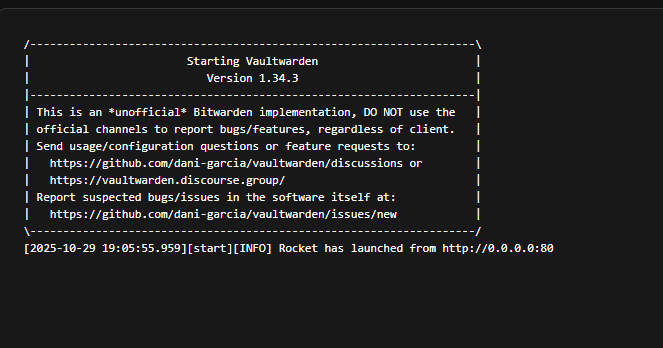
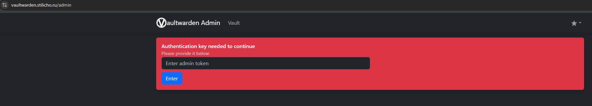
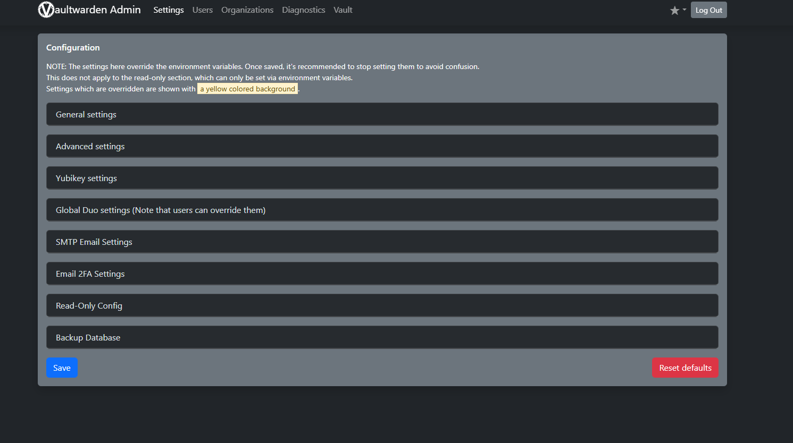
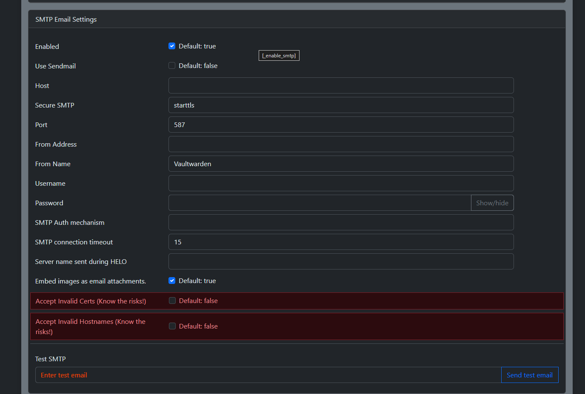
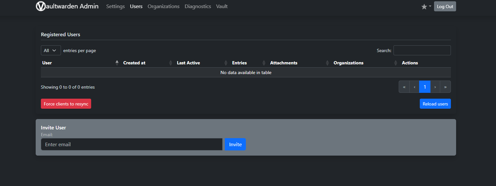
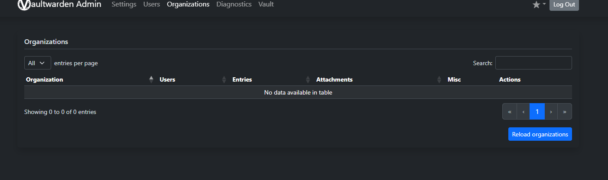
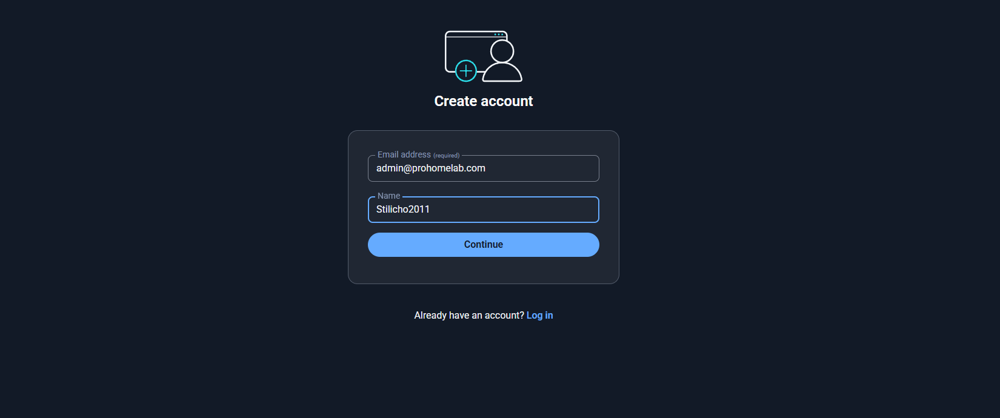
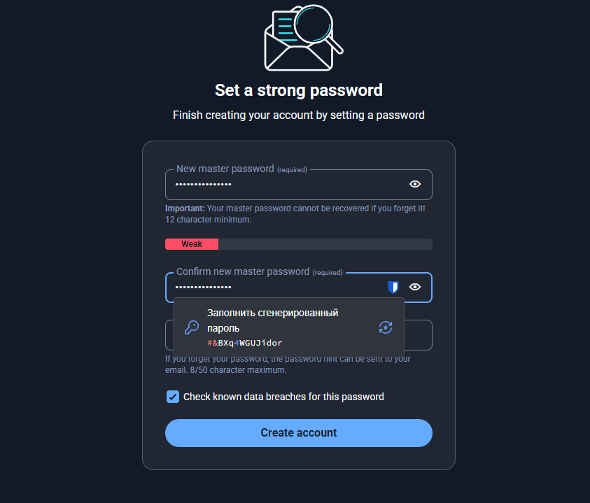
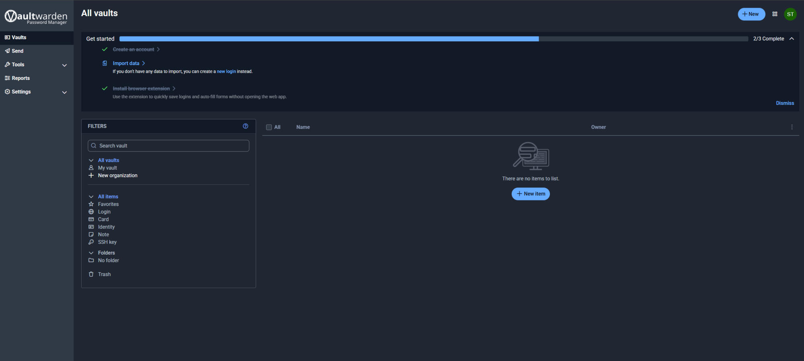

# Vaultwarden
## Установка **Vaultwarden**

<iframe width="100%" height="468" src="https://www.youtube.com/embed/zJhB5p6Xrt0?si=_S8wmgm5nRQzWCdk" title="YouTube video player" frameborder="0" allow="accelerometer; autoplay; clipboard-write; encrypted-media; gyroscope; picture-in-picture; web-share" allowfullscreen></iframe>

### Что такое менеджер паролей — кратко

Менеджер паролей — это приложение, которое безопасно хранит ваши логины, пароли, заметки и другие секреты в зашифрованной форме и помогает автоматически подставлять данные при входе в сайты/приложения. Преимущества: сильные уникальные пароли для каждого сервиса, генерация случайных паролей, синхронизация между устройствами, централизованное хранилище паролей и ssh-ключей, а также история изменений.

### Что такое Vaultwarden

**Vaultwarden** — это лёгкая, быстрая и совместимая с Bitwarden реализация сервера (написана на Rust), которая реализует API Bitwarden и позволяет использовать официальные клиенты Bitwarden (браузерные расширения, мобильные/десктоп приложения) с вашим собственным сервером. **Vaultwarden** ориентирован на self-host развёртывание (контейнеры, Docker Compose, Kubernetes и т. п.). 
### Почему self-hosted (почему имеет смысл самостоятельно развернуть приложение у себя)

Коротко — ключевые преимущества self-hosted Vaultwarden:

*   **Контроль над данными**: база и резервные копии находятся под вашим контролем, не в облаке третьих лиц.
*   **Конфиденциальность**: отсутствие передачи метаданных/бэкап-копий на внешние сервисы. Вы контролируете ваши данные.
*   **Гибкость и интеграция**: можно подключить LDAP/SMTP/внешнюю БД, настроить резервные копии, использовать свой TLS (reverse proxy) и т.д.
*   **Экономия и простота**: Vaultwarden легче и дешевле по ресурсам, чем upstream Bitwarden Server. 
    
    **Минусы/риски**: вы сами отвечаете за безопасность (обновления, TLS, бэкапы, настройка брандмауэра).

### Короткий план развертывания (что сделаем)

1.  Скачиваем/сами составляем `docker-compose.yml`.
2.  Создаём папку для данных и задаём на нее права.
3.  Запускаем `docker compose up -d`.
4.  Настраиваем reverse-proxy (обязательно) и TLS (Let's Encrypt / SWAG / Traefik). Без ssl сертификата приложение нормально не функционирует.
5.  Настраиваем `ADMIN_TOKEN`, выключаем свободную регистрацию пользователей(если нужно), делаем бэкапы.

### Полный `docker-compose.yml` (пример готового файла)

Вариант docker compose файла, который я использую у себя, с учетом, что я пользователь обратного прокси **Traefik**

```yaml

services:
  vaultwarden:  # Определение сервиса Vaultwarden — основного контейнера менеджера паролей.
    container_name: vaultwarden  # Имя контейнера в Docker — удобно для команд и логов.
    image: vaultwarden/server:latest  # Используем официальный образ Vaultwarden с Docker Hub (написан на Rust).
    restart: unless-stopped  # Контейнер будет автоматически перезапущен, если упадёт, но не после ручной остановки.
    
    volumes:
      - /path/to/bind/mount/:/data/  # Монтируем локальную директорию на хосте в /data контейнера.
                                                   # Здесь хранятся база данных, вложения и конфигурация Vaultwarden.

    environment:
      - SIGNUPS_ALLOWED=false        # Запрещаем регистрацию новых пользователей (false) — повышает безопасность.
      #- ADMIN_TOKEN=token           # Токен для панели администратора /admin. Закомментирован, чтобы не хранить в открытом виде.
      - WEBSOCKET_ENABLED=true       # Включаем WebSocket — клиенты Bitwarden смогут мгновенно получать обновления.
      - DOMAIN=https://vaultwarden.domain.ru  # Указываем домен — нужен для правильных ссылок (например, сброс пароля).
      - TZ=Europe/Moscow             # Задаём часовой пояс — корректное время в логах и уведомлениях.

    networks:
      - proxy                        # Подключаем контейнер к внешней сети Traefik'а, чтобы прокси мог его обнаружить.

    labels:
      - "traefik.enable=true"  # Разрешаем Traefik обрабатывать этот контейнер.

      # --- HTTP → HTTPS редирект ---
      - "traefik.http.routers.vaultwarden.entrypoints=web"  # Указываем входную точку HTTP (порт 80).
      - "traefik.http.routers.vaultwarden.rule=Host(`vaultwarden.domain.ru`)"  # Доменное имя для HTTP.
      - "traefik.http.middlewares.vaultwarden-https-redirect.redirectscheme.scheme=https"  # Определяем middleware для редиректа на HTTPS.
      - "traefik.http.routers.vaultwarden.middlewares=vaultwarden-https-redirect"  # Применяем редирект к HTTP-трафику.

      # --- HTTPS (secure) ---
      - "traefik.http.routers.vaultwarden-secure.entrypoints=websecure"  # Используем точку входа HTTPS (порт 443).
      - "traefik.http.routers.vaultwarden-secure.rule=Host(`vaultwarden.domain.ru`)"  # Доменное имя для HTTPS.
      - "traefik.http.routers.vaultwarden-secure.tls=true"  # Включаем TLS (Traefik автоматически получит сертификат Let's Encrypt).
      - "traefik.http.routers.vaultwarden-secure.service=vaultwarden"  # Привязываем HTTPS-маршрут к сервису Vaultwarden.
      # - "traefik.http.routers.vaultwarden-secure.middlewares=authentik@file"  # Подключаем middleware Authentik для дополнительной авторизации (если настроено в Traefik).
      
      # --- Backend настройки ---
      - "traefik.http.services.vaultwarden.loadbalancer.server.port=80"  # Порт внутри контейнера, на котором слушает Vaultwarden.
      - "traefik.docker.network=proxy"  # Указываем, какую сеть использовать для связи Traefik ↔ Vaultwarden.

    security_opt:
      - no-new-privileges:true  # Безопасный режим: контейнер не сможет повысить свои привилегии внутри системы.

networks:
  proxy:
    external: true  # Используем внешнюю сеть Docker, которую уже использует Traefik.


```

#### Примечания к docker compose файлу

*   `- ADMIN_TOKEN=replace_with_a_strong_token_here`  
    `ADMIN_TOKEN` — токен, позволяющий зайти в административную панель (`/admin`). Если он не задан, админ-панель недоступна. Обязательно сгенерируйте длинную случайную строку и храните её в секрете. Безопасно: не храните в публичных репозиториях. 
*   `- SIGNUPS_ALLOWED=false`  
    Разрешать ли регистрацию новых аккаунтов через веб-интерфейс. Рекомендуется `false`, если вы делаете сервер доступным извне и хотите контролировать пользователей. Если `true` — любой сможет зарегистрироваться, если порт открыт.
*   `- WEBSOCKET_ENABLED=true`  
    Включает поддержку WebSocket для синхронизации клиентов (например, чтобы изменения мгновенно синхронизировались между расширениями и приложениями). Для некоторых конфигураций (reverse-proxy) может потребоваться дополнительно проксировать websocket соединения. Есть нюансы с активацией через `.env` vs `config.json` в старых версиях — но обычно `WEBSOCKET_ENABLED=true` работает. 

### Дополнительные практические советы

1.  **Обязательно используйте reverse-proxy + TLS.** Web-vault (браузерная версия) требует защищённого контекста для Web Crypto API, поэтому либо используйте `https`. Рекомендуется ставить Vaultwarden за SWAG/NPM/Traefik и получать Let's Encrypt сертификат автоматически. 
2.  **Бэкапы.** Бэкапите папку `./vw-data` регулярно. Для SQLite — просто копирование файла `db.sqlite3` (или ручная дамп-команда) плюс backup attachments. Многие используют ежедневные cron-job’ы или внешние скрипты.
3.  **Обновления.** В production указывайте конкретный тег образа и обновляйте контролируемо (`docker compose pull && docker compose up -d`). Следите за релизами на GitHub/Docker Hub. 
4.  **Admin Panel.** После установки доступ к административной панели даёт `https://your-domain/admin` — нужен `ADMIN_TOKEN`. Будьте аккуратны: админ-панель позволяет управлять пользователями. 
5.  **Использование внешней БД.** Для большого количества пользователей или корпоративного использования рекомендуется PostgreSQL (через `DATABASE_URL`), а не SQLite. 
6.  **Нюансы с WebSocket.** Если используете прокси — проверьте, что прокси проксирует WebSocket (прокси должен поддерживать `Upgrade: websocket` и проксировать соответствующие заголовки). 

### Шифрование ADMIN\_TOKEN

Как вы понимаете, по умолчанию мы с вами можем просто сгенерировать случайный, но сложный токен в любом генераторе паролей и указать его в строке `ADMIN_TOKEN`, но так как это будет в простом текстовом формате, то **Vaultwarden** на данный факт ругаться как в логах, так и в админ панели. Да и действительно - это небезопасно, даже если мы простой и никому неинтересный домашний пользователь. Чтобы сделать все по всем правилам куртуазного искусства, нам нужно захэшировать наш токен. 

В wiki **Vaultwarden**  есть подробные и четкие инструкции. [Хэшируем пароль](https://github.com/dani-garcia/vaultwarden/wiki/Enabling-admin-page#secure-the-admin_token)

Я буду использовать простую команду

`echo -n "MySecretPassword" | argon2 "$(openssl rand -base64 32)" -e -id -k 19456 -t 2 -p 1 | sed 's#\$#\$\$#g'`

В данном случае я хэширую значение _MySecretPassword,_ которое указано внутри кавычек. Получившееся значение вставляем в наш docker-compose файл в графу `ADMIN_TOKEN` и теперь контейнер можно запускать командой:

```yaml
docker compose up -d
```

## Первый вход в панель администратора

После того как наш контейнер запустится, можем посмотреть его логи, например с помощью **Portainer.**



У меня все порядке и приложение не ругается, так как значения нашего токена надежно захэшированы. В противном случае вы бы увидели предупреждение, что ваш токен указан в простом текстовом формате и это небезопасно. Хотя и на работоспособность приложения это никак не влияет.

Чтобы зайти в панель администратора вводим в адресную строку браузуера адрес **Vaultwarden** и обязательно в конце указываем **/admin**




Для подтверждения что мы это мы вводим наш пароль администратора и попадаем в панель

После входа выбери вкладку **General settings** — это центральный раздел конфигурации



В самом верху нас ждет напоминание, что любые значения, которые мы вносим в настройках администратора перезаписывают значения переменных, которые указаны в docker compose файле (например, данные нашего почтового сервера) или в настройках самого приложения. При этом нам говорят, что значения которые будут перезаписаны выделены желтым. 

Все настройки администратора очень обширные, их слишком много и не все они критически важные. Ниже я привожу описание основных настроек как я себе это представляю.

### Раздел “General settings” — подробный обзор

#### **Domain**

*   **Описание:** Основной домен, по которому доступен Vaultwarden.
*   **Пример:** `https://vaultwarden.stilicho.ru`
*   **Назначение:**  
    Используется в ссылках (например, для приглашений, сброса пароля и email-уведомлений).  
    **Важно:** если поменяешь домен — обнови и `WEBSOCKET_ADDRESS`.

* * *

#### **WebSocket Address**

*   **Описание:** Адрес WebSocket для синхронизации клиентов Bitwarden.
*   **Пример:** `wss://vault.stilicho.ru/notifications/hub`
*   **Назначение:**  
    Обеспечивает мгновенную синхронизацию (например, если добавлен новый пароль с другого устройства).
*   **Примечание:** Если используешь **Traefik** или другой прокси, важно пробросить `/notifications/hub`.

* * *

#### **Web Vault Enabled**

*   **Описание:** Включает или отключает веб-интерфейс хранилища (https://vaultwarden/ui).
*   **По умолчанию:** ✅ Включено.
*   **Зачем выключать:** Если хочешь использовать Vaultwarden **только через Bitwarden Desktop/Mobile** клиенты.

* * *

#### **User Registration (** Allow new signups**)**

*   **Описание:** Разрешить ли новым пользователям самостоятельно регистрироваться.
*   **Переменная окружения:** `SIGNUPS_ALLOWED`
*   **Варианты:**
    *   ✅ **True** — любой может зарегистрироваться.
    *   🚫 **False** — регистрацию можно проводить только вручную (например, админ создаёт пользователей через `/admin` или SQL).
*   **Совет:** при публичном сервере лучше выключить.

* * *

#### **Invitation (**Allow invitations**)**

*   **Описание:** Разрешает приглашение пользователей организациями.
*   **Переменная:** `INVITATIONS_ALLOWED`
*   **Рекомендация:**  
    Оставь включённым, если используешь **Organizations**, иначе никто не сможет присоединиться.

* * *

#### **SMTP Enabled**

*   **Описание:** Включает поддержку электронной почты для уведомлений, подтверждений, приглашений и т.д.
*   **Переменные:** `SMTP_*`
*   **Рекомендация:**  
    Настрой SMTP перед созданием организаций или сбросом паролей.

* * *

#### **E-mail Domain Whitelist**

*   **Описание:** Список разрешённых доменов e-mail для регистрации.
*   **Пример:** `stilicho.ru,prohomelab.com`
*   **Назначение:**  
    Полезно, если ты хочешь ограничить регистрацию корпоративными доменами.

* * *

#### Require email verification on signups

*   **Описание:** Требовать подтверждения почты при регистрации.
*   **Переменная:** `INVITATION_ORG_NAME` (для сообщений)
*   **Рекомендация:** включить при включённом SMTP.

* * *

#### Allow password hints

*   **Описание:** Разрешить пользователям оставлять “подсказку” к мастер-паролю.
*   **Рекомендация:** можно отключить, чтобы не давать злоумышленнику подсказки.

* * *

#### **YubiKey OTPs Enabled**

*   **Описание:** Включить поддержку аппаратных ключей **YubiKey** (2FA).
*   **Переменные:** `YUBICO_CLIENT_ID`, `YUBICO_SECRET_KEY`
*   **Назначение:** двухфакторная аутентификация через одноразовые коды.

* * *

#### **WebSocket Notifications Enabled**

*   **Описание:** Разрешить систему уведомлений в реальном времени (через WebSocket).
*   **Примечание:** требует корректно настроенный обратный прокси. [Websocket Docs](https://github.com/dani-garcia/vaultwarden/wiki/Enabling-WebSocket-notifications)

#### **Admin Token**

*   **Описание:** Показывает текущий токен входа в админ-панель.
*   **Изменить можно только через ENV:**

```yaml
-e ADMIN_TOKEN='newsecret'

```

#### Disable Two-Factor remember

*   **Описание:** Запрещает пользователям сохранять сессию после прохождения 2FA.
*   **Рекомендация:** включить на публичных серверах для повышения безопасности.

> [!IMPORTANT]
> Один из самых важных разделов это настройки почты в разделе **SMTP EMAIL SETTINGS**




Так как в будущем мы будем или захотим приглашать (простую регистрацию мы не разрешили) пользователей, будь то члены вашей семьи или сотрудники вашей фирмы, то эти настройки очень важны.

Остальные настройки уже по вашему желанию, но, как я уже сказал, я бы отключил простую неконтролируемую регистрацию в приложении. Отключение регистрации не влияет на возможность отправлять и регистрироваться по приглашениям.

### Раздел **Users** — полное описание

Вся таблица “Users” показывает список всех пользователей хранилища, их статус, уровень подтверждения и активность.

В разделе **Users** мы можем управлять нашими пользователями и направлять им приглашения.




### Что такое **Organization**

**Organization** — это "организация" или, проще говоря, **группа пользователей**, которые могут совместно использовать определённые записи (логины, пароли, безопасные заметки и т.п.).

Это аналог корпоративного или семейного хранилища в Bitwarden Cloud.

В разделе Organizations мы можем создавать организации. 




* * *

#### Основная идея

*   У вас есть **личный "всё мое" сейф**, видимый только вам.
*   Но в рамках **Organization** вы можете **создавать общие коллекции**, например:
    *   “DevOps” — для паролей CI/CD, SSH-ключей, токенов API
    *   “Маркетинг” — для доступа к соцсетям и рекламным кабинетам
    *   “Семья” — для совместных подписок (Netflix, Spotify и т.п.)

* * *

#### Как это работает

1.  **Администратор** создаёт организацию (например, “ProHomelab”).
2.  Добавляет участников по e-mail (требуется, чтобы у них уже была учётка на этом же сервере Vaultwarden).
3.  Создаёт **Collections** (категории для общих данных).
4.  Назначает, кто имеет доступ к каждой коллекции (чтение, запись, администрирование).
5.  Пользователи получают эти записи в своём клиенте Bitwarden (веб, десктоп, мобильный и т.д.).

* * *

#### Пример структуры

```yaml
Organization: ProHomelab
 ├── Collection: Infrastructure
 │    ├── Proxmox login
 │    ├── Traefik dashboard
 │    └── Grafana API key
 ├── Collection: Media
 │    ├── Jellyfin admin
 │    └── Audiobookshelf credentials

```

* * *

#### Типы ролей

*   **Owner** — полный контроль над организацией.
*   **Admin** — управление пользователями и коллекциями.
*   **Manager** — управляет только своими коллекциями.
*   **User** — может пользоваться выданным доступом, но не управлять структурой.

* * *

#### Важные детали:

*   Organizations **не обязательны**, если вы используете Vaultwarden только для личного пользования.
*   Чтобы использовать их, необходимо **включить регистрацию пользователей и подтверждение e-mail**.
*   Можно создать **несколько организаций** на одном сервере Vaultwarden.
*   Поддерживаются **личные ключи шифрования**, т.е. админ не видит содержимое паролей участников.

С настройками в панели администратора наконец-то закончили, давайте уже зарегистрируемся в приложении

## Регистрация первого пользователя в приложении 

Для первоначальной регистрации пользователя переходим по адресу нашего **Vaultwarden,** в моем случае **vaultwarden.stilicho.ru**




Выбираем **Create Account**


Указываем нашу почту и nickname

> [!WARNING]
> Для регистрации самого первого пользователя у вас должна быть разрешена простая регистрация. В противном случае вы не сможете создать аккаунт администратора. После создания первого пользователя простую регистрацию можно отключить.



По умолчанию пароль должен быть не меньше 12 знаков, Vaultwarden проверяет его на сложность (в моем случае у меня пароль хоть и длинный, но слабый). Также приложения предлагает нам проверить его на наличие утечек. Попросту говоря, может я придумал простой пароль, который кто-то уже использовал и он был в свое время скомпрометирован.

После этого мы с вами попадаем в наше хранилище



Как вы видите в самом верху нам подсказывают какие три шага мы должны сделать. В моем случае я создал аккаунт и уже установил расширение для браузера. Теперь нам предлагают импортировать данные из других менеджеров паролей. Как экспортировать данные из вашего старого менеджера паролей надо читать документацию конкретного приложения, но общий принцип везде одинаковый. После этого вам нужно будет просто импортировать файлик в **Vaultwarden**. 

## Пользовательские настройки (User Settings)

Теперь разберём **пользовательские настройки (User Settings)** — то есть то, что видит **обычный пользователь Vaultwarden** после входа в **веб-интерфейс (Web Vault)**, по адресу:

```yaml
https://vaultwarden.<твой-домен>.ru
```

Разберём **раздел “Vaults”** в **Vaultwarden** — это как раз _сердце всей системы_, где хранятся и управляются твои пароли, токены, заметки и другие секреты.

💡 Чтобы не путать:

*   **“Vaults”** — это личное хранилище (и общие через Organizations).
*   **“Settings”** — настройки поведения хранилища.
*   **“Admin Panel”** (`/admin`) — серверные параметры.

* * *

#### Раздел **Vaults** (или просто “My Vault”)

Путь:

`Web Vault → Vault (по умолчанию открывается после входа) vaultwarden.<твой-домен>.ru`

Это основной интерфейс пользователя, где видны все его записи.

* * *

### Основная структура

В верхней части интерфейса есть фильтры и вкладки, а в основной области — список (или карточки) записей.

Вот как она устроена 👇

* * *

#### 1. **Items (элементы хранилища)**

Каждая запись называется **Item**.  
Они могут быть одного из следующих **типов**:

| Тип | Назначение | Пример |
| --- | --- | --- |
| **Login** | Логин + пароль + URL | Сайт GitHub, SSH панель, Grafana |
| **Card** | Данные банковской карты | Visa, MasterCard |
| **Identity** | Личные данные | ФИО, адрес, email |
| **Secure Note** | Произвольный текст | SSH ключ, токен API, конфиг |

Каждый элемент содержит:

*   имя (Name)
*   тип
*   поля (username, password, URL и пр.)
*   при желании: TOTP (одноразовый код), вложения, заметки
*   привязку к **Organization** и **Collection**, если есть общие записи

* * *

#### 2. **Collections**

Если ты участвуешь в **Organization**, то в левой панели появится список **Collections** — это общие папки, в которых лежат записи, доступные группе пользователей.

> Пример:
> 
> *   _DevOps Collection_: пароли от Prometheus, Grafana
> *   _Media Collection_: доступы к Jellyfin и Audiobookshelf

Без организации эти секции не отображаются.

* * *

#### 3. **Навигационные вкладки**

Верхняя панель обычно включает:

| Вкладка | Назначение |
| --- | --- |
| **All Items** | Все записи, личные и общие |
| **Favorites** | Отмеченные “звёздочкой” элементы |
| **Folders** | Личные папки (не общие, только для структуры пользователя) |
| **Trash** | Удалённые записи, которые можно восстановить |
| **Organizations** | Доступ к общим хранилищам, если ты в них участвуешь |

* * *

#### 4. **Добавление новых записей**

Кнопка **“+New Item”** открывает форму создания записи.

Поля зависят от выбранного типа (Login, Card, Note и т.п.).  
Также доступны:

*   “Generate password” — встроенный генератор паролей
*   “Add TOTP” — добавление одноразового 2FA-кода
*   “Attach file” — добавить вложение (если включено в Vaultwarden `.env` → `ENABLE_ATTACHMENTS=true`)

* * *

#### 5. **Поиск и фильтрация**

В верхней строке можно искать по:

*   названию
*   имени пользователя
*   домену
*   заметкам  
    (поиск выполняется локально — данные не передаются серверу в открытом виде)

Также есть фильтры:

*   по типу элемента
*   по организации / коллекции
*   по меткам (“favorites”, “recent”)

* * *

#### 6. **Папки (Folders)**

*   Это **личная логическая структура**, не связанная с организациями.
*   Помогает группировать записи по темам (например, “Работа”, “Дом”, “Проекты”).
*   Создаются и редактируются вручную.
*   Данные в папке не передаются другим пользователям, даже если у них та же организация.

* * *

#### 7. **Trash (Корзина)**

*   Удалённые записи не исчезают сразу — попадают сюда.
*   Можно **восстановить** или **удалить навсегда**.
*   Vaultwarden хранит их в зашифрованном виде до очистки корзины.

* * *

#### 8. **Context menu (контекстное меню записи)**

При нажатии на запись появляются действия:

*   View (просмотр)
*   Edit (редактировать)
*   Clone (клонировать)
*   Move to Folder / Collection
*   Add Favorite
*   Delete

* * *

#### 9. **Password Generator**

Доступен прямо из Vault:

*   Генерация пароля нужной длины и сложности
*   Опции: буквы, цифры, символы, исключить похожие знаки и т.д.
*   Можно скопировать и вставить в новый элемент

* * *

## Итого

| Раздел / Элемент | Назначение |
| --- | --- |
| **All Items** | Все записи пользователя |
| **Folders** | Личные категории |
| **Collections** | Общие категории (в организациях) |
| **Trash** | Корзина |
| **Add Item** | Добавление логина / заметки / карты |
| **Search** | Поиск по Vault |
| **Password Generator** | Создание надёжных паролей |

К сожалению в одной статье невозможно описать все возможности это замечательного приложения, поэтому более подробно обо всех настройках Vaultwarden вы можете почитать в официальной документации приложения.