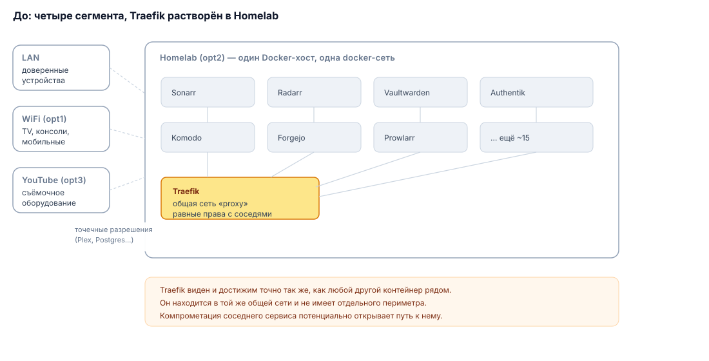
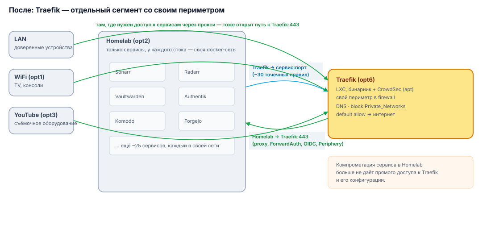

> [!NOTE]
> Все имена хостов, VLAN и прочее носят условные названия для целей написания настоящей статьи

Раньше Traefik у меня жил вперемешку со всеми остальными сервисами — контейнером на том же Docker-хосте (условно назовём его Homelab), в той же сети, что и десятки других стэков. Все работало, но с точки зрения безопасности так себе решение: обратный прокси, через который проходит весь внешний трафик и вся аутентификация, ничем не отличался по правам доступа от любого другого контейнера рядом с ним (ко всему прочему большинство контейнеров ещё и в одной docker-сети). Скомпрометируй любой из соседних сервисов — и злоумышленник в одном шаге от единственной точки входа во всю инфраструктуру.

Ко всему прочему сегментация получалась частичной между VLAN, так как надо было выпускать SSL-сертификаты на сервисы в других VLAN. Ломалась сама логика сегментации сети — вроде она, эта ваша сегментация, есть, а вроде и не совсем.

Так как я решил вынести Traefik физически в отдельный LXC-контейнер (о чём можно почитать [здесь](https://prohomelab.com/posts/traefik-in-lxc-part-1/), [здесь](https://prohomelab.com/posts/traefik-in-lxc-part-2/) и [здесь](https://prohomelab.com/posts/traefik-in-lxc-part-3/)), то был создан отдельный VLAN и свой собственный периметр в firewall. Заодно вынужденно пересобрал docker-сети и сделал полный аудит правил в OPNsense. Что, забегая вперёд, пошло только на пользу, так как в процессе пересборки сети и контейнеров были выловлены ряд косяков, один из которых был крайне существенным. Признаюсь честно, причиной этого существенного косяка была банальная опечатка, но в случае предметной атаки на мою сеть её последствия могли быть катастрофическими (я не параноик и своё место в истории понимаю, но не вижу смысла игнорировать банальные принципы построения безопасной сети). Ниже — подробное сравнение того, что было и что стало, и почему именно так.

## Было: четыре сегмента, Traefik растворён в одном из них

До переезда Traefik в отдельный LXC-контейнер в OPNsense было четыре VLAN:

| Сегмент | Что там жило |
| --- | --- |
| LAN | доверенные устройства, админский доступ |
| WiFi (opt1) | бытовые устройства, TV, консоли, мобильные устройства |
| Homelab (opt2) | Docker-хосты со всеми стэками, включая сам Traefik на одном из докер-хостов |
| YouTube (opt3) | для опытов со съёмками видео для YouTube |

Никакого выделенного правила именно под reverse-proxy не было — Traefik сидел контейнером в общей docker-сети на Homelab вместе со всем остальным (плюс отдельная сеть `proxy`, в которую были включены и он, и бэкенды). Firewall-правила сегмента Homelab были написаны в терминах «что Homelab может достать снаружи» (Plex, Postgres, ollama), а не в терминах «кто может достучаться до Traefik и на каких условиях» — потому что такого вопроса просто не стояло: всё было рядом, в одной сети.



## Стало: Traefik — отдельный VLAN со своим набором правил

Добавил пятый сегмент — **opt6** (не опечатка в нумерации, есть ещё пара opt-интерфейсов, они неважны для статьи) — только для Traefik и его CrowdSec. Сам Traefik теперь не контейнер, а нативный бинарник (v3.7.0 на дату написания статьи) в LXC на Debian 13, CrowdSec — тоже не в Docker, а через `apt`, с собственным LAPI и bouncer-плагином, подключённым как experimental plugin в статическом конфиге Traefik. Получилось два независимых экземпляра CrowdSec в инфраструктуре — один плагином прямо в OPNsense, второй — при Traefik.

LXC закрыл по минимуму: SSH только по ключу, никаких лишних сервисов на хосте. Порт 22 (пока) не менял. Пока не вижу смысла заводить отдельного юзера для traefik.

Базовые правила на opt6 — по той же схеме, что и на остальных сегментах: разрешить внутренний DNS, дать точечные VPN-исключения там, где они нужны, заблокировать доступ ко всем остальным приватным сетям и только после этого — дефолтный allow в интернет.

Но главное отличие не в этой стандартной схеме, а в том, что добавилось между её шагами: набор точечных правил `Traefik → Homelab:порт_сервиса`, по одному на каждый проксируемый сервис, а не одно общее «Traefik видит весь Homelab». Из старого конфига в новом появилось порядка пятидесяти таких правил — например:

```
Traefik -> Homelab:Mealie
Traefik -> Homelab:Audiobookshelf
Traefik -> Homelab:Vaultwarden
Traefik -> Homelab:Authentik
```

и так далее, по одному правилу на каждый сервис, стоящий за прокси.

Раньше, когда Traefik физически был соседом этих контейнеров на одном хосте, такая детализация была не нужна — трафик между ними даже не доходил до firewall, он оставался внутри docker-bridge. Теперь, когда Traefik ушёл на отдельный VLAN, каждое взаимодействие стало пересекать границу сегментов — и firewall наконец увидел (и смог ограничить) то, что раньше было полностью невидимым для него.

Отдельно осталось одно отключённое правило-заготовка — «Traefik → Homelab без ограничения по порту». Оно выключено, но само его наличие стоит держать под контролем: включать его стоит разве что «на скорую руку» при отладке — и не забывать выключать обратно. Зачем собственно говоря оно у меня и есть



## Порт 443 в обратную сторону — не опция, а обязательное условие

Отдельно стоит сказать про направление **из** остальных VLAN **к** Traefik — это симметрично важная часть схемы, и без неё вся конструкция не работает. Совсем не работает.  Причина достаточно проста: все сервисы у меня имеют SSL-сертификат и общаются по доменным именам.

Через Traefik:443 проходит:

- вся внешняя маршрутизация запросов к сервисам (обычный reverse-proxy трафик);
- ForwardAuth-проверка через Authentik для любого защищённого ресурса — браузер стучится на сервис, Traefik форвардит запрос в Authentik за решением «пускать/не пускать», и весь этот цикл идёт через тот же 443;
- OIDC-аутентификация для сервисов, использующих Authentik как провайдера;
- WSS-соединение Periphery-агентов Komodo с Core — домен `komodo.твойдомен.ru` резолвится именно в Traefik, и агент инициирует исходящее соединение туда.

Поэтому в правилах сегмента Homelab явно прописаны направленные разрешения на 443 порт Traefik — как для самого Homelab, так и для других хостов, которым нужен доступ к сервисам через прокси. Без этого сервисы просто не могу общаться по доменным именам.

Это не заплатка на возникшую проблему, а прямое следствие того, что Traefik теперь единая точка входа для всего: и для людей, и для сервисов, и для служебных агентов. **Любой VLAN, откуда должен идти запрос к чему-либо через прокси или через Authentik, обязан иметь этот путь открытым** — без доступа к 443 разом отваливаются внешняя маршрутизация, вся аутентификация и связь с Periphery-агентами Komodo и аналогичных сервисов (Portainer, Dozzle, Arcane или Dockhand), потому что это на самом деле один и тот же путь трафика, а не три разных. При проектировании любого нового сегмента этот путь нужно закладывать сразу, а не дожидаться, пока что-то перестанет работать.

## Docker-сети: тот же принцип, но внутри одного хоста

В дополнение к описанным правилам firewall, я пересмотрел и сетевую модель на уровне самого Docker. Раньше все стэки на Homelab жили в одной общей docker-сети вместе с Traefik — контейнер одного стэка теоретически мог достучаться до контейнера совсем другого стэка через общий bridge (если он был), и правила firewall тут были бессмысленны, потому что трафик даже не покидал хост.

Теперь у каждого стэка — своя изолированная docker-сеть, а общую сеть `proxy`, где раньше сидел реверс-прокси, я отключил: она стала не нужна с тех пор, как Traefik переехал из Docker в LXC и начал ходить к бэкендам не по внутреннему docker-имени, а по IP:порту хоста через firewall — точно так же, как и всё остальное между VLAN. Тот же принцип «точечный доступ вместо общей сети», который применили на уровне VLAN, теперь применяется и на уровне docker-хоста.

## Зачем вообще делать аудит правил, если «и так работает»

Когда экспортировал текущие правила и построчно сравнил со старым конфигом, вылезло несколько вещей, которые в потоке ежедневной работы просто не были бы замечены:

- самый главный косяк я описать не могу. Не потому что это военная тайна, а потому что стыдно. В описании одного из самых важных правил была допущена досадная описка (даже не опечатка), что фактически приводило к неработающей сегментации.  
- часть добавленных правил была скопирована под новые нужды, но описания за ними я не обновил — например, правила доступа к `Traefik:https` подписаны как «Allow access to Traefik ping port», хотя к ping-порту (8083) отношения не имеют. Функционально это ничего не ломает, но при следующем аудите легко прочитать неверное описание и сделать неправильный вывод о том, что вообще разрешено. Все переписал;
- отключённое правило-заготовка на opt6 (см. выше) — зафиксированно отдельно, чтобы не забыть, что оно там есть, но в итоге, уже в процессе написания настоящей статьи, принято решение его просто удалить;
- ограничил доступ к NAS только портами 445 (протокол smb) и 2049 (протокол nfs)
- сравнение «было / стало» чётко показало, какие правила — прямое следствие переезда Traefik (весь блок opt6 и связанные с ним `:https`-разрешения), а какие — унаследованный от старой схемы технический долг, который стоит почистить отдельно.

Ничего из этого не было бы заметно, если бы я просто проверил «работает — не работает» и на этом остановился. Ради этого аудит и делается: не чтобы найти одну большую ошибку, а чтобы систематически вычистить мелкие несостыковки, которые накапливаются при любой миграции.

## Итоги

- Traefik и CrowdSec — в отдельном LXC на своём VLAN, без лишних соседей
- Межсегментный доступ к бэкендам — точечный, по конкретным портам под каждый сервис (~50 отдельных правил вместо одного общего)
- Доступ **из** остальных VLAN **к** Traefik:443 — обязательное условие: через него идёт вся внешняя маршрутизация, ForwardAuth, OIDC и связь с Periphery-агентами Komodo одновременно
- Docker-сети разделены по стэкам, общая сеть под reverse-proxy убрана как избыточная
- Аудит правил «до/после» оказался полезен сам по себе — как способ систематически найти накопившиеся неточности в конфигурации, которые иначе остались бы незамеченными

Если планируете похожий переезд — сначала выпишите все скрытые зависимости через прокси (не только «браузер открывает сайт», но и служебные соединения — агенты, вебхуки, auth-редиректы), и заложите доступ к 443 в обе стороны сразу, а не по факту поломки. И не пожалейте времени на построчное сравнение конфигурации до и после — почти наверняка найдётся что почистить.