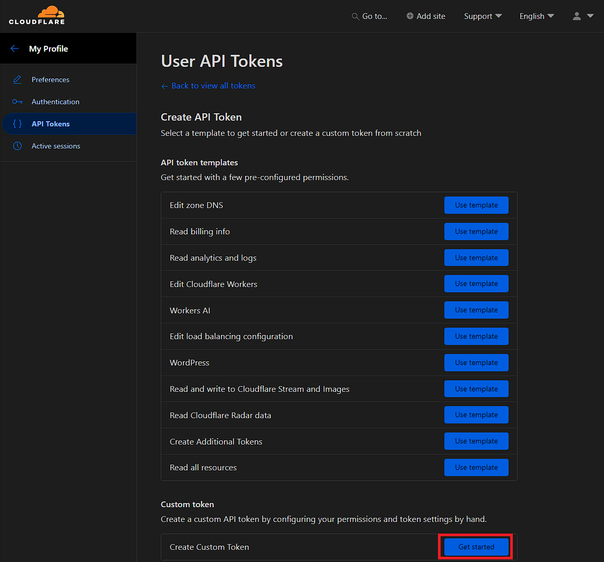
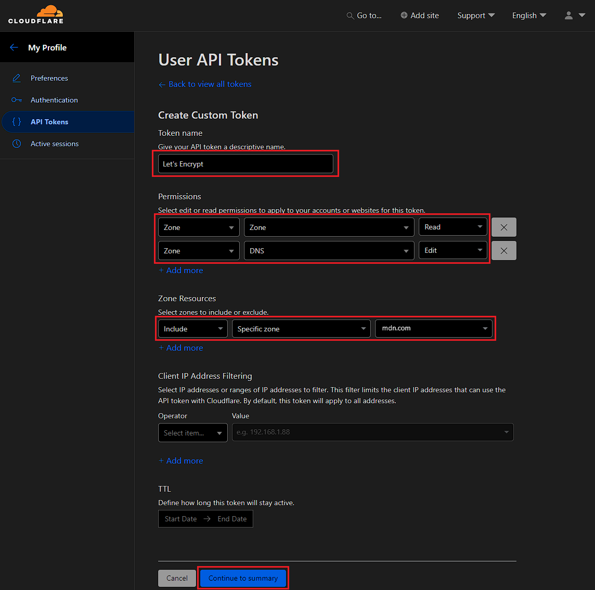

## Введение

В [первой части](https://prohomelab.com/posts/traefik-in-lxc-part-1/) мы подготовили LXC-контейнер, поставили Traefik как бинарник и запустили его в тестовом режиме — с открытым dashboard и DEBUG-логами, только чтобы убедиться, что всё в принципе стартует. Как вы наверно поняли, конкретно в моем случае, речь идет о переезда рабочего конфига, а не о создании с нуля, поэтому часть статьи написана с учетом данной специфики.

С тех пор проделана основная часть работы: финальный static config, TLS-сертификаты, ротация логов и полная раскладка dynamic config по файлам — включая перенос десятка сервисов, которые раньше маршрутизировались через Docker labels, а не через Traefik file provider.

<iframe width="100%" height="468" src="https://www.youtube.com/embed/7bCy7bdjjmA?si=f7bwUxrVR87Jm8L9" title="YouTube video player" frameborder="0" allow="accelerometer; autoplay; clipboard-write; encrypted-media; gyroscope; picture-in-picture; web-share" allowfullscreen></iframe>

Сам по себе переезд на новый хост закономерно потребовал построчно пройтись по всей конфигурации — и по сути превратился в полноценный аудит. В процессе всплыло немало интересного: и про сам Traefik, и про то, как были устроены отдельные сервисы вокруг него. Но давайте обо всем по порядку.

---

## Получение API-токена Cloudflare

Прежде чем собирать финальный static config, нужен API-токен Cloudflare — он понадобится для DNS-01 challenge при выпуске сертификатов (в том числе wildcard, без необходимости открывать порт 80 наружу под HTTP-01).

Конечно не обязательно пользоваться Cloudflare, можно использовать любого днс-провайдера, с которым работает [DNS Providers :: ACME client and library written in Go.](https://go-acme.github.io/lego/dns/index.html)

Переходим в профиль Cloudflare, в раздел создания токенов.


Выбираем создание кастомного токена — не готовый шаблон, чтобы ограничить права минимально необходимым набором, а не выдавать токену больше, чем реально нужно.



Указываем права: Zone → DNS → Edit, и по возможности ограничиваем токен конкретной зоной (доменом), а не всеми зонами аккаунта сразу — так при компрометации токена ущерб ограничен одним доменом.



Создаём токен.


Значение токена показывается только один раз — сохраните его сразу в менеджере паролей. Посмотреть его повторно через интерфейс Cloudflare не получится, только пересоздать заново.


Список уже созданных токенов доступен там же, на странице токенов.


Этот токен и есть значение `CF_DNS_API_TOKEN`, которое пойдёт в `traefik.env` — подробнее в разделе про TLS ниже.

---

## Финальный static config

Отличия от тестового варианта из части 1:

```yaml
global:                             # Глобальные настройки Traefik.
  checkNewVersion: true             # При запуске Traefik проверяет, вышла ли новая версия.
  sendAnonymousUsage: true          # Отправляет анонимную телеметрию разработчикам Traefik.                              # Никакие конфигурации или домены не передаются.
  # Можно отключить, если принципиально не используете телеметрию.
api:                                 # Настройки встроенного API и веб-интерфейса.
  dashboard: true                   # Включает Dashboard для просмотра роутеров,                                    # сервисов, middleware и состояния Traefik.
  debug: true                       # Разрешает расширенную диагностическую информацию API.     # Безопасно, если Dashboard защищён авторизацией                                  # и не опубликован в Интернет без защиты.
entryPoints:                        # Точки входа — порты, на которых слушает Traefik.
  web:                              # HTTP (порт 80).
    address: ":80"                  # Прослушивать все интерфейсы на TCP-порту 80.
    forwardedHeaders:               # Настройки доверенных X-Forwarded-* заголовков.
      trustedIPs: &trustedIps       # YAML-якорь. Позже этот список будет повторно использован
                                     # для HTTPS без дублирования.
        # Cloudflare public IP list
        - 103.21.244.0/22           # Разрешить доверять X-Forwarded-* только запросам,
                                     # пришедшим с IP Cloudflare.
        # ... остальные диапазоны Cloudflare
    http:                           # Настройки HTTP для данного entryPoint.
      encodedCharacters:            # Разрешить некоторые URL в закодированном виде.
        allowEncodedSlash: true     # Не декодировать "%2F" в "/".
                                     # Нужно некоторым приложениям и API.
        allowEncodedHash: true      # Не декодировать "%23" в "#".
                                     # Иногда требуется REST API и WebDAV.
      middlewares:                  # Middleware, применяемые ко всем HTTP-запросам.
        # - crowdsec@file           # После установки CrowdSec можно включить
                                     # глобальную защиту от известных атакующих IP.
        - rate-limit@file           # Ограничение количества запросов.
                                     # Защищает от простого флуда и перебора.
      redirections:                 # Правила автоматических перенаправлений.
        entryPoint:                 # Перенаправление между entryPoint.
          to: websecure             # Все HTTP-запросы отправлять на HTTPS.
          scheme: https             # Использовать HTTPS.
  websecure:                        # HTTPS (порт 443).
    address: ":443"                 # Прослушивать TCP-порт 443.
    forwardedHeaders:
      trustedIPs: *trustedIps       # Использовать тот же список доверенных IP,
                                     # который объявлен выше.
    http:
      encodedCharacters:
        allowEncodedSlash: true     # Аналогично HTTP.
        allowEncodedHash: true      # Аналогично HTTP.
      middlewares:
        # - crowdsec@file
        - rate-limit@file           # Ограничение запросов также работает и по HTTPS.
    transport:                      # Таймауты обработки соединений.
      respondingTimeouts:
        readTimeout: 600s           # Максимальное время чтения запроса клиента.
                                     # Полезно для больших загрузок.
        writeTimeout: 600s          # Максимальное время отправки ответа.
        idleTimeout: 600s           # Через сколько закрывать неактивное соединение.
  metrics:                          # Отдельный entryPoint для Prometheus.
    address: ":8082"                # Метрики доступны только на порту 8082.
metrics:                            # Настройки экспорта метрик.
  prometheus:                       # Использовать формат Prometheus.
    entryPoint: metrics             # Отдавать метрики через entryPoint metrics.
    addEntryPointsLabels: true      # Добавлять метку entryPoint в метрики.
    addServicesLabels: true         # Добавлять имя backend-сервиса.
    addRoutersLabels: true          # Добавлять имя router.
    buckets:                        # Границы гистограмм времени ответа.
      - 0.1                         # До 100 мс.
      - 0.3                         # До 300 мс.
      - 1.2                         # До 1.2 секунды.
      - 5.0                         # До 5 секунд.
serversTransport:                   # Настройки подключения Traefik к backend.
  insecureSkipVerify: false         # Проверять TLS-сертификаты backend.
                                     # Это правильное значение.
                                     # Для отдельных сервисов можно создать
                                     # собственный ServersTransport.
providers:                          # Источники конфигурации.
  file:                             # Использовать файловый provider.
    directory: /etc/traefik/dynamic # Каталог с динамической конфигурацией.
    watch: true                     # Автоматически применять изменения без перезапуска.
certificatesResolvers:              # Настройки получения сертификатов.
  cloudflare:                       # Имя resolver.
    acme:                           # Использовать ACME (Let's Encrypt).
      email: email@email.com        # Email владельца сертификатов.
      storage: /etc/traefik/acme.json            # Где хранить сертификаты и аккаунт ACME.
      dnsChallenge:                 # Подтверждение владения доменом через DNS.
        provider: cloudflare        # Использовать Cloudflare API.
        resolvers:                  # DNS-серверы, через которые проверяется TXT-запись.
          - "1.1.1.1:53"
          - "1.0.0.1:53"
log:                                 # Основной журнал Traefik.
  level: "INFO"                     # Уровень логирования.
                                     # DEBUG полезен только при поиске проблем.
  filePath: "/var/log/traefik/traefik.log"
                                     # Путь к файлу логов.
  format: "common"                  # Классический текстовый формат.
  maxSize: 100                      # Ротация после достижения 100 МБ.
  maxBackups: 0                     # Хранить все архивы.
  maxAge: 0                         # Не удалять старые архивы по возрасту.
  compress: true                    # Сжимать старые файлы логов.
accessLog:                          # Журнал всех HTTP-запросов.
  filePath: "/var/log/traefik/access.log"
  format: json                      # JSON удобно анализировать через Loki,
                                     # Elasticsearch и Grafana.
  addInternals: true                # Логировать внутренние сервисы Traefik
                                     # (Dashboard, Ping и т.п.).
  filters:                          # Фильтрация записей.
    statusCodes:
      - "204-299"                   # Логировать успешные ответы.
      - "400-599"                   # Логировать ошибки клиента и сервера.
  fields:
    headers:
      defaultMode: drop             # По умолчанию не сохранять HTTP-заголовки.
      names:
        User-Agent: keep            # Оставить только User-Agent.
experimental:                       # Экспериментальные возможности.
  plugins:                          # Подключение сторонних плагинов.
    bouncer:                        # CrowdSec Bouncer.
      moduleName: github.com/maxlerebourg/crowdsec-bouncer-traefik-plugin
                                     # GitHub-модуль плагина.
      version: v1.7.1               # Фиксированная версия.
    traefikwarp:                    # Плагин интеграции с Cloudflare WARP.
      moduleName: github.com/l4rm4nd/traefik-warp
      version: v1.1.5
tls:                                 # Глобальные настройки TLS.
  options:
    default:                        # Настройки по умолчанию для всех HTTPS-соединений.
      sniStrict: true                # Запрещать TLS-соединение без корректного SNI.
                                     # Повышает безопасность.
      minVersion: VersionTLS12      # Минимально допустимая версия TLS.
                                     # TLS 1.0 и 1.1 полностью запрещаются.
      cipherSuites:                 # Разрешённые шифры (используются только TLS 1.2).
                                     # Для TLS 1.3 список игнорируется,
                                     # так как он фиксирован стандартом.
        - TLS_ECDHE_ECDSA_WITH_AES_128_GCM_SHA256
        - TLS_ECDHE_RSA_WITH_AES_128_GCM_SHA256
        - TLS_ECDHE_ECDSA_WITH_AES_256_GCM_SHA384
        - TLS_ECDHE_RSA_WITH_AES_256_GCM_SHA384
        - TLS_ECDHE_ECDSA_WITH_CHACHA20_POLY1305
        - TLS_ECDHE_RSA_WITH_CHACHA20_POLY1305
```

Главное, что поменялось относительно тестового конфига из [первой части](https://prohomelab.com/posts/traefik-in-lxc-part-1/):

- `providers.docker` убран полностью — цель всего переезда как раз в отвязке от Docker и любого другого бекэнда в принципе;
- `api.insecure` больше не используется — dashboard защищён отдельным роутером с Basic Auth (см. раздел ниже), а не голым портом 8080;
- `log.level` вернул на `INFO` — DEBUG был нужен только для первого теста.

### Про `api.debug: true`

Оставил осознанно. Это включает pprof-эндпоинты рядом с dashboard — сам по себе некритично, если роутер к `api@internal` защищён аутентификацией (Basic Auth или Authentik), что у меня и сделано.

### Про `allowEncodedSlash`/`allowEncodedHash`

Не убирал, хотя формально это дублирует дефолтное поведение Traefik. У этих флагов нестабильная история между релизами v3 — дефолт менялся туда-обратно между минорными версиями, менялся разработчиками молча, что приводило к неработоспособным приложениям, типа Matrix или Trilium. Явная фиксация в конфиге страхует от неожиданностей при обновлении бинарника.

---

## TLS: один wildcard-сертификат вместо кучи отдельных

Вместо того чтобы прописывать `certResolver` в каждом сервисном роутере отдельно, вынес это в отдельный файл `dynamic/tls.yaml`:

```bash
nano /etc/traefik/dynamic/tls.yml
```

```yaml
tls:
  stores:
    default:
      defaultGeneratedCert:
        resolver: cloudflare
        domain:
          main: domain.ru
          sans:
            - "*.domain.ru"
```

`defaultGeneratedCert` задаёт сертификат по умолчанию для **всего** Traefik. Любой роутер с `tls: {}` (без явных `domains`/`certResolver`) автоматически получает этот wildcard-сертификат по SNI — не нужно дублировать резолвер в каждом из полутора десятков сервисных файлов.

Токен Cloudflare, полученный в самом начале статьи, для DNS-01 challenge вынесен из static config в отдельный `EnvironmentFile`:

```bash
sudo touch /etc/traefik/traefik.env
sudo chmod 600 /etc/traefik/traefik.env
```

```bash
# /etc/traefik/traefik.env, права 600
CF_DNS_API_TOKEN=ваш_токен
```

и подключён в systemd-юните через `EnvironmentFile=` — подробнее в разделе про юнит ниже.

---

## Dashboard: защита через Basic Auth

Раз `api.insecure` больше не используется, доступ к dashboard идёт через обычный роутер — точно так же, как к любому проксируемому сервису, только с обязательным middleware аутентификации на нём.

Хеш пароля генерируется через `htpasswd` (пакет `apache2-utils`, который ставили ещё в части 1):

```bash
htpasswd -nB admin
```

Флаг `-n` выводит результат сразу в консоль, не записывая в файл; `-B` — использовать bcrypt. Отдельно подчеркну: **не используйте** `openssl passwd -1` — это устаревший MD5-based хеш, который слабее криптографически и не рекомендуется для новых конфигураций.

Middleware:

```yaml
http:
  middlewares:
    auth:
      basicAuth:
        users:
          - "admin:$2y$05$..."   # хеш из htpasswd -nB
        realm: "Restricted"
```

Роутер для dashboard подключает этот middleware и указывает специальный зарезервированный сервис `api@internal` — под этим именем сам Traefik публикует собственный dashboard и API, отдельного блока `services:` для него заводить не нужно:

```yaml
http:
  routers:
    dashboard:
      entryPoints:
        - websecure
      rule: "Host(`traefik.domain.ru`)"
      service: api@internal
      middlewares:
        - auth
      tls: {}
```

`tls: {}` без явного `certResolver` — раз уже настроен wildcard-сертификат через `defaultGeneratedCert` (см. раздел про TLS выше), поддомен dashboard попадает под него автоматически, отдельно прописывать резолвер не нужно.

---

## Ротация логов

Отдельный и очень важный момент, связанный с логами, а вернее с их размером: параметры `maxSize`/`maxBackups`/`maxAge`/`compress` в static config относятся **только** к `log:` (сам `traefik.log`). Для `accessLog:` встроенной ротации не существует вообще — Traefik умеет только переоткрыть файл по сигналу `USR1`, ротацией должен заниматься внешний `logrotate`.

Поэтому, чтобы избежать разрастания `access.log` до сотен мегабайт, я сделал следующее:

```bash
nano /etc/logrotate.d/traefik-access
```

```conf
# /etc/logrotate.d/traefik-access
# Правила автоматической ротации access.log Traefik.
/var/log/traefik/access.log {
    daily                   # Проверять необходимость ротации ежедневно.
    size 20M                # Выполнить ротацию, если размер файла достиг 20 МБ.
                             # При использовании вместе с daily ротация произойдёт,
                             # когда выполнится хотя бы одно из условий
                             # (прошёл день или превышен размер).
    rotate 14               # Хранить 14 архивов логов, затем удалять самые старые.
    compress                # Архивировать старые логи с помощью gzip.
    delaycompress           # Самый свежий архив не сжимать до следующей ротации.
                             # Полезно, если приложение ещё некоторое время
                             # может держать файл открытым.
    missingok               # Не считать ошибкой отсутствие файла логов.
    notifempty               # Не выполнять ротацию, если файл пустой.
    postrotate               # Команды, выполняемые после завершения ротации.
        systemctl kill -s USR1 traefik.service
                             # Отправить Traefik сигнал USR1.
                             # Traefik закроет старый файл журнала и
                             # откроет новый без перезапуска сервиса.
    endscript                # Конец блока postrotate.
}
```

`traefik.log` при этом продолжает ротироваться встроенным механизмом из static config — два независимых механизма для двух разных файлов, каждый под свою задачу.

---

## Структура dynamic config

Раскладка по каталогам:

```
/etc/traefik/dynamic/
├── middlewares/
│   ├── auth.yaml
│   ├── authentik-forwardauth.yaml
│   ├── default-headers.yaml
│   ├── https-redirect.yaml
│   ├── ipAllowList.yaml
│   ├── middlewares-buffering.yaml
│   ├── nextcloud-secure-headers.yaml
│   ├── onlyoffice-middleware.yaml
│   ├── rate-limit.yaml
│   ├── secure-headers.yaml
│   └── ... (библиотека остальных middleware Traefik про запас)
├── services/
│   ├── dashboard.yaml
│   ├── nextcloud.yaml
│   ├── onlyoffice.yaml
│   ├── authentik.yaml
│   ├── homepage.yaml
│   ├── plex.yaml
│   ├── jellyfin.yaml
│   └── ... (по одному файлу на сервис)
├── serverstransports.yaml
└── tls.yaml
```

Один файл — один сервис или один middleware. Наименование файла сразу говорит, что внутри — не нужно открывать, чтобы понять назначение. Ко всему прочему, если всё описывать в одном файле, получится огромный по объёму YAML, и воспринимать информацию будет очень сложно.

Соответственно для создания middleware для базовой аутентификации, указанной выше, создаем командой

```bash
nano /etc/traefik/dynamic/middlewares/auth.yaml
```

Динамическую конфигурацию для dashboard создаем командой

```bash
nano /etc/traefik/dynamic/services/dashboard.yaml
```


### Библиотека middleware про запас

Помимо тех, что реально используются, завёл файлы для всех middleware из [официального списка Traefik OSS](https://doc.traefik.io/traefik/reference/routing-configuration/http/middlewares/overview/), которых ещё не было в структуре: `AddPrefix`, `Chain`, `CircuitBreaker`, `Compress`, `ContentType`, `DigestAuth`, `Errors`, `GrpcWeb`, `InFlightReq`, `PassTLSClientCert`, `ReplacePath(Regex)`, `Retry`, `StripPrefix(Regex)`. Не все подключены к реальным роутерам — часть лежит как готовый шаблон на случай, если понадобится (например, `InFlightReq` пригодится для Jellyfin/Immich при транскодировании, `IPAllowList` — если когда-нибудь понадобится ограничить доступ к части сервисов по IP).
Но у меня на сайте еще будет отдельная статья, посвященная механизму middlewares в Traefik. 

---

## Перенос сервисов с Docker labels на file provider

Больше десятка сервисов (OnlyOffice, Authentik, Audiobookshelf, Dozzle, Forgejo, Komodo, Gotify, Linkwarden, Mealie, Navidrome, весь *arr-стек, Portainer, Trilium, Uptime Kuma, TubeArchivist) до этого маршрутизировались напрямую через Docker labels на самих контейнерах. При переносе в file provider аудит каждого конфига по пути показал несколько вещей, которые стоит упомянуть отдельно — часть из них годами работала незаметно именно потому, что Docker резолвит container name как DNS сам.

### Docker labels — не все они складываются, а перезаписываются

Самая неочевидная находка аудита: если один и тот же лейбл (например, `traefik.http.routers.X.middlewares`) объявлен на контейнере несколько раз с разными значениями — Traefik использует **последнее** объявление, предыдущие тихо отбрасываются. У одного из моих сервисов (а точнее у OnlyOffice) таких дублей было три подряд — реально применялось только последнее, а два предыдущих просто ни на что не влияли, никак не сигнализируя об этом, и я жил в неведении.

### Docker DNS-имена не резолвятся вне Docker-сети

Очевидная на бумаге вещь, но про которую очень легко забыть: адреса вида `http://authentik_server:9000` или `crowdsec:8080` работают только внутри одной и той же Docker-сети. При переезде Traefik в LXC все такие адреса пришлось заменить на реальные IP Docker-хоста — включая переменные окружения самих приложений (например, `TRUSTEDREVERSEPROXY`/whitelist-параметры у Trilium и Navidrome, которые доверяют заголовкам от конкретной подсети).

### OIDC-клиент vs forwardAuth — не путать

В стеке оказалось два разных паттерна аутентификации через Authentik, и важно не смешивать их:

- **forwardAuth middleware на Traefik** — нужен приложениям, которые сами не умеют в OIDC (Dozzle, Navidrome, весь *arr-стек, Uptime Kuma). Traefik перехватывает запрос до приложения и проверяет сессию через Authentik.
- **Встроенный OIDC-клиент в самом приложении** — Gotify, Mealie, Trilium, Vaultwarden, Komodo умеют говорить с Authentik напрямую как Identity Provider. Здесь `authentik@file` middleware на Traefik не нужен и был бы избыточен — приложение уже требует логин само.

---

## Финальный systemd-юнит

В принципе начальная настройка обратного прокси завершена. Однако осталось сделать ещё одну вещь — превратить наш обратный прокси в полноценный сервис, чтобы можно было использовать обычные команды `systemctl`.

```bash
nano /etc/systemd/system/traefik.service
```

```ini
# /etc/systemd/system/traefik.service
# systemd unit для запуска Traefik как системного сервиса.
[Unit]
Description=Traefik Reverse Proxy
# Краткое описание сервиса, отображается в systemctl status.
Documentation=https://doc.traefik.io
# Ссылка на официальную документацию Traefik.
After=network-online.target
# Запускать Traefik только после того, как сеть будет полностью поднята.
# Это особенно важно при использовании DNS Challenge и удалённых backend.
Wants=network-online.target
# При запуске Traefik также попытаться активировать network-online.target.
# В отличие от Requires, не считается ошибкой, если цель не будет достигнута.
[Service]
Type=simple
# Traefik работает как обычный процесс на переднем плане.
# systemd считает сервис запущенным сразу после старта процесса.
EnvironmentFile=/etc/traefik/traefik.env
# Загружает переменные окружения из файла.
# Обычно здесь хранятся секреты, например токен Cloudflare,
# чтобы не размещать их в конфигурации Traefik.
ExecStart=/usr/local/bin/traefik --configfile=/etc/traefik/traefik.yaml
# Команда запуска Traefik.
# В качестве конфигурации используется файл traefik.yaml.
Restart=on-failure
# Автоматически перезапускать сервис,
# если он завершился с ошибкой.
RestartSec=5
# Перед повторным запуском подождать 5 секунд.
# Это предотвращает бесконечный цикл мгновенных перезапусков.
[Install]
WantedBy=multi-user.target
# Запускать сервис автоматически при загрузке системы
# после достижения стандартного многопользовательского режима.
```

Работает от root (осознанный выбор для этого homelab) — поэтому `AmbientCapabilities=CAP_NET_BIND_SERVICE` не нужна, но если решите перейти на непривилегированного пользователя, это первое, что нужно будет добавить вместе с `User=`/`Group=`.

```bash
systemctl daemon-reload
systemctl enable --now traefik.service
```

Теперь доступны обычные команды:

```bash
systemctl status traefik    # статус юнита
systemctl restart traefik   # перезапуск после правки static config
systemctl stop traefik      # остановка
```

---

## Что осталось сделать в будущем.

Сознательно оставил на отдельный заход, не в рамках этой статьи:

1. **Установка и настройка CrowdSec рядом с Traefik.** По плану — через apt, локальный LAPI на `127.0.0.1:8080`, `acquis.yaml` читает `access.log` напрямую с диска, новый bouncer-ключ вместо старого (тот, что раньше лежал в открытом виде в Docker-конфиге, уже отозван). Пока не установлен — соответствующий middleware в entrypoints static config закомментирован.
2. **Проброс портов бэкендов на Docker-хосте** — сейчас часть сервисов (OnlyOffice, Authentik и другие) недоступны из нового Traefik-сегмента, порты нужно опубликовать на конкретном IP хоста и разрешить точечно через firewall-правила между сегментами сети.
3. **Разрешение конфликта портов** — Portainer и Authentik оба целятся на 9000 при проксировании, нужно развести.
4. **Переключение реальных доменов** со старого Docker-based Traefik на новый — пакетами, с проверкой каждого сервиса, а не разом.

Как только это будет сделано и новый Traefik примет боевой трафик — старый Docker-контейнер можно будет выключить. Об этом, вероятно, будет отдельная третья часть.

## Ссылки

- [Официальная документация Traefik](https://doc.traefik.io/traefik/)
- [CrowdSec](https://doc.crowdsec.net/)
- [Список middleware Traefik](https://doc.traefik.io/traefik/reference/routing-configuration/http/middlewares/overview/)