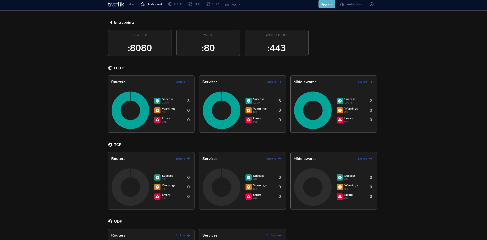
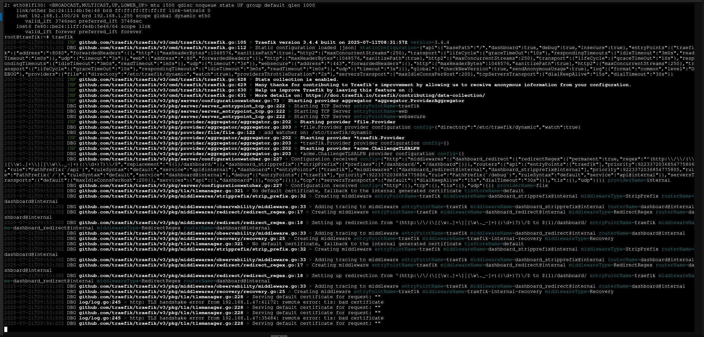

## Введение

<iframe width="100%" height="468" src="https://www.youtube.com/embed/5WMKn1CSBR8?si=Wg5BUex5bKBDpPiv" title="YouTube video player" frameborder="0" allow="accelerometer; autoplay; clipboard-write; encrypted-media; gyroscope; picture-in-picture; web-share" allowfullscreen></iframe>

Traefik — это современный обратный прокси и балансировщик нагрузки, идеально подходящий для self-hosting и DevOps решений. В данной статье мы пошагово рассмотрим, как **установить Traefik в LXC-контейнер Proxmox** и запустить его как `systemd`-сервис, что позволяет добиться высокой отказоустойчивости и интеграции с системной инициализацией.
Для удобства я разделил описание этого достаточно нетривиального процесса на две части. В этой статье пойдет речь о подготовке и первичном тестировании работоспособности нашего обратного прокси.

> [!NOTE]
> Если вам понравилась настоящая статья, то можете меня поддержать став спонсором на бусти (ссылка в разделе контакты)

---

## Преимущества установки Traefik как systemd unit

- ✅ Стартует автоматически при загрузке контейнера  
- ✅ Управляется как полноценная служба (`systemctl start/stop/status`)  
- ✅ Работает стабильно без Docker  
- ✅ Простая интеграция с другими сервисами

---

## Требования

Перед началом убедитесь, что у вас есть:

- ✅ Непривилегированный (забудьте про привилегированный контейнер, в данном конкретном случае, как страшный сон) LXC-контейнер на Proxmox  
- ✅ Debian/Ubuntu внутри контейнера, но крайне желательно использовать Debian. Черт с ним, что там устаревшие пакеты, нам главное стабильность.  
- ✅ Доступ по SSH или консоли.  
- ✅ Внешний FQDN домен и настроенный DNS сервер, который четко указывает, что все запросы в виде `*.domain.ru` должны быть перенаправлены на ip вашего контейнера, где установлен **traefik**

---

## Шаг 1: Создание LXC-контейнера

В Proxmox создайте непривилегированный контейнер:

- ОС: Debian 12 или 13 (рекомендуется)  
- Тип: Непривилегированный (поддерживается Traefik) — этот параметр выбирается **на этапе создания контейнера** (чекбокс "Unprivileged container" в мастере Proxmox); если контейнер уже создан как привилегированный, проще пересоздать его непривилегированным, чем менять этот параметр постфактум  
- Сеть: Bridge (например, `vmbr0`)  


**Nesting** в данном сценарии не нужен — он требуется, только если внутри самого LXC вы планируете поднимать вложенные контейнеры (например, Docker/Podman). Для Traefik как systemd-сервиса Nesting не даёт ничего, кроме расширенного набора системных вызовов, доступных процессам контейнера — то есть без необходимости снижает изоляцию. Оставьте Nesting выключенным, если не планируете контейнеризацию внутри этого LXC.



**Обратите внимание** LXC контейнер использует только те ресурсы, которые ему нужны, а не все выделенные контейнеру.


Примерный вариант контейнера

Template: Debian 12 или 13
Disk: 32G
CPU: 2
Memory: 2048
Swap: 0
Network: static IPv4: 192.168.x.x/24

Обязательно сделать следующее:

1. Установить дату и время. Это важно. Мы с вами будем смотреть логи данного контейнера, а значит нам нужно, чтобы события указывали на корректное время. Более того, в будущем мы установим `crowdsec` , а значит корректный часовой пояс нам важен вдвойне. Ведь время атаки должно быть четко зафиксировано.  

Проверим настройки времени

```bash
timedatectl
```

Узнайте правильное наименование вашего часового пояса:

```bash
timedatectl list-timezones
```

Установите ваш часовой пояс по образу и подобию моего

```bash
timedatectl set-timezone Europe/Moscow
```

2. Обновим контейнер, вернее операционную систему

```bash
apt full-upgrade
```

3. Установим необходимые зависимости. Список, который приведен ниже, достаточно условный, добавляйте то, что считаете нужным.

```bash
apt install curl tar sudo lshw apt-transport-https wget nano gnupg htop lsb-release apache2-utils
```

---
## Шаг 2: Настройка доступа только по ssh ключам

После установки Debian 13 рекомендуется отказаться от аутентификации по паролю и использовать только SSH-ключи. Это значительно повышает безопасность сервера и защищает от автоматизированных попыток подбора паролей. 

### Установка публичного ключа

Скопируйте свой публичный ключ на сервер:

```bash
ssh-copy-id root@<IP_СЕРВЕРА>
``` 

Или вручную добавьте содержимое файла `~/.ssh/id_ed25519.pub` в файл: `/root/.ssh/authorized_keys` 


Проверьте, что вход по ключу работает, прежде чем переходить к следующему шагу. 

### Отключение входа по паролю

Откройте файл конфигурации OpenSSH: 

```bash
nano /etc/ssh/sshd_config
```

Измените или добавьте следующие параметры:
```text
PubkeyAuthentication yes
PasswordAuthentication no
KbdInteractiveAuthentication no
PermitRootLogin prohibit-password
``` 

Где:
- `PubkeyAuthentication yes` — разрешает вход по SSH-ключам.
- `PasswordAuthentication no` — полностью отключает вход по паролю.
- `KbdInteractiveAuthentication no` — отключает интерактивную аутентификацию.
- `PermitRootLogin prohibit-password` — разрешает вход пользователю `root` только по SSH-ключу. 

### Применение настроек

Перед перезапуском службы рекомендуется проверить конфигурацию:

```bash
sshd -t
```

 Если ошибок нет, перезапустите службу:
 
```bash
systemctl restart ssh
```
   
 ### Особенности Debian 13 
 
 В минимальных установках Debian 13 (например, в LXC-контейнерах Proxmox) можно столкнуться с ошибкой:
 
```text
Missing privilege separation directory: /run/sshd
```

 Это означает, что не был автоматически создан временный каталог `/run/sshd`, необходимый для работы OpenSSH. Исправить проблему можно штатной командой:
 
```bash
systemd-tmpfiles --create
``` 
 
 После этого снова выполните проверку:
 
```bash
sshd -t
``` 
  
  и перезапустите службу: 
  
```bash
systemctl restart ssh
``` 
  

> [!NOTE]
> Команда `systemd-tmpfiles --create` не изменяет конфигурацию системы и не снижает безопасность. Она лишь создает временные каталоги и файлы, описанные в правилах `systemd-tmpfiles`, в том числе `/run/sshd`, необходимый для корректной работы OpenSSH.

   
### Проверка 

Не закрывая текущую SSH-сессию, откройте новое подключение и убедитесь, что вход по ключу выполняется успешно. Проверить применившиеся параметры можно командой: 
```bash
sshd -T | grep -E 'passwordauthentication|permitrootlogin|pubkeyauthentication|kbdinteractiveauthentication'
```

Ожидаемый результат: 
```text
passwordauthentication no pubkeyauthentication yes permitrootlogin prohibit-password kbdinteractiveauthentication no
``` 

Только после успешной проверки рекомендуется закрывать текущую SSH-сессию.

---

## Шаг 3: Установка бинарного файла Traefik и первый тестовый прогон

Идем на github репозиторий [traefik](https://github.com/traefik/traefik).

```bash
# скачиваем архив c последней версией обратного прокси
wget https://github.com/traefik/traefik/releases/download/v3.4.4/traefik_v3.4.4_linux_amd64.tar.gz
```

```bash
# распаковываем архив 
tar -zxvf traefik_v3.4.4_linux_amd64.tar.gz
```

```bash
# перемещаем бинарный файл туда где он и должен храниться, и где находятся все бинарные файлы
mv traefik /usr/local/bin/
```

Теперь можно удалить ненужный архив, чтобы не мусорить.

## Шаг 4: Создаем предполагаемую структуру управления Traefik, а именно - место, где мы будем хранить статическую, динамическую конфигурацию и логи

Вся конфигурация нашего обратно прокси состоит yaml файлов, которые будут определять статическую и динамическую конфигурацию (У вас может быть все по другому, вернее местоположение файлов может быть другое, главное, чтобы пути были бы правильно прописаны)

```bash
mkdir /etc/traefik
```

— у нас будет один конфигурационный файл статической конфигурации

```bash
mkdir /etc/traefik/dynamic
```

— все файлы динамической конфигурации у нас будут храниться в соответствующей директории. Можно конечно использовать только один файл динамической конфигурации, но по итогу там будет минимум 100 строк (на самом деле больше), а такой объем со временем станет достаточно сложно воспринимать в одном файле.

```bash
touch /etc/traefik/acme.json
```

— создаем файл, в котором будут храниться данные о наших сертификатах

```bash
chmod 600 /etc/traefik/acme.json
```

— задаем необходимые права на acme.json файл. В противном случае Traefik просто не запустится. Считаю, что наличие такой защиты от дурака - большой плюс.

Также создаем директорию, где у нас с вами будут храниться логи, а именно: traefik.log и access.log

```bash
mkdir -p /var/log/traefik
chown root:root /var/log/traefik
```

Позже мы с вами настроим работу с логами

## Шаг 5: Запуск тестовой конфигурации

Создаем на данном этапе тестовую конфигурацию Traefik, которая нам нужна исключительно для тестирования работоспособности самого обратного прокси. В дальнейшем мы с вами все расширим и углубим(с).

```bash
nano /etc/traefik/traefik.yaml
```

```yaml
# Это простой статический конфиг. Еще раз, у нас все будет работать нативно, никакого докера.
# Подумайте на тем, чтобы активировать опцию передачи анонимной статистики использования приложения, так как это поможет разработчикам.
# Уровень логирования DEBUG покажет вам все debug сообщения в консоли, пока Traefik в запущенном состоянии.
# Любой yaml файл, который у нас будет находиться в директории `/etc/traefik/dynamic` будет обработан в режиме реального времени, соответственно позволяет «на лету» изменять конфигурацию маршрутов, сервисов, middlewares, TLS и серверных транспортов. Это значит что нам не нужно будет каждый раз перезапускать сервис
# Мы указываем простые и пока незащищенные точки входа web and websecure. 
# Разрешаем небезопасный (пока не выпустили сертификаты) доступ к панели Traefik и доступ к API.
# Так как yaml формат чувствителен к пробелам, то если у вас в файл где-то лишний пропуск/пробел, сервис просто не запустится, но в логах вы должны увидеть в какой строке допущены ошибка. При этом номер строки с ошибкой может быть указан неверно, поэтому бдительности все-таки терять не стоит.

# https://doc.traefik.io/traefik/contributing/data-collection/
global:
  checkNewVersion: true
  sendAnonymousUsage: true
 
# https://doc.traefik.io/traefik/operations/api/
api:
  dashboard: true
  insecure: true
  debug: true
  disableDashboardAd: false

# https://doc.traefik.io/traefik/observability/logs/
log:
  level: DEBUG  #TRACE DEBUG INFO WARN ERROR FATAL PANIC

# https://doc.traefik.io/traefik/routing/entrypoints/
entryPoints:
  web:
    address: ":80"
  websecure:
    address: ":443"

#------------: https://doc.traefik.io/traefik/providers/file/
providers:
  file:
    directory: /etc/traefik/dynamic
    watch: true
```


**⚠️ Эта конфигурация временная и небезопасна для продакшена.** `api.insecure: true` открывает dashboard и API без какой-либо аутентификации на всех интерфейсах контейнера, а `log.level: DEBUG` пишет избыточно подробные логи. Используйте этот конфиг только для проверки работоспособности в закрытом сегменте сети. Если вы останавливаетесь на этом шаге и не переходите сразу к части 2 — обязательно верните `api.insecure` в `false` (или уберите совсем) и защитите dashboard отдельным роутером с аутентификацией, прежде чем открывать порты наружу.


### Проверка работоспособности

Вводим неожиданную команду `traefik` - чтобы запустить наш обратный прокси и проверить что на данном этапе все хорошо: прокси работает и мы с вами можем получить доступ к веб-панели **Traefik**.

Переходим по ip адресу нашего обратного прокси, который доступен по умолчанию по порту 8080

`http://192.168.0.11:8080/dashboard/`





Если все пошло на плану и все работает, то мы с вами создали фундамент для дальнейшей работы с обратным прокси

## Шаг 6: Обновление Traefik

Вы спросите меня как обновлять **Traefik** в случае его установки как бинарного пакета? Хороший вопрос. На самом деле это очень просто, фактически мы с вами повторим шаги, указанные в пункте 2 настоящей инструкции.

1. Идем на гитхаб **Traefik** и находим последний актуальный релиз

2. Скачиваем нужный на файл командой

```bash
wget https://github.com/traefik/traefik/releases/download/v3.*.*/traefik_v3.*.*_linux_amd64.tar.gz
```

3. Распаковываем

```bash
tar -zxvf traefik_v3.*.*_linux_amd64.tar.gz
```

4. Перемещаем файл, где находятся все бинарные файлы

```bash
mv ./traefik /usr/local/bin
```

В следующей части мы с вами рассмотрим вопрос настройки полноценной рабочей инстанции нашего обратного прокси.

## Ссылки

- [Официальная документация Traefik](https://doc.traefik.io/traefik/)
- [Сайт Traefik](https://traefik.io/traefik)
