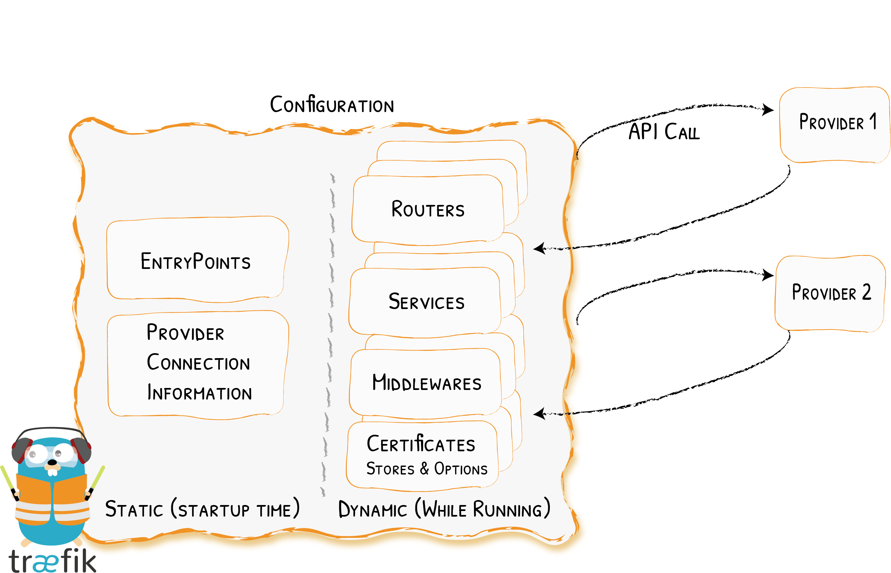
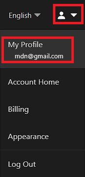
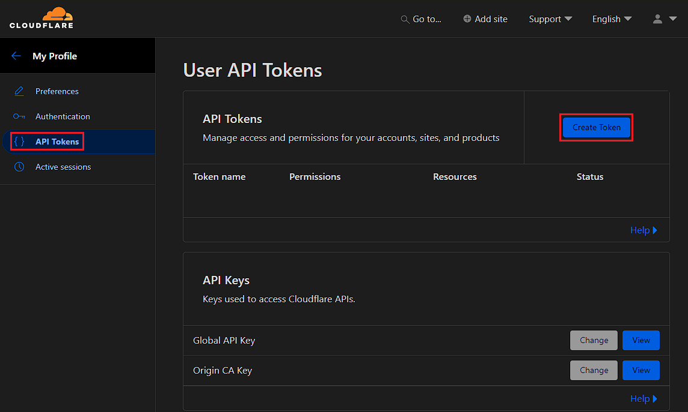
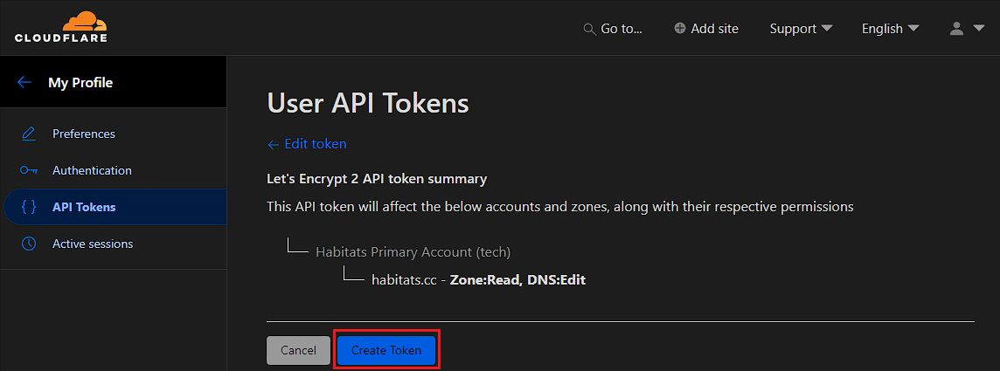
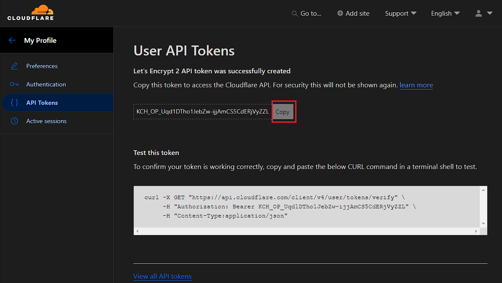
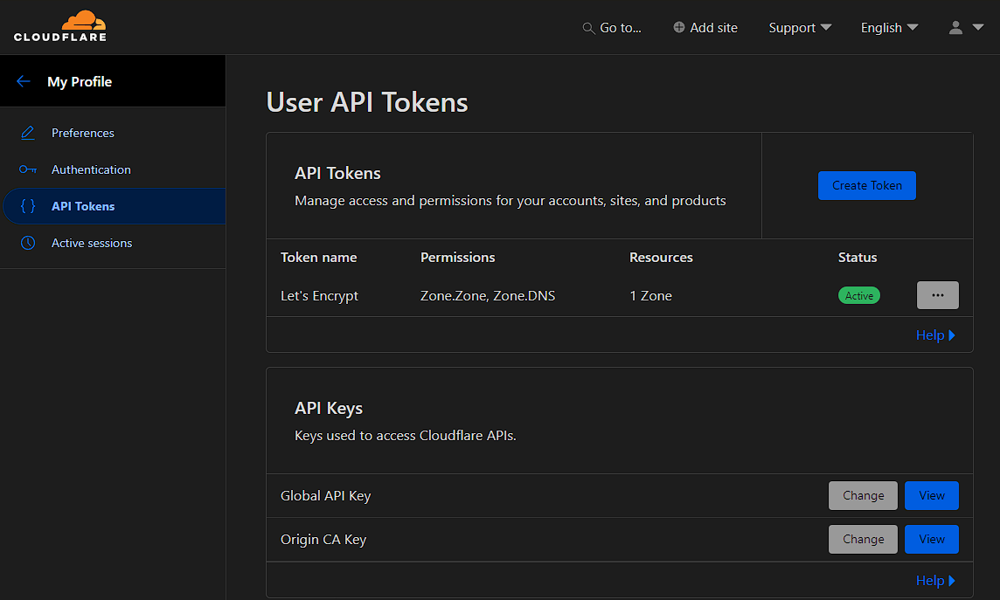

## Traefik Reverse Proxy в Docker: Полное руководство по настройке

<iframe width="100%" height="468" src="https://www.youtube.com/embed/1mTbILjtOo0?si=NW21AN35SAaJwKsF" title="YouTube video player" frameborder="0" allow="accelerometer; autoplay; clipboard-write; encrypted-media; gyroscope; picture-in-picture; web-share" allowfullscreen></iframe>

Если вам понравилась настоящая статья, то можете поддержать автора став спонсором на бусти (ссылка в разделе контакты).

**Обратный прокси (reverse proxy)** — это сервер, который принимает запросы от клиентов и перенаправляет их на внутренние сервисы. Он работает как посредник между пользователем и вашим веб-приложением, скрывая реальную архитектуру и обеспечивая удобные функции: балансировку нагрузки, кэширование, SSL-терминацию, маршрутизацию по доменам и многое другое.

В этой статье мы подробно рассмотрим, что такое обратный прокси, зачем он нужен, и разберём настройку **Traefik в Docker**.

---

### Что такое обратный прокси и зачем он нужен?

**Reverse proxy** — это важный компонент современной инфраструктуры. Основные преимущества:

1. **Единая точка входа для всех сервисов** — можно использовать один IP и разные домены или поддомены для множества приложений. Отсутствует необходимость открывать на роутере разные порты под разные приложения. Нам нужны только порт 80 и 443.
2. **Безопасность** — скрытие внутренних сервисов за прокси, защита от прямого доступа.  
3. **Поддержка SSL** — автоматическая генерация и обновление HTTPS-сертификатов с Let's Encrypt. Наше соединение зашифровано, браузер не ругается на небезопасное подключение.
4. **Балансировка нагрузки** — распределение запросов между несколькими контейнерами или серверами. Для дома это не так критично, но в production среде - это просто необходимость
5. **Гибкая маршрутизация** — можно настроить правила, перенаправления и rewrite для разных приложений.

---

### Особенности обратного прокси Traefik

**Traefik** — современный облачно-ориентированный reverse proxy и балансировщик нагрузки. Его отличительные особенности:  

- **Динамическая конфигурация** — Traefik динамически обнаруживает контейнеры Docker и автоматически настраивает маршруты. Не надо перезагружать для применения изменений настроек в динамической конфигурации.
- **Интеграция с Let's Encrypt и встроенный ACME клиент** — автоматическое получение и обновление SSL-сертификатов. Не надо следить за сроком действия ssl сертификата, **traefik** сам обновит сертификат при необходимости  
- **Поддержка множества провайдеров** — Docker, Kubernetes, Consul и т.д.  
- **Удобная панель мониторинга** — веб-интерфейс для просмотра маршрутов и состояния. Да, это не панель для управления, а для мониторинга, но очень информативная  
- **Гибкая маршрутизация и middleware** — можно добавлять аутентификацию, редиректы, rate limit и т.д. Это вообще  

---

Traefik идеально подходит для devops и продакшн-окружений, где используется **Docker Compose** или Kubernetes.
При этом необходимо отметить, что Traefik имеет больший функционал, чем популярный у homelab-сообщества nginx proxy manager, и если вы обратите внимание, то его используют многие топ-ютуб блоггеры именно из-за функционала.

---

### Что такое Routers, Middlewares и Services в обратном прокси Traefik



Traefik использует в своей конфигурации три основных компонента: (routers) маршрутизаторы, (services) службы и (middlewares ) промежуточное программное обеспечение

**Routers**

Маршрутизаторы подобны фронтендам: они управляют входящими запросами. В разделе «Routers» вы определите точку входа (entrypoint), кто у нас резолвит сертификаты, и определяет правила для запроса

**Services**

Сервисы подобны бэкендам: они определяют, куда отправлять запросы. Здесь вы можете указать порт, который Traefik будет использовать для проксирования и любые дополнительные балансировщики нагрузки.

**Middlewares**

Одна из самых сложных, но и самых интересных функций **Traefik**. Они - middlewares- изменяют запрос и фактически являются «промежуточным ПО» между маршрутизаторами и сервисами. Вы можете легко добавлять такие элементы, как заголовки, аутентификация, префикс пути или комбинировать их, создавая группы (chains) для повторного использования.

С помощью этих трех концепций мы: идентифицируем входящие запросы; определяем, куда направляется запрос; и выбираем, как мы хотим изменить запрос по мере его маршрутизации.

---

### Конфигурация Traefik

Существует множество способов настройки Traefik, и для новичков это может быть довольно сложно. Хотя кому я вру? Для новичков это будет просто очень сложно. Даже имея некоторый опыт, я порой не всегда могу сразу разобраться в методах настройки Traefik или как выпустить сертификат на какой-нибудь сервис, который по своей настройке может требовать специальных заголовков.

Итак, давайте уделим время изучению некоторых важных деталей конфигурации Traefik, а именно статической и динамической конфигурации.


### Динамическая конфигурация

**Traefik** — это динамический обратный прокси-сервер, то есть он может автоматически (на лету) добавлять и удалять маршруты при запуске или остановке контейнеров, а также применять другие изменения.

Динамическую конфигурацию можно указать в двух местах:

С поставщиком **Docker**, используя метки в **Docker Compose** для каждого сервиса. Обратите внимание, что, хотя Traefik не требует перезапуска, сервис с метками потребуется пересоздать (о том, что это за метки я рассказываю в видео, ссылка в начале настоящей статьи).

С файловым провайдером (File Provider) — YAML-файлы в папке «rules» (подробнее см. ниже). Это не требует перезапуска или переустановки каких-либо служб и является по-настоящему динамическим. Именно этот метод я показываю в настоящей статье.

### Статическая конфигурация

Хотя **динамическая конфигурация** является одним из главных преимуществ Traefik, важно понимать, что Traefik также использует статическую конфигурацию, которая определяется по-другому и должна храниться отдельно.

Для применения изменений в статической конфигурации необходимо перезапустить Traefik.
Существует три различных способа определения статической конфигурации Traefik. Одновременно можно использовать только один из них.

1. Файл конфигурации — может быть в разных форматах, но я использую YAML (traefik.yaml).

2. Аргументы командной строки (CLI) — эти аргументы передаются во время запуска docker контейнера. Я такой вариант не использую, как из-за большого объема команд, так и из-за сложности восприятия объема информации. Но это вопрос личных преференций.

Список всех переменных можно посмотреть по [ссылке](https://doc.traefik.io/traefik/reference/static-configuration/env/)

### Настройка получения SSL сертификата

#### Что нам нужно для полноценной работы обратного прокси

1. Нам нужно квалифицированное доменное имя. При покупке доменного имени рекомендую обратить внимание не на стоимость покупки (они плюс, минус всегда одинаковые), а на стоимость продления. Потому что процентное соотношение между стоимость покупки и стоимостью продления может неприятно удивить.

Сам я пользуюсь услугами [smartape](smartape.ru/?partner=139490). Стоимость продления домена в зоне .ру у них 200р. Можете перейти по реферальной ссылке и посмотреть актуальную стоимость. Не реклама.

1. Дальше нам нужно разместить наше доменное имя на внешних днс серверах. Я сам пользуюсь услугами **cloudflare**, но из-за блокировок РКН доступ к их днс может не работать. И хотя я продолжаю пользоваться cloudflare, с учетом существующих на данный момент ограничений советовать их я не могу. Хотя в данной статье я покажу настройку именно с cloudflare. Список днс провайдеров можно посмотреть в документации [Traefik](https://doc.traefik.io/traefik/https/acme/#providers). Там есть и отечественные сервисы, нужно просто учитывать код провайдера и переменные окружения при настройке.

2. Желательно иметь белый ip адрес, который вы можете приобрести у вашего интернет-провайдера.

3. Настроить split dns, чтобы запросы по поддоменному имени внутри локальной сети не выходили за ее пределы. Более подробно можете посмотреть в моем ролике, посвященному именно этой теме.



#### Настройки DNS с помощью Cloudflare

Я предполагаю, что у вас уже зарегистрировано доменное имя и оно уже перенесено на dns сервера соответствующего провайдера. Я показываю все на примере Cloudflare.
В этом гайде я использую доменное имя **stilicho.ru**
Картинки не мои, а взяты из интернета

Переходите в ваш профайл



Переходим в меню для создания токена



Начинаем создавать кастомный токен


Задаем конкретные настройки токена


Создаем токен



Скопируйте значения вашего токена и сохраните в безопасном месте, так как посмотреть еще раз значения токена в профиле cloudflare у вас не получится.
Полученный токен мы с вами будем использоваться на настройки нашего прокси как сервиса, и он позволяет управлять нашими сертификатами с помощью Cloudflare. Если вы потеряете токен, то единственным выходом будет только его пересоздание с нуля.



Можете посмотреть все токены, которые вы создали с помощью cloudflare



---

### Настройка Traefik в Docker

#### Шаг 1. Создаём `docker-compose.yml`

```yaml
services:
  traefik:
    image: traefik:latest # Используем последний образ Traefik 
    container_name: traefik # Имя контейнера
    restart: unless-stopped # Говорим докеру, чтобы контейнер всегда пытался перезапуститься, в случае непредвиденной остановки 
    security_opt:
      - no-new-privileges:true # Не даем получить контейнеру дополнительные привилегии без нашего ведома
    networks:
       proxy: # контейнер будет работать определенной докер сети с названием 'proxy'
    ports:
      - 80:80 # определяем HTTP порт 
      - 443:443 # определяем HTTPS порт
    environment:
      - CF_API_EMAIL=mail@gmail.com # Указываем свою почтовый адрес, который у нас служит аккаунтом в Cloudflare для получения API токена 
      - CF_DNS_API_TOKEN=apitoken # указываем значения полученного токена 
    volumes:
      - /etc/localtime:/etc/localtime:ro # синхронизируем время контейнера со временем хоста
      - /var/run/docker.sock:/var/run/docker.sock:ro # Разрешаем Traefik взаимодействовать с докером напрямую 
      - /home/user/docker/traefik/traefik.yaml:/traefik.yaml:ro # указываем где у нас находится файл статической конфигурации Traefik 
      - /home/user/docker/traefik/acme.json:/acme.json # указываем где у нас будут храниться все данные о наших SSL сертификатах
      - /home/user/docker/traefik/config.yaml:/config.yaml:ro # Указываем где у нас хранится файл динамической конфигурации 
      - /home/user/docker/traefik/logs:/var/log/traefik # прописываем путь до директории, где у нас будут храниться логи Traefik и access log
    labels: 
      - "traefik.enable=true" # Активируем Traefik для данного сервиса 
      - "traefik.http.routers.traefik.entrypoints=http" # Определяем точку входа HTTP
      - "traefik.http.routers.traefik.rule=Host(`traefik-dashboard.user.ru`)" # Определяем хост правило для роутинга 
      - "traefik.http.middlewares.traefik-auth.basicauth.users=user:password" # Прикручиваем базовую аутентификацию для защиты нашего traefik, указывая логин и пароль в захэшированном виде
      - "traefik.http.middlewares.traefik-https-redirect.redirectscheme.scheme=https" # Указываем что HTTP трафик должен быть перенаправлен в HTTPS трафик
      - "traefik.http.middlewares.sslheader.headers.customrequestheaders.X-Forwarded-Proto=https" # Задаем передадресацию заголовков для SSL
      - "traefik.http.routers.traefik.middlewares=traefik-https-redirect" # Применяем Apply HTTPS redirect middleware для редиректа https трафика
      - "traefik.http.routers.traefik-secure.entrypoints=https" # Безопасная точка входа для HTTPS
      - "traefik.http.routers.traefik-secure.rule=Host(`traefik-dashboard.user.ru`)"  # Хост правило для https роутинга 
      - "traefik.http.routers.traefik-secure.middlewares=traefik-auth" # Применяем аутентификационную middleware
      - "traefik.http.routers.traefik-secure.tls=true" # Включаем TLS для безопасного соединения 
      - "traefik.http.routers.traefik-secure.tls.certresolver=cloudflare" # Используем Cloudflare для выпуска сертификатов
      - "traefik.http.routers.traefik-secure.tls.domains[0].main=user.ru" # Доменное имя второго уровня, на который выпускаем SSL сертификат
      - "traefik.http.routers.traefik-secure.tls.domains[0].sans=*.user.ru" # Выпускаем wildcard SSL сертификат на все поддоменные имя в рамках домена, определенного правилом выше
      - "traefik.http.routers.traefik-secure.service=api@internal" # Определяем внутренний сервис для Traefik API

networks:
  proxy:
    name: proxy # Определяем внешнюю сеть к которой необходимо присоединиться 
    external: true # Указываем, что сеть является внешней 
```

#### Шаг 2. Создаём `traefik.yaml`

```yaml
api:
  dashboard: true #включаем дэшборд
  debug: true # включаем уровень дебаг
entryPoints: # определяем точки входа
  http: # название точки входа
    address: ":80" # порт который относиться к названию http
    http: # следующие пять строчек, говорят нам, что мы на глобальном уровне заставляем весь трафик, который приходит на порт 80
      redirections:
        entryPoint:
          to: https
          scheme: https
  https: # название точки входа
    address: ":443" # порт который относиться к названию https
      encodedCharacters:                  # Разрешённые закодированные символы (важно для Trilium)
        allowEncodedSlash: true           # Разрешить %2F
        allowEncodedPercent: true         # Разрешить %25
        allowEncodedHash: true            # Разрешить %23    
serversTransport: # следующие две строчки разрешают нам использовать самоподписанные ssl сертификаты в тех сервиса, которые их используют, например Proxmox
  insecureSkipVerify: true
providers: # определяем провайдеров конфигурации - это докер и файл динамической конфигурации
  docker:
    endpoint: "unix:///var/run/docker.sock"
    exposedByDefault: false
  file:
    filename: /config.yaml
certificatesResolvers: # определяем кто у нас выступает резолвером сертификатов
  cloudflare: # кто именно, указываем, что надо использовать acme; указываем почту, которая используется в cloudflare
    acme:
      email: mail@gmail.com #add your email
      storage: acme.json # определяем файл, где будет храниться вся информация об ssl сертификатов
      dnsChallenge: # используем метод получения ssl сертификатов как dns challenge
        provider: cloudflare  
        # provider: vultr
        resolvers:
          - "1.1.1.1:53"
          - "1.0.0.1:53"

log: # определяем уровень логирования и путь для логов
  level: "INFO"
  filePath: "/var/log/traefik/traefik.log"
accessLog:
  filePath: "/var/log/traefik/access.log"

```

#### Шаг 3. Создаем файл динамической конфигурации

В динамической конфигурации мы указываем по каким маршрутам (routers) находятся наши сервисы (services). Указываем на какое поддоменное имя надо выпускать сертификат к конкретному сервису и какие middlewares необходимо применить.
В файле который приведен ниже, мы выпускаем ssl сертификат на нашу ноду Proxmox, чтобы она - нода - была доступна по красивому поддоменному имени.

```yaml
http:
 #region routers 
  routers:
    proxmox:
      entryPoints:
        - "https"
      rule: "Host(`proxmox.DOMAIN_NAME.ru`)"        # поменяйте на ваше доменное имя
      middlewares:
        - default-headers
        - https-redirect
      tls: {}
      service: proxmox
#
#region services
#
  services:
    proxmox:
      loadBalancer:
        servers:
          - url: "https://ip:8006"            # указываете ваш айпи
        passHostHeader: true
#
# region middlewares
#  
  middlewares:                                # даем определение какие middlewares мы хотим в будущем использовать. Полны список на сайте traefik.io 
    #
    https-redirect:    # перенаправляет запрос, если схема запроса отличается от настроенной схемы.
      redirectScheme:
        scheme: https
        permanent: true
#
    default-headers: # управляет заголовками запросов и ответов
      headers:
        frameDeny: true
        browserXssFilter: true
        contentTypeNosniff: true
        forceSTSHeader: true
        stsIncludeSubdomains: true
        stsPreload: true
        stsSeconds: 15552000
        customFrameOptionsValue: SAMEORIGIN
        customRequestHeaders:
          X-Forwarded-Proto: https

    default-whitelist: # локальный фаерволл, работающий по принципу разрешить запросы только с конкретных айпи.
      ipAllowList:
        sourceRange:
        - "10.0.0.0/8"
        - "192.168.0.0/16"
        - "172.16.0.0/12"

```

#### Шаг 4. Создаем acme.json

```touch /etc/traefik/acme.json``` - создаем файл, в котором будут храниться данные о наших сертификатах

```chmod 600 /etc/traefik/acme.json``` - задаем необходимые права на acme.json файл. В противном случае Traefik просто не запустится. Считаю, что наличие такой защиты от дурака - большой плюс.

#### Шаг 5. Запуск контейнера Traefik

`docker network create proxy` - создаем докер сеть с названием proxy

`sudo apt install apache2-utils` - устанавливаем пакет утилит apache 2

`echo $(htpasswd -nB user) | sed -e s/\\$/\\$\\$/g` - создаем захэшированный пароль для нашего дэшборда

`docker compose up -d` - запускаем контейнер

Если у вас все в порядке - это можно посмотреть в логе traefik.log - то теперь, когда мы перейдем по ссылке для дэшборда **traefik** по адресу traefik-dashboard.user.ru, то: во-первых, мы такой доступ получим, а, во-вторых, сможем посмотреть данные нашего сертификата в браузере. Также данные о сертификате можно посмотреть в acme.json файле.

Если все в порядке, то у вас в наличии подготовленный полноценный обратный прокси, который стоит и бьет копытом, чтобы начать выпускать ssl сертификаты на все подряд.
Но, конечно, вместе с настоящей статьей, лучше посмотреть еще и видео, так как там наглядное пособие, каким образом можно выпускать сертификаты с помощью labels в докере.